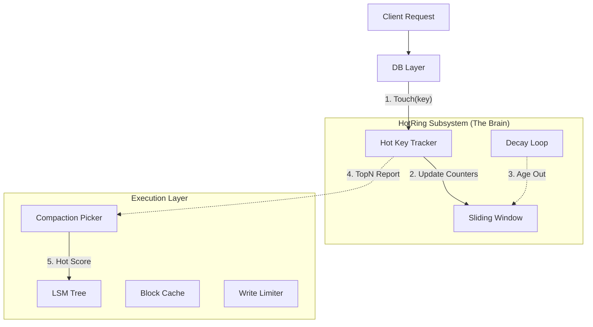

# 2026-01-16 hotring design

本文档详细记录了 NoKV 中 `hotring` 模块的设计灵感、架构定位、核心实现以及未来展望。这是一个从学术论文汲取灵感，并转化为工业级“热点探测器”的典型案例。

当前实现已抽离为独立仓库：`github.com/feichai0017/hotring`。

---

## 1. 设计灵感：取其神而弃其形

**来源**：[HotRing: A Hotspot-Aware In-Memory Key-Value Store (FAST '20)](https://www.usenix.org/conference/fast20/presentation/chen-jiqiang)

### 1.1 论文解决的痛点
在传统的 Hash 索引（链地址法）中，如果链表很长且热点数据位于链表尾部，每次访问热点都需要遍历大量冷数据，造成严重的 CPU Cache Miss 和长尾延迟。HotRing 提出将链表改为**环形结构**，并让 Head 指针智能指向热点节点，从而实现 $O(1)$ 的热点访问。

### 1.2 NoKV 的工程转化
NoKV 并没有照搬论文作为主索引（因为主索引是 LSM Tree），而是提取了 **“热点感知”** 这一核心思想，设计了一个**轻量级、旁路式**的热点统计模块。

*   **差异点**：
    *   **定位**：论文是存数据的**索引**；NoKV 是记账的**统计器**。
    *   **结构**：论文是**环形链表 + 智能指针**；NoKV 是**分片 Hash + 有序链表 + 滑动窗口**。
*   **核心价值**：在百万级 QPS 下，以极低的开销（Lock-Free List）精准识别系统中的“热点”，为缓存优化和限流提供数据支撑。

---

## 2. 核心架构：反馈驱动设计 (Feedback-Driven)

NoKV 的 HotRing 不仅仅是一个统计工具，它是整个系统“自适应优化”的大脑。

### 2.1 架构全景图



### 2.2 关键交互流程
1.  **探测 (Probe)**：
    *   **读路径**：每次 `Get` 命中时调用 `Touch`。
    *   **写路径**：只有当启用了限流（`WriteHotKeyLimit`）或突发检测时，才会调用 `TouchAndClamp`。
2.  **计算 (Compute)**：HotRing 内部利用**滑动窗口**算法计算实时 QPS。
3.  **反馈 (Feedback)**：
    *   **Compaction 评分**：`lsm/compact` 在选择压缩层级时，会参考 `HotRing.TopN`。如果某一层包含大量热点 Key，会优先压缩该层（Hot Overlap Score），减少热点数据的读放大。
    *   **缓存预取 (Prefetch)**：DB 层会根据 TopN 结果触发预取逻辑。虽然 HotRing 不直接控制 Cache，但它提供的热点名单是预取策略的重要输入。
    *   **写入限流**：对于写频率过高的 Key，`TouchAndClamp` 会触发限流保护。

---

## 3. 实现细节深度解析

### 3.1 并发控制：Lock-Free 与 Spin-Lock
为了支撑高并发，HotRing 采用了混合并发策略：

*   **主链表 (Buckets & List)**：采用 **Lock-Free** 的 CAS 操作进行节点插入。
    *   **Ordered List**：链表节点按 `(Tag, Key)` 排序，查找失败可提前终止。
*   **滑动窗口 (Window Counters)**：由于涉及复杂的窗口滚动和数组更新，使用了轻量级的 **Spin-Lock (自旋锁)** 保护。
    *   `node.lockWindow()`: `CAS(&lock, 0, 1)`。
*   **衰减 (Decay)**：后台协程定期衰减时，会有互斥锁保护 `decayMu`，但实际的计数器衰减是原子操作。

### 3.2 统计算法：滑动窗口与衰减
如何区分“历史热点”和“突发热点”？

1.  **滑动窗口 (Sliding Window)**：
    *   将时间切分为多个 Slot（如 8 个 Slot，每个 250ms）。
    *   `Touch` 时根据 `Timestamp % Slots` 写入对应 Slot。
    *   **效果**：能够精准反映“最近 2 秒”的热度，过期数据自动失效。
2.  **衰减 (Decay)**：
    *   后台协程定期将所有 Counter 右移一位（`count >> 1`）。
    *   **效果**：模拟热度的“半衰期”，让不再访问的旧热点逐渐冷却。

---

## 3.3 与论文/算法的关键差异（工程化改动）

| 对比点 | 论文 / 经典算法 | NoKV HotRing |
| :-- | :-- | :-- |
| 目标 | 作为索引或严格频率估计 | **作为系统级热点反馈信号** |
| 数据结构 | 环形链表/Sketch | **哈希分桶 + 有序链表** |
| 误差控制 | 明确误差界 | **工程可接受范围** |
| 并发 | 复杂锁或全局结构 | **Lock-Free + 轻量自旋锁** |
| 时间维度 | 常态累计 | **滑动窗口 + 衰减** |

结论：NoKV HotRing 是“**工程可用**”优先的实现，而不是“**数学最优**”优先。

---

## 4. 实际应用场景

### 4.1 可观测性 (Observability)
运维人员可以通过 CLI 实时查看系统热点，瞬间定位“谁在打挂数据库”。
```bash
# 使用 stats 命令查看
$ go run cmd/nokv/main.go stats --workdir ./work_test
...
Hot Keys:
  key: user:1001, count: 52000
  key: config:global, count: 12000
```

### 4.2 缓存与性能 (Performance)
*   **VIP 缓存区 (Hot Tier)**：LSM Cache 内部维护了一个小型的 `Clock-Pro` 缓存（Hot Tier）。虽然它不是绝对的“免死金牌”（仍可能被更热的数据挤出），但它为热点 Block 提供了比普通 LRU 更强的保护。
*   **热点压缩优先**：通过 HotRing 的反馈，系统能主动将热点数据所在的重叠 SSTable 进行合并，将热点数据的查询路径压缩到最短。

---

## 5. 未来展望

基于目前的 HotRing 基础，NoKV 未来可以实现更高级的特性：

1.  **写吸收 (Write Absorption)**：
    *   对于超高频写入的热点（如计数器），可以在内存中聚合 100 次更新为 1 次 VLog 写入，大幅降低 LSM 写放大。
2.  **动态数据迁移**：
    *   在分布式场景下，发现某个 Region 出现热点，自动触发 Region Split 或将该热点 Key 迁移到专用节点。

## 6. 总结

NoKV 的 `hotring` 是一个 **“学术灵感 + 工程务实”** 的典范。它没有追求理论上完美的环形索引结构，而是抓住了“热点感知”这一核心价值，用混合并发结构（Lock-Free + SpinLock）解决了工程中最头疼的**监控盲区**问题，并成功反哺了 Compaction 调度。
