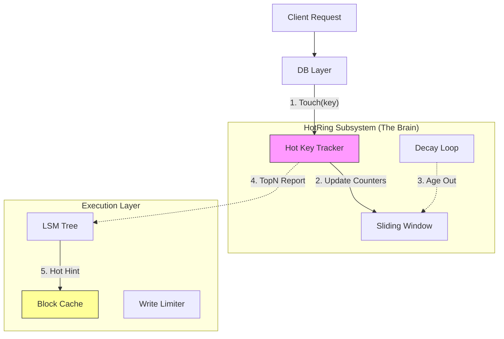

# 2026-01-16 hotring design

本文档详细记录了 NoKV 中 `hotring` 模块的设计灵感、架构定位、核心实现以及未来展望。这是一个从学术论文汲取灵感，并转化为工业级“热点探测器”的典型案例。

---

## 1. 设计灵感：取其神而弃其形

**来源**：[HotRing: A Hotspot-Aware In-Memory Key-Value Store (FAST '20)](https://www.usenix.org/conference/fast20/presentation/chen-jiqiang)

### 1.1 论文解决的痛点
在传统的 Hash 索引（链地址法）中，如果链表很长且热点数据位于链表尾部，每次访问热点都需要遍历大量冷数据，造成严重的 CPU Cache Miss 和长尾延迟。HotRing 提出将链表改为**环形结构**，并让 Head 指针智能指向热点节点，从而实现 $O(1)$ 的热点访问。

### 1.2 NoKV 的工程转化
NoKV 并没有照搬论文作为主索引（因为主索引是 LSM Tree），而是提取了 **“热点感知”** 这一核心思想，设计了一个**轻量级、旁路式**的热点统计模块。

*   **差异点**：
    *   **定位**：论文是存数据的**索引**；NoKV 是记账的**统计器**。
    *   **结构**：论文是**环形链表 + 智能指针**；NoKV 是**分片 Hash + 有序链表 + 滑动窗口**。
*   **核心价值**：在百万级 QPS 下，以极低的开销（无锁、旁路）精准识别系统中的“热点”，为缓存优化和限流提供数据支撑。

---

## 2. 核心架构：反馈驱动设计 (Feedback-Driven)

NoKV 的 HotRing 不仅仅是一个统计工具，它是整个系统“自适应优化”的大脑。

### 2.1 架构全景图



### 2.2 关键交互流程
1.  **探测 (Probe)**：读写请求到达 DB 层时，旁路调用 `HotRing.Touch(key)`。
2.  **计算 (Compute)**：HotRing 内部利用**滑动窗口**算法计算实时 QPS。
3.  **反馈 (Feedback)**：
    *   **缓存联动**：DB 定期将 TopN 热点推送给 LSM Tree。当加载 Block 时，如果发现包含热点 Key，则打上 `HotHint` 标记，将其直接晋升到 **VIP 热区缓存 (Clock-Pro Hot Cache)**，防止被冷数据逐出。
    *   **写入限流**：对于写频率过高的 Key，`TouchAndClamp` 会触发限流保护。

---

## 3. 实现细节深度解析

### 3.1 数据结构：无锁分片哈希
为了支撑高并发，HotRing 采用了极致的无锁设计。

*   **Sharding**：顶层是一个 `atomic.Pointer[Node]` 数组（Buckets），减少竞争。
*   **Ordered List**：链表节点按 `(Tag, Key)` 排序。
    *   **优势**：查找失败可以提前终止（Fail Fast），无需遍历全链表。
*   **CAS Insertion**：
    ```go
    // 伪代码：无锁插入
    for {
        prev, curr := findPosition(bucket, key)
        if prev.CompareAndSwapNext(curr, newNode) {
            return success
        }
        // CAS 失败说明有并发修改，重试
    }
    ```

### 3.2 统计算法：滑动窗口与衰减
如何区分“历史热点”和“突发热点”？

1.  **滑动窗口 (Sliding Window)**：
    *   将时间切分为多个 Slot（如 8 个 Slot，每个 250ms）。
    *   `Touch` 时根据 `Timestamp % Slots` 写入对应 Slot。
    *   **效果**：能够精准反映“最近 2 秒”的热度，过期数据自动失效。
2.  **衰减 (Decay)**：
    *   后台协程定期将所有 Counter 右移一位（`count >> 1`）。
    *   **效果**：模拟热度的“半衰期”，让不再访问的旧热点逐渐冷却。

---

## 4. 实际应用场景

### 4.1 可观测性 (Observability)
运维人员可以通过 CLI 实时查看系统热点，瞬间定位“谁在打挂数据库”。
```bash
$ nokv stats --hot-keys
Top 5 Hot Keys (Last 5s):
1. "sku:1001" - 52,000 QPS
2. "user:888" - 12,000 QPS
```

### 4.2 缓存保活 (Cache Pinning)
这是 NoKV 最精妙的设计。
*   **问题**：全表扫描（Scan）往往会把 Block Cache 里的热点数据挤出去（Cache Pollution）。
*   **解法**：通过 HotRing 识别出的热点 Block，进入 Cache 时自带“免死金牌”（进入 Clock-Pro 的 Hot 区域），无论 Scan 怎么扫，VIP 热点不受影响。

---

## 5. 未来展望

基于目前的 HotRing 基础，NoKV 未来可以实现更高级的特性：

1.  **写吸收 (Write Absorption)**：
    *   对于超高频写入的热点（如计数器），可以在内存中聚合 100 次更新为 1 次 VLog 写入，大幅降低 LSM 写放大。
2.  **动态数据迁移**：
    *   在分布式场景下，发现某个 Region 出现热点，自动触发 Region Split 或将该热点 Key 迁移到专用节点。
3.  **智能索引优化**：
    *   对于长期热点，甚至可以考虑将其 Value 直接内联到内存索引中（LSM MemTable 不刷盘），实现真正的 In-Memory 性能。

## 6. 总结

NoKV 的 `hotring` 是一个 **“学术灵感 + 工程务实”** 的典范。它没有追求理论上完美的环形索引结构，而是抓住了“热点感知”这一核心价值，用最简单的无锁结构解决了工程中最头疼的**缓存污染**和**监控盲区**问题。