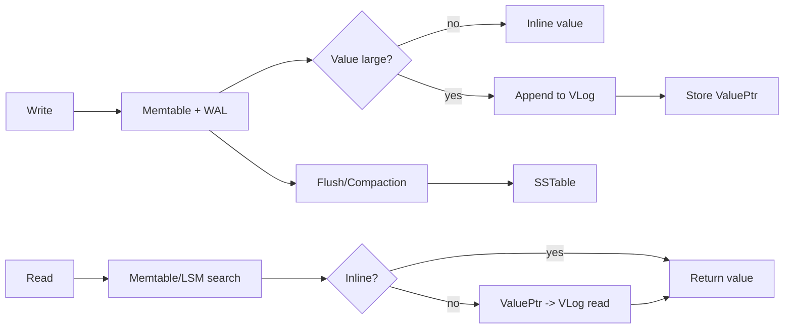

# 2026-01-16 mmap choice

这是一些碎碎念记录，想把 mmap 的选择理由写得清楚一些，尤其是围绕 SSTable 和 VLog 的定义、使用场景和读写交互逻辑。

## 概念与定位

SSTable 是 LSM 的核心持久化文件，按 key 有序且不可变，内部由索引、数据块与过滤器等结构组成，因此它在读路径里几乎无处不在。VLog 则用于存放较大的 value，写入时顺序追加，LSM 内只保存 value pointer，读取时再回查 VLog。用一句话概括就是：SSTable 读密集且不可变，VLog 顺序写但读是随机的。

## 读写交互逻辑

下面这张图展示了写入与读取的主要交互路径，重点是读路径几乎一定触达 SSTable，而 VLog 只在 value 外置时才参与。

## IO 方案对比的直观理解

mmap 的核心优势是随机读成本低，系统调用少，而且读取可以直接落在 OS 的页缓存路径上；但它的缺点也很明确，RSS 和 page cache 不可控，写入必须处理好 msync 语义，并且跨平台细节差异较多。相比之下，pread 或 buffered read 配合自建 cache 更容易控制内存和行为，但会引入额外拷贝和系统调用成本。direct I/O 能绕过 page cache，避免污染，但工程复杂度高，并且在随机读场景并不总是更快。

## 为什么 SSTable 更适合 mmap

SSTable 不可变且读取频繁，映射稳定，很少需要 remap，这使得 mmap 的工程成本低而收益明显。加上读路径以随机读为主，mmap 能把很多读转化成轻量页缺失，配合 OS 的页缓存形成自然的热点命中。因此在 SSTable 上采用 mmap 通常是可预期且合理的选择。

## 为什么我们在 VLog 上也用了 mmap

我们目前的实现方式是让 VLog 直接走 mmap，这样读路径可以用 Bytes/View 直接得到切片，写入也可以通过 mmap buffer 追加并配合 msync 落盘，这让实现保持简洁并与 SSTable 的风格一致。代价在于 VLog 文件往往更大，随机读更分散，page cache 污染风险显著更高，RSS 波动也更容易出现。如果 value 的冷热分布不稳定，mmap 带来的缓存收益不一定能抵消它的副作用。

## 与 Badger 的思路对比

Badger 更倾向于把 mmap 用在 SSTable，而在 VLog 上偏向 FileIO 或 pread，目的就是减少大文件对页缓存的冲击，让热点集中在 SSTable 的 block 上。它也提供了可配置的模式，但整体倾向体现了一个理念：热点应主要由 SSTable 驱动，VLog 更应该谨慎消耗 page cache。

## Linux 侧的 IO 选择

在 Linux 上我们可以组合使用多种 IO 手段，比如常规的 read/pread/write，以及 mmap 配合 madvise 提示访问模式，也可以用 posix_fadvise 或 readahead 做预读提示；如果需要更细粒度控制，还可以使用 O_DIRECT 进行 direct I/O，或者基于 io_uring 做异步 IO。我们在 file 包中已经实现了一个基础的 io_uring 框架，后续如果要做更强的异步读写或并发调度，可以基于它扩展。

## 小结

SSTable 的读密集与不可变特性让 mmap 成为一个相对稳妥的默认选择，而 VLog 的大文件与随机读特性让 mmap 的代价更明显。当前实现偏向工程简化，但从长期来看，VLog 可能更适合 pread + 小型缓存的策略，并在热点稳定时再开放 mmap 作为可选模式。
