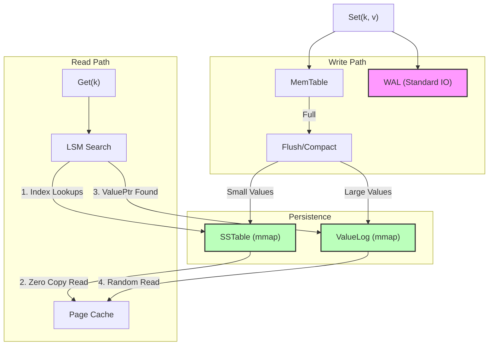

# 2026-01-16 mmap choice

本文档详细对比了主流文件 I/O 模型的差异，并解析 NoKV 在不同组件（SSTable, WAL, VLog）中做出不同 I/O 选择的深层原因与权衡。

## 1. I/O 模型的四国杀

在 Linux/Unix 环境下，我们在设计存储引擎时通常面临四种选择。理解它们的优劣是做出正确架构决策的前提。

| 特性 | 标准 I/O (`read`/`write`) | 内存映射 (`mmap`) | 直接 I/O (`O_DIRECT`) | 异步 I/O (`io_uring`) |
| :--- | :--- | :--- | :--- | :--- |
| **机制** | 系统调用，数据在 Kernel Buffer 和 User Buffer 间拷贝 | 建立虚拟内存映射，缺页中断加载，**零拷贝** | 绕过 Page Cache，直接 DMA 到用户内存 | 提交请求队列，内核异步完成，零系统调用开销 |
| **优势** | 简单，通用，Page Cache 自动预读 | **读延迟极低** (像访问内存一样)，代码简单 | **完全可控** (内存/刷盘)，无 GC 干扰 | 吞吐量极高，CPU 占用低 |
| **痛点** | **拷贝开销** (CPU copy)，高频调用 Context Switch | **不可控** (Page Fault 阻塞，TLB shootdown)，大文件污染 Cache | **复杂** (需自建 Buffer Pool，对齐限制) | **极复杂** (编程模型完全不同) |
| **适用** | 日志追加 (WAL) | 只读索引，随机小读 (SSTable) | 数据库自管理缓存 (MySQL, ScyllaDB) | 超高并发网络/磁盘 IO |

---

## 2. NoKV 的选择：因地制宜

NoKV 没有“一种 IO 走天下”，而是根据不同组件的访问模式（Access Pattern）选择了最适合的方案。

### 2.1 SSTable：坚定选择 `mmap`

SSTable 是 LSM Tree 的数据文件，具有 **不可变 (Immutable)** 和 **随机读 (Random Read)** 的特性。

*   **痛点**：如果用标准 `pread`，每次 `Get(key)` 都要发起一次系统调用。在 100k QPS 下，上下文切换（Context Switch）的开销是巨大的。
*   **mmap 的解法**：
    *   **零拷贝**：数据直接映射到用户空间，`slice = data[offset:len]`，没有 `memcpy`。
    *   **零系统调用**：热点数据如果在物理内存中，读取就是纯内存访问，纳秒级延迟。
    *   **OS 帮我管缓存**：利用操作系统的 Page Cache 管理热点，不用自己写复杂的 LRU Cache。

### 2.2 WAL：回归标准 `os.File` + `bufio`

WAL (Write Ahead Log) 是 **顺序追加 (Append Only)** 且 **持久化敏感** 的。

*   **mmap 的痛点**：
    *   **文件扩容麻烦**：mmap 需要预先 `ftruncate` 占位，写满了要 `remap`，这在追写场景下很笨重。
    *   **落盘不可控**：虽然有 `msync`，但 OS 何时把 Dirty Page 刷盘是不确定的。对于要求 `fsync` 严格落盘的 WAL，标准 IO 更可控。
*   **NoKV 的选择**：使用标准 I/O 配合 `bufio.Writer`。
    *   `bufio` 提供了用户态缓冲，减少了 `write` 系统调用次数。
    *   `fsync` 语义清晰，确保数据不丢。

### 2.3 ValueLog：目前的妥协 (mmap + madvise)

ValueLog 也是 **顺序写**，但面临 **随机读**（KV 分离查询时）。

*   **现状**：NoKV 目前对 VLog 也使用了 `mmap`。
*   **写入控制**：虽然使用 mmap 写入，但代码中显式调用了 `madvise(MADV_DONTNEED)`。
    *   在 `DoneWriting`（文件写满轮转）和 `SetReadOnly` 时，系统会通知内核“我不再需要这些页面了”。
    *   **目的**：主动释放 VLog 刚刚写入的大量脏页占用的 Page Cache，防止它们把 SSTable 的热点数据（索引、Filter）挤出内存。
*   **持久化**：只有当 `SyncWrites: true` 时，才会调用 `msync`。平时依赖 OS 的后台刷盘。

---

## 3. 读写交互逻辑图

下面这张图展示了不同 IO 模型在 NoKV 读写流中的位置：

## 4. 总结

NoKV 的 I/O 选型策略是 **“读写分治，稳定为王”**：

1.  **读密集 (SST)**：选 `mmap`，榨干内存带宽，减少 CPU 开销。
2.  **写敏感 (WAL)**：选 `Standard IO`，确保数据安全和追加性能。
3.  **大容量 (VLog)**：选 `mmap` + `madvise`，利用切片读取的便利性，同时主动管理缓存污染。

理解这些权衡，是掌握存储引擎底层性能优化的关键。