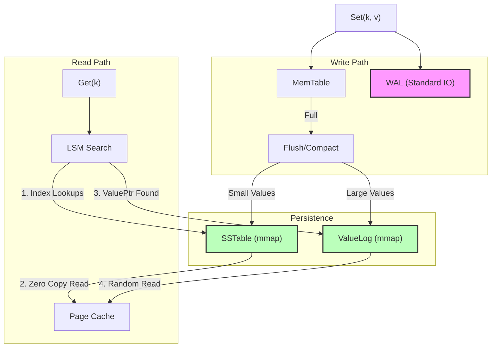

# 2026-01-16 mmap selection rationale

This note compares the mainstream file I/O models in detail and explains the reasoning and trade-offs behind why NoKV picks different I/O strategies in different components (SSTable, WAL, VLog).

## 1. The four-way I/O fight

On Linux/Unix, when designing a storage engine, you typically face four choices. Understanding their trade-offs is the prerequisite for any reasonable architectural decision.

| Property | Standard I/O (`read`/`write`) | Memory-mapped (`mmap`) | Direct I/O (`O_DIRECT`) | Async I/O (`io_uring`) |
| :--- | :--- | :--- | :--- | :--- |
| **Mechanism** | Syscall, copy between Kernel Buffer and User Buffer | Establish virtual-memory mapping, page-fault load, **zero copy** | Bypass Page Cache, DMA directly into user memory | Submit a request queue, kernel completes asynchronously, zero syscall overhead |
| **Strength** | Simple, general, automatic readahead via Page Cache | **Extremely low read latency** (memory-access-like), simple code | **Fully controllable** (memory / fsync), no GC interference | Very high throughput, low CPU cost |
| **Pain** | **Copy overhead** (CPU copy), frequent context switches at high rates | **Uncontrollable** (page faults block, TLB shootdown), large files pollute cache | **Complex** (must build your own buffer pool, alignment constraints) | **Very complex** (a fundamentally different programming model) |
| **Best for** | Append-only logs (WAL) | Read-only indexes, random small reads (SSTable) | DBs that manage their own cache (MySQL, ScyllaDB) | Ultra-high-concurrency network / disk I/O |

---

## 2. NoKV's choice: pick what fits

NoKV does **not** use one I/O strategy for everything. We pick a strategy per component based on its actual access pattern.

### 2.1 SSTable: firmly `mmap`

SSTables are LSM-Tree data files: **immutable** and accessed via **random reads**.

*   **Pain point**: with standard `pread`, every `Get(key)` issues one syscall. At 100k QPS, the context-switch cost dominates.
*   **What `mmap` gives us**:
    *   **Zero copy**: data is mapped directly into user space; `slice := data[offset:len]` involves no `memcpy`.
    *   **Zero syscalls** when hot: once the page is resident, reads are pure memory accesses, nanosecond latency.
    *   **OS manages the cache for you**: rely on the OS Page Cache for hot pages, no need to hand-write a complex LRU.

### 2.2 WAL: back to standard `os.File` + `bufio`

WAL (Write-Ahead Log) is **append-only** and **persistence-sensitive**.

*   **Why `mmap` is the wrong fit**:
    *   **File growth is awkward**: `mmap` needs `ftruncate` to reserve space, and `remap` once you exceed it; this is clumsy for append-style workloads.
    *   **Flush timing is opaque**: `msync` exists, but when the OS actually writes dirty pages back to disk is non-deterministic. WAL needs strict `fsync` semantics, which standard I/O exposes more cleanly.
*   **NoKV's choice**: standard I/O with `bufio.Writer`.
    *   `bufio` provides user-space buffering, reducing the number of `write` syscalls.
    *   `fsync` semantics are clear, so we know exactly when the data is durable.

### 2.3 ValueLog: a deliberate compromise (`mmap` + `madvise`)

ValueLog is **append-write** but takes **random reads** (when KV separation is in play).

*   **Status quo**: NoKV currently uses `mmap` for VLog as well.
*   **Write control**: even though writes go through `mmap`, the code explicitly calls `madvise(MADV_DONTNEED)`.
    *   On `DoneWriting` (file rotation) and `SetReadOnly`, we tell the kernel "I no longer need these pages."
    *   **Why**: actively release the dirty pages VLog just produced so they don't evict the hot SSTable data (indexes, filters) from Page Cache.
*   **Persistence**: `msync` is only called when `SyncWrites: true`. Otherwise we rely on the OS background writeback.

---

## 3. Read/write interaction diagram

The diagram below shows where each I/O model sits in NoKV's read and write path:

```mermaid
flowchart TD
    subgraph "Write Path"
        Mem[MemTable]
        WAL["WAL (Standard IO)"]
        Flush["Flush/Compact"]
    end

    subgraph "Persistence"
        SST["SSTable (mmap)"]
        VLog["ValueLog (mmap)"]
    end

    Write["Set(k, v)"] --> Mem
    Write --> WAL

    Mem -->|Full| Flush
    Flush -->|"Small Values"| SST
    Flush -->|"Large Values"| VLog

    subgraph "Read Path"
        Get["Get(k)"]
        LSM["LSM Search"]

        Get --> LSM
        LSM -->|"1. Index Lookups"| SST
        SST -->|"2. Zero Copy Read"| Kernel["Page Cache"]

        LSM -->|"3. ValuePtr Found"| VLog
        VLog -->|"4. Random Read"| Kernel
    end

    style WAL fill:#f9f,stroke:#333,stroke-width:2px
    style SST fill:#bfb,stroke:#333,stroke-width:2px
    style VLog fill:#bfb,stroke:#333,stroke-width:2px
```

## 4. Summary

NoKV's I/O strategy is **"split read and write, prefer stability"**:

1. **Read-heavy (SST)**: pick `mmap` to extract memory bandwidth and shave CPU cost.
2. **Write-sensitive (WAL)**: pick standard I/O for predictable durability and append performance.
3. **Bulk capacity (VLog)**: pick `mmap` + `madvise` to keep the slice-read ergonomics while actively managing cache pollution.

Understanding these trade-offs is the key to low-level storage-engine performance work.
