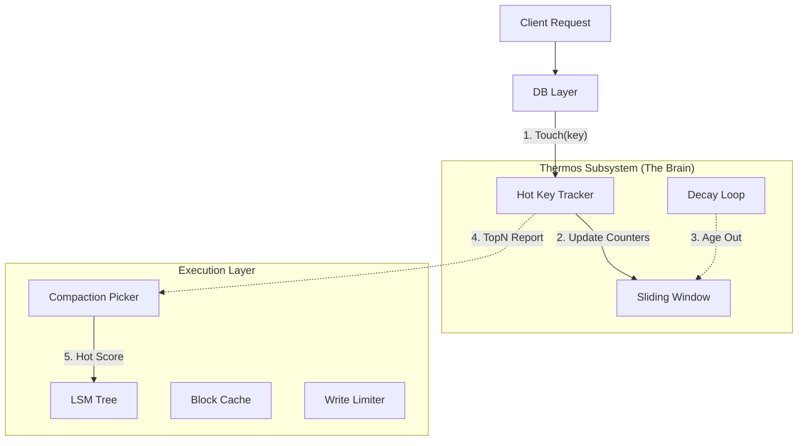

# 2026-01-16 Thermos design note

This note records the original design thinking behind `thermos`. Note: the production implementation has since been narrowed; Thermos remains as an optional internal hot-key detector and write-side hot-key throttling tool. The ambitions in this note around read prefetch, compaction hints, and value-log hot/cold routing **no longer reflect the current default implementation**.

The current implementation lives in the `thermos/` package inside the NoKV repo.

---

## 1. Where the inspiration came from: take the spirit, drop the form

**Source**: [HotRing: A Hotspot-Aware In-Memory Key-Value Store (FAST '20)](https://www.usenix.org/conference/fast20/presentation/chen-jiqiang)

### 1.1 What the paper solves
In a traditional hash index (chained), if the chain is long and the hot data lives near the tail, every hot access walks past a lot of cold data. That kills CPU cache locality and produces awful tail latency. HotRing turns the chain into a **ring structure** and lets the head pointer intelligently point at the hot node, achieving $O(1)$ hot access.

### 1.2 How NoKV adapted it
NoKV does **not** copy the paper as the primary index — our primary index is the LSM Tree. Instead we extracted the core idea, **hotness awareness**, and built a lightweight, side-channel hot-key tracker.

*   **Differences**:
    *   **Role**: the paper is a data-bearing **index**; NoKV's is an accounting **counter**.
    *   **Structure**: the paper uses a **ring + smart pointer**; NoKV uses **sharded hash + ordered list + sliding window**.
*   **Core value**: at million-QPS rates, identify the system's actual hotspots at very low cost (lock-free list), and feed that signal into cache and throttling decisions.

---

## 2. Core architecture: feedback-driven design

NoKV's Thermos is not just a counter. It's the brain of the system's "self-adaptive" loop.

### 2.1 Architecture overview



### 2.2 Key interaction flow
1.  **Probe**:
    *   **Read path**: every successful `Get` calls `Touch`.
    *   **Write path**: only when throttling (`WriteHotKeyLimit`) or burst detection is enabled, the write side calls `TouchAndClamp`.
2.  **Compute**: Thermos uses a **sliding window** algorithm to derive real-time QPS internally.
3.  **Feedback**:
    *   **Compaction scoring**: `lsm/picker.go` consults `Thermos.TopN` when picking a level to compact. If a level holds many hot keys, it gets compaction priority (Hot Overlap Score), reducing read amplification on the hot path.
    *   **Cache prefetch**: the DB layer can trigger prefetch logic based on TopN. Thermos doesn't drive cache itself, but the hot-key list it exposes is an important input to prefetch policy.
    *   **Write throttling**: for keys with abnormally high write frequency, `TouchAndClamp` triggers protective throttling.

---

## 3. Implementation details

### 3.1 Concurrency: lock-free with selective spin locks
Thermos uses a hybrid concurrency strategy to support high parallelism:

*   **Primary chain (Buckets & List)**: lock-free CAS for node insertion.
    *   **Ordered List**: nodes are sorted by `(Tag, Key)`, so failed lookups can short-circuit.
*   **Sliding window (Window Counters)**: window rotation and array updates are non-trivial, so we guard them with a lightweight **spin lock**.
    *   `node.lockWindow()`: `CAS(&lock, 0, 1)`.
*   **Decay**: a background goroutine periodically decays the counters under `decayMu`, but the actual counter decay is an atomic operation.

### 3.2 Statistical algorithm: sliding window plus decay
How do you separate "long-tail historical hotspots" from "current burst hotspots"?

1.  **Sliding window**:
    *   Time is partitioned into slots (e.g. 8 slots, 250ms each).
    *   `Touch` writes into the slot indexed by `Timestamp % Slots`.
    *   **Effect**: precisely reflects the last ~2 seconds of activity; expired data falls off automatically.
2.  **Decay**:
    *   The background goroutine periodically right-shifts every counter (`count >> 1`).
    *   **Effect**: simulates a "half-life" so that previously hot keys cool off if no longer accessed.

---

## 3.3 Key differences from the paper / classic algorithms (engineering changes)

| Axis | Paper / classical algorithm | NoKV Thermos |
| :-- | :-- | :-- |
| Goal | Index or strict frequency estimation | **System-level hot-key feedback signal** |
| Data structure | Ring list / sketch | **Sharded hashing + ordered list** |
| Error bounds | Explicit error guarantees | **Engineering-acceptable range** |
| Concurrency | Heavy locks or global structure | **Lock-free + light spin lock** |
| Time dimension | Steady accumulation | **Sliding window + decay** |

Bottom line: NoKV Thermos prioritizes **engineering usability** over **mathematical optimality**.

---

## 4. Real-world applications

### 4.1 Observability
Operators can inspect the system's hotspots via CLI in real time, immediately identifying "who is overloading the database":
```bash
# Use the stats command
$ go run cmd/nokv/main.go stats --workdir ./work_test
...
Hot Keys:
  key: user:1001, count: 52000
  key: config:global, count: 12000
```

### 4.2 Cache and performance
*   **VIP cache tier (Hot Tier)**: the LSM Cache internally maintains a small `Clock-Pro` cache (Hot Tier). It's not absolute immunity (hotter data can still evict), but it provides hot blocks more protection than plain LRU.
*   **Hot-priority compaction**: Thermos feedback lets the system actively merge overlapping SSTables that hold hot data, shortening the hot key's query path.

---

## 5. Future directions

Based on the current Thermos foundation, NoKV could pursue more advanced features:

1.  **Write absorption**:
    *   For ultra-high-frequency hot writes (like counters), aggregate 100 in-memory updates into 1 VLog write, drastically reducing LSM write amplification.
2.  **Dynamic data migration**:
    *   In a distributed setting, when one Region develops a hotspot, automatically trigger Region split or migrate the hot key to a dedicated node.

## 6. Summary

NoKV's `thermos` is a textbook example of **"academic inspiration + engineering pragmatism"**. Instead of chasing the paper's theoretically perfect ring index, it captured the core value — hotspot awareness — and used hybrid concurrency (lock-free + spin lock) to solve the most painful real-world problem: **the monitoring blind spot**. It successfully feeds back into Compaction scheduling.
