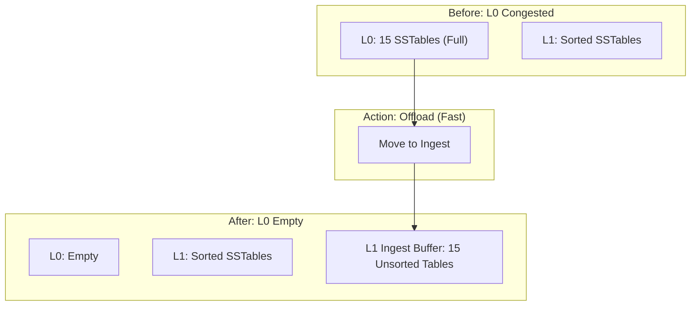

# 2026-02-01 compaction and ingest

本文档深入解析 NoKV 的 **Compaction（压缩）** 机制与 **Ingest Buffer（导入缓冲）** 的协同设计。这是 NoKV 解决 LSM Tree 经典的“写停顿（Write Stall）”问题的核心武器，也是体现其工业级稳定性的关键设计。

---

## 1. 设计理念：拒绝“写停顿”

在 LSM Tree 架构中，数据从 MemTable 刷入 L0 层。由于 L0 层的 SSTable 之间 Key 是重叠的，当 L0 文件数量达到上限（如 15 个）时，必须触发 L0 -> L1 的 Compaction。

*   **传统痛点**：L0 -> L1 的 Compaction 需要将 L0 文件与 L1 中所有重叠的文件读出，进行归并排序（Merge Sort），然后重写。这个过程涉及大量 IO 和 CPU，耗时较长。
*   **后果**：如果写入速度超过了 L0 -> L1 的压缩速度，L0 就会被填满，系统被迫触发 **Write Stall**（限制甚至停止写入），导致严重的性能抖动。

**NoKV 的哲学**：
> **“先收下，再整理。”**
> 当 L0 拥堵时，不要阻塞写入去等待漫长的排序，而是先把 L0 的文件“甩”给下一层，让下一层暂时“保管”，等有空了再慢慢整理。

---

## 1.1 参考论文与工程对标

以下论文/系统是 NoKV compaction 与 ingest buffer 设计的主要参考坐标（按主题分类）：

* **LSM 设计与调参理论**：
  * [Monkey (SIGMOD 2017)](https://stratos.seas.harvard.edu/publications/monkey-optimal-navigable-key-value-store) —— 全局调参、Bloom 过滤器与合并策略的权衡模型。
  * [Dostoevsky (SIGMOD 2018)](https://stratos.seas.harvard.edu/publications/dostoevsky-better-space-time-trade-offs-lsm-tree-based-key-value-stores) —— Lazy Leveling / 低合并成本的层级策略。
* **写停顿与稳定性**：
  * [bLSM (SIGMOD 2012)](https://dblp.uni-trier.de/rec/conf/sigmod/SearsR12.html) —— 强调写入吞吐稳定与 tail latency。
  * [Performance Stability in LSM-based Storage Systems](https://arxiv.org/abs/1906.09667) —— compaction 抖动与写停顿成因分析。
* **工程系统实践**：
  * [RocksDB Compaction (官方文档)](https://github.com/facebook/rocksdb/wiki/Compaction) —— leveled/tiered/universal 与 L0 处理策略。
  * [PebblesDB](https://utsaslab.github.io/pebblesdb/) —— 碎片化/分片思路降低写放大。
  * [Co-KV](https://arxiv.org/abs/1807.04151) —— 把 compaction 视作核心瓶颈的系统研究。

---

## 2. 核心组件：Ingest Buffer

为了实现上述哲学，NoKV 为每一层（Level 1+）引入了一个特殊的结构：**Ingest Buffer**。

### 2.1 结构定义 (`lsm/ingest.go`)
它不是一个简单的队列，而是一个**分片化**的容器：

```go
type ingestBuffer struct {
    shards []ingestShard // 默认 4 个分片
}

type ingestShard struct {
    tables    []*table   // 暂存在这里的 SSTable 列表
    ranges    []tableRange // 对应的 Key 范围索引
}
```

*   **分片 (Sharding)**：根据 Key 的前缀将暂存的表分配到不同的 Shard。
*   **并行性**：这允许后台的多个 Compactor 线程并行地处理不同 Key 范围的积压数据。

---

## 3. 交互逻辑：救火与还债

NoKV 的 Compaction 流程被设计为“快慢双轨”制。

### 3.1 快路径：L0 溢出卸载 (Offloading)

这是应对 Write Stall 的“救火”机制。

*   **触发**：L0 文件数过多。
*   **动作 (`moveToIngest`)**：
    1.  不进行数据合并。
    2.  直接将 L0 的 SSTable 文件从 L0 列表中移除。
    3.  将这些文件加入到 L1 的 `Ingest Buffer` 中。
*   **代价**：纯元数据操作，**微秒级**完成。
*   **结果**：L0 瞬间清空，写停顿解除。L1 暂时持有这些未排序的文件。



### 3.2 慢路径：后台异步归并 (Merge)

这是“还债”机制，确保存储结构的最终有序性。

*   **触发**：Compactor 发现某层的 `Ingest Buffer` 积压严重（`Score > 1`）。
*   **模式选择 (IngestMode)**：
    *   **IngestDrain**：将 Ingest Shard 合并进 Main Tables，彻底清空缓冲。
    *   **IngestKeep**：合并 Shard，但如果下游压力也大，可能会将输出结果继续保留在 Ingest Buffer 中（暂存结果），以避免写入放大的级联效应。
*   **动作 (`fillTablesIngestShard`)**：
    1.  挑选一个积压最严重的 `Shard`。
    2.  锁定该 Shard 和 L1 中与其 Key 范围重叠的 `Main Tables`。
    3.  执行标准的归并排序。
    4.  生成新的 `Main Tables`，清空该 Shard。

---

## 4. 读路径的权衡

这种设计本质上是 **“空间换时间”** 和 **“读写权衡”**。我们牺牲了一点点读性能，换取了极致的写稳定性。

**查询流程 (`Get`)**：
1.  **查 MemTable**。
2.  **查 L0**。
3.  **查 L1**：
    *   **先查 L1 Ingest Buffer**：因为这里面是从 L0 刚“甩”下来的新数据，版本更新。
        *   需要在 Shard 内进行二分查找（因为 buffer 内的表之间可能有重叠）。
    *   **后查 L1 Main Tables**：这是标准的有序数据，查找很快。
4.  **查 L2...**

---

## 5. 协同设计：Value-Aware Compaction

除了处理写抖动，Compaction 还承担了**回收 VLog 空间**的任务。

*   **痛点**：在 KV 分离架构中，LSM 里的删除只是写了一个 Tombstone，VLog 里的旧 Value 依然占着磁盘。
*   **方案**：
    *   **Value Density (价值密度)**：Compaction Picker 会计算每一层的 `TotalValueBytes / TotalSizeBytes`。
    *   **Discard Stats (失效统计)**：虽然 VLog GC 依赖专门的 discard stats，但 Compaction 必须负责通过重写 SSTable 来丢弃那些指向无效 Value 的指针。
    *   **策略**：Compaction 会优先选择 Value 密度异常（或者包含大量 Stale 数据）的层级进行压缩，主动触发指针清理。

## 6. 总结

NoKV 的 Compaction 和 Ingest Buffer 设计解决了一组复杂的工程矛盾：

| 问题 | 传统方案 | NoKV 方案 | 收益 |
| :--- | :--- | :--- | :--- |
| **L0 拥堵** | 阻塞写入，强制合并 | **L0 -> Ingest Buffer** (快速卸载) | **零写停顿 (Zero Write Stall)** |
| **合并卡顿** | 单线程大合并 | **Sharding + Subcompaction** | 并行处理，利用多核/SSD 优势 |
| **VLog 膨胀** | 被动等待 | **Value-Aware Scoring** | 主动出击，加速空间回收 |

这是一个非常成熟的工业级设计，它不仅关注“存得下”，更关注“写得稳”和“删得掉”。

---

## 7. 与论文原始设计的关键对比（我们做了哪些改动）

### 7.1 与 bLSM / Performance Stability 的对比
| 论文观点 | 原文侧重点 | NoKV 改动 | 实际影响 |
| :-- | :-- | :-- | :-- |
| 写停顿主因是 L0 拥堵 + Compaction 过慢 | 强调稳定吞吐 | **Ingest Buffer + 快速卸载** | 写停顿几乎消失 |
| 需要把后台任务节奏“拉平” | 关注 tail latency | **分片 + 并行 compaction + 动态调度** | 把抖动压在后台 |

### 7.2 与 Monkey / Dostoevsky 的对比
| 论文观点 | 原文侧重点 | NoKV 改动 | 实际影响 |
| :-- | :-- | :-- | :-- |
| LSM 参数需全局权衡（读/写/空间） | 理论模型 | **引入 ingest buffer 作为工程缓冲层** | 实际调参更稳定 |
| Lazy leveling 降低合并成本 | 减少写放大 | **IngestKeep/Drain 模式** | 热点时延降低 |

### 7.3 与 RocksDB / PebblesDB 的对比
| 系统 | 原始设计 | NoKV 改动 | 说明 |
| :-- | :-- | :-- | :-- |
| RocksDB | L0 → leveled，universal 作为可选 | **引入每层 ingest 缓冲区** | 更适合 burst 场景 |
| PebblesDB | 碎片化 LSM | **按前缀分片 shard** | 保持范围局部性 |

### 7.4 与论文原型不同的工程化点

* **分片并行**：按 key 前缀 shard，使 ingest 与 compaction 可并行而不互相覆盖。
* **IngestKeep / IngestDrain**：把“快速止血”和“慢速还债”拆成两条路径。
* **Value-aware compaction**：与 VLog discard stats 联动，把无效指针尽快清掉。
* **调度基于 backlog/score**：优先处理最急的 shard，而非随机挑选。

> 简单总结：论文解决的是“理论最优解”，NoKV 做的是“工程稳定性 + 可运维”。
