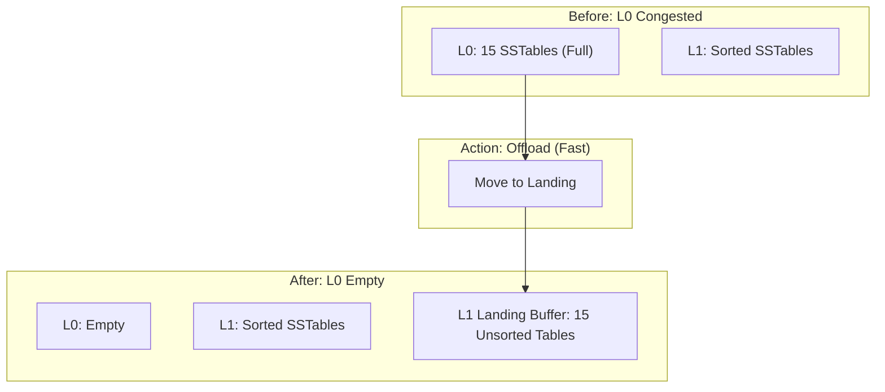

# 2026-02-01 Compaction and Landing Buffer design

This note dissects NoKV's **compaction** mechanism and the cooperative design with the **landing buffer**. Together they are the core weapon NoKV uses against the classic LSM-Tree "write stall" problem, and a key piece of evidence for our industrial-grade stability claim.

---

## 1. Design philosophy: refuse to "write stall"

In the LSM-Tree architecture, data flushes from MemTable into L0. Because L0 SSTables overlap on key ranges, once L0 file count hits the cap (e.g. 15), an L0 → L1 compaction is forced.

*   **Traditional pain**: an L0 → L1 compaction must read the L0 files plus all overlapping L1 files, merge-sort them, and rewrite. This involves heavy I/O and CPU and takes a long time.
*   **Consequence**: if write rate exceeds L0 → L1 compaction rate, L0 fills up and the system is forced into **write stall** (throttling or stopping writes), causing severe performance jitter.

**NoKV's philosophy**:
> **"Land first, sort later."**
> When L0 is congested, don't block writes waiting for a long sort — *toss* the L0 files into the next level, let it park them temporarily, and sort them on a slower schedule.

---

## 1.1 Reference papers and engineering peers

The following papers / systems are NoKV's main reference points for compaction and landing buffer design (grouped by topic):

* **LSM design and tuning theory**:
  * [Monkey (SIGMOD 2017)](https://stratos.seas.harvard.edu/publications/monkey-optimal-navigable-key-value-store) — global tuning, Bloom filter and merge-policy trade-off model.
  * [Dostoevsky (SIGMOD 2018)](https://stratos.seas.harvard.edu/publications/dostoevsky-better-space-time-trade-offs-lsm-tree-based-key-value-stores) — Lazy Leveling / lower merge-cost level strategy.
* **Write stall and stability**:
  * [bLSM (SIGMOD 2012)](https://dblp.uni-trier.de/rec/conf/sigmod/SearsR12.html) — emphasis on stable write throughput and tail latency.
  * [Performance Stability in LSM-based Storage Systems](https://arxiv.org/abs/1906.09667) — analysis of compaction jitter and write-stall causes.
* **Engineering systems**:
  * [RocksDB Compaction (official docs)](https://github.com/facebook/rocksdb/wiki/Compaction) — leveled / tiered / universal and L0 strategies.
  * [PebblesDB](https://utsaslab.github.io/pebblesdb/) — fragmentation / sharding ideas to reduce write amplification.
  * [Co-KV](https://arxiv.org/abs/1807.04151) — research that frames compaction as the central bottleneck.

---

## 2. Core component: the Landing Buffer

To realize the philosophy above, NoKV introduces a special structure on every level (Level 1+): **the Landing Buffer**.

### 2.1 Structure (`lsm/landing.go`)

It's not a flat queue — it's a **sharded** container:

```go
type landingBuffer struct {
    shards []landingShard // 4 shards by default
}

type landingShard struct {
    tables    []*table     // SSTables parked here
    ranges    []tableRange // matching key-range index
}
```

*   **Sharding**: parked tables are routed to a shard by key prefix.
*   **Parallelism**: this lets multiple background compactor threads work different key ranges simultaneously.

---

## 3. Interaction logic: emergency response and debt repayment

NoKV's compaction is designed as a "fast lane / slow lane" two-track system.

### 3.1 Fast path: L0 overflow offload

This is the firefighting mechanism for write stalls.

*   **Trigger**: L0 file count exceeds threshold.
*   **Action (`moveToLanding`)**:
    1.  No data merge.
    2.  Remove the L0 SSTables from the L0 list.
    3.  Append them to L1's `Landing Buffer`.
*   **Cost**: pure metadata operation, **microsecond-scale**.
*   **Result**: L0 is empty instantly, write stall released. L1 temporarily holds the unsorted files.



### 3.2 Slow path: background async merge

This is the debt-repayment mechanism that ensures the storage layout eventually returns to fully sorted.

*   **Trigger**: a compactor sees that some level's `Landing Buffer` is overloaded (`Score > 1`).
*   **Mode selection (LandingMode)**:
    *   **LandingDrain**: merge the landing shard into Main Tables, fully clearing the buffer.
    *   **LandingKeep**: merge the shard, but if downstream pressure is also high, keep the output in Landing Buffer (staged result) to avoid a cascade of write amplification.
*   **Action (`fillTablesLandingShard`)**:
    1.  Pick the most backlogged shard.
    2.  Lock that shard plus the overlapping `Main Tables` in L1.
    3.  Run a standard merge sort.
    4.  Produce new `Main Tables`, clearing the shard.

---

## 4. Read path trade-offs

This design is fundamentally **"space for time"** and **"read/write trade-off"**. We pay a small read cost to get extreme write stability.

**Query flow (`Get`)**:
1.  **Check MemTable**.
2.  **Check L0**.
3.  **Check L1**:
    *   **First check L1 Landing Buffer**: this is the freshly tossed-down newer data, with newer versions.
        *   We binary-search inside the shard (because tables in the buffer can overlap).
    *   **Then check L1 Main Tables**: this is the standard sorted data — fast lookup.
4.  **Check L2 ...**

---

## 5. Cooperative design: value-aware compaction

Beyond handling write jitter, compaction also bears the responsibility of **reclaiming VLog space**.

*   **Pain**: in a KV-separation architecture, deleting in LSM only writes a tombstone — the old value still occupies the VLog disk.
*   **Approach**:
    *   **Value Density**: the compaction picker computes per-level `TotalValueBytes / TotalSizeBytes`.
    *   **Discard Stats**: VLog GC depends on dedicated discard stats, but compaction is responsible for rewriting SSTables to drop pointers to invalid values.
    *   **Strategy**: compaction prioritizes levels with abnormal value density (or lots of stale data), proactively triggering pointer cleanup.

## 6. Summary

NoKV's compaction + landing buffer design resolves a knot of engineering trade-offs:

| Problem | Traditional approach | NoKV approach | Benefit |
| :--- | :--- | :--- | :--- |
| **L0 congestion** | Block writes, force merge | **L0 → Landing Buffer** (fast offload) | **Zero write stall** |
| **Merge stall** | Single-threaded big merge | **Sharding + subcompaction** | Parallel processing, multicore/SSD friendly |
| **VLog bloat** | Wait passively | **Value-aware scoring** | Active reclamation |

This is a mature industrial design that cares not only about "fits on disk" but also "writes stay smooth" and "deletions actually reclaim space."

---

## 7. Key differences from the original papers (what we changed)

### 7.1 vs bLSM / Performance Stability

| Paper insight | Paper focus | NoKV change | Real impact |
| :-- | :-- | :-- | :-- |
| Write stall is mainly caused by L0 congestion + slow compaction | Stable throughput | **Landing Buffer + fast offload** | Write stall almost gone |
| Background tasks need rhythm "smoothing" | Tail latency | **Sharding + parallel compaction + dynamic scheduling** | Jitter pushed to background |

### 7.2 vs Monkey / Dostoevsky

| Paper insight | Paper focus | NoKV change | Real impact |
| :-- | :-- | :-- | :-- |
| LSM parameters require global trade-off (read/write/space) | Theoretical model | **Introduce landing buffer as engineering buffer layer** | Tuning is more stable in practice |
| Lazy leveling reduces merge cost | Lower write amplification | **LandingKeep / Drain modes** | Lower hot-key tail latency |

### 7.3 vs RocksDB / PebblesDB

| System | Original design | NoKV change | Notes |
| :-- | :-- | :-- | :-- |
| RocksDB | L0 → leveled, universal as option | **Per-level landing buffer** | Better fit for bursty scenarios |
| PebblesDB | Fragmented LSM | **Prefix-sharded** | Preserves range locality |

### 7.4 Engineering moves vs paper prototypes

* **Sharded parallelism**: shard by key prefix so landing and compaction can run in parallel without overwriting each other.
* **LandingKeep / LandingDrain**: separate "fast hemostasis" from "slow debt repayment" into two paths.
* **Value-aware compaction**: cooperate with VLog discard stats to clean up stale pointers faster.
* **Schedule by backlog/score**: process the most overloaded shard first, not random selection.

> One-line summary: papers tackle "theoretical optimum"; NoKV tackles "engineering stability + operability."
