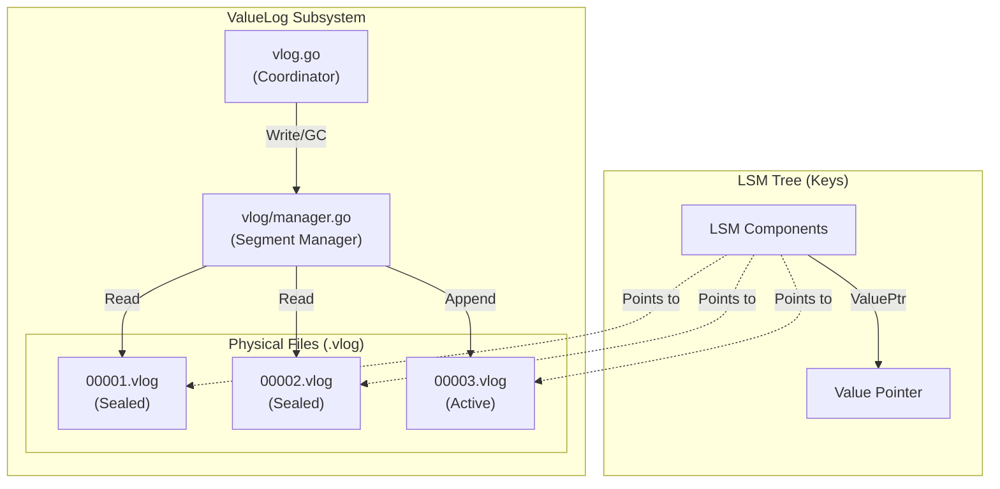
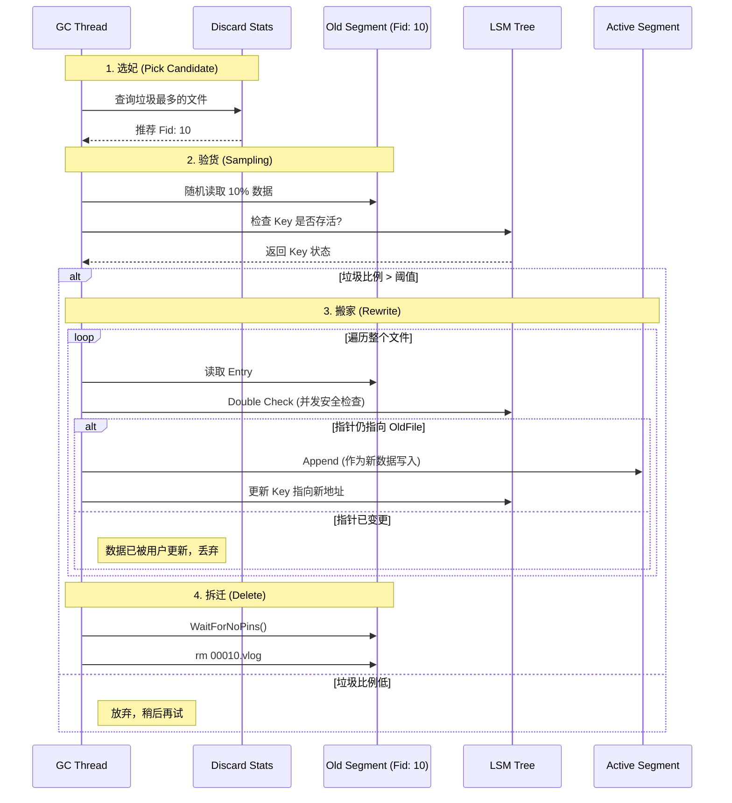

# 2026-02-01 vlog design and gc

本文档详细记录了 NoKV 中 ValueLog 组件的设计思路、核心机制（GC）以及底层文件系统的实现细节。NoKV 采用了类似 BadgerDB 的键值分离（Key-Value Separation）架构，其中 ValueLog 是承载实际数据的主体。

---

## 1. 核心架构：三层洋葱模型

ValueLog 的实现采用了典型的分层架构，自顶向下分为三层：

| 层级 | 模块/文件 | 核心职责 | 关键技术 |
| :--- | :--- | :--- | :--- |
| **业务逻辑层** | `vlog.go` | 负责 GC 调度、垃圾统计 (Discard Stats)、与 LSM 的交互（索引重建） | 协程调度, 统计聚合 |
| **文件管理层** | `vlog/manager.go` | 管理 `.vlog` 文件集合，处理文件轮转 (Rotation)、ID 映射、并发引用 | 读写锁, 原子计数 (Pinning) |
| **底层 IO 层** | `file/` (`mmap`) | 封装 OS 文件操作，提供高性能的内存映射读写接口 | `mmap`, `msync`, Zero-Copy |

### 架构示意图 (Mermaid)

---

## 2. 底层文件系统设计 (`file/`)

NoKV 放弃了标准的 `read/write` 系统调用，全面采用 **Memory Mapped Files (mmap)** 来管理 VLog。

### 2.1 为什么选择 mmap？
*   **极致读性能**：读取文件等同于访问内存数组 (`data[offset : offset+len]`)。实现了用户态的 **Zero Copy**（零拷贝），避免了内核到用户空间的 buffer拷贝。
*   **简化 IO 逻辑**：不需要处理复杂的 `seek` 和 `read` 循环，由操作系统负责缺页加载（Page Fault）。

### 2.2 实现细节 (`file/mmap_*.go`)
*   **写入 (Append)**：直接 `copy` 数据到映射的 byte slice 中。
*   **扩容 (Truncate & Remap)**：
    *   `mmap` 映射区域大小固定。
    *   当空间不足时，调用 `ftruncate` 增大物理文件 -> `munmap` 解除映射 -> `mmap` 重新映射更大的空间。
*   **持久化 (Sync)**：NoKV 的 WAL 使用标准 IO (bufio) 以保证持久性，而 VLog 默认依赖 OS 刷盘。只有当 `SyncWrites` 开启时，VLog 才会显式调用 `msync`。

---

## 3. 文件管理与并发控制 (`vlog/manager.go`)

### 3.1 文件分片 (Segmentation)
数据被切分为多个固定大小（配置项 `ValueLogFileSize`）的 Segment 文件。
*   **Manifest 维护**：VLog 的生命周期（Head 指针、删除操作）通过 Manifest 文件进行持久化，而不是仅依赖扫描目录。这保证了崩溃恢复的一致性。

### 3.2 并发安全机制 (Pinning)
为了防止在 **GC 删除文件** 时，仍有 **读请求** 访问该文件，NoKV 实现了一套基于原子计数的引用保护机制。

*   **Pin (加锁)**：读请求开始时，`atomic.AddInt32(&pinCount, 1)`。
*   **Unpin (解锁)**：读请求结束时，`atomic.AddInt32(&pinCount, -1)`。
*   **Wait (阻塞)**：GC 线程在删除文件前，调用 `waitForNoPins()`，阻塞直到 `pinCount` 归零。

---

## 4. 垃圾回收 (GC) 设计

由于 LSM Tree 只能删除 Key 的索引，ValueLog 中的旧数据（无效 Value）会永久占用磁盘。GC 是 KV 分离架构中最关键的一环。

### 4.1 核心策略：重写 (Rewrite)
NoKV 不支持在文件中间“打洞”删除，而是采用 **“采样搬运 + 整体删除”** 的策略。

### 4.2 GC 流程图

### 4.3 关键设计心得
1.  **Value Threshold (阈值控制)**：
    *   并非所有 Value 都进 VLog。默认只有大于 **1KB** (`utils.DefaultValueThreshold`) 的 Value 才会分离。小 Value 依然内联在 LSM Tree 中，以优化小对象的 Range Scan 性能。
2.  **Discard Stats (垃圾统计)**：
    *   每次 LSM Compaction 丢弃 Key 时，都会记录对应的 ValueLog 文件 ID 增加了多少垃圾。
    *   统计信息定期持久化到内部 Key `!NoKV!discard` 中，防止重启丢失。
3.  **并发更新保护**：
    *   在 GC 搬运数据的瞬间，用户可能并发更新了该 Key。
    *   **解决方案**：GC 在写入新值前，再次检查 LSM Tree。如果发现 LSM 中的 ValuePtr 已经指向了**更新的文件**（Fid 更大）或**更新的偏移量**，说明用户抢先更新了，GC 放弃搬运旧值，保证了数据一致性。

---

## 5. 总结

NoKV 的 ValueLog 设计在**工程实现**上做出了以下权衡：

*   **空间换时间**：允许一定的磁盘空间浪费（GC 阈值），换取极高的写入性能（顺序写）。
*   **复杂性换性能**：引入了复杂的 GC 机制和并发引用计数，换取了 KV 分离带来的 LSM 写放大降低（Write Amplification Reduction）。
*   **OS 亲和性**：充分利用 `mmap` 和 Page Cache，减少了用户态的内存拷贝和缓冲管理开销。

---

## 6. 未来展望：KV 分离架构的前沿演进

对于 KV 分离（Key-Value Separation）存储架构，NoKV 目前处于“经典 WiscKey 实现”的阶段。针对 Range Scan 性能差和 GC 开销大这两大痛点，以下是 NoKV 未来演进的方向：

### 6.1 优化 GC 开销：从“盲目追加”到“冷热分离”
**现状**：NoKV 目前是简单的 Append-Only，冷热数据混杂在同一个 Vlog 文件中，导致 GC 时需要重复搬运冷数据。

**演进方向（参考 HashKV）**：
*   **Hash 分区**：根据 `Hash(Key)` 将 Value 写入不同的 Partition。
*   **收益**：同一个 Key 的历史版本集中在特定分区。更新频繁的 Key 所在分区变脏极快，GC 时可能直接删除整个分区文件，实现“零搬运”回收。

### 6.2 优化范围查询：小 Value 内联 (Inlining)
**现状**：虽然已有阈值控制，但中等大小的 Value 依然会导致 Scan 性能下降。

**演进方向（参考 RocksDB BlobDB）**：
*   **更灵活的阈值**：动态调整 `min_blob_size`。
*   **收益**：在 YCSB-Scan 场景下，由于小对象随 Key 顺序读取，性能将获得质的提升。

### 6.3 硬件协同：ZNS SSD 与 NVM
*   **ZNS (Zoned Namespace) SSD**：利用其顺序写的物理特性，消除 SSD 内部的 FTL GC，实现底层层面的零写放大。
*   **NVM (非易失内存)**：将 VLog 的索引或 L0/L1 层存放在 NVM，极大降低元数据访问延迟。

### 6.4 NoKV 的独特地位
NoKV 目前的 **WiscKey + HotRing** 组合已经解决了一个经典痛点：LSM 在热点访问下的倾斜问题。未来通过引入 **小对象内联** 和 **冷热分区**，NoKV 将进化为更具竞争力的工业级分布式存储引擎。