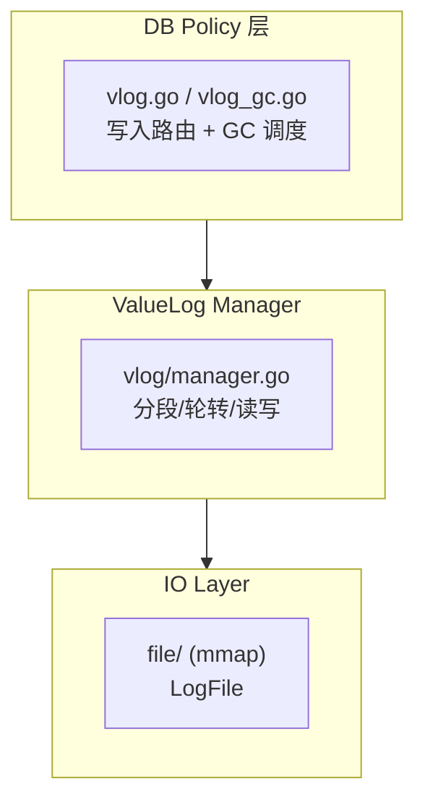
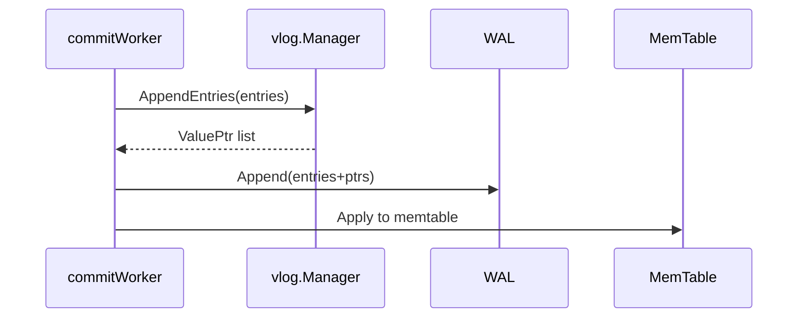
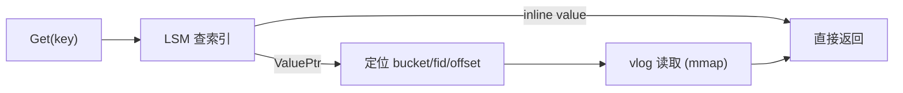
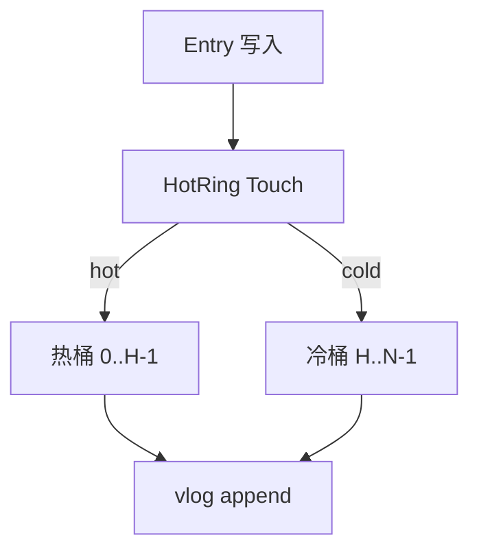
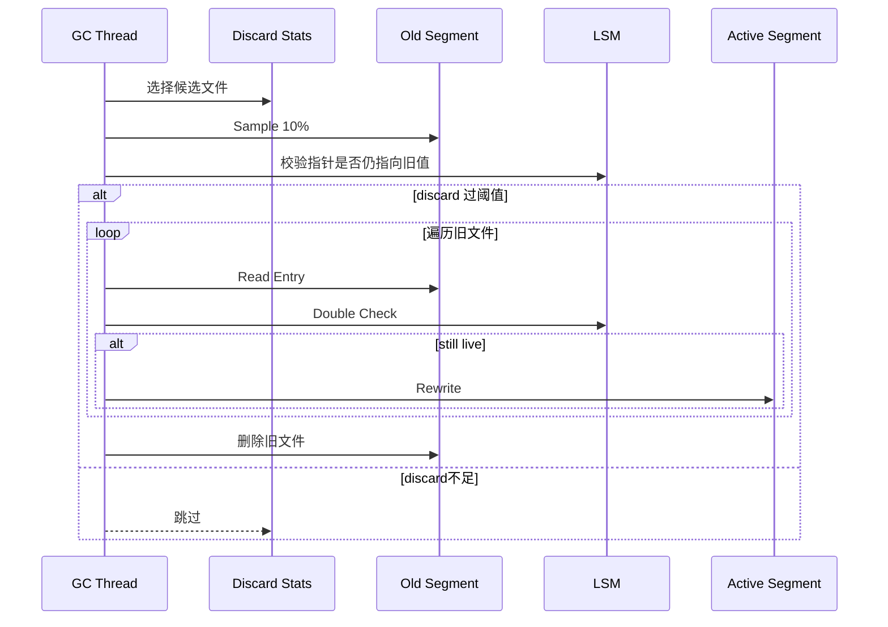
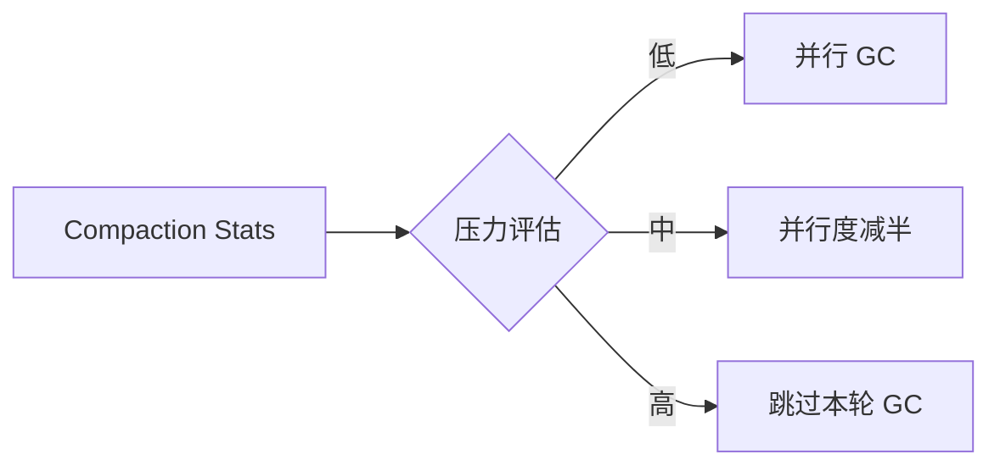

# 2026-02-05 vlog 设计与 GC（WiscKey + HashKV 工程化）

这份笔记把 NoKV 的 ValueLog（vlog）设计、GC 机制、以及最近的并行化与热冷分流优化整理成一份完整版本。内容融合 **WiscKey**（KV 分离）与 **HashKV**（哈希分区/热冷分离）两条主线，并结合当前实现细节与参数策略。

---

## 一页摘要（TL;DR）

**核心思路**：LSM 只保存 Key+ValuePtr，大 Value 顺序写入 vlog；再用 **多桶 + 热冷分流** 把热点更新局部化，并通过 **并行 GC + 压力控制** 把 GC 开销稳定在可控范围。

| 设计点 | 借鉴 | NoKV 实现 | 直接收益 |
| :-- | :-- | :-- | :-- |
| KV 分离 | WiscKey | vlog + ValuePtr | LSM 更小、写入更顺序 |
| 哈希分区 | HashKV | `ValueLogBucketCount` | 垃圾局部化 |
| 热冷分流 | HashKV | HotRing 路由 | 热点不污染冷数据 |
| GC 并行 | 工程化 | `ValueLogGCParallelism` | 提升清理吞吐 |
| 压力控制 | 工程化 | reduce/skip 阈值 | 不与 compaction 抢资源 |

---

## 1. 论文借鉴要点

### 1.1 WiscKey
* **KV 分离**：LSM 只存 Key + ValuePtr，大 Value 写入 vlog。
* **顺序写**：写入走日志追加，延迟稳定。
* **GC 必要性**：旧值只能通过搬运+删除回收。

### 1.2 HashKV
* **哈希分区**：ValueLog 分桶，key 的历史版本集中。
* **热冷分离**：热点更新影响局部桶，冷数据保持稳定。
* **轻 GC**：热点桶高频回收，冷桶低频维护。

### 1.3 参考论文（标题）
* **[WiscKey: Separating Keys from Values in SSD-conscious Storage](https://www.usenix.org/conference/fast16/technical-sessions/presentation/lu)**
* **[HashKV: Enabling Efficient Updates in KV Storage via Hashing](https://www.usenix.org/conference/atc18/presentation/chan)**

---

## 2. 设计目标（工程化视角）

1) **写路径极简**：顺序追加为主，不引入复杂索引结构。  
2) **GC 不扰动主路径**：并行但受控，避免和 compaction 争 IO。  
3) **热点更新局部化**：尽量把垃圾限制在热桶。  
4) **可观测 + 可调参**：让调参是“看得见的系统工程”。  

---

## 2.1 设计约束与假设

* **Crash Recovery 必须可靠**：vlog 的 head/删除状态必须可恢复。
* **写放大优先于读放大**：更倾向把写成本压低，读路径可容忍一次额外跳转。
* **GC 可退让**：GC 是“后台维护”，不能把 compaction 压死。

---

## 3. 架构总览（分层模型）



---

## 4. 目录布局与分桶结构

```text
<workdir>/
  vlog/
    bucket-000/
      00000.vlog
      00001.vlog
    bucket-001/
      00000.vlog
      00001.vlog
    ...
```

* `ValueLogBucketCount > 1` 启用分桶。
* ValuePtr 现在包含 `Bucket/Fid/Offset/Len`，LSM 可以精确定位。

---

## 4.1 记录格式与 ValuePtr 布局

**vlog 记录格式**（与 WAL 一致）：

```
+--------+----------+------+-------------+-----------+-------+
| KeyLen | ValueLen | Meta | ExpiresAt   | Key bytes | Value |
+--------+----------+------+-------------+-----------+-------+
                                             + CRC32 (4B)
```

**ValuePtr 布局**：

```
+------+--------+-----+--------+
| Len  | Offset | Fid | Bucket |
+------+--------+-----+--------+
| 4B   | 4B     | 4B  | 4B     |
```

这保证了：**LSM 索引只需持有 ValuePtr 即可定位到具体桶 + 文件 + 偏移**。

---

## 4.2 Manifest 与恢复关系（NoKV 特有工程点）

与论文原型不同，NoKV **把 vlog 的 head 与删除事件写入 manifest**：


这样恢复时不依赖完整目录扫描，避免误删/误开段。

---

## 5. 写入路径（顺序追加）



关键保证：**vlog 写入在 WAL 之前**，崩溃恢复时不会出现“指针悬空”。

---

## 6. 读路径（指针解引用）



读路径的代价在于一次额外的 vlog 定位，但换来更小的 LSM 与更顺序的写入。

---

## 6. 热冷分流（HotRing 驱动）

热度统计只看写路径（写热点），避免读热点污染：



默认配置（可调）：
* `ValueLogBucketCount = 16`
* `ValueLogHotBucketCount = 4`
* `ValueLogHotKeyThreshold = 8`

---

## 7. GC 机制（采样 + 重写）



---

## 8. 并行 GC + 压力控制（核心工程化）

### 8.1 并行调度
* `ValueLogGCParallelism` 控制并发数（默认自动）。
* **同桶互斥**：同一桶不会并发 GC（无锁 CAS）。
* 全局 semaphore 限制同时 GC 数量。

### 8.2 压力控制
当 compaction 压力过高时，GC 自动降级或跳过：



阈值参数：
* `ValueLogGCReduceScore / ValueLogGCReduceBacklog`
* `ValueLogGCSkipScore / ValueLogGCSkipBacklog`

---

## 8.3 与论文实现的关键差异（重点对比）

### WiscKey vs NoKV
| 维度 | WiscKey | NoKV |
| :-- | :-- | :-- |
| vlog 元数据 | 论文原型不强调 manifest | **manifest 记录 head/删除** |
| GC 触发 | 依赖扫描与 stale ratio | **来自 LSM discard stats** |
| GC 并行 | 未强调 | **多桶并行 + 压力控制** |
| 热点处理 | 无显式热冷 | **HotRing 驱动热/冷桶** |

### HashKV vs NoKV
| 维度 | HashKV | NoKV |
| :-- | :-- | :-- |
| 分区策略 | 哈希分区 | **哈希分桶 + 热/冷分流** |
| 目标 | 降低更新放大 | **降低 GC 波动 + write amp** |
| GC 调度 | 以分区为单位 | **分桶并行 + compaction 压力控制** |

> 结论：NoKV 保留论文的“核心思想”，但在**恢复一致性、调度策略、观测性**上做了工程化强化。

---

## 9. 可观测性与调参抓手

关键指标（expvar）：
* `NoKV.ValueLog.GcParallelism`
* `NoKV.ValueLog.GcActive`
* `NoKV.ValueLog.GcScheduled`
* `NoKV.ValueLog.GcThrottled`
* `NoKV.ValueLog.GcSkipped`
* `NoKV.ValueLog.GcRejected`

简单调参建议：
* 低负载：调高 `ValueLogGCParallelism`
* 高负载：降低 `ReduceScore` 或 `ReduceBacklog`，更快降级

---

## 10. 代价与边界

* 桶数过多 → 文件碎片化、head 追踪成本上升  
* 热桶过小 → 轮转频繁、写放大升高  
* 并行 GC 过高 → 可能与 compaction 争抢 IO  

---

## 11. 小结

NoKV 的 vlog 设计是典型的 “**WiscKey + HashKV + 工程化调度**”：

* **写路径保持顺序**，延迟稳定  
* **多桶 + 热冷分流** 把垃圾局部化  
* **并行 GC + 压力控制** 把系统稳定性和吞吐平衡起来  

这使得 vlog 从“可用”走向“可运维 + 可扩展”。
