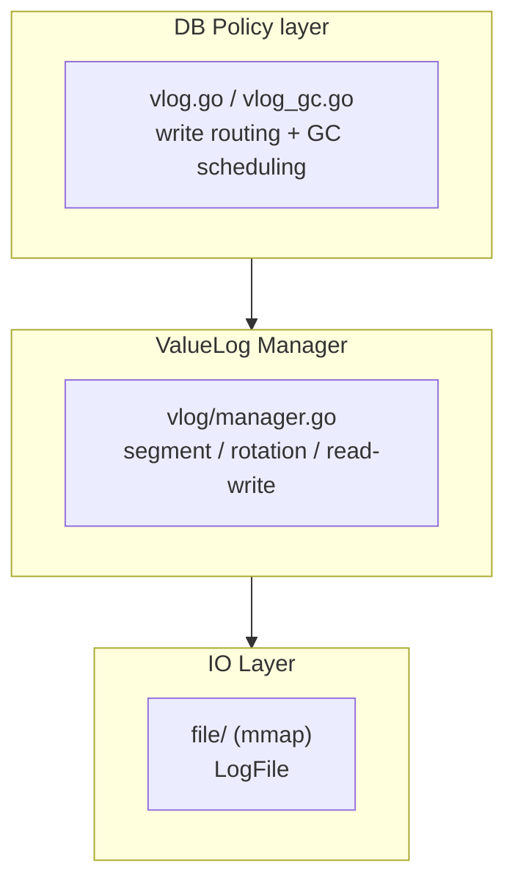
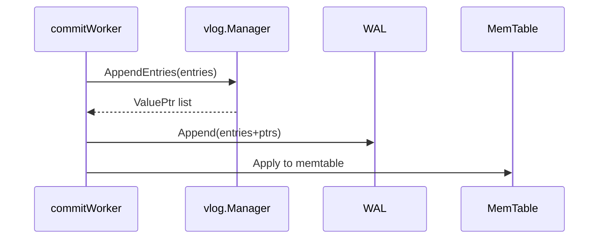
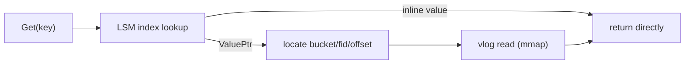
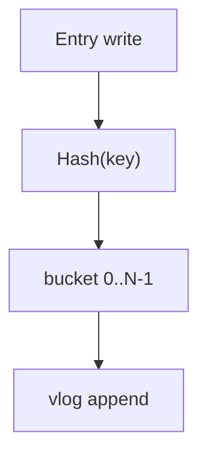
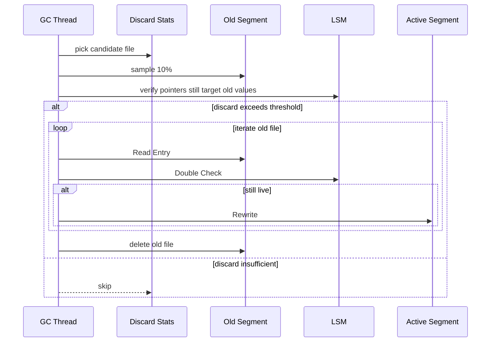
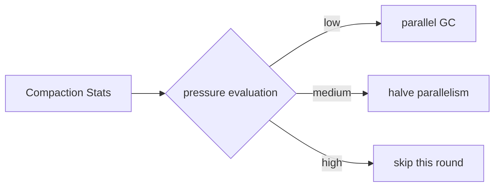

# 2026-02-05 vlog design and GC (engineered WiscKey + HashKV)

This note consolidates NoKV's ValueLog (vlog) design, GC mechanics, and recent parallelization + hot/cold routing work into a single complete picture. It blends two threads — **WiscKey** (KV separation) and **HashKV** (hash partitioning + hot/cold separation) — and ties them to current implementation details and tuning strategy.

---

## TL;DR

**Core idea**: LSM keeps only Key + ValuePtr; large values go append-only into vlog; **multi-bucket + hot/cold routing** localizes hot updates; **parallel GC + pressure control** keeps GC overhead in a controllable band.

| Design point | Inspiration | NoKV implementation | Direct benefit |
| :-- | :-- | :-- | :-- |
| KV separation | WiscKey | vlog + ValuePtr | Smaller LSM, more sequential writes |
| Hash partitioning | HashKV | `ValueLogBucketCount` | Garbage localization |
| Parallel GC | Engineering | `ValueLogGCParallelism` | Higher cleanup throughput |
| Pressure control | Engineering | reduce/skip thresholds | Doesn't fight compaction for resources |

---

## 1. Paper background

### 1.1 WiscKey
* **KV separation**: LSM stores Key + ValuePtr; large values go to vlog.
* **Sequential writes**: append-only writes give stable latency.
* **GC necessity**: stale values can only be reclaimed by copy + delete.

### 1.2 HashKV
* **Hash partitioning**: bucketize ValueLog so a key's history is concentrated.
* **Hot/cold separation**: hot updates affect local buckets while cold data stays stable.
* **Lightweight GC**: hot buckets get aggressive reclamation; cold buckets get low-frequency maintenance.

### 1.3 Reference papers
* **[WiscKey: Separating Keys from Values in SSD-conscious Storage](https://www.usenix.org/conference/fast16/technical-sessions/presentation/lu)**
* **[HashKV: Enabling Efficient Updates in KV Storage via Hashing](https://www.usenix.org/conference/atc18/presentation/chan)**

---

## 2. Design goals (engineering view)

1) **Minimal write path**: append dominates; no fancy index structures.
2) **GC must not perturb the main path**: parallel but throttled, doesn't fight compaction for I/O.
3) **Localize hot updates**: keep garbage inside hot buckets when possible.
4) **Observable + tunable**: parameter tuning is "visible system engineering."

---

## 2.1 Constraints and assumptions

* **Crash recovery must be reliable**: vlog head and delete state must be recoverable.
* **Prefer write amplification cost over read amplification**: lean on lower write cost; the read path can tolerate one extra hop.
* **GC can yield**: GC is "background maintenance" — it must not crush compaction.

---

## 3. Architecture overview (layered model)


```mermaid
flowchart TD
  subgraph DB["DB Policy layer"]
    VlogGo["vlog.go / vlog_gc.go<br/>write routing + GC scheduling"]
  end
  subgraph Mgr["ValueLog Manager"]
    MgrGo["vlog/manager.go<br/>segment / rotation / read-write"]
  end
  subgraph IO["IO Layer"]
    File["file/ (mmap)<br/>LogFile"]
  end

  DB --> Mgr --> IO
```

---

## 4. Directory layout and bucketing

```text
<workdir>/
  vlog/
    bucket-000/
      00000.vlog
      00001.vlog
    bucket-001/
      00000.vlog
      00001.vlog
    ...
```

* `ValueLogBucketCount > 1` enables bucketing.
* ValuePtr now contains `Bucket/Fid/Offset/Len`, allowing precise positioning from the LSM side.

---

## 4.1 Record format and ValuePtr layout

**vlog record format** (same as WAL):

```
+--------+----------+------+-------------+-----------+-------+
| KeyLen | ValueLen | Meta | ExpiresAt   | Key bytes | Value |
+--------+----------+------+-------------+-----------+-------+
                                             + CRC32 (4B)
```

**ValuePtr layout**:

```
+------+--------+-----+--------+
| Len  | Offset | Fid | Bucket |
+------+--------+-----+--------+
| 4B   | 4B     | 4B  | 4B     |
```

This guarantees: **the LSM index needs only ValuePtr to locate exact bucket + file + offset**.

---

## 4.2 Manifest and recovery (NoKV-specific engineering)

Different from the paper prototype, NoKV **records vlog head and delete events into the manifest**:


```mermaid
flowchart LR
  A["vlog append"] --> B["update head"]
  B --> C["manifest edit"]
  C --> D["crash recovery"]
  D --> E["rebuild vlog state"]
```

So recovery doesn't depend on a full directory scan, avoiding accidental delete / open of segments.

---

## 5. Write path (append)


```mermaid
sequenceDiagram
  participant C as commitWorker
  participant V as vlog.Manager
  participant W as WAL
  participant M as MemTable
  C->>V: AppendEntries(entries)
  V-->>C: ValuePtr list
  C->>W: Append(entries+ptrs)
  C->>M: Apply to memtable
```

Key guarantee: **vlog append happens before WAL**, so crash recovery never produces "dangling pointers."

---

## 6. Read path (pointer dereference)


```mermaid
flowchart LR
  K["Get(key)"] --> LSM["LSM index lookup"]
  LSM -->|inline value| V["return directly"]
  LSM -->|ValuePtr| P["locate bucket/fid/offset"]
  P --> R["vlog read (mmap)"]
  R --> V
```

The read path costs one extra vlog seek but in exchange the LSM is smaller and writes are more sequential.

---

## 6. Plain bucketing (current implementation)

Hot-key statistics only follow the write path (write hotspots), preventing read hotspots from polluting:


```mermaid
flowchart TD
  E["Entry write"] --> H["Hash(key)"]
  H --> B["bucket 0..N-1"]
  B --> V["vlog append"]
```

Default config (tunable):
* `ValueLogBucketCount = 16`

---

## 7. GC mechanism (sample + rewrite)


```mermaid
sequenceDiagram
  participant GC as GC Thread
  participant Stats as Discard Stats
  participant Old as Old Segment
  participant LSM as LSM
  participant New as Active Segment

  GC->>Stats: pick candidate file
  GC->>Old: sample 10%
  GC->>LSM: verify pointers still target old values
  alt discard exceeds threshold
    loop iterate old file
      GC->>Old: Read Entry
      GC->>LSM: Double Check
      alt still live
        GC->>New: Rewrite
      end
    end
    GC->>Old: delete old file
  else discard insufficient
    GC-->>Stats: skip
  end
```

---

## 8. Parallel GC + pressure control (core engineering)

### 8.1 Parallel scheduling
* `ValueLogGCParallelism` controls concurrency (default auto).
* **Same-bucket exclusivity**: a single bucket is never GC'd concurrently (lock-free CAS).
* Global semaphore caps total in-flight GC.

### 8.2 Pressure control
When compaction pressure is high, GC automatically degrades or skips:


```mermaid
flowchart LR
  A["Compaction Stats"] --> B{"pressure evaluation"}
  B -->|low| C["parallel GC"]
  B -->|medium| D["halve parallelism"]
  B -->|high| E["skip this round"]
```

Threshold parameters:
* `ValueLogGCReduceScore / ValueLogGCReduceBacklog`
* `ValueLogGCSkipScore / ValueLogGCSkipBacklog`

---

## 8.3 Key differences from the papers

### WiscKey vs NoKV

| Axis | WiscKey | NoKV |
| :-- | :-- | :-- |
| vlog metadata | Paper prototype doesn't emphasize manifest | **manifest records head / delete** |
| GC trigger | Scan + stale ratio | **driven by LSM discard stats** |
| GC parallelism | Not emphasized | **multi-bucket parallel + pressure control** |
| Hot handling | No explicit hot/cold | Plain hash multi-bucket |

### HashKV vs NoKV

| Axis | HashKV | NoKV |
| :-- | :-- | :-- |
| Partition strategy | Hash partition | **Hash bucketing + hot/cold routing** |
| Goal | Reduce update amplification | **Reduce GC jitter + write amp** |
| GC scheduling | By partition | **Per-bucket parallel + compaction pressure control** |

> Bottom line: NoKV keeps the papers' core ideas but strengthens **recovery consistency, scheduling policy, observability** through engineering.

---

## 9. Observability and tuning levers

Key metrics (expvar):
* `NoKV.ValueLog.GcParallelism`
* `NoKV.ValueLog.GcActive`
* `NoKV.ValueLog.GcScheduled`
* `NoKV.ValueLog.GcThrottled`
* `NoKV.ValueLog.GcSkipped`
* `NoKV.ValueLog.GcRejected`

Simple tuning advice:
* Low load: raise `ValueLogGCParallelism`
* High load: lower `ReduceScore` or `ReduceBacklog` to degrade faster

---

## 10. Costs and limits

* Too many buckets → file fragmentation, higher head-tracking cost
* Hot bucket too small → frequent rotation, higher write amplification
* Parallel GC too high → can fight compaction for I/O

---

## 11. Summary

NoKV's vlog design is the textbook combination "**WiscKey + HashKV + engineered scheduling**":

* **Write path stays sequential**, latency stable
* **Multi-bucket + hot/cold routing** localizes garbage
* **Parallel GC + pressure control** balances stability and throughput

This is what moves vlog from "usable" to "operationally manageable + scalable."
