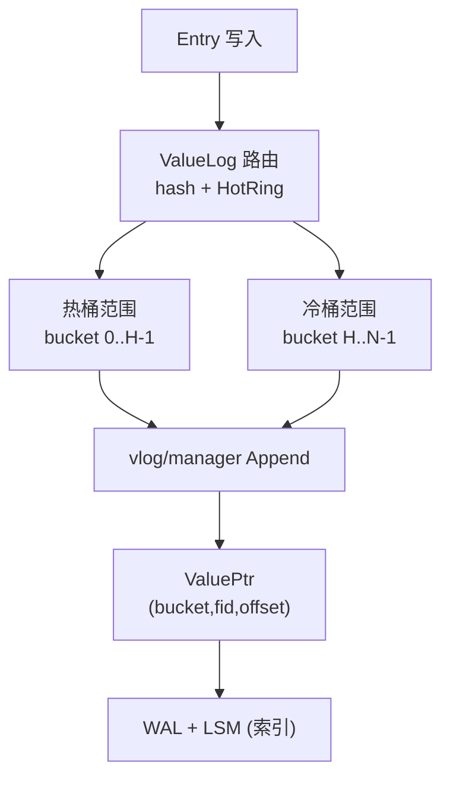
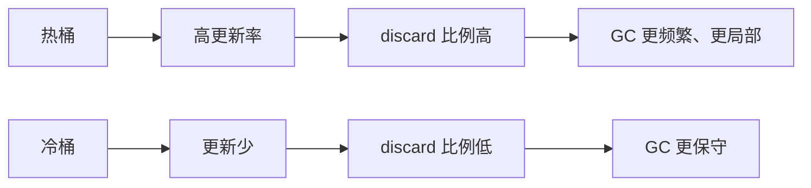

# 2026-02-05 vlog 设计心得（WiscKey + HashKV 借鉴）

这篇笔记记录 NoKV 在 ValueLog（vlog）上的设计取舍与工程化落地。整体思路来自两篇论文：
**WiscKey**（KV 分离）和 **HashKV**（哈希分区/热冷分离）。

---

## 1. 论文借鉴点

### 1.1 WiscKey
* **KV 分离**：LSM 只存 Key + ValuePtr，大 Value 顺序写入 vlog。
* **顺序写 + 随机读**：写入性能极高，但读路径需要根据 ValuePtr 追溯 vlog。
* **GC 重要性**：旧值需要通过 GC 回收，避免 vlog 长期膨胀。

### 1.2 HashKV
* **哈希分区**：ValueLog 被划分为多个 partition/bucket。
* **更新局部化**：同一 key 的历史版本聚集在一个分区，热点更新不会污染整个 vlog。
* **更轻 GC**：热分区可以更频繁 GC，冷分区可以保持稳定。

---

## 2. NoKV 的工程化落地

1. **多桶 vlog**  
   `ValueLogBucketCount > 1` 时，vlog 按 hash 分桶，目录布局变为：
   `workdir/vlog/bucket-XXX/00000.vlog`。

2. **ValuePtr 扩展**  
   ValuePtr 显式记录 `Bucket/Fid/Offset/Len`，使 LSM 可以准确指向桶内文件。

3. **热/冷分流（HotRing 驱动）**  
   * 通过 HotRing 统计“写热点”。
   * 热 key → 热桶范围 `[0..hotBuckets-1]`  
   * 冷 key → 冷桶范围 `[hotBuckets..bucketCount-1]`
   * 默认配置采用 `ValueLogBucketCount=16`、`ValueLogHotBucketCount=4`、`ValueLogHotKeyThreshold=8`（可按负载调整）。

4. **并行 GC + 压力控制**  
   * 多桶 GC 可并行，但 **同一桶只允许一个 GC**（锁自由的桶级互斥）。
   * 并行度 `ValueLogGCParallelism` 默认自动取 `max(NumCompactors/2, 1)`，并受桶数上限约束。
   * compaction 压力高时会 **降级或跳过 GC**：
     * `ValueLogGCReduceScore / ReduceBacklog` 触发并行度减半。
     * `ValueLogGCSkipScore / SkipBacklog` 触发本轮跳过。

---

## 3. 设计示意图

---

## 4. 设计优点

1. **GC 局部化**：热点更新集中在热桶，冷数据不被“连坐”重写。
2. **降低写放大**：避免全局 vlog 被少量热 key 污染而频繁 GC。
3. **更可控的调参**：热桶与冷桶可配置不同 GC 策略与阈值。
4. **并行扩展空间**：多桶天然适合并行 GC 或独立 IO 调度。

---

## 5. 代价与注意点

* **桶数过多**会导致文件碎片化、head 数量膨胀。
* **热桶过小**会让热桶文件轮转更频繁。
* **热度阈值**需要根据写入分布调优，过低会把冷 key 误判为热。

---

## 6. 总结

NoKV 的 vlog 设计以 WiscKey 的 KV 分离为基础，结合 HashKV 的哈希分区思路，
最终落地为 **“多桶 + 热冷分流”** 的工程方案：顺序写性能保持不变，但 GC 的
成本和波动被压缩到热桶范围内，整体更稳定、可控。
