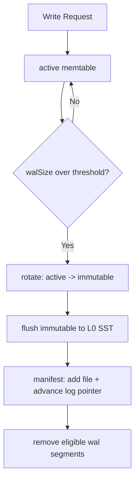
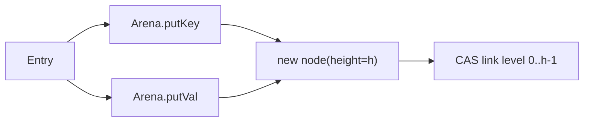
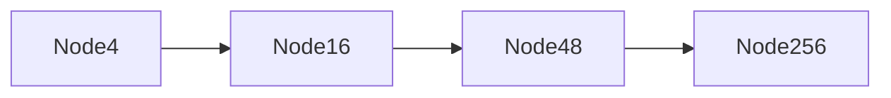

# 2026-02-09-memory-craft-memtable-arena-skiplist-art

本文档面向第一次读 NoKV 的同学，也记录我自己在这块实现里的工程化思路。主题是 MemTable 层的三件事：

1. MemTable 作为“可恢复写入阶段”的设计意义。
2. Arena 为什么是性能与可控性的关键。
3. Skiplist / ART 两种索引在真实工程里的取舍。

---

## 1. 设计理念：MemTable 不是缓存，而是“写入阶段机”

很多人第一次看 LSM 会把 MemTable 理解成“内存缓存层”。在 NoKV 里，这个理解不够准确。

更准确的说法是：

* MemTable 是 **WAL 之后、SST 之前** 的有序写入阶段。
* 它必须同时满足“马上可读”和“崩溃可恢复”。
* 它的生命周期由 flush 节奏驱动，而不是由 GC 自发回收。

这决定了实现不能只追求单次操作快，还要追求状态转换可证明。

---

## 2. 核心结构：一张图看懂生命周期

这条链路的工程重点是：**先有可恢复记录，再有内存可见状态，再有持久层安装。**

---

## 3. MemTable 与 WAL 的绑定关系

`lsm/memtable.go` 里的 `memTable` 结构包含 `segmentID` 和 `walSize`，这不是“顺手放进来”的字段，而是状态一致性的锚点。

* `segmentID`：把某一代 memtable 与 WAL segment 绑定。
* `walSize`：驱动 rotate 的直接信号。
* `maxVersion`：配合内部 key 版本序。

写入时序：

1. `wal.Append` 成功。
2. `index.Add` 更新内存索引。

这个顺序保证了：“能读到的数据，一定能从日志重放回来”。

---

## 4. Arena：把分配成本从“每次写入”移到“阶段回收”

### 4.1 为什么必须有 Arena

如果 key/value/node 都直接走 Go heap，写高峰会带来两个明显问题：

* 大量小对象分配导致 GC 频繁扫描。
* 指针对象离散，CPU cache 命中率差。

Arena 的核心思想是：

* 用 offset 取代大多数指针。
* 用 bump 分配替代通用分配器路径。
* 用 memtable 生命周期回收，替代细粒度 free。

### 4.2 对齐是正确性要求，不是优化选项

在 skiplist 里 value 元数据是 `uint64` 原子读写。Arena 的对齐保障决定了这里是否存在未定义行为风险。

简单说：没有对齐保障，这不是“慢一点”，而是“可能错”。

---

## 5. Skiplist 设计（工程可维护基线）

### 5.1 数据结构要点

* 随机层高 `randomHeight`，上限 `maxHeight`。
* tower 每层用 CAS 链接。
* key/value/node 存在 Arena，节点内部用 offset。

### 5.2 写入模型（Add）

`Add` 的逻辑不是“直接插入”，而是“先定位，再条件更新，再分层安装”：

1. `findSpliceForLevel` 从高到低找到每层 `prev/next`。
2. 如果发现同 key，直接原子覆盖 value。
3. 不同 key 才创建新节点。
4. 从 level0 开始 CAS 安装，失败重试。

这种流程的价值是：并发冲突局部化，不需要全局大锁。

### 5.3 读与迭代

`Search` 通过 `findNear` 找 `>= key` 的候选，再用 `kv.SameKey` 校验。迭代器支持 `Seek/SeekForPrev/Next/Prev`，并通过 refcount 避免并发 flush 时提前释放。

### 5.4 何时优先选 Skiplist

* 优先稳定性与可排障性。
* 团队希望降低认知负担。
* 需要一个稳健默认实现做回归基线。

---

## 6. ART 设计（性能上限路径）

### 6.1 结构核心

* Node4/16/48/256 自适应升级。
* 前缀压缩减少重复路径。
* leaf 保存完整 key + value。

### 6.2 并发模型

NoKV ART 的关键不是“树结构本身”，而是 COW + CAS 安装：

* 读路径读不可变快照。
* 写路径复制 payload 后 CAS 替换。
* 冲突时重试 `tryInsert`。

这让 ART 在高并发读写场景下通常能拿到更低延迟。

### 6.3 查询与范围扫描

`lowerBound` 统一了 `Search` 与 `Seek` 的行为语义，也让范围扫描路径更自然。

---

## 7. Skiplist vs ART：不是“谁更先进”，而是“谁更合身”

| 维度 | Skiplist | ART |
| :-- | :-- | :-- |
| 复杂度 | 中等，结构直观 | 高，路径分叉多 |
| 可维护性 | 强 | 中 |
| 常见读延迟 | 中 | 低（常见负载） |
| 范围扫描 | 好 | 很好 |
| 并发写冲突行为 | CAS 重试、简单 | COW+CAS、实现复杂 |
| 调试成本 | 低 | 高 |

工程建议：

* 默认以 Skiplist 起步，先把系统行为跑稳。
* 明确读热点与范围扫描占比后，再切 ART 并做专项 benchmark。

---

## 8. 常见误区（新人最容易踩的坑）

1. 误区：`MemTableSize` 直接等于实际内存占用。
事实：当前 rotate 更贴近 WAL 字节，索引真实内存与 WAL 字节不严格线性。

2. 误区：用了 Arena 就没有内存压力。
事实：Arena 只是把释放粒度变粗，压力从“小对象 GC”变成“阶段峰值”。

3. 误区：ART 一定全面优于 Skiplist。
事实：ART 的收益依赖负载形态与实现细节，不是无条件成立。

---

## 9. 工程化检查清单（上线前）

1. 观察 flush backlog 是否长期上升。
2. 观察 rotate 频率是否异常（过快/过慢）。
3. 对比 `mem_table_engine=skiplist/art` 的 P99 读写延迟。
4. 检查重启恢复时间是否随参数变化异常放大。

---

## 10. 总结

MemTable 这一层真正的价值，不只是“把写先放内存”，而是把“写入吞吐、崩溃恢复、后台整理”三件事收敛到一个可证明的状态机里。

在这个状态机中：

* Arena 决定上限性能是否稳定。
* Skiplist 决定基线是否稳健可控。
* ART 决定是否能进一步逼近延迟和吞吐上限。

NoKV 的这套实现是很典型的工程答案：先保语义，再做性能，再留插拔空间。
