# 2026-02-09 从 0 到 1 理解 MemTable：Arena、Skiplist 与 ART

这份笔记面向 **第一次阅读 NoKV 的同学**，同时记录我在实现过程中的工程化设计心得。内容聚焦 MemTable 层的核心设计：生命周期、WAL 绑定、Arena 内存分配策略，以及两种索引实现（Skiplist / ART）的工程取舍。目标是回答三个问题：

1. 为什么这样设计。  
2. 两种实现到底差在哪。  
3. 线上如何选型和调参。  

---

## 一页摘要（TL;DR）

**核心思路**：MemTable 不是“纯内存结构”，而是与 WAL segment 绑定的写入阶段单元。写入先追加 WAL，再更新内存索引；达到阈值后轮转为 immutable，后台 flush 为 SST，再通过 manifest checkpoint 释放旧 WAL。

| 设计点 | NoKV 实现 | 直接收益 | 代价/约束 |
| :-- | :-- | :-- | :-- |
| MemTable 抽象 | `memIndex` 接口（`Add/Search/Iterator/MemSize/Ref`） | 索引可插拔 | 统一抽象会屏蔽部分实现细节优化 |
| WAL 绑定 | `memTable.segmentID` + `walSize` | 恢复与回收路径清晰 | 轮转主要看 WAL 字节而非纯内存占用 |
| Arena 分配 | chunk 化、无锁 bump 分配、对齐保障 | 低分配开销、低 GC 压力 | 内部碎片不可避免，释放粒度粗 |
| Skiplist | 概率层高 + CAS 链接 | 实现成熟、语义直观 | 写放大与指针开销更高 |
| ART | 前缀压缩 + Node4/16/48/256 + COW/CAS | 热点读写性能强、顺序扫描好 | 实现复杂，调试门槛高 |

---

## 1. 设计目标（工程视角）

1) **写入路径可恢复**：任何时点 crash 后都能按 WAL + manifest 重建状态。  
2) **索引实现可替换**：同一 LSM 流程下允许 skiplist/art 切换。  
3) **内存分配可控**：减少小对象分配和 GC 抖动。  
4) **flush 回收可证明**：SST 安装成功后才能推进 WAL checkpoint 并删除旧段。  

---

## 2. MemTable 生命周期

### 2.1 结构与抽象

`memTable` 结构（`lsm/memtable.go`）：

```go
type memTable struct {
    lsm        *LSM
    segmentID  uint32
    index      memIndex
    maxVersion uint64
    walSize    int64
}
```

索引抽象：

```go
type memIndex interface {
    Add(*kv.Entry)
    Search([]byte) kv.ValueStruct
    NewIterator(*utils.Options) utils.Iterator
    MemSize() int64
    IncrRef()
    DecrRef()
}
```

代码锚点（便于和实现逐行对照）：

| 主题 | 代码位置 |
| :-- | :-- |
| MemTable 抽象与写入 | `lsm/memtable.go`（`memTable` / `setBatch` / `recovery`） |
| 轮转与 flush worker | `lsm/lsm.go`（`Set` / `SetBatch` / `rotateLocked` / `submitFlush`） |
| Flush 安装与 log pointer | `lsm/levels.go`（`flush` / `canRemoveWalSegment`） |
| memtable engine 选择 | `lsm/memtable.go`（`newMemIndex`） |
| ART 主实现 | `utils/art.go`（`tryInsert` / `lowerBound` / `artIterator`） |
| Arena 分配器 | `utils/arena.go`（`allocate` / `allocAligned` / `ensureChunk`） |

---

### 2.2 写入路径（单条/批量）

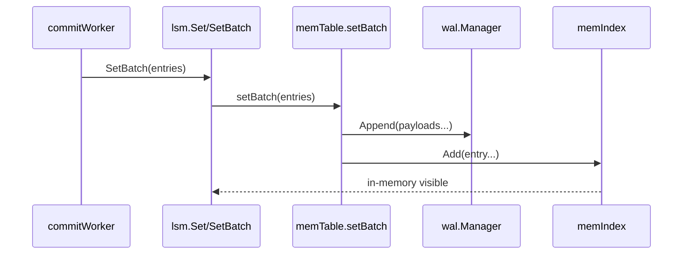

关键点：

* `setBatch` 先编码并 `wal.Append`，再 `index.Add`（`lsm/memtable.go`）。  
* `walSize` 按 WAL 追加长度累加，用于轮转和 checkpoint。  
* 批量路径在同一 memtable segment 内尽量合并写入，减少锁与系统调用开销。  

线性化点与并发语义（实现视角）：

* 线性化点在 `wal.Append` 成功后；索引更新发生在其后，因此“可见即可恢复”。  
* `Set/SetBatch` 常态走 `RLock`；仅在容量触发时升级到 `Lock` 执行 `rotateLocked`。  
* `rotateLocked` 将旧表放入 `immutables`，新表切换到新 WAL segment，旧表再异步 flush。  

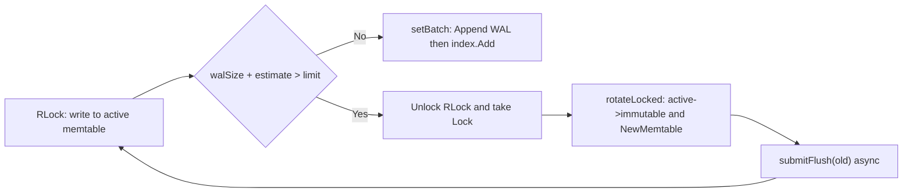

---

### 2.3 轮转、flush、恢复

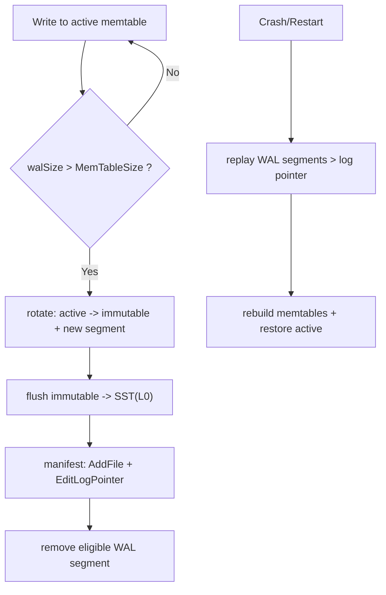

关键点：

* 新建 memtable 时会 `SwitchSegment(newFid)`，将内存与 WAL 段一一对应。  
* `flush` 成功后，manifest 同时记录 `AddFile` 与 `EditLogPointer`，再尝试删除可删 WAL 段。  
* `recovery` 根据 manifest 的 log pointer 删除/跳过旧段，仅重放必要 WAL。  

状态机视角：

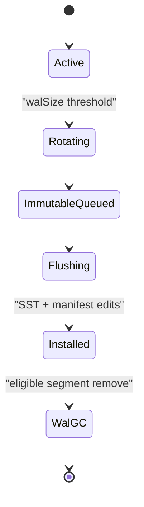

---

### 2.4 一个重要设计取舍

当前轮转阈值主要由 `walSize` 判断（`lsm/lsm.go`），而不是严格由 `index.MemSize()` 驱动。  

含义：

* 优点：和恢复/checkpoint 语义一致，逻辑简单。  
* 代价：对 ART 这类结构，索引真实内存占用与 WAL 字节不总是线性一致，可能出现“内存先紧张但未轮转”或“较早轮转”的偏差。  

---

## 3. Arena 设计（两种索引共用）

### 3.1 为什么要 Arena

MemTable 高频写入会产生大量短生命周期对象。若完全走 Go heap，小对象分配/回收会明显放大 GC 成本。  

Arena 目标：

* 将 key/value/node 以“偏移量”组织在连续 chunk 中。  
* 用原子 bump 指针分配，减少锁争用。  
* 通过 refcount 在结构层统一释放整块资源。  

---

### 3.2 关键机制

* `Arena.allocate`：CAS 推进 `n`（偏移），按 chunk 边界切分。  
* `ensureChunk`：按需创建 chunk，避免一次性大分配。  
* `allocAligned`：保证对齐，满足原子读写需求。  

---

### 3.3 对齐是硬约束

`skiplist` 的 value 走 `atomic.LoadUint64`，因此 node/value 对齐必须保证（`utils/arena.go` 中 `nodeAlign` 相关注释）。这属于“正确性前提”，不是性能微调。

---

### 3.4 Arena 的工程权衡

* 优点：低 GC、低碎片元数据开销、并发分配快。  
* 缺点：对象不能细粒度释放，生命周期跟随整棵索引；长期运行下需要依赖 memtable 轮转做阶段性回收。  

---

## 4. Skiplist 设计（和 ART 同粒度）

### 4.1 数据结构与内存布局

Skiplist 的节点定义（`utils/skiplist.go`）有三个关键点：

* value 用一个 `uint64` 打包（低 32 位 value offset，高 32 位 value size），可原子读写。  
* key/node/value 都放在 Arena，节点只保存 `offset + size`，减少 heap 对象。  
* `tower` 是固定上限数组，但实际分配由 `height` 截断，避免为低层节点浪费空间。  

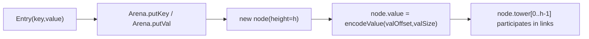

---

### 4.2 并发写入模型（Add）

`Add` 的实际流程是：

1. 从顶层到底层做 `findSpliceForLevel`，得到每层 `prev/next`。  
2. 如果发现同 key（`prev[i] == next[i]`），直接 `setValue` 原子覆盖并返回。  
3. 不存在同 key 时，新建节点并随机层高（`randomHeight`）。  
4. 尝试 CAS 提升全局 `height`。  
5. 按 **从底层到高层** 逐层 `casNextOffset` 安装节点；失败就重新计算 splice 并重试。  

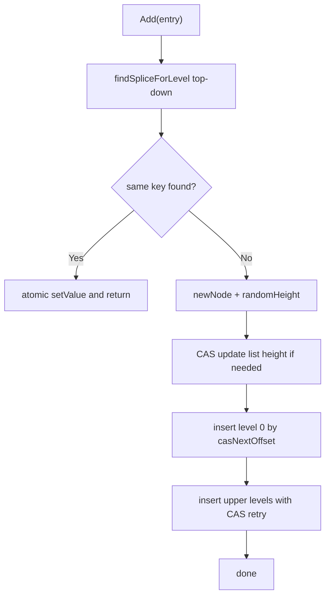

这里的工程价值是：不依赖全局大锁，冲突时局部重试，写入路径在高并发下仍保持可预测。

---

### 4.3 查找语义（Search / findNear）

`Search` 并不是直接哈希命中，而是：

1. 调 `findNear(key, less=false, allowEqual=true)` 找第一条 `>= key`。  
2. 再用 `kv.SameKey` 做 user key 级别校验。  
3. 命中则返回 `ValueStruct`，否则 miss。  

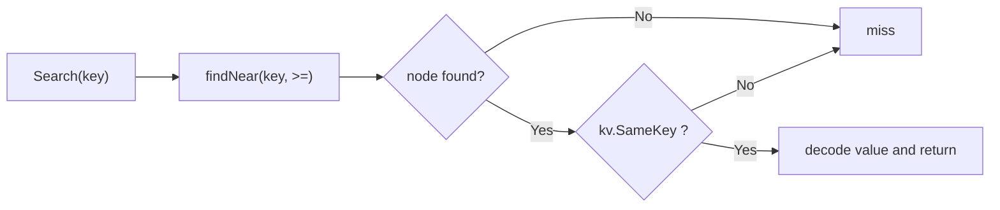

这套语义与内部 key（含版本）排序方式一致，便于和 MVCC 行为对齐。

---

### 4.4 迭代器与生命周期管理

Skiplist 迭代器（`SkipListIterator`）支持：

* `Seek`（>= target）  
* `SeekForPrev`（<= target）  
* `Next/Prev` 双向游标  

生命周期由引用计数兜底：

* `NewIterator` -> `IncrRef`  
* `Iterator.Close` -> `DecrRef`  

这样可以保证 flush 和读并发时，底层 Arena 不会被过早释放。

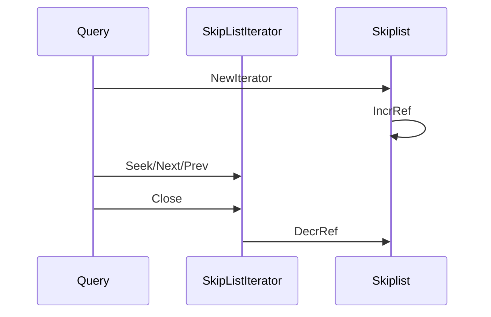

---

### 4.5 复杂度与工程取舍

* 期望复杂度：查找/写入 `O(logN)`，最坏退化 `O(N)`。  
* 优点：实现稳定、行为可解释、易排障。  
* 代价：塔式指针元数据开销较高；随机层高在某些负载下会带来波动。  
* 对 NoKV 的意义：作为默认引擎时，Skiplist 提供“可维护性优先”的基线实现。  

---

## 5. ART 设计

### 5.1 结构

* Node4/16/48/256 自适应节点。  
* 前缀压缩减少重复 key 前缀开销。  
* leaf 保存完整 key + value，支持 lower-bound 查找。  

节点升级路径：

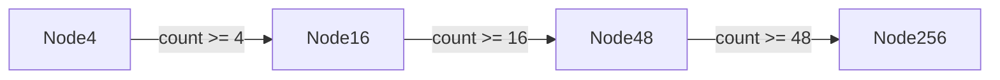

---

### 5.2 并发模型（关键）

代码注释明确采用 **COW + CAS**：

* 读路径 lock-free，读取不可变节点快照。  
* 写路径复制 payload/节点后 CAS 安装。  
* 插入冲突时重试（`tryInsert` 循环）。  

这套模型让 ART 在高并发读写下保持较好吞吐与扫描顺序稳定性。

插入流程（对应 `tryInsert`）：

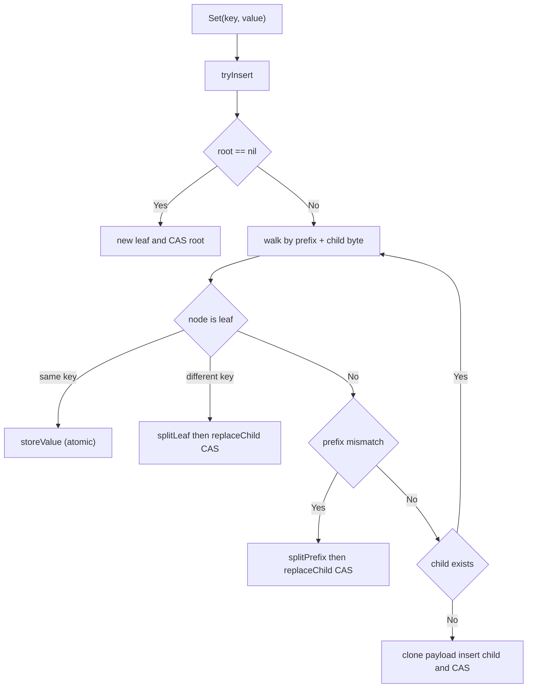

写路径关键细节：

* 非 root 替换通过 `parent.payloadOffset.CompareAndSwap` 完成，避免全局锁。  
* `insertChild` 会在必要时进行 `Node4->16->48->256` 升级。  
* CAS 失败后外层重试，保证并发写下的一致安装。  

---

### 5.3 查找语义（Search/Seek）

`Search` 的语义不是“精确路径命中即返回”，而是：

1. 先用 `lowerBound(target)` 找到第一条 `>= target` 的 leaf。  
2. 再用 `kv.SameKey` 校验是否同一 user key。  
3. 不同 key 则返回 miss。  

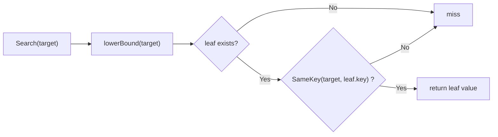

这种实现能直接复用范围查找逻辑，也让 `Seek` 与 `Search` 在行为上统一到 lower-bound。

---

### 5.4 迭代器

ART 迭代器维护栈帧（`iterFrame`），通过 `descendToMin/advance` 做中序遍历。Seek 使用 lower-bound，再回填路径栈，适合范围查询与 MVCC merge。

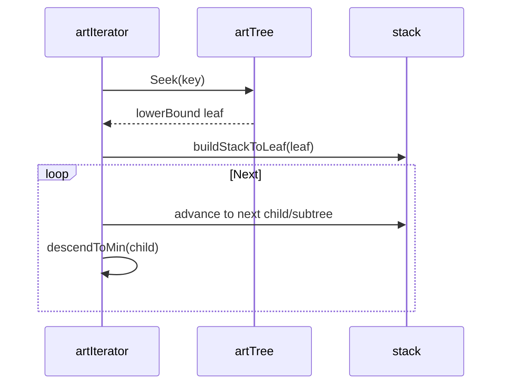

---

## 6. Skiplist vs ART：当前代码下的实测与解读

本地微基准（`go test ./utils -bench ... -benchmem -benchtime=1s`）：

| Benchmark | 结果（Apple M3 Pro / darwin arm64） |
| :-- | :-- |
| `BenchmarkARTInsert` | `~255 ns/op` |
| `BenchmarkARTGet` | `~73 ns/op` |
| `BenchmarkSkiplistInsert` | `~810 ns/op` |
| `BenchmarkSkiplistGet` | `~316 ns/op` |

解读：

* 在当前实现与测试模型下，ART 插入/读取都明显更快。  
* 但这不是“绝对结论”：两组 benchmark 负载模型并不完全对齐（key 空间与重置策略不同），更适合当趋势信号。  

---

## 7. 选型与调参建议

1. 默认稳态优先：`mem_table_engine = "skiplist"`  
适合先追求可维护性和行为可预期。  

2. 读密集/热点明显：`mem_table_engine = "art"`  
适合低延迟、范围遍历较多的场景。  

3. 配合 `MemTableSize` 一起调  
增大 memtable 可降低 flush 频率，但会增加恢复重放成本。  

4. 观察 flush/WAL 指标联动  
如果 flush backlog 长期增长，先检查 compaction 和磁盘，而不是只调 memtable engine。  

---

## 8. 小结

NoKV 的 MemTable 设计本质是：**WAL 语义优先 + 索引可插拔 + Arena 降 GC**。  

* Skiplist 提供稳定、清晰、低认知成本的默认路径。  
* ART 提供更激进的性能上限，尤其在读与有序遍历上。  
* 生命周期（rotate/flush/recovery）和 manifest checkpoint 的一致性，是整个设计最关键的工程价值。  
