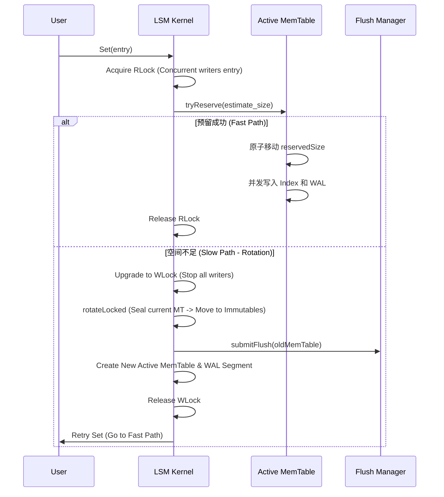

# NoKV 内存内核：Arena 线性分配与自适应索引（ART vs SkipList）的极致工程实现

在高性能存储引擎中，内存管理直接决定了系统的吞吐上限和延迟稳定性。NoKV 的 MemTable 层通过 Arena 线性分配和高度优化的索引结构，实现了零 GC 压力下的极速读写。本文将深度拆解这一层级的核心架构设计与工程权衡。

---

## 1. Arena：构建“指针无关”的堆外内存池

NoKV 的 Arena（位于 `utils/arena.go`）是所有内存索引的物理基石。它通过“单向追加”和“偏移量寻址”机制，将海量的小对象分配从 Go Runtime 的堆内存中剥离出来。

### 1.1 物理布局与分配策略
Arena 并不是零散的内存块，而是一个连续的 `[]byte`。
*   **线性分配 (Bump Allocation)**：分配开销仅为一个原子加法。
*   **内存对齐 (Alignment)**：为了保证原子操作（如 64 位版本号更新）的安全性，Arena 强制执行对齐：

```go
// AllocAligned 确保分配的起始地址在 align 的倍数上
func (a *Arena) AllocAligned(size, align int) uint32 {
    // 计算对齐补齐量 (Padding)
    padding := (align - (int(a.n) % align)) % align
    // 原子地移动分配指针
    offset := a.Allocate(uint32(size + padding))
    // 返回真实的起始偏移量
    return offset + uint32(padding)
}
```

**为什么对齐是刚需？**：在现代 64 位 CPU 上，如果一个 8 字节的 `uint64` 跨越了缓存行 (Cache Line)，硬件无法保证其原子写操作的原子性。NoKV 通过 Arena 对齐，保证了所有元数据更新（如 SkipList 的 Tower 链接或 ART 的版本号）在物理上是并发安全的。

### 1.2 寻址艺术：Uint32 Offset vs Pointer
在 Go 堆中存储数百万个节点指针会导致 GC 扫描极慢（STW 延迟剧增）。NoKV 所有的索引节点内部都使用 `uint32` 的 Offset 来互相引用。
*   **GC 友好性**：Offset 对 GC 是透明的。在扫描阶段，GC 只需要扫描 Arena 那个巨大的 `[]byte` 切片头，而不需要递归扫描数以万计的小对象。
*   **内存节省**：在 64 位系统上，`uint32` (4B) 只有原生指针 (8B) 的一半大小，这让内存索引的有效负载比提高了近一倍。

---

## 2. SkipList：经典的并发写基准

SkipList（位于 `utils/skiplist.go`）以其实现简单、并发稳健著称，是 NoKV 的基准索引。

### 2.1 架构设计
*   **多级塔式索引**：通过随机化层高（MaxHeight=20，概率 P=0.25），实现平均 $O(\log N)$ 的查找复杂度。
*   **无锁并发 (Lock-free)**：利用 `atomic.CompareAndSwapUint32` 在每一层进行节点插入。

### 2.2 插入协议 (Add 逻辑)
SkipList 的插入不是简单的 `Lock -> Insert`，而是一个多阶段的原子安装过程：
1.  **节点创建**：在 Arena 中预分配节点空间，设置 Key/Value 的 Offset。
2.  **寻找切面 (Find Splice)**：从最高层开始向下寻找每一层的前驱 (`prev`) 和后继 (`next`) 节点。
3.  **逐层原子链接**：从 Level 0 开始向上 CAS 安装。如果 CAS 失败（说明并发环境下有其他节点插入），则局部重试寻找切面，直到安装完成。

```go
func (s *Skiplist) Add(entry *kv.Entry) {
    // 1. 预分配节点并随机化层高
    nodeOffset := s.newNode(entry.Key, entry.Value, height)
    // 2. 局部 CAS 链接
    for i := 0; i < height; i++ {
        for {
            prev, next := s.findSpliceForLevel(entry.Key, i)
            // 将新节点的 next 指向找到的后继
            s.setNextOffset(nodeOffset, i, next)
            // 原子地将前驱的 next 指向新节点
            if s.casNextOffset(prev, i, next, nodeOffset) {
                break 
            }
        }
    }
}
```

---

## 3. ART：追求极致的自适应基数树

ART（Adaptive Radix Tree，位于 `utils/art.go`）是 NoKV 的默认索引，专为现代 CPU 缓存架构和内存效率平衡设计。

### 3.1 自适应节点架构
ART 会根据子节点数量动态调整节点物理大小，以平衡空间利用率和查询效率：
*   **Node4 / Node16**：使用线性扫描寻找子节点，适合分支较少的路径。
*   **Node48**：使用间接索引表（256 字节哈希表），空间效率极高。
*   **Node256**：直接数组寻址，提供极致的 $O(k)$ 寻址性能。

### 3.2 排序难题：Comparable Route Key 编码
Radix Tree 原生基于字节比较，不支持 LSM 要求的复合排序（UserKey 升序 + Version 降序）。NoKV 通过一套精妙的编码解决：
*   **编码公式**：`RouteKey = EncodeComparable(UserKey) + BigEndian(Timestamp)`。
*   **设计价值**：这保证了在 ART 树的层级深度遍历结果完全等价于 LSM 的 `Key + Version` 排序逻辑，从而完美支持 `Seek` 和范围扫描。

### 3.3 并发模型：纯 COW + CAS 发布
*   **完全无锁读 (Lock-free Read)**：通过 COW (Copy-On-Write) 保证读取路径观察到的是一致的、不可变的节点快照。
*   **写入语义**：写路径始终克隆父节点 payload，在克隆副本上完成修改，再通过 CAS 原子发布新 payload。已发布 payload 不再原地修改，降低并发一致性风险并简化维护。

---

## 4. MemTable 原子预留协议 (Workflow)

当用户调用 `Set` 时，LSM 内核的协调流程如下：



---

## 5. 性能参数与工程取舍建议

在 `Options` 中配置索引引擎时，应考虑负载特性：

| 维度 | SkipList | ART (Default) |
| :--- | :--- | :--- |
| **点查延迟 (Get)** | $O(\log N)$，较高 Cache Miss | $O(k)$，缓存局部性极佳 |
| **范围定位 (Seek)** | 中等 | 极快（前缀压缩优势） |
| **内存占用** | 极低（仅存储 Offset） | 较高（当前约 2x，包含内部节点） |
| **代码可维护性** | 极佳 | 较高（节点升级降级复杂） |

**总结**：NoKV 的内存设计遵循 **“空间即状态，并发即原子”** 的原则。Arena 锁定了物理稳定性，自适应索引提供了灵活的性能上限。这套方案让 NoKV 在单机热点场景下表现出了极强的韧性。
