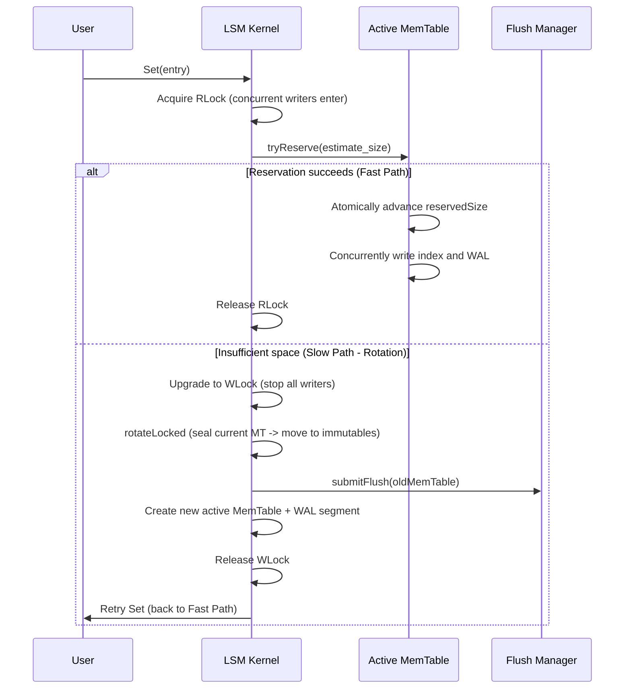

# NoKV memory kernel: Arena linear allocation and adaptive index (ART vs SkipList)

In a high-performance storage engine, memory management directly determines throughput ceiling and latency stability. NoKV's MemTable layer uses Arena linear allocation plus a heavily optimized index structure to deliver fast read/write under zero GC pressure. This note dissects the core architecture decisions and engineering trade-offs.

---

## 1. Arena: building a "pointer-free" off-heap memory pool

NoKV's Arena (in `utils/arena.go`) is the physical foundation of every memory index. Through "monotonic append" and "offset-based addressing," it removes massive small-object allocation from the Go runtime's heap.

### 1.1 Physical layout and allocation strategy
Arena is not a collection of scattered blocks — it is one contiguous `[]byte`.
*   **Bump allocation**: each allocation is one atomic add.
*   **Memory alignment**: to keep atomic operations (e.g. 64-bit version updates) safe, Arena enforces alignment:

```go
// AllocAligned ensures the start address is a multiple of `align`.
func (a *Arena) AllocAligned(size, align int) uint32 {
    // Compute padding to alignment.
    padding := (align - (int(a.n) % align)) % align
    // Atomically advance the allocation pointer.
    offset := a.Allocate(uint32(size + padding))
    // Return the actually-aligned starting offset.
    return offset + uint32(padding)
}
```

**Why is alignment required?** On modern 64-bit CPUs, an 8-byte `uint64` that crosses a cache line is no longer guaranteed atomic at the hardware level. Arena alignment guarantees every metadata update (SkipList tower link, ART version stamp, etc.) is physically concurrency-safe.

### 1.2 The art of addressing: `uint32` offset vs pointer
Storing millions of node pointers in the Go heap makes GC scans glacial (massive STW spikes). Every NoKV index node uses `uint32` offsets to refer to peers.
*   **GC-friendly**: offsets are opaque to the GC. The GC only needs to scan the giant `[]byte` slice header of the Arena, not millions of small node objects.
*   **Memory savings**: on 64-bit systems, `uint32` (4B) is half the size of a native pointer (8B), nearly doubling the index payload density.

---

## 2. SkipList: the classic concurrent baseline

SkipList (in `utils/skiplist.go`) is famous for being simple and concurrency-robust; it's NoKV's baseline index.

### 2.1 Architecture
*   **Tower index**: random level (MaxHeight=20, P=0.25) gives $O(\log N)$ lookup on average.
*   **Lock-free concurrency**: per-level node insertion uses `atomic.CompareAndSwapUint32`.

### 2.2 Insert protocol (`Add` flow)
SkipList insertion is not a naïve `Lock -> Insert` — it's a multi-stage atomic install:
1.  **Node creation**: pre-allocate the node in Arena, set Key/Value offsets.
2.  **Find splice**: from the top level down, find the predecessor (`prev`) and successor (`next`) on each level.
3.  **Per-level atomic link**: from level 0 upward, CAS-install. If CAS fails (because of a concurrent insertion), retry the local splice search until installation succeeds.

```go
func (s *Skiplist) Add(entry *kv.Entry) {
    // 1. Pre-allocate the node and randomize its height.
    nodeOffset := s.newNode(entry.Key, entry.Value, height)
    // 2. Local CAS linking.
    for i := 0; i < height; i++ {
        for {
            prev, next := s.findSpliceForLevel(entry.Key, i)
            // Point the new node's next to the discovered successor.
            s.setNextOffset(nodeOffset, i, next)
            // Atomically point the predecessor at the new node.
            if s.casNextOffset(prev, i, next, nodeOffset) {
                break
            }
        }
    }
}
```

---

## 3. ART: a maximally tuned adaptive radix tree

ART (Adaptive Radix Tree, in `utils/art.go`) is NoKV's default index, specifically tuned for modern CPU cache architecture and for balancing space vs query efficiency.

### 3.1 Adaptive node architecture
ART dynamically adjusts node physical size based on child count, balancing space and query speed:
*   **Node4 / Node16**: linear scan to find children — best for shallow branching.
*   **Node48**: indirect index table (256-byte hash) — high space efficiency.
*   **Node256**: direct array addressing — maximum $O(k)$ lookup speed.

### 3.2 Sorting challenge: comparable route-key encoding
Radix trees are byte-comparison native and don't support the composite ordering LSM needs (UserKey ascending + Version descending). NoKV solves it with a deliberate encoding:
*   **Encoding**: `RouteKey = EncodeComparable(UserKey) + BigEndian(Timestamp)`.
*   **Design value**: depth-first traversal of the ART tree produces results equivalent to LSM's `Key + Version` ordering, so `Seek` and range scan work natively.

### 3.3 Concurrency model: pure COW + CAS publish
*   **Lock-free reads**: Copy-On-Write guarantees that any reader sees a consistent immutable snapshot of nodes.
*   **Write semantics**: the write path always clones the parent payload, applies the modification on the clone, and then CAS-publishes the new payload. Published payloads are never mutated in place — this lowers concurrency-consistency risk and simplifies maintenance.

---

## 4. MemTable atomic-reservation protocol

When a user calls `Set`, the LSM kernel's coordination flow is:



---

## 5. Tunable parameters and engineering trade-offs

When you choose the index engine in `Options`, consider workload character:

| Dimension | SkipList | ART (Default) |
| :--- | :--- | :--- |
| **Point read latency (Get)** | $O(\log N)$, more cache misses | $O(k)$, excellent cache locality |
| **Range positioning (Seek)** | Medium | Very fast (prefix-compression advantage) |
| **Memory footprint** | Very low (offsets only) | Higher (currently ~2x, includes internal nodes) |
| **Code maintainability** | Excellent | Higher complexity (node up/downgrade) |

**Bottom line**: NoKV's memory design follows the principle **"space is state, concurrency is atomicity."** Arena pins down physical stability; the adaptive index provides the flexible performance ceiling. Together they give NoKV strong resilience under single-node hot-spot workloads.
