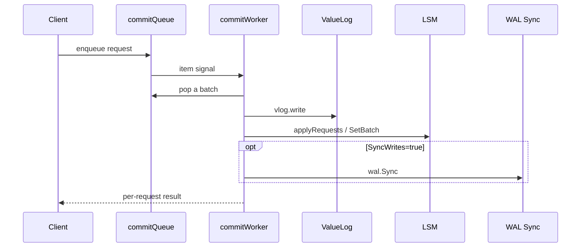
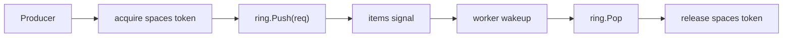
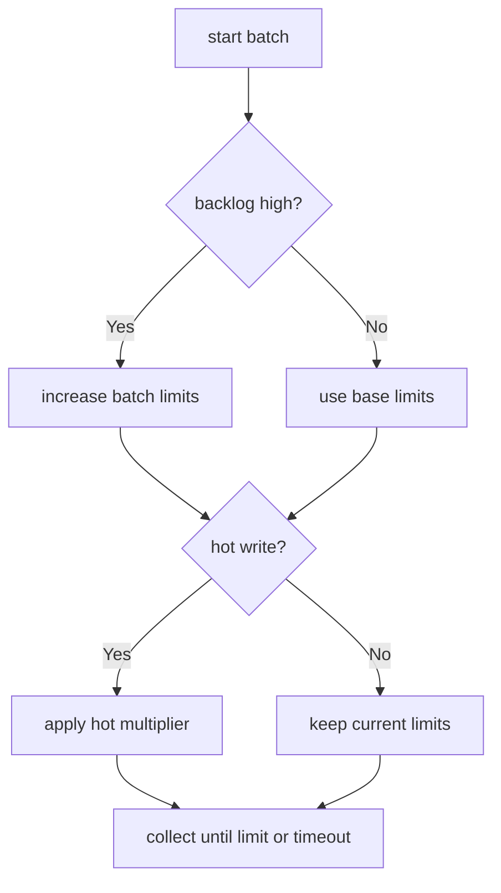
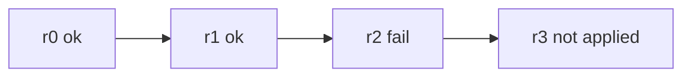
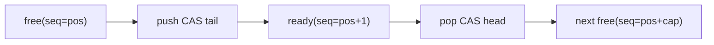

# 2026-02-09-rhythm-of-writes-commit-worker-batch-ringbuffer

本文档面向第一次理解 NoKV 写路径的同学，也记录这块实现里的工程化设计方法。我们讨论三件事：

1. `commit worker` 为什么是写路径中枢。
2. `write batch` 如何在延迟与吞吐之间做动态平衡。
3. `ringbuffer` 如何提供低开销并发队列基础。

---

## 1. 设计理念：写路径要像“节拍器”，不是“碰碰运气”

写路径如果没有节拍控制，会出现三种典型问题：

* 突发流量把队列顶爆，内存飙升。
* 单请求提交抖动大，尾延迟失控。
* 错误归因粗糙，客户端重复重试放大压力。

NoKV 的方案是把写路径拆成“前台入队 + 后台批处理 + 明确完成语义”，让系统行为更像稳定节拍而不是随机波动。

---

## 2. 总览图：从请求到落盘

关键是顺序：先 `vlog.write`，再 `LSM apply`，最后按需 `wal.Sync`。这保证 ValuePtr 不会指向不存在的数据。

---

## 3. commitQueue：三层组合而不是“只有一个 ring”

`commitQueue` 的设计不是单一结构，而是三件套：

1. `Ring[*commitRequest]` 负责数据面高效 push/pop。
2. `spaces` 通道负责容量票据，形成硬上限背压。
3. `items` 通道负责可消费事件，避免 worker 忙等。

这三层叠加后，系统同时得到：并发效率、内存上限、可控阻塞语义。

---

## 4. write batch：动态策略而非固定批次

`nextCommitBatch` 的核心是“看现场调节”，不是死配阈值：

* backlog 高：放大 `limitCount`、`limitSize`。
* 检测到 hot write：应用 `HotWriteBatchMultiplier`。
* 队列短暂发空但批未满：等待 `WriteBatchWait` 做 coalesce。

这套策略把轻载低延迟与重载高吞吐放在一个框架里。

---

## 5. 最近关键修复：错误归因从“整批同错”变成“逐请求准确”

历史风险：`applyRequests` 中途失败时，整批请求被同一个错误覆盖，导致已经成功的请求被误判失败。

修复后的语义：

1. `applyRequests` 返回失败位置 `failedAt`。
2. `commitWorker` 只标记 `failedAt` 及之后请求失败。
3. `finishCommitRequests` 支持逐请求回填错误。

这个改动的价值不在“快”，而在“语义正确”。

---

## 6. RingBuffer：MPMC 序号协议与内存保活控制

`utils/ringbuffer.go` 采用 seq 协议：

* `Push` 观察 `slot.seq == pos` 才能写。
* `Pop` 观察 `slot.seq == pos+1` 才能读。
* `Pop` 后推进 `seq` 到下一轮并清空 `slot.val`。

清空 `slot.val` 是关键工程点：它减少对象被 ring 槽位长期引用而延迟回收。

---

## 7. 与 Hot 统计的耦合点：写路径要避免统计偏置

这块最容易被忽略的风险是“统计口径不一致”与“双重计数”。

当前方向（你前面定下的策略）是对的：

* 读写 ring 分离，避免高读热点误触发写限流。
* `isHotWrite` 仅做 `Frequency` 判断，不再二次 `Touch`。

这会显著降低误判和过度限流。

---

## 8. 参数建议（新人可直接起步）

1. `WriteBatchMaxCount`: 64~128。
2. `WriteBatchMaxSize`: 1~4MiB。
3. `WriteBatchWait`: 100~300us，低延迟可设 0。
4. `HotWriteBatchMultiplier`: 2 起步，通常不建议超过 4。
5. `SyncWrites=true` 时重点观察 `AvgApplyMs` 与 `AvgRequestWaitMs`。

---

## 9. 常见误区

1. 误区：batch 越大越好。
事实：吞吐会上去，但 P99 可能更差。

2. 误区：ring 是无锁就等于没有阻塞。
事实：上层 `spaces/items` 语义决定了阻塞与背压行为。

3. 误区：写路径优化只看 QPS。
事实：错误归因、恢复一致性、尾延迟同样是一等指标。

---

## 10. 工程化检查清单

1. 观察队列长度是否长期贴近上限。
2. 观察 batch size 分布是否极端两极化。
3. 观察失败请求是否都具备准确错误来源。
4. 做一次高并发压测确认 prefetch 与写路径不会空转抢 CPU。

---

## 11. 总结

NoKV 这条写路径的核心不是某个“单点算法”，而是三部分协同：

* `commit worker` 管节奏。
* `write batch` 管效率曲线。
* `ringbuffer` 管并发成本。

把这三件事放在一起，写路径才能同时做到：有上限、有吞吐、可解释。
