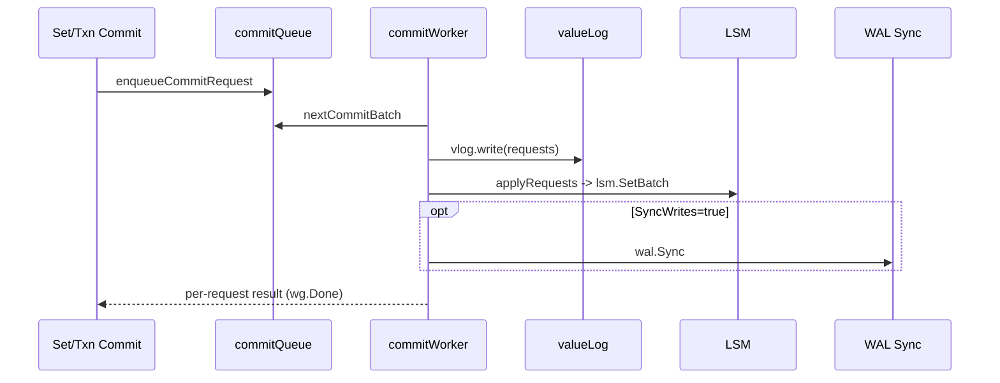
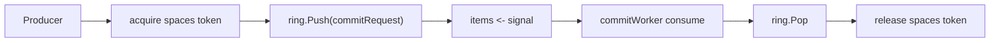
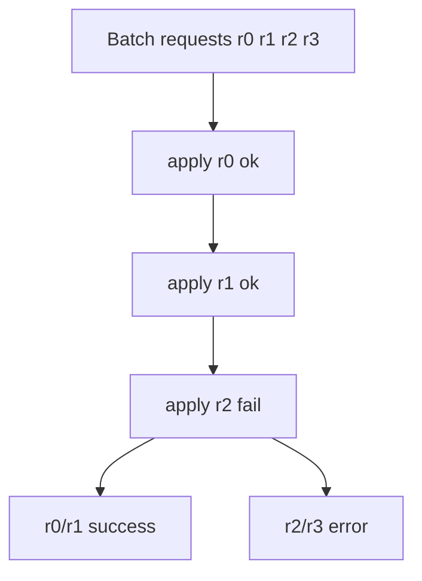

# 2026-02-09 Commit Worker、Write Batch 与 RingBuffer 设计心得

这份笔记面向 **初次了解 NoKV 写路径的读者**，同时记录我在这块实现中的工程化方法和取舍。核心覆盖三块：

1. `commitWorker` 批处理提交模型  
2. `write batch` 的合批/背压策略  
3. 自研 `RingBuffer`（MPMC）在提交队列与预取队列里的应用  

并结合最近一次修复，重点解释“为何这样设计、收益在哪里、边界在哪里”。

---

## 一页摘要（TL;DR）

**核心思路**：前台写请求快速入队，后台单 worker 做批量提交。提交顺序是 **vlog -> LSM -> (optional) WAL Sync**，通过固定容量 ring + 双信号通道实现可控背压，避免无界堆积。

| 设计点 | NoKV 实现 | 直接收益 | 代价/约束 |
| :-- | :-- | :-- | :-- |
| 入队结构 | `Ring[*commitRequest]` + `spaces/items` | lock-free 数据面 + 阻塞背压 | 结构复杂度上升 |
| 批处理 | 动态放大 batch limit + 微小等待窗口 | 提升吞吐、降低调度抖动 | 可能增加尾延迟 |
| 提交顺序 | `vlog.write` -> `lsm.SetBatch` -> `wal.Sync` | ValuePtr 不悬空，持久化语义清晰 | 失败处理更复杂 |
| 错误归因 | 按 request 回填错误（非整批同错） | 成功请求不会被误报失败 | 需要维护批内失败索引 |
| RingBuffer | MPMC 序号槽位协议（seq） | 高并发低开销 | 满队列时仍需上层策略 |

---

## 1. 设计目标（工程视角）

1) 写请求提交延迟可控，且高并发下吞吐线性增长。  
2) 队列容量有硬上限，避免内存被写入洪峰拖垮。  
3) ValueLog 与 LSM 的失败语义一致，不产生“指针悬挂”。  
4) 观测可解释：队列长度、等待时间、批次规模都可度量。  

---

## 2. 写路径总览

关键代码锚点：

* 入队与背压：`db_write.go`（`sendToWriteCh` / `enqueueCommitRequest`）  
* 批次组装：`db_write.go`（`nextCommitBatch`）  
* 提交主循环：`db_write.go`（`commitWorker`）  
* ValueLog 写入与失败回滚：`vlog.go`（`write` + `Rewind`）  

---

## 3. CommitQueue 设计

`commitQueue` 不是“仅 ring”实现，而是三层组合：

1. 数据面：`Ring[*commitRequest]`（lock-free push/pop）  
2. 容量票据：`spaces` 通道（入队前先拿 slot）  
3. 可消费信号：`items` 通道（有数据时唤醒 worker）  

这使得行为同时满足：

* ring 的低开销并发操作  
* 可阻塞的背压语义  
* 可控的关停收敛路径

---

## 4. Write Batch 策略

`nextCommitBatch` 做了三件事：

1. **动态放大上限**：队列 backlog 大时，放大 `limitCount` 与 `limitSize`。  
2. **热点加权**：检测到 hot write 时，使用 `HotWriteBatchMultiplier` 提升合批能力。  
3. **短暂 coalesce**：队列瞬时空但批未满时，等待 `WriteBatchWait` 再尝试捞一批。

这套策略的目标是：在轻载保持低延迟，在重载优先吞吐并尽快清队列。

---

## 5. 最近修复：批内错误归因

历史问题：`applyRequests` 逐 request 写 LSM，一旦中途失败，整批 request 都被同一个错误回填。  
后果：前面已经成功落盘的请求也可能被客户端误判为失败并重试。

修复后语义：

1. `applyRequests` 返回 `(failedAt, err)`。  
2. `commitWorker` 仅给 `failedAt` 及之后请求标错；之前请求保持成功。  
3. `finishCommitRequests` 支持 `perReqErr` 精确回填。

这个修复是语义正确性优先，不是单纯性能优化。

---

## 6. RingBuffer 设计（MPMC）

`utils/ringbuffer.go` 采用序号槽位协议（`seq`）：

* `Push`：当 `slot.seq == pos` 时可写入。  
* `Pop`：当 `slot.seq == pos+1` 时可读取。  
* `Pop` 后把 `slot.seq` 推进到下一轮，并清空 `slot.val` 避免对象保活。

最近补充了一点：

* `Pop` 成功后显式清零 `slot.val`，减少 GC 对已消费对象的保活时间。

---

## 7. 小结

NoKV 当前写路径的工程价值在于：**有界队列 + 批处理 + 明确失败语义**。

* `commitWorker` 是吞吐与一致性中枢。  
* `write batch` 决定系统在轻载/重载下的弹性曲线。  
* `ringbuffer` 提供低开销并发基础，但真正的系统可用性来自上层背压与错误语义设计。  
