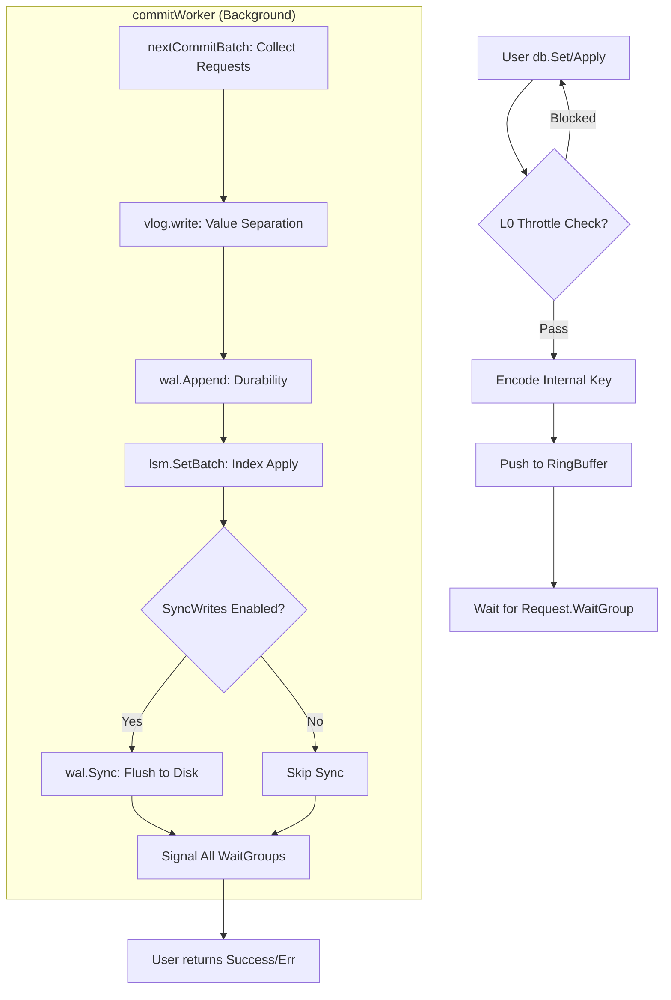

# NoKV 写入流水线：从 MPSC 节拍器到自适应聚合的深度演进

高性能存储引擎的写入路径必须像“节拍器”一样稳定。NoKV 的写入流水线不仅是一个并发队列，它是一套具备 **自适应反馈能力** 和 **分段一致性保证** 的异步聚合系统。本文深度拆解 NoKV 如何在高并发压力下保持极致的写入吞吐与低尾延迟。

---

## 1. 架构模型：MPSC 聚合流水线

NoKV 并没有让每个用户协程都直接去竞争底层的磁盘锁或 WAL 互斥量，而是采用了 **MPSC (Multi-Producer, Single-Consumer)** 异步聚合模型。

### 1.1 设计背景：为什么是 MPSC？
在 LSM 引擎中，WAL (预写日志) 的写入必须是严格顺序的。如果让 1000 个用户协程并发地调用 `write()` 系统调用，内核态的上下文切换和文件锁竞争会瞬间压垮系统。
NoKV 通过 MPSC 模型，将数千个前台并发压力汇聚到一个后台 `commitWorker` 中，将随机小写入转化为大块的顺序磁盘 IO。

### 1.2 核心组件：commitQueue
`commitQueue`（位于 `db_write.go`）并不是一个简单的 Channel，它是由三部分构成的协同系统：
*   **RingBuffer**：基于原子序列号的无锁循环队列，负责极速的数据传递。
*   **Spaces Channel**：作为“票据”系统，控制队列的硬上限，形成天然的 **Backpressure (背压)**。
*   **Items Channel**：作为“唤醒”信号，通知后台 Worker 有新数据到达，避免 Worker 空转浪费 CPU。

---

## 2. 自适应批处理算法 (Adaptive Coalescing)

`nextCommitBatch` 是整个流水线的灵魂。它不是死板地按照固定大小打包，而是能够根据系统负载动态调整其“吞吐模式”。

### 2.1 积压驱动的动态上限
系统实时监控队列积压程度 (`queueLen`)。当积压严重时，Worker 会自动“变强”：
```go
// 动态调整 Batch 限制
backlog := int(cq.queueLen.Load())
if backlog > limitCount {
    // 如果队列积压，按比例放大 Batch 大小，最高 4 倍
    factor := min(max(backlog/limitCount, 1), 4)
    limitCount = min(limitCount * factor, hardLimit)
    limitSize *= int64(factor)
}
```
**设计价值**：这利用了批处理的规模效应。压力越大，聚合度越高，单次磁盘 I/O 摊薄的成本就越低，从而在高压下实现吞吐量的“逆增长”。

### 2.2 热点感知倍率 (Hot-Aware)
如果 Batch 中包含由 `hotTracker` 识别出的热点写 Key，系统会应用 `HotWriteBatchMultiplier`。
*   **原理**：对于热点 Key，多次写入往往可以合并。通过扩大 Batch，我们让热点请求在进入 WAL 之前有更多机会在内存中被“折叠”，极大减轻了物理磁盘的带宽压力。

### 2.3 Coalesce 等待机制
在队列瞬时为空时，Worker 不会立即触发提交，而是会短暂等待一个 `WriteBatchWait`（默认 200us）。这个微小的停顿是低延迟与高吞吐之间的微妙平衡点，它能让微量的突发流量共享一次 `fsync` 成本。

---

## 3. 核心调用逻辑：一个请求的“入库”之旅



---

## 4. 健壮性设计：分段式错误归因与回滚

在聚合系统中，最怕的是“一人犯错，全家连坐”。如果一个包含 100 个请求的 Batch 在执行到第 50 个时磁盘满了，剩下的 50 个怎么办？

NoKV 实现了 **精确的失败路径追踪**：
1.  **逐请求执行**：`applyRequests` 会在遇到第一个错误时停止，并返回 `failedAt` 索引。
2.  **错误隔离**：
    ```go
    // finishCommitRequests 负责分发结果
    for i, cr := range batch.reqs {
        if i < failedAt {
            cr.req.Err = nil // 前面的请求已经成功落盘
        } else {
            cr.req.Err = actualErr // 从失败点开始的所有请求标记为错误
        }
        cr.req.wg.Done()
    }
    ```
3.  **VLog 回滚**：如果写入一半失败，VLog 会执行 `Rewind` 操作，将文件头指针回滚到上一个已知的安全点，防止留下不完整的脏数据。

---

## 5. 性能参数推导与调优

| 参数 | 默认值 | 调优逻辑 |
| :--- | :--- | :--- |
| `WriteBatchMaxCount` | 64 | 聚合深度。提高可增加吞吐，但会拉长 P99 延迟。 |
| `WriteBatchWait` | 200us | 聚合等待时间。Sync 写场景下建议保留，非 Sync 场景可设为 0。 |
| `SyncWrites` | false | 是否每次 Batch 都调用 `fsync`。设为 true 会让吞吐下降一个数量级，但保证强持久性。 |
| `HotWriteMultiplier`| 2 | 热点聚合倍率。对于倾斜严重的负载，可设为 4。 |

**总结**：NoKV 的写路径通过“牺牲”极微小的入队延迟，换取了极其稳健的磁盘顺序写入带宽。这种 **“漏斗式”** 的设计配合 **自适应调节算法**，是 NoKV 能够从容应对分布式环境下突发写潮汐的关键所在。
