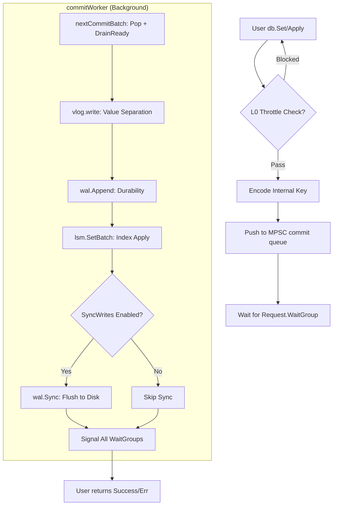

# NoKV write pipeline: from an MPSC metronome to adaptive aggregation

A high-performance storage engine's write path needs to behave like a metronome — steady. NoKV's write pipeline is not just a concurrent queue; it's an asynchronous aggregation system with **adaptive feedback** and **per-stage consistency guarantees**. This note dissects how NoKV holds high write throughput and low tail latency under heavy concurrent pressure.

---

## 1. The architectural model: an MPSC aggregation pipeline

NoKV does **not** let every user goroutine fight for the underlying disk lock or WAL mutex directly. Instead, it uses an **MPSC (Multi-Producer, Single-Consumer)** asynchronous aggregation model.

### 1.1 Why MPSC?
In an LSM engine, WAL (write-ahead log) writes must be strictly sequential. Letting a thousand user goroutines call `write()` concurrently floods the kernel with context switches and file-lock contention.
NoKV uses MPSC to funnel thousands of foreground producers into a single background `commitWorker`, converting random small writes into large sequential disk I/O.

### 1.2 Core component: `commitQueue`
`commitQueue` (in `internal/runtime/write_pipeline.go`) is now a write-specific queue wrapped around `utils.MPSCQueue[*commitRequest]`, replacing the old RingBuffer + dual-channel protocol. Today's implementation has three pieces:
* **Bounded MPSC queue**: a bounded multi-producer / single-consumer queue using per-slot sequence numbers, providing strict single-consumer semantics and explicit shutdown.
* **Long-lived consumer session**: once `commitWorker` starts, it acquires `MPSCConsumer` exactly once and uses `Pop`/`DrainReady` to batch-pull requests. This avoids repeat acquire/release on the hot path.
* **Out-of-queue accounting and backpressure**: `pendingEntries`, `pendingBytes`, and `ReservedLen()` together drive backlog observation and batch amplification. When the queue is full, `MPSCQueue` itself blocks producers — we don't lean on a separate "spaces/items" channel.

---

## 2. Adaptive batching algorithm

`nextCommitBatch` is the soul of the pipeline. It does not pack into fixed-size batches mechanically — it dynamically reshapes its "throughput mode" based on system load.

### 2.1 Backlog-driven dynamic ceiling
The system continuously observes queue backlog (`commitQueue.len()`, internally `MPSCQueue.ReservedLen()`). When backlog grows, the worker "levels up":
```go
// Dynamically scale the batch limit
backlog := cq.len()
if backlog > limitCount {
    // If the queue is backing up, grow the batch size up to 4x.
    factor := min(max(backlog/limitCount, 1), 4)
    limitCount = min(limitCount*factor, backlog)
    limitSize *= int64(factor)
}
```
**Design value**: this exploits batching economy of scale. The more pressure, the deeper the batches, the lower the per-byte cost of each disk I/O. The result is a counter-intuitive "throughput growth" effect under load.

### 2.2 Current status
The current implementation no longer scales batch size based on Thermos. Batch size is determined by queue pressure and explicit batch limits only.

### 2.3 Coalescing wait
When the queue is briefly empty, the worker doesn't fire a commit immediately — it waits for a short `WriteBatchWait` (default 200µs). This tiny pause is the delicate balance between low latency and high throughput: it lets a small burst share a single `fsync` cost.

---

## 3. The core call flow: one request's journey



---

## 4. Robustness: per-stage error attribution and rollback

In an aggregation system, the worst outcome is "one error, everybody pays." If a batch of 100 requests fails on item 50 because the disk filled up, what happens to the other 50?

NoKV uses **precise failure-point tracking**:
1.  **Per-request execution**: `applyRequests` stops on the first error and returns the `failedAt` index.
2.  **Error isolation**:
    ```go
    // finishCommitRequests routes the result.
    for i, cr := range batch.reqs {
        if i < failedAt {
            cr.req.Err = nil // requests before the fault are durable.
        } else {
            cr.req.Err = actualErr // everything from the fault on is marked failed.
        }
        cr.req.wg.Done()
    }
    ```
3.  **VLog rollback**: if a write fails partway through, the VLog `Rewind`s its file head pointer back to the last known safe point, preventing partial dirty data from staying behind.

---

## 5. Tunable parameters and their reasoning

| Parameter | Default | Tuning rationale |
| :--- | :--- | :--- |
| `WriteBatchMaxCount` | 64 | Aggregation depth. Higher boosts throughput but stretches P99. |
| `WriteBatchWait` | 200µs | Coalesce wait. Recommended for sync-write scenarios; can drop to 0 in async-write mode. |
| `SyncWrites` | false | Whether to call `fsync` on every batch. Setting it true lowers throughput by an order of magnitude but guarantees strong durability. |

**Bottom line**: NoKV's write path keeps foreground goroutines off the persistence hot path through a bounded MPSC funnel, batch `DrainReady`, and explicit value-log / LSM / sync staging. This funnel design plus adaptive batching is the key to current write throughput and tail-latency control.
