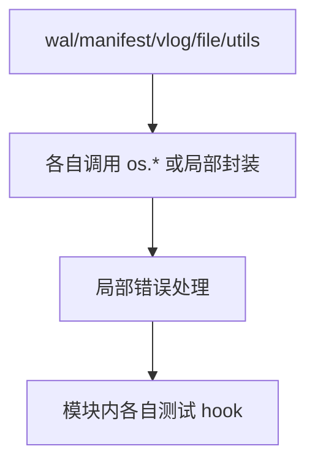
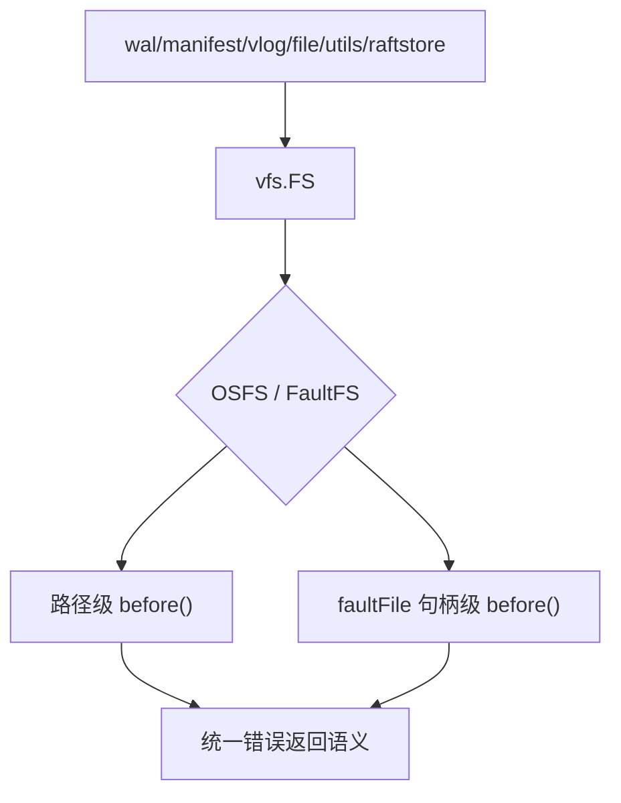

# 2026-02-15 vfs 设计与存储引擎对比（对齐 Pebble 的工程实践）

这篇笔记聚焦三件事：

1. NoKV 为什么要引入统一 `vfs` 抽象。
2. `vfs` 具体怎么实现、替代了哪些旧方法。
3. 调用流程在改造前后有什么变化，并与 Pebble / RocksDB / Badger 对比。

---

## 一页摘要（TL;DR）

NoKV 的这轮 `vfs` 改造不是“换个包名”，而是把存储 IO 语义收敛为同一套契约：

* 统一入口：`OpenHandle` / `OpenFileHandle`。
* 统一注入：`FaultPolicy` 管理规则与 hook，`FaultFS` 包装所有路径与句柄操作。
* 统一能力边界：`File` 不再强制 `Fd()`，改为可选能力接口 `FDProvider`。

直接替代的旧设计：

* 分散在 DB/VLog 的侵入式测试 hook。
* 多套 `*WithFS` 导出 API 变体。
* 依赖文件描述符的硬耦合接口约束。

---

## 1. 改造前的问题与约束

在统一 VFS 之前，存储层虽然功能可用，但有几个典型工程问题：

* WAL / Manifest / VLog 的文件访问语义分散，失败路径覆盖不均。
* 模块内测试 hook 不统一，新增故障场景要改多处代码。
* `*WithFS` 与非 `WithFS` 双 API 并存，调用面冗余。
* `File` 抽象对 `Fd()` 的硬要求，使未来非 OS-backed file 实现被接口卡住。

这类问题不会马上造成功能错误，但会持续拉高维护成本和回归风险。

---

## 2. 设计与实现（NoKV 当前版本）

### 2.1 抽象层：`vfs.FS` + `vfs.File`

`vfs.FS` 统一路径级操作：

* `OpenHandle`
* `OpenFileHandle`
* `MkdirAll/Remove/Rename/Stat/ReadDir/ReadFile/WriteFile/Truncate/Glob/Hostname`

`vfs.File` 统一句柄级操作：

* `Read/ReadAt`
* `Write/WriteAt`
* `Seek`
* `Sync`
* `Truncate`
* `Close`
* `Name`

默认实现 `OSFS` 直接映射到 `os.*`。调用方通过 `Ensure(fs)` 处理 `nil`。

### 2.2 故障注入层：`FaultFS` + `FaultPolicy` + `faultFile`

核心思路：

* `FaultFS` 包装 `FS`，所有路径级操作进入统一 `before(...)`。
* `faultFile` 包装 `File`，句柄级 `Write/Sync/Close/Truncate` 也走统一注入。
* `FaultPolicy` 提供规则匹配与计数触发：
  * `FailOnceRule`
  * `FailOnNthRule`
  * `FailAfterNthRule`
  * `FailOnceRenameRule`

并且 hook 已并入 policy 执行路径，不再有分叉维护面。

### 2.3 `Fd` 能力解耦

`File` 接口移除 `Fd()` 硬要求，改为：

* 可选能力接口 `FDProvider`
* 帮助函数 `FileFD(f)` 在需要 fd 的调用点提取能力

`utils/dirlock` 已切换到 `FileFD`，从“接口强制约束”转为“按需能力检查”。

---

## 3. 替代了哪些旧方法与问题

### 3.1 API 形态收敛

旧形态：大量 `*WithFS` 与基础方法并存。  
新形态：统一主 API 接受 `vfs.FS`（可 `nil`）。

例如：

* `manifest.OpenWithFS` / `manifest.Open` -> `manifest.Open(dir, fs)`
* `manifest.VerifyWithFS` / `manifest.Verify` -> `manifest.Verify(dir, fs)`
* `wal.VerifyDirWithFS` / `wal.VerifyDir` -> `wal.VerifyDir(dir, fs)`

### 3.2 测试注入收敛

旧形态：模块内部 test hook 分散。  
新形态：通过 `FaultFS` 在统一入口注入，覆盖 `open/sync/close/truncate` 失败路径。

### 3.3 句柄能力边界更清晰

旧形态：所有 `File` 都必须暴露 `Fd()`。  
新形态：只有确实需要 fd 的地方才要求 `FDProvider`，降低实现耦合。

---

## 4. 调用流程前后变化

### 4.1 改造前（分散调用）

特点：

* 入口多，失败语义靠各模块自觉保持一致。
* 故障注入粒度不统一，回归覆盖依赖局部实现细节。

### 4.2 改造后（统一调用）

特点：

* 所有关键路径都经过统一注入层。
* sync/close/truncate 的失败路径能用同一模型测试。
* 调用方 API 形态一致，迁移和维护成本更低。

---

## 5. 与 Pebble / RocksDB / Badger 的对比结果

| 维度 | Pebble | RocksDB | Badger | NoKV（当前） |
| :-- | :-- | :-- | :-- | :-- |
| 统一 FS 抽象 | 强（`vfs.FS`） | 强（`Env` / `FileSystem`） | 中（工具层主导） | 强（精简统一） |
| 故障注入体系 | 强（`errorfs`） | 可做（Env 注入） | 较弱（非核心） | 强（`FaultFS`） |
| 句柄级注入 | 有 | 可实现 | 有限 | 有（Write/Sync/Close/Truncate） |
| API 收敛度 | 高 | 高 | 中 | 高（本轮显著提升） |

结论：

* 设计思想上，NoKV 已对齐 Pebble 的“抽象层 + 注入层”方向。
* 工程范围上，NoKV 目前是“围绕核心存储路径的精简实现”，不是通用大而全 VFS 工具箱。

---

## 6. 简短总结

这轮 `vfs` 改造的价值在于：把存储 IO 从“模块自治”改为“契约统一”。

核心不是“多了一个包”，而是把以下内容变成统一系统行为：

* 文件操作入口
* 故障注入方式
* 失败语义测试覆盖
* 句柄能力边界

这使得 NoKV 在 WAL/Manifest/VLog/raftstore 的稳定性验证和后续维护上，工程成本显著下降。

---

## 参考资料

* Pebble VFS: <https://pkg.go.dev/github.com/cockroachdb/pebble/vfs>
* Pebble errorfs: <https://pkg.go.dev/github.com/cockroachdb/pebble/vfs/errorfs>
* RocksDB `file_system.h`: <https://raw.githubusercontent.com/facebook/rocksdb/main/include/rocksdb/file_system.h>
* RocksDB `Env` 文档: <https://github.com/facebook/rocksdb/wiki/Basic-Operations/7c243a62ceda1634fbda04fce76e87889b30ffda>
* Badger 文档: <https://pkg.go.dev/github.com/dgraph-io/badger/v4>
