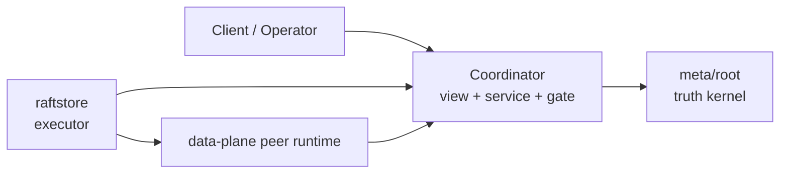
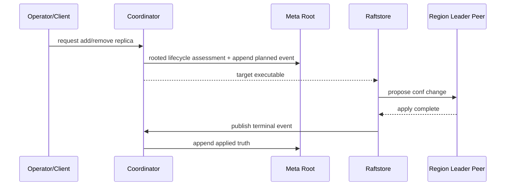

# 2026-03-30 Why Coordinator and the execution plane must stay layered

> Status: this boundary has continued to converge. `coordinator` owns the rooted view, services, and proposal gate; `raftstore` owns data-plane execute; `meta/root` owns minimal truth. This note explains why `Coordinator` cannot be merged into the execution plane.

## TL;DR

- 🧭 Topic: why `coordinator` must be a view/service layer, not a half-baked executor.
- 🧱 Core objects: `meta/root`, `coordinator`, `raftstore`, `RootEvent`.
- 🔁 Call chain: `planned truth -> data-plane execute -> terminal truth`.
- 📚 Reference: TiKV's control-plane / execution-plane separation; Delos / FDB-style truth/service decoupling.

## 1. Why this matters

The most common mistake distributed KVs make on the control plane:

- Build one central service first.
- Then keep stuffing routing, scheduling, metadata, execution entry points, and operational commands into it.
- End up with one fat "control-plane brain."

It looks convenient short-term. The long-term cost is severe:

1. authority and runtime get tangled.
2. recovery path diverges from the normal execute path.
3. the execution plane gets dirtied by control-plane overreach.

NoKV picks a different path:

- `meta/root` as the minimal truth kernel
- `coordinator` as the rooted view + service
- `raftstore` as the executor

## 2. Current layering

Relevant code:

- `coordinator`
- `meta/root`
- `raftstore/store`

Structure:

### Three layers of responsibility

#### `meta/root`

Owns:

- rooted truth
- transition state machine
- checkpoint + retained tail

#### `coordinator`

Owns:

- route view
- transition view
- leader-only write gate
- assessment / inspection RPC
- liveness service

#### `raftstore`

Owns:

- consume target
- execute conf change / admin command
- local apply
- publish terminal truth

## 3. Why `Coordinator` cannot directly serve as the execution plane

### 3.1 control-plane is not execution-plane

What `Coordinator` is good at:

- Global view
- Routing and directory service
- Proposal gate
- Scheduler decisions and rooted assessment

But the actual *execution* of those actions happens at the leader store:

- `AddPeer`
- `RemovePeer`
- `TransferLeader`
- `Split`
- `Merge`
- snapshot install

If we let `Coordinator` directly mutate local region runtime, three problems appear immediately:

1. Local truth becomes detached from the raft apply path.
2. Normal execute path and recovery path no longer agree.
3. The control-plane starts moonlighting as an executor, blowing up the error model.

### 3.2 Execution must land on the leader peer

Relevant code:

- `raftstore/store/transition_executor.go`
- `raftstore/store/membership_ops.go`
- `raftstore/store/admin_ops.go`

Real execution must go through:

1. Find the local leader peer.
2. Publish planned truth.
3. Propose conf change / admin command.
4. Local apply.
5. Publish terminal truth.

This path must stay clean — otherwise the entire lifecycle gets polluted.

## 4. Actual call flow today

### 4.1 peer change

### 4.2 split / merge

Same path; the proposal payload is an admin command instead of a conf change.

## 5. Benefits of this layering

### 5.1 `Coordinator` doesn't grow back into authority

`coordinator`'s main code today:

- `coordinator/storage/root.go`
- `coordinator/catalog/cluster.go`
- `coordinator/server`

It's clearly no longer a "big metadata database" but a rooted view host.

### 5.2 The execution plane is easier to keep pure

`raftstore` has been compressed further into:

- builder
- executor
- outcome

This gives a clear landing for further "pure executor" cleanup.

### 5.3 Future scheduler / runtime semantics can grow independently

You can keep adding scheduler policy, admission, backoff, and debug surface inside `Coordinator` without leaking back into `meta/root`.

## 6. Design philosophy

Two core principles:

### 6.1 `Coordinator` is the global view and service layer, not the local-state executor

### 6.2 Execute path and recovery path must share one truth model

If an action only holds at runtime and can't be reconstructed after recovery, it's design-dirty.

## 7. Reference patterns

This layering borrows from some industrial structures with long track records:

- TiKV's basic separation between control-plane and raft execution.
- FoundationDB / Delos-style truth/service decoupling.
- The database-kernel principle "don't let the orchestrator write executor-local state directly."

## 8. What's already correct today

- `Coordinator` no longer maintains a second copy of authority truth.
- `meta/root` owns the transition state machine.
- `raftstore` is closer to a target-driven executor.
- The transition view is materialized from rooted truth.

## 9. Still worth doing

- Continue pushing `raftstore` toward pure executor.
- Continue strengthening `Coordinator`'s outward transition / debug surface.

## 10. Summary

The reason `Coordinator` and the execution plane can't merge into one layer isn't aesthetic naming. It's that:

- control-plane should not mutate local execution state.
- authority, view, runtime, executor must be layered.
- Only with this layering do recovery, testing, scheduling, and evolution stop polluting each other.

NoKV is starting to settle into this line, and it's a prerequisite for any further scheduler / control-plane runtime research.
