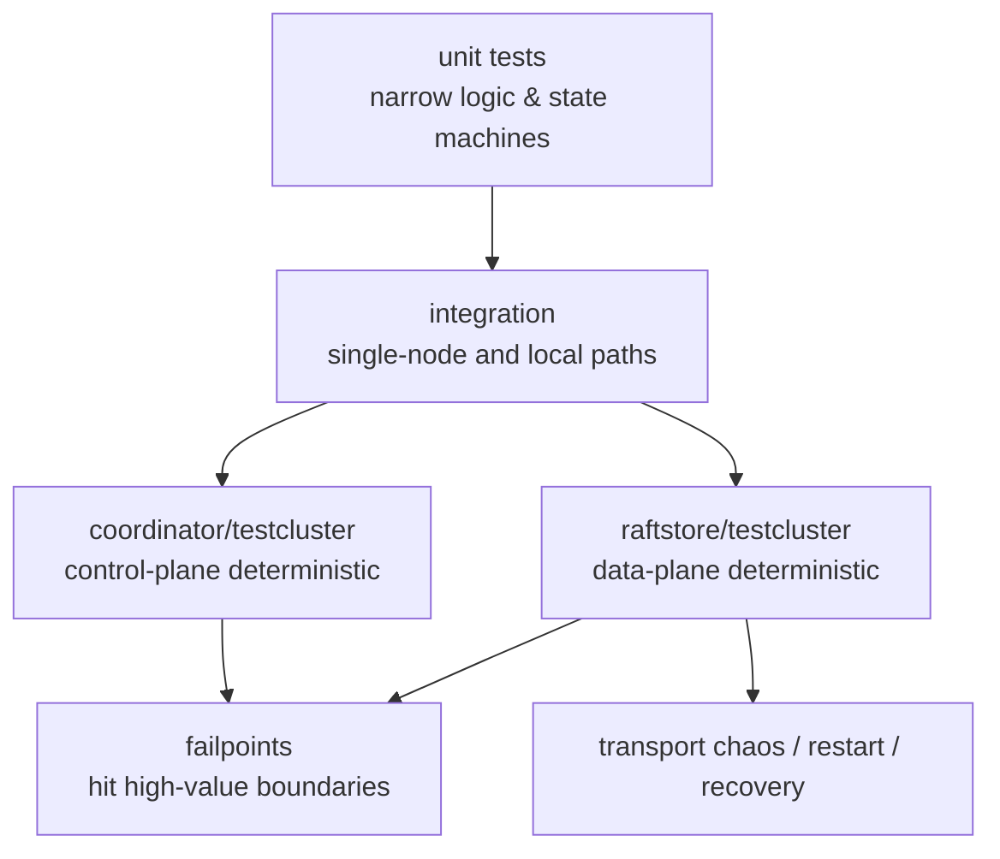
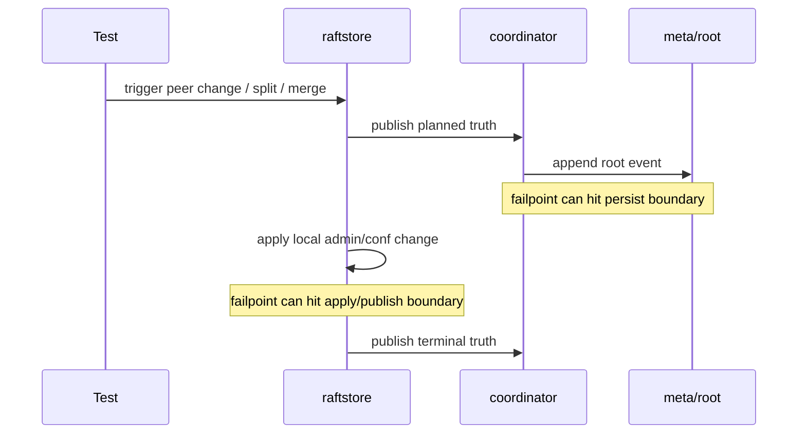

# 2026-03-30 Why distributed testing can't lean on black-box alone, and how to keep failpoints disciplined

> Status: NoKV has built up a multi-tier distributed test framework. The point of this note is **not** to enumerate cases — it's to explain why testing must be layered by boundary and fault model.

## TL;DR

- 🧭 Topic: why distributed testing must combine black-box path validation with narrow-boundary fault injection.
- 🧱 Core objects: `testcluster`, failpoint, integration tests, recovery tests.
- 🔁 Call chain: `unit -> integration -> multi-node deterministic -> failpoint/chaos`.
- 📚 Reference: fault-injection patterns and deterministic cluster harnesses common in industrial databases.

## 1. Why this matters

The two most common failure modes in distributed-system testing:

1. Only unit tests, no system-path validation.
2. Only black-box integration, no boundary-level fault-hit capability.

The first can't prove the real system actually works.
The second can't reliably hit the dangerous lifecycle boundaries — publish, persist, send, install.

NoKV's direction is not to pick one — it's to **layer**:

- package-level tests
- node-local integration
- multi-node deterministic integration
- restart / recovery tests
- transport chaos
- failpoints
- `testcluster` harness

## 2. Relevant implementation

- `raftstore/testcluster`
- `raftstore/failpoints`
- `raftstore/integration`
- `meta/root/backend/replicated`
- `coordinator/server`

## 3. Why black-box alone is insufficient

Suppose you only write black-box integration:

- Spin up three nodes
- Send requests
- Verify final convergence

This has value, but it can't reliably hit some genuinely dangerous boundaries:

- After ready advance, before send
- After snapshot apply, before publish
- After root event persist, before view reload
- The transition between install bootstrap and compact rewrite

If you wait for black-box randomness to land on these boundaries, neither stability nor diagnosability is enough.

## 4. Why failpoint alone is also insufficient

The other extreme — handing every complex path to failpoints — produces another bad shape:

- Production code peppered with test branches
- Failpoints proliferate
- The whole system gets reshaped by its own testing tools

So the real question isn't "should we use failpoints" — it's:

> Are failpoints used **only** for high-value, hard-to-black-box-hit lifecycle boundaries where resource injection isn't precise enough?

## 5. NoKV's current test layering

### 5.1 `testcluster`

Its value isn't "easier to write tests" — it converts multi-node environment setup into a formal harness.

It's now explicitly split into two layers:

- `raftstore/testcluster`
  - Spin up stores
  - Wire transport
  - Run data-plane scenarios with a single Coordinator dependency
- `coordinator/testcluster`
  - Spin up `3 coordinator + replicated meta`
  - Test rooted watch/reload, leader/follower propagation
  - Dedicated to control-plane scenarios

`raftstore/testcluster` provides:

- Spin up Coordinator
- Spin up multiple nodes
- block/unblock peer
- restart node
- wait leader / hosted / scheduler mode

So migration, snapshot, and membership tests don't keep rebuilding data-plane cluster scaffolding; control-plane integration tests don't keep getting stuffed into the store harness.

### 5.2 Failpoints

Today, the legitimate places for failpoints concentrate around:

- publish boundary
- persist boundary
- send boundary
- install boundary

These have a common signature:

- High risk
- Hard to hit reliably from black-box
- Most likely to leave half-state on failure

## 6. Call flow and test landing points

Take the rooted metadata path as an example:

You can see:

- Black-box integration proves the chain holds end-to-end.
- Failpoints reliably hit the most dangerous middle boundaries.

## 7. Design philosophy

### 7.1 Don't let test mechanisms substitute for architecture

Failpoints can't replace clear layering. Conversely, a good failpoint design assumes the boundaries are already clear.

### 7.2 Don't pollute production paths for the sake of testing

Only boundaries that are:

- High value
- Hard to hit
- With clear fault models

are worth instrumenting.

### 7.3 System-level correctness must be proved by multiple layers together

No single test layer can carry the whole proof on its own.

## 8. Reference patterns

Not borrowing from any one framework — this is a mature pattern in industrial systems:

- unit tests prove local logic
- deterministic cluster / integration prove path composition
- failpoint / fault injection hit high-value boundaries
- transport / restart / recovery test real distributed faults

## 9. Coverage already in place

- Multi-tier testing is established
- `testcluster` is an independent harness
- Failpoints are converging onto high-value boundaries
- migration / rooted metadata / distributed paths have core coverage
- Coordinator outage, transport partition, restart recovery, split/merge restart safety are now part of the integration matrix

## 10. Coverage gaps still open

- Long-running stress / soak isn't a default test yet.
- Shell scripts still lack direct golden / smoke tests.
- Invariant helpers are still relatively few.
- Degraded mode has core cases but doesn't yet cover every publish / reload interleaving.
- Transport chaos covers partition and link jitter but isn't a large-scale fault matrix yet.
- Scheduler / control-plane runtime testing doesn't yet have a complete policy matrix.

## 11. Summary

NoKV's distributed test trunk has evolved from "write more cases" to "validate by layered boundary and fault model."

What matters is not test count, but:

- Black-box tests prove system-level convergence
- `testcluster` provides multi-node environment control
- Failpoints handle only high-value, black-box-hard boundaries

Hold this layering, and as the system grows more complex, the test framework will not start polluting the code in return.
