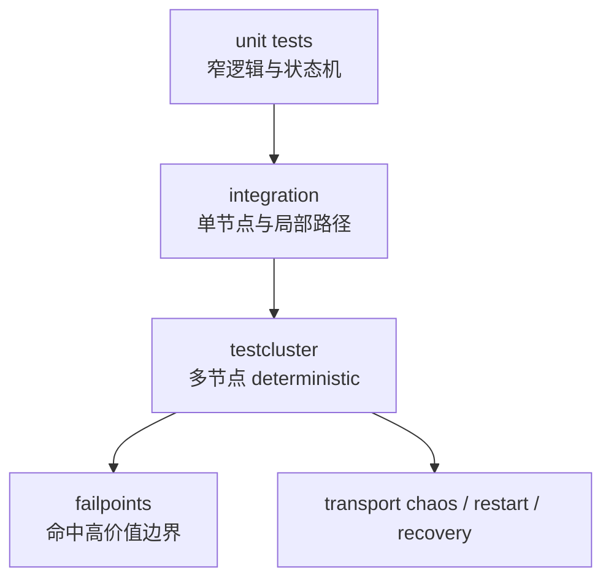
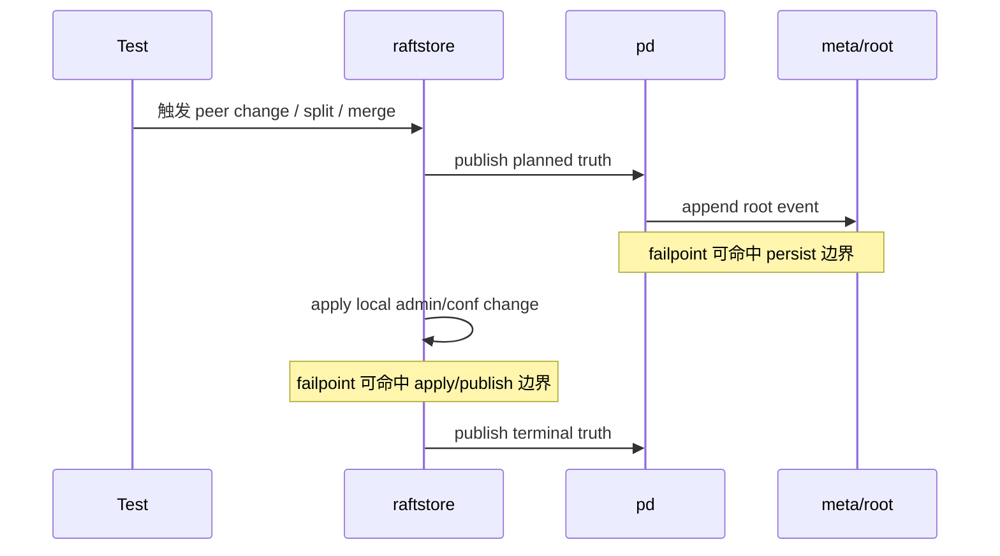

# 2026-03-30 分布式测试为什么不能只靠黑盒，以及 failpoint 该怎么克制

> 状态：当前 NoKV 已经形成多层分布式测试体系。本文重点不是罗列 case，而是解释为什么测试必须按边界和故障模型分层。

## 导读

- 🧭 主题：为什么分布式测试必须同时有黑盒路径验证和窄边界故障注入。
- 🧱 核心对象：`testcluster`、failpoint、integration、recovery tests。
- 🔁 调用链：`单测 -> 集成 -> 多节点 deterministic -> failpoint/chaos`。
- 📚 参考对象：工业数据库常见的 fault injection 与 deterministic cluster harness。

## 1. 为什么这件事重要

分布式系统最常见的测试失真有两种：

1. 只有单测，没有系统路径验证。
2. 只有黑盒集成，没有边界级故障命中能力。

前者的问题是：证明不了真实系统会跑通。  
后者的问题是：很难稳定打中 publish、persist、send、install 这些真正危险的生命周期边界。

NoKV 现在的方向不是选其中之一，而是分层：

- package-level tests
- node-local integration
- multi-node deterministic integration
- restart / recovery tests
- transport chaos
- failpoints
- `testcluster` harness

## 2. 当前相关实现

- `/Volumes/mac Ds - Data/WorkSpace/GitHub/NoKV/raftstore/testcluster`
- `/Volumes/mac Ds - Data/WorkSpace/GitHub/NoKV/raftstore/failpoints`
- `/Volumes/mac Ds - Data/WorkSpace/GitHub/NoKV/raftstore/integration`
- `/Volumes/mac Ds - Data/WorkSpace/GitHub/NoKV/meta/root/backend/replicated`
- `/Volumes/mac Ds - Data/WorkSpace/GitHub/NoKV/pd/server`

## 3. 为什么不能只靠黑盒

假设只写黑盒集成：

- 启三个节点
- 发请求
- 看最终收敛

这当然有价值，但它打不中一些真正危险的边界：

- ready advance 后、send 前
- snapshot apply 后、publish 前
- root event persist 后、view reload 前
- install bootstrap 和 compact rewrite 的切换边界

这些边界如果只靠黑盒随机跑到，稳定性和定位能力都不够。

## 4. 为什么也不能只靠 failpoint

如果反过来把所有复杂路径都交给 failpoint，又会出现另一种坏形态：

- 生产代码里布满测试分支
- failpoint 越打越细
- 整个系统被测试手段反过来塑形

所以真正正确的问题不是“要不要 failpoint”，而是：

> failpoint 是否只用于高价值、黑盒难命中、资源注入又不够精确的生命周期边界。

## 5. 当前 NoKV 的测试分层

### 5.1 `testcluster`

它的价值不是“写测试方便一点”，而是把多节点环境搭建收成正式 harness：

- 起 PD
- 起多个节点
- block/unblock peer
- restart node
- wait leader / hosted / scheduler mode

这样 migration、snapshot、membership 测试就不用重复造 cluster 脚手架。

### 5.2 failpoint

当前合理的 failpoint 应该集中在：

- publish boundary
- persist boundary
- send boundary
- install boundary

这些点的共同特点是：

- 风险高
- 黑盒难稳定命中
- 一旦失败最容易留下半状态

## 6. 调用逻辑和测试落点

以 rooted metadata 路径为例：

这里可以看出：

- 黑盒集成能证明整条链成立
- failpoint 能稳定命中最危险的中间边界

## 7. 设计理念

### 7.1 不把测试手段当架构替代品

failpoint 不能替代清楚的分层。相反，好的 failpoint 设计应当建立在边界已经清楚的前提上。

### 7.2 不为了测试去污染生产路径

只有那些：

- 价值高
- 命中难
- 故障模型明确

的边界，才值得打点。

### 7.3 系统级正确性要靠多层测试共同证明

没有哪一层测试能单独承担全部证明责任。

## 8. 参考对象

这里借鉴的不是某个框架，而是工业系统里非常成熟的一套做法：

- unit test 证明局部逻辑
- deterministic cluster/integration 证明路径成立
- failpoint/fault injection 命中高价值边界
- transport/restart/recovery 测真实分布式故障

## 9. 当前已经做到的

- 多层测试已经形成
- `testcluster` 已经是独立 harness
- failpoint 打点开始收敛到高价值边界
- migration / rooted metadata / distributed path 已有较完整覆盖

## 10. 还应该继续做什么

- 更强的 invariant helper
- 更系统的 degraded-mode 测试
- 更强的 transport chaos
- 更系统的 operator/runtime 侧测试

## 11. 总结

NoKV 当前的分布式测试主线已经从“多写几个 case”进化成了“按边界和故障模型分层验证”。

最重要的不是测试数量，而是：

- 黑盒测试负责系统级收敛
- `testcluster` 负责多节点环境控制
- failpoint 只负责高价值、黑盒难命中的边界

这条分层如果守住，后面系统越复杂，测试体系越不会反过来把代码搞脏。
