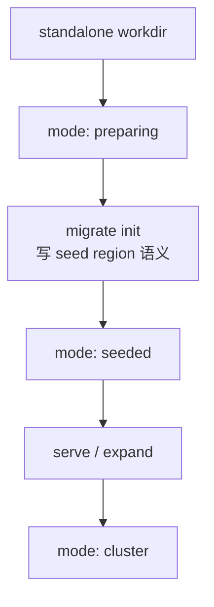
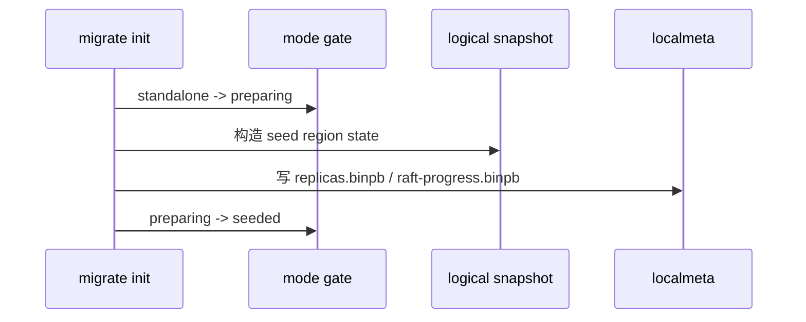
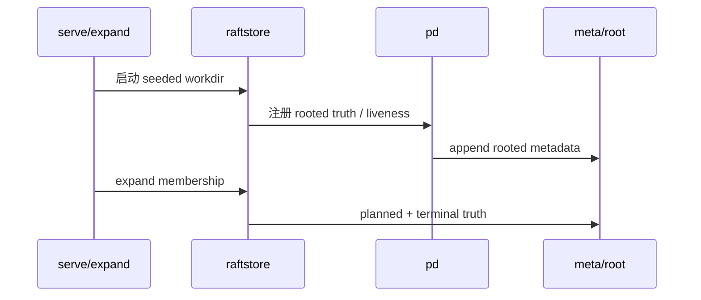

# 2026-03-30 迁移设计里最关键的不是命令，而是 mode 和 snapshot 语义

> 状态：当前 migration 主线已经形成。本文关注的是背后的状态协议，而不是 CLI 表面。

## 导读

- 🧭 主题：迁移为什么首先是目录生命周期协议，而不是一组运维命令。
- 🧱 核心对象：`mode`、raft durable snapshot、logical region snapshot。
- 🔁 调用链：`standalone -> preparing -> seeded -> serve/expand -> cluster`。
- 📚 参考对象：分布式数据库里的 lifecycle gate、逻辑快照与协议快照分层。

## 1. 为什么这件事重要

在分布式系统里，迁移经常被误解成一组“方便运维的命令”。

但真正决定迁移是否成立的，不是命令数量，而是两个更深的东西：

1. workdir 当前到底处于什么生命周期状态
2. snapshot 到底代表什么语义层次

如果这两个问题没有被严格定义，最后通常会出现：

- 目录状态模糊
- 半迁移目录仍然能被错误打开
- snapshot 混杂 raft metadata 和应用状态
- 扩副本和恢复只能靠脚本和运气

## 2. 当前相关实现

- `raftstore/mode`
- `raftstore/migrate`
- `raftstore/engine/snapshot.go`
- `raftstore/snapshot`

当前主线可以概括成：

## 3. `mode` 为什么是协议，不是状态枚举

### 当前 mode

- `standalone`
- `preparing`
- `seeded`
- `cluster`

### 为什么它重要

这不是给 CLI 提示用的标签，而是 workdir lifecycle contract。

只要一个目录进入了 `preparing/seeded/cluster`，系统就必须明确知道：

- 它不再是普通 standalone DB
- 某些打开路径必须拒绝
- 某些恢复逻辑必须切到 region/peer 语义

也就是说：

> `mode` 是对目录身份的正式判定。

没有这一层，迁移过程就只能靠“别乱用目录”这种口头约定。

## 4. snapshot 为什么必须分层

相关代码：

- `raftstore/engine/snapshot.go`
- `raftstore/snapshot`

当前最重要的分层是：

### 4.1 raft durable metadata snapshot

表达的是：

- index
- term
- conf state
- durable protocol metadata

### 4.2 logical region snapshot

表达的是：

- 某个 key range 内真正的逻辑状态
- region-scoped state
- 后续 bootstrap/install 所需的数据语义

### 为什么这条分层必须存在

因为迁移要解决的问题不是“恢复一个 raft group”，而是：

- 把一个原本没有分布式身份的 workdir
- 提升成一个有 region/peer 语义的状态片段
- 然后让它能进入 cluster 生命周期

如果 snapshot 不分层，迁移就会变成：

- 一部分协议 metadata
- 一部分逻辑数据
- 一部分目录复制
- 一部分脚本约定

最终谁也说不清系统到底在恢复什么。

## 5. 当前调用逻辑

### `migrate init`

### `serve / expand`

## 6. 哪些看起来简单但其实是错路

### 6.1 只把迁移做成脚本链

这会让：

- 状态边界不清楚
- 错误恢复路径不清楚
- 测试只能测脚本 happy path

### 6.2 把 snapshot 当成一个统称

如果不分 raft durable snapshot 和 logical region snapshot，后面所有关于：

- install
- migration
- restore
- reshard

的设计都会反复纠缠。

### 6.3 让 standalone 打开路径默认接受所有目录

这会直接让迁移中的目录被错误当成普通 DB 继续写，最终破坏状态提升协议。

## 7. 设计理念

这里背后的理念其实很简单：

### 7.1 目录生命周期要写进协议

### 7.2 snapshot 语义要精确，不要模糊

### 7.3 迁移是状态提升，不是工具链拼接

## 8. 参考对象

这条线借鉴的是一类通用工程原则，而不是某个系统的现成模块：

- 分布式数据库里关于生命周期 gate 的做法
- region/shard 系统里逻辑快照与协议快照分层的经验
- Delos/FDB 一类系统对“最小 durable 核心 + 可重建 view”的强调

## 9. 当前已经做到的

- mode gate 已经存在
- localmeta / snapshot / migrate 已经分层
- migration 已经不是 dump/import 风格
- 后续可以自然接到 `pd` / `meta/root` 主线

## 10. 后续还值得继续做的

- 更强的 migration observability
- SST-based snapshot install 与 migration 更深整合
- 更完整的 operator 编排和故障恢复

## 11. 总结

NoKV 当前 migration 设计真正成立的关键，不是有多少命令，而是：

- workdir mode 被做成了正式协议
- snapshot 被做成了分层语义
- standalone 到 distributed 是状态提升，而不是系统切换

这也是为什么后面的 control-plane、snapshot install、operator runtime 都能继续建立在这条主线上，而不是重做一遍。
