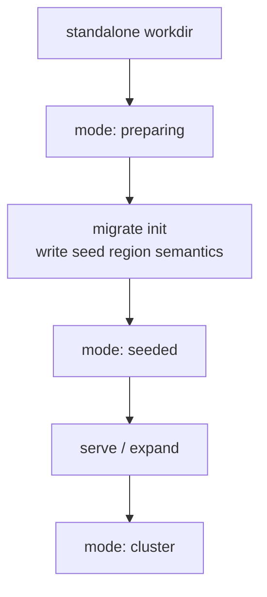
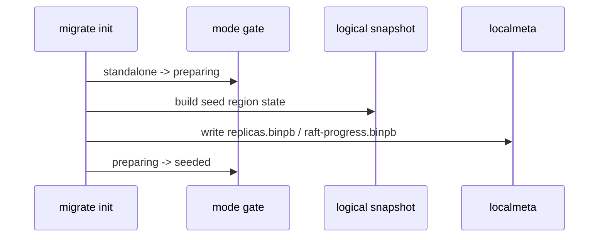
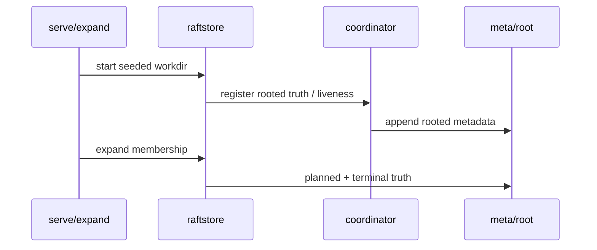

# 2026-03-30 The most important thing in migration design isn't commands — it's mode and snapshot semantics

> Status: the migration trunk is now in place. This note focuses on the underlying state protocol, not the CLI surface.

## TL;DR

- 🧭 Topic: why migration is fundamentally a directory lifecycle protocol, not a set of operational commands.
- 🧱 Core objects: `mode`, raft durable snapshot, logical region snapshot.
- 🔁 Call chain: `standalone -> preparing -> seeded -> serve/expand -> cluster`.
- 📚 Reference: lifecycle gates in distributed databases, layered logical vs protocol snapshots.

## 1. Why this matters

In distributed systems, migration is often misread as "a set of operationally convenient commands."

But what actually determines whether migration holds isn't the number of commands — it's two deeper things:

1. What lifecycle state is the workdir actually in.
2. What semantic level does the snapshot represent.

If neither of these is rigorously defined, you typically end up with:

- Ambiguous directory state.
- Half-migrated directories that can still be opened wrong.
- Snapshots mixing raft metadata with application state.
- Replica expansion and recovery that depend on scripts and luck.

## 2. Relevant implementation

- `raftstore/mode`
- `raftstore/migrate`
- `raftstore/raftlog/snapshot.go`
- `raftstore/snapshot`

The current trunk:

## 3. Why `mode` is a protocol, not a status enum

### Current modes

- `standalone`
- `preparing`
- `seeded`
- `cluster`

### Why it matters

This isn't a CLI hint label — it's a workdir lifecycle contract.

Once a directory enters `preparing/seeded/cluster`, the system must explicitly know:

- It's no longer a plain standalone DB.
- Some open paths must refuse to proceed.
- Some recovery logic must switch to region/peer semantics.

In other words:

> `mode` is a formal verdict on the directory's identity.

Without this layer, migration could only rely on "don't misuse the directory" — a verbal convention.

## 4. Why snapshot must be layered

Relevant code:

- `raftstore/raftlog/snapshot.go`
- `raftstore/snapshot`

The most important layering:

### 4.1 raft durable metadata snapshot

Expresses:

- index
- term
- conf state
- durable protocol metadata

### 4.2 logical region snapshot

Expresses:

- The actual logical state inside a key range.
- Region-scoped state.
- Data semantics needed for later bootstrap/install.

### Why this layering must exist

Because migration is not solving "recover a raft group." It's solving:

- Take a workdir that has no distributed identity.
- Promote it into a state slice that has region/peer semantics.
- Then let it enter the cluster lifecycle.

Without snapshot layering, migration becomes:

- Some protocol metadata.
- Some logical data.
- Some directory copy.
- Some script convention.

And nobody can say what the system is actually recovering.

## 5. Current call flow

### `migrate init`

### `serve / expand`

## 6. Things that look simple but are wrong paths

### 6.1 Treating migration as a chain of scripts

This produces:

- Unclear state boundaries.
- Unclear error-recovery paths.
- Tests that only exercise the script's happy path.

### 6.2 Treating "snapshot" as a single concept

Without separating raft durable snapshot from logical region snapshot, every later design around:

- install
- migration
- restore
- reshard

ends up entangled.

### 6.3 Letting the standalone open path accept any directory by default

That immediately lets a mid-migration workdir get opened as a regular DB and written through, which destroys the state-promotion protocol.

## 7. Design philosophy

The underlying philosophy is straightforward:

### 7.1 Directory lifecycle must be encoded in the protocol

### 7.2 Snapshot semantics must be precise, not fuzzy

### 7.3 Migration is state promotion, not toolchain stitching

## 8. Reference patterns

This line borrows from general engineering principles, not any one system:

- Lifecycle-gate practices in distributed databases.
- Logical-vs-protocol snapshot layering experience in region/shard systems.
- Delos / FDB-style emphasis on "minimal durable core + reconstructible view."

## 9. Boundaries already in place

- mode gate exists and prevents half-migrated dirs from being opened as plain standalone.
- `localmeta` / `snapshot` / `migrate` are layered.
- migration is no longer dump/import style — it's state promotion.
- seed region, snapshot install, and membership expansion can enter the distributed trunk.

## 10. Capabilities not yet implemented

- No online auto-split of existing standalone data.
- No automatic rebalance.
- No standalone rollback / repair commands for failed migration.
- Migration observability is still basic.
- SST ingest / zero-copy snapshot install remain future optimizations, not semantic prerequisites.

## 11. Summary

What actually makes NoKV's current migration design hold up isn't the number of commands. It's that:

- workdir mode is a formal protocol.
- snapshot is layered semantically.
- standalone-to-distributed is a state promotion, not a system switch.

This is also why subsequent control-plane, snapshot install, and scheduler / control-plane runtime work can build on this trunk instead of being redone.
