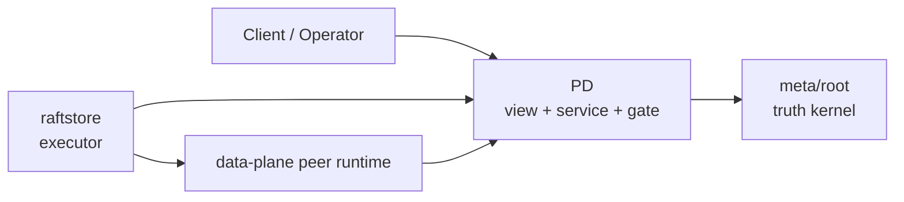
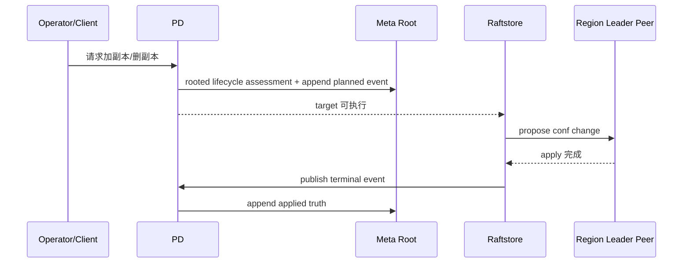

# 2026-03-30 为什么 PD 和执行面必须分层

> 状态：当前这条边界已经进一步收敛。`pd` 负责 rooted view、service 和 proposal gate；`raftstore` 负责 data-plane execute；`meta/root` 负责最小 truth。本文重点解释为什么 `PD` 不能和执行面混成一层。

## 导读

- 🧭 主题：为什么 `pd` 必须是 view/service 层，而不是半个执行器。
- 🧱 核心对象：`meta/root`、`pd`、`raftstore`、`RootEvent`。
- 🔁 调用链：`planned truth -> data-plane execute -> terminal truth`。
- 📚 参考对象：TiKV 的控制面/执行面分离、Delos/FDB 的 truth/service 解耦。

## 1. 为什么这件事重要

分布式 KV 最容易在控制面上犯的一个错误是：

- 先做一个中心服务
- 再把目录、调度、元数据、执行入口、运维命令慢慢都堆进去
- 最后得到一个又大又胖的“控制平面大脑”

这样短期看起来方便，长期的问题非常明显：

1. authority 和 runtime 混在一起
2. 恢复路径和正常执行路径不一致
3. 执行面被 control-plane 越权写脏

NoKV 当前选择的是另一条路：

- `meta/root` 作为最小 truth kernel
- `pd` 作为 rooted view + service
- `raftstore` 作为 executor

## 2. 当前分层

相关代码：

- `pd`
- `meta/root`
- `raftstore/store`

结构如下：

### 三层职责

#### `meta/root`

负责：

- rooted truth
- transition state machine
- checkpoint + retained tail

#### `pd`

负责：

- route view
- pending/operator view
- leader-only write gate
- assessment / inspection RPC
- liveness service

#### `raftstore`

负责：

- consume target
- 执行 conf change / admin command
- local apply
- terminal truth publish

## 3. 为什么 `PD` 不能直接做执行面

### 3.1 control-plane 不等于 execution-plane

`PD` 擅长的是：

- 看全局视图
- 做路由和目录服务
- 做 proposal gate
- 做 operator/scheduler runtime

但真正执行这些动作的仍然是 leader store：

- `AddPeer`
- `RemovePeer`
- `TransferLeader`
- `Split`
- `Merge`
- snapshot install

如果让 `PD` 直接改本地 region 运行时，会立刻出现三个问题：

1. 本地 truth 与 raft apply 路径脱节
2. 正常执行和恢复路径不一致
3. control-plane 开始兼做 executor，错误模型爆炸

### 3.2 执行必须落在 leader peer 上

相关代码：

- `raftstore/store/transition_executor.go`
- `raftstore/store/membership_service.go`
- `raftstore/store/admin_service.go`

真正执行时必须经过：

1. 找到本地 leader peer
2. publish planned truth
3. propose conf change / admin command
4. local apply
5. publish terminal truth

这条路径必须保持清楚，否则整个 lifecycle 会变脏。

## 4. 当前实际调用逻辑

### 4.1 peer change

### 4.2 split / merge

路径类似，只是 proposal payload 从 conf change 换成 admin command。

## 5. 这条分层的收益

### 5.1 `PD` 不重新长成 authority

当前 `pd` 的主要代码：

- `pd/storage/root.go`
- `pd/catalog/cluster.go`
- `pd/view/pending_view.go`
- `pd/operator`
- `pd/server`

可以看出来，它已经不是一个“大 metadata 数据库”了，而是一个 rooted view host。

### 5.2 执行面更容易纯化

`raftstore` 当前已经被进一步压成：

- builder
- executor
- outcome

这为后续继续做纯 executor 化提供了清楚的落点。

### 5.3 后续 scheduler/operator runtime 更容易单独生长

你以后可以继续在 `PD` 里做：

- owner
- attempt
- admission
- backoff
- operator runtime

但这些都不需要倒灌进 `meta/root`。

## 6. 设计理念

这里的核心理念有两条：

### 6.1 `PD` 是全局视图和服务层，不是本地状态执行器

### 6.2 执行路径必须和恢复路径共享同一条 truth model

如果一个动作只能在运行时成立、恢复后解释不出来，那它就是设计上不干净。

## 7. 参考对象

这条分层借鉴的是一些工业系统长期证明有效的结构：

- TiKV 里 control-plane 与 raft 执行面的基本分离
- FoundationDB / Delos 一类系统里 truth 与 service 的解耦
- 数据库内核里“不要让编排器直接写执行器本地状态”的基本原则

## 8. 当前已经做对的地方

- `PD` 不再维护第二份 authority truth
- `meta/root` 持有 transition state machine
- `raftstore` 已经更接近 target-driven executor
- pending/operator view 已经从 rooted truth materialize 出来

## 9. 还值得继续做的

- `pd/operator` 真正长出 scheduler/operator runtime
- `raftstore` 继续纯 executor 化
- `PD` 对外 operator/debug surface 继续增强

## 10. 总结

`PD` 和执行面不能混成一层，根本原因不是“命名要好看”，而是：

- control-plane 不应该篡改本地执行态
- authority、view、runtime、executor 必须分层
- 只有这样，系统恢复、测试、调度和演进才不会互相污染

当前 NoKV 这条线已经开始站稳，而且它是后续继续做 scheduler/operator 研究的必要前提。
