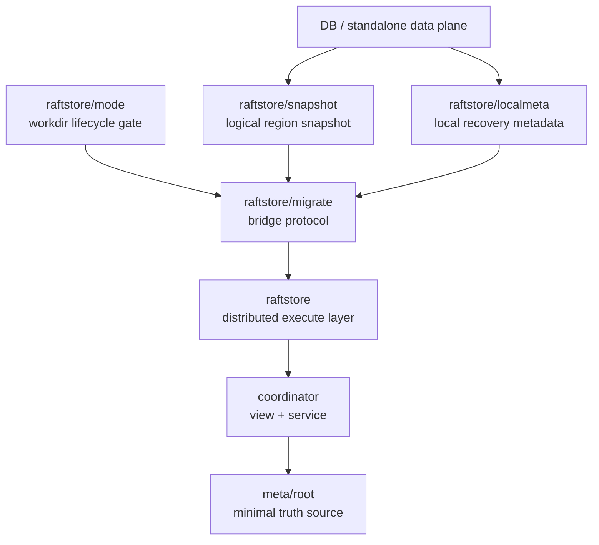
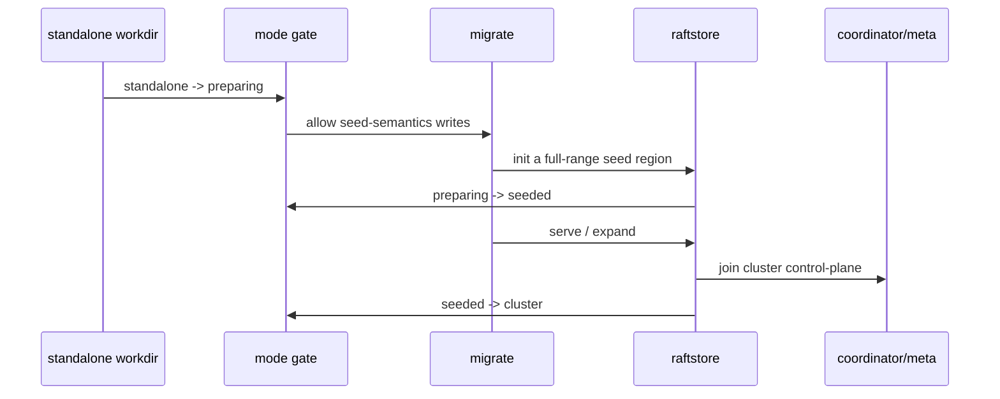

# 2026-03-30 Why the standalone-to-distributed bridge is a trunk capability of NoKV

> Status: design is in place; implementation is spread across `DB`, `raftstore`, `migrate`, `coordinator`, and `meta/root`. This note focuses on why NoKV did not split into two separate systems ("standalone" vs "distributed") rather than rehashing commands.

## TL;DR

- 🧭 Topic: how a standalone workdir is promoted into a distributed store via protocol, instead of going through a dump/import side-tool route.
- 🧱 Core objects: `mode`, `snapshot`, `localmeta`, `seed region`.
- 🔁 Call chain: `standalone -> preparing -> seeded -> cluster`.
- 📚 Reference: identity promotion in range/shard systems; the "small stable control-plane skeleton" pattern from Delos / FDB.

## 1. Why this matters

Many KV projects build the standalone version first, then bolt on a separate set of metadata, recovery, ops, and data-import logic when distributed capability is needed. It's quick in the short term, but produces three long-term problems:

1. Standalone data and distributed data live in different worlds; later you can only dump/import.
2. Operations and recovery come in two flavors — project complexity multiplies.
3. Many designs that look fine at the standalone stage have to be redone once distribution arrives.

NoKV refuses this path. NoKV's goal is **not** "build a standalone KV first, build a distributed KV next." It's:

> Run the same data plane in standalone form first, then promote it into distributed form through protocol and recovery layers.

## 2. Current system boundary

Relevant implementation lives in:

- `db.go`
- `raftstore/localmeta`
- `raftstore/snapshot`
- `raftstore/mode`
- `raftstore/migrate`
- `coordinator`
- `meta/root`

Layering:

### Key calls

1. `DB` is still the shared low-level data plane — not a "legacy format" you have to export and re-import.
2. `raftstore/localmeta` only owns store-local recovery; it is **not** cluster authority.
3. `raftstore/snapshot` is a logical region snapshot, not equivalent to raft durable snapshot metadata.
4. `migrate` is a protocol, not a script collection.

## 3. What goes wrong without this

If standalone and distributed are two systems, the typical outcome:

- The standalone directory is treated as "legacy format" — dump the whole thing.
- Distributed bootstrap depends on external tools, not the system's own lifecycle protocol.
- Recovery, validation, observability, and testing paths are forked into two tracks.
- Any later research on snapshot, reshard, scheduler/control-plane has to be redone twice.

For a research platform, this fragmentation is especially bad. You can't answer the most basic question:

> Are you researching one system's evolution, or migration tooling between two systems?

NoKV explicitly answers the former.

## 4. How the bridge is encoded as protocol

The core isn't CLI naming — it's state boundaries.

### 4.1 workdir mode is a formal protocol

Relevant code:

- `raftstore/mode`

Lifecycle stages today:

- `standalone`
- `preparing`
- `seeded`
- `cluster`

Implications:

- A workdir is no longer permanently assumed to be a regular local DB.
- Once a directory enters `preparing/seeded/cluster`, the regular standalone open path must be gated.
- Lifecycle no longer depends on "the operator remembers not to slip" — it depends on library-level constraints.

### 4.2 Snapshot is layered, not one fuzzy concept

Relevant code:

- `raftstore/raftlog/snapshot.go`
- `raftstore/snapshot`

There are two snapshot layers today:

1. raft durable metadata snapshot
2. region logical state snapshot

This layering matters because what gets *promoted* from standalone to distributed is:

- Data state for a key range
- Region identity
- Peer identity
- Local recovery metadata

Not just a copy of term/index/confstate.

### 4.3 `migrate` is a state-promotion protocol, not command stitching

Relevant code:

- `raftstore/migrate/init.go`
- `raftstore/migrate/expand.go`

Trunk in summary:

The valuable parts:

- State promotion has clear boundaries.
- Snapshot has clear boundaries.
- Recovery and normal execute use the same semantics.

## 5. Call flow

### `migrate init`

Goal:

- Write seed region semantics into the original standalone workdir.
- Make it stop being "just a DB directory."

Roughly:

1. Check whether the current mode allows promotion.
2. Create initial region / peer / localmeta for the workdir.
3. Export logical region snapshot or build seed state.
4. Advance the directory to `seeded`.

### `serve`

Goal:

- Bring a seeded workdir into actual cluster semantics.

Roughly:

1. Start `raftstore`.
2. Restore local `replicas.binpb` and `raft-progress.binpb`.
3. Register rooted truth with `coordinator` / `meta/root`.
4. Start participating in the execution plane with region/peer identity.

### `expand`

Goal:

- Grow seed region into a replicated region.

Roughly:

1. Generate new peer change / split / merge targets.
2. Pass through `coordinator` proposal gate into `meta/root`.
3. Let `raftstore` execute the actual conf change / snapshot install.
4. Write back terminal truth to `meta/root`.

## 6. Design philosophy

Three principles behind this bridge:

### 6.1 Don't build two data planes

Standalone and distributed share the underlying DB / LSM / WAL / VLog.

### 6.2 Identity promotion matters more than data movement

The hard part isn't "copy the bytes" — it's:

- Make formerly anonymous local state become state with region/peer identity.
- Let it enter a recoverable, verifiable, schedulable cluster lifecycle.

### 6.3 Migration must go through protocol

If the bridge is just a script, every later research direction —

- restore
- reshard
- scheduler/control-plane runtime
- snapshot install
- failover

— gets fuzzy.

## 7. Reference patterns

No system is copied directly, but the thinking is close to several industrial practices:

- Range/shard identity and replication-metadata layering in TiKV / Cockroach.
- "Small stable control-plane skeleton as system bone" pattern from FoundationDB / Delos.
- Database-kernel principle: encode lifecycle in protocol, not in operator runbooks.

## 8. Boundaries already in place

- workdir mode gate is in formal implementation.
- `migrate init` / `serve` / `expand` are protocol entry points, not ad-hoc scripts.
- `localmeta` is cleanly separated from engine metadata.
- region snapshot is a separate layer, reused by migration / install.
- The bridge path connects to the `coordinator` / `meta/root` trunk.

## 9. Capabilities not yet implemented

- No automatic split / rebalance during the promotion phase.
- snapshot install is not yet a zero-copy table transfer or SST-ingest optimized path.
- No standalone rollback / repair command for failed `init`.
- Migration observability is still basic.
- scheduler/control-plane runtime doesn't yet automatically orchestrate migration lifecycle.

## 10. Summary

What's actually valuable about NoKV's standalone-to-distributed bridge isn't the few CLI commands — it's that:

- It does not split standalone and distributed into two systems.
- It encodes state promotion as a protocol.
- Subsequent research on control-plane, snapshot, scheduling, and recovery all builds on the same system.

This matters more than "build another distributed KV shell," because it determines whether NoKV can keep evolving without rebuilding a layer at every step.
