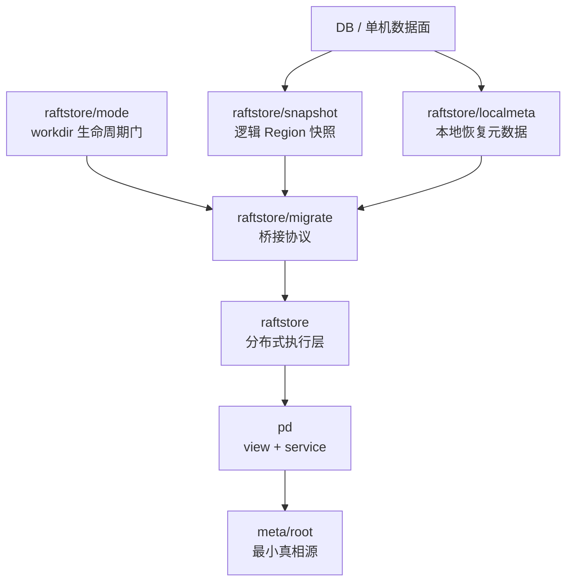
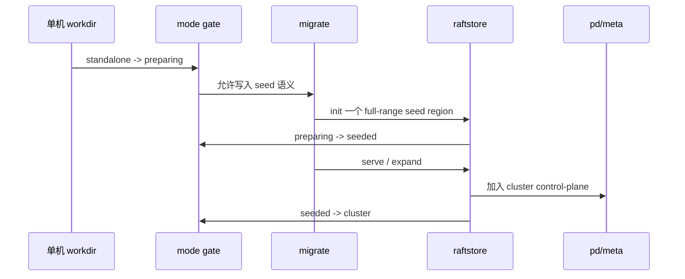

# 2026-03-30 从单机到分布式的桥接为什么是 NoKV 的主线能力

> 状态：当前设计已经落地，相关实现分散在 `DB`、`raftstore`、`migrate`、`pd` 与 `meta/root` 中。本文重点不是复述命令，而是解释为什么 NoKV 没有把“单机版”和“分布式版”做成两套系统。

## 导读

- 🧭 主题：单机 workdir 如何通过协议提升成分布式 store，而不是走 dump/import 外挂工具路线。
- 🧱 核心对象：`mode`、`snapshot`、`localmeta`、`seed region`。
- 🔁 调用链：`standalone -> preparing -> seeded -> cluster`。
- 📚 参考对象：range/shard 系统的身份提升、Delos/FDB 一类的小控制面骨架。

## 1. 为什么这件事重要

很多 KV 项目在早期会先把单机版做出来，等到需要分布式能力时，再额外补一套新的元数据、恢复、运维和数据导入逻辑。这样做短期上手快，但长期会带来三个问题：

1. 单机数据和分布式数据不是同一个世界，后续只能 dump/import。
2. 运维和恢复心智要分两套，项目复杂度成倍增长。
3. 很多设计在单机阶段看起来成立，进入分布式后全部重做。

NoKV 不希望走这条路。NoKV 的目标不是“先做一个单机 KV，再做一个分布式 KV”，而是：

> 同一套数据面先以单机形态运行，再通过协议和恢复层逐步提升为分布式形态。

## 2. 当前系统边界

当前相关实现主要分布在：

- `/Volumes/mac Ds - Data/WorkSpace/GitHub/NoKV/db.go`
- `/Volumes/mac Ds - Data/WorkSpace/GitHub/NoKV/raftstore/localmeta`
- `/Volumes/mac Ds - Data/WorkSpace/GitHub/NoKV/raftstore/snapshot`
- `/Volumes/mac Ds - Data/WorkSpace/GitHub/NoKV/raftstore/mode`
- `/Volumes/mac Ds - Data/WorkSpace/GitHub/NoKV/raftstore/migrate`
- `/Volumes/mac Ds - Data/WorkSpace/GitHub/NoKV/pd`
- `/Volumes/mac Ds - Data/WorkSpace/GitHub/NoKV/meta/root`

分层如下：

### 关键判断

1. `DB` 仍然是底层共享数据面，不是导出后再导入另一种格式。
2. `raftstore/localmeta` 只负责 store-local 恢复，不是 cluster authority。
3. `raftstore/snapshot` 是逻辑 region 快照，不等于 raft durable snapshot metadata。
4. `migrate` 是协议，不是脚本集合。

## 3. 如果不这样做，会发生什么

如果单机和分布式是两套系统，典型结果会是：

- 单机目录直接被视为“旧格式”，只能整体导出。
- 分布式 bootstrap 依赖外部工具，而不是系统自身的生命周期协议。
- 恢复、校验、观测、测试路径出现双轨制。
- 后面任何关于 snapshot、reshard、operator 的研究都要分别做两遍。

对于研究平台来说，这种分裂尤其糟糕。因为你无法回答一个最基本的问题：

> 你研究的是同一个系统的扩展，还是两套系统之间的迁移工具？

NoKV 现在的做法是明确回答前者。

## 4. 当前设计怎么把桥接做成协议

核心不是 CLI 名字，而是状态边界。

### 4.1 workdir mode 是正式协议

相关代码：

- `/Volumes/mac Ds - Data/WorkSpace/GitHub/NoKV/raftstore/mode`

当前生命周期至少包括：

- `standalone`
- `preparing`
- `seeded`
- `cluster`

这意味着：

- 一个 workdir 不再永远被假设成普通本地 DB。
- 一旦目录进入 `preparing/seeded/cluster`，普通单机打开路径就必须被 gate 住。
- 生命周期不再靠“运维同学记住别手抖”，而是靠库级约束。

### 4.2 snapshot 被分层，而不是一个模糊大概念

相关代码：

- `/Volumes/mac Ds - Data/WorkSpace/GitHub/NoKV/raftstore/engine/snapshot.go`
- `/Volumes/mac Ds - Data/WorkSpace/GitHub/NoKV/raftstore/snapshot`

当前有两层 snapshot：

1. raft durable metadata snapshot
2. region logical state snapshot

这条分层很重要，因为单机提升到分布式，真正需要提升的是：

- key range 对应的数据状态
- region identity
- peer identity
- local recovery metadata

而不是只搬一份 term/index/confstate。

### 4.3 migrate 是状态提升协议，不是命令拼接

相关代码：

- `/Volumes/mac Ds - Data/WorkSpace/GitHub/NoKV/raftstore/migrate/init.go`
- `/Volumes/mac Ds - Data/WorkSpace/GitHub/NoKV/raftstore/migrate/expand.go`

当前主线可以概括成：

这里真正值钱的是：

- state promotion 有明确边界
- snapshot 有明确边界
- 恢复和正常执行走同一套语义

## 5. 调用逻辑

### `migrate init`

目标：

- 给原 standalone workdir 写入 seed region 语义
- 让它不再只是“一个 DB 目录”

做的事情大致是：

1. 检查当前 mode 是否允许提升。
2. 为 workdir 生成初始 region / peer / localmeta。
3. 导出逻辑 region snapshot 或建立 seed state。
4. 把目录推进到 `seeded`。

### `serve`

目标：

- 让 seeded workdir 进入真正的 cluster 语义

做的事情大致是：

1. 启动 `raftstore`。
2. 恢复本地 `replicas.binpb` 和 `raft-progress.binpb`。
3. 向 `pd` / `meta/root` 注册 rooted truth。
4. 开始按 region/peer 身份参与执行面。

### `expand`

目标：

- 把 seed region 扩成 replicated region

做的事情大致是：

1. 生成新的 peer change / split / merge 目标。
2. 通过 `pd` proposal gate 进入 `meta/root`。
3. 由 `raftstore` 执行真正的 conf change / snapshot install。
4. terminal truth 回写 `meta/root`。

## 6. 设计理念

这条桥接路线背后的理念有三条：

### 6.1 不重复造两套数据面

单机和分布式共享底层 DB / LSM / WAL / VLog。

### 6.2 身份提升比数据搬运更重要

困难不在于“把字节拷过去”，而在于：

- 让原本匿名的本地状态变成带 region/peer 身份的状态
- 让它进入可恢复、可验证、可编排的 cluster 生命周期

### 6.3 迁移必须走协议

如果桥接只是一个脚本，后面所有关于：

- restore
- reshard
- operator runtime
- snapshot install
- failover

的研究都会变得含糊不清。

## 7. 参考对象

这一块没有直接照搬某一个系统，但思路上接近几类工业实践：

- TiKV / Cockroach 里关于 range/shard 身份与复制元数据分层的经验
- FoundationDB / Delos 一类系统里“让小而稳定的控制面成为系统骨架”的思路
- 数据库内核里“把生命周期写进协议而不是运维手册”的做法

## 8. 当前实现已经做到的

- workdir mode 已经进入正式实现
- localmeta 与 engine metadata 已明确分开
- region snapshot 已是单独层
- migration 主线已形成 protocol 化入口
- 后续 `pd` / `meta/root` 主线能直接承接这条桥

## 9. 还没做完的

- 更成熟的 migration observability
- 更系统的 operator runtime 编排
- 更完整的 snapshot install 与 reshard 联动
- 对超大数据量场景的性能与恢复策略

## 10. 总结

NoKV 这条“从单机到分布式”的桥接路线，真正值钱的不是多了几条 CLI，而是：

- 它没有把单机和分布式做成两套系统
- 它把 state promotion 写成了协议
- 它让后续关于 control-plane、operator、snapshot、调度的研究，都能建立在同一套系统之上

这比“再做一个分布式 KV 外壳”更重要，因为它决定了 NoKV 后面能不能持续演进，而不是每往前走一步都重造一层。
