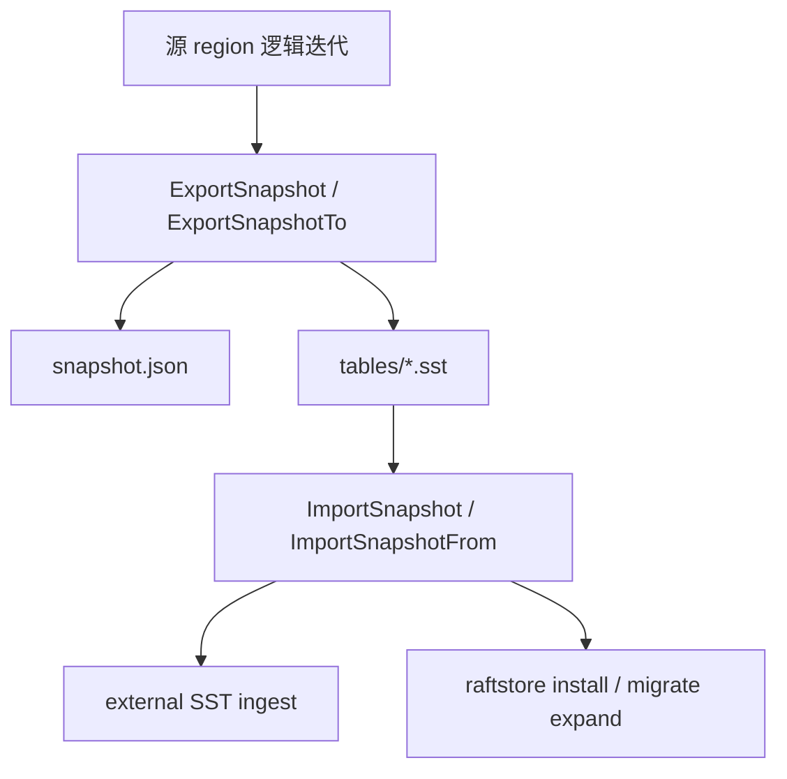
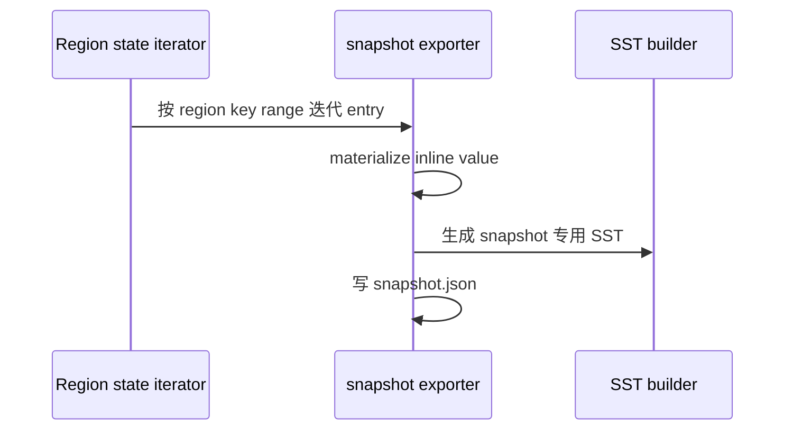
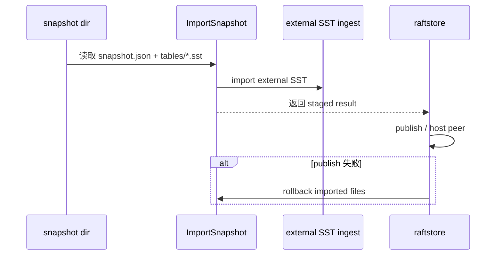

# 2026-03-31 基于 SST 的 Snapshot Install 设计与实现

> 状态：已在 migration 路径和内部 raft snapshot payload 路径中落地。本文重点解释为什么 NoKV 选择了“region-scoped、self-contained、与源端 vlog 独立”的 SST snapshot 方案。

## 导读

- 🧭 主题：为什么 NoKV 要把 snapshot install 做成 region-scoped、自描述、可回滚的 SST 协议。
- 🧱 核心对象：`snapshot.json`、`tables/*.sst`、external SST ingest、rollback。
- 🔁 调用链：`ExportSnapshot -> snapshot dir -> ImportSnapshot -> staged publish/rollback`。
- 📚 参考对象：LSM external ingest、工业分布式 KV 的 range snapshot install。

## 1. 为什么这件事重要

在 standalone 到 distributed 的桥接已经成立之后，真正的瓶颈不再是“流程怎么走”，而是：

> 数据怎么以更低写放大、更清楚恢复语义的方式搬过去。

第一阶段 correctness-first 的路径是对的：

- 逻辑 region snapshot
- 内存 payload
- 常规 write/apply 路径导入

但这条路径有明显代价：

- 全量逻辑重编码
- 大 snapshot 内存开销偏高
- 目标侧还要再走一遍常规 write path
- 写放大较大

所以需要升级 snapshot install 的数据搬运层。

## 2. 当前系统边界

相关代码：

- `raftstore/snapshot/meta.go`
- `raftstore/snapshot/dir.go`
- `raftstore/snapshot/payload.go`
- `raftstore/migrate/init.go`
- `raftstore/migrate/expand.go`
- `raftstore/store/peer_lifecycle.go`
- `lsm/external_sst.go`
- `db_snapshot.go`

分层如下：



## 3. 设计目标

这次设计不是重做 migration 主线，而是只替换“数据搬运层”。

保持不变的东西：

- standalone 提升成 full-range seed region
- `expand` 把 seed 扩成 replicated region
- install-before-publish 的生命周期边界

要改进的东西：

- snapshot 产物形式
- install 的写放大
- 大 snapshot 的内存占用

## 4. 我们最终采用的设计

### 4.1 region-scoped

snapshot 以 region key range 为边界，而不是以底层 LSM 文件边界为边界。

### 4.2 self-contained

导出的 snapshot 必须自描述：

- 自带 `snapshot.json`
- 自带 `tables/*.sst`
- 不依赖源端额外目录结构

### 4.3 与源端 vlog 独立

这里是最关键的一点。

因为 NoKV 使用 value separation，一部分 value 可能以 `ValuePtr` 形式留在 vlog 中。直接搬现有 SST 文件会遇到一个致命问题：

- 目标端导入后，SST 里的引用仍然可能指向源端 vlog

所以当前第一阶段方案明确要求：

> snapshot export 时把 value materialize 成 inline user bytes。

这样目标端不需要继续理解源端 vlog 布局。

## 5. 为什么一些更简单的方案是错的

### 5.1 直接复用现有 SST 文件

这条路看起来最省事，但对第一阶段是错的。原因：

- 现有 SST 边界未必和 region 边界一致
- 现有 SST 可能仍然依赖源端 vlog
- 会把 compaction 历史反向泄露给 snapshot 协议

### 5.2 把源端 vlog 一起打包

这条路理论上可行，但第一阶段不值得。

因为这样 install 协议会立刻变成：

- SST 文件
- vlog segments
- vlog head / manifest 语义
- 跨层 rollback

复杂度上升太快。

### 5.3 把 split / reshard 和 snapshot redesign 一起做

这也不适合第一阶段。当前正确的顺序应该是：

1. 先把 snapshot install 这条数据搬运链做干净
2. 再讨论更复杂的 reshard/reshaping 联动

## 6. Snapshot 目录长什么样

当前目录形态：

```text
snapshot/
  snapshot.json
  tables/
    000001.sst
    000002.sst
    ...
```

其中：

- `snapshot.json`
  - region-scoped manifest
  - 记录版本、region、entry_count、table_count、size、created_at 等信息
- `tables/*.sst`
  - snapshot 专用 SST payload

这个 manifest 不是用来替代 LSM 的 `MANIFEST`，而是为了明确表达：

> 这是一个 region-scoped snapshot contract。

## 7. 导出与安装调用逻辑

### 7.1 导出



### 7.2 安装



## 8. 为什么 `ImportSnapshot(...)` 返回富结果

这是当前设计里一个经常被忽略、但非常重要的点。

`ImportSnapshot(...)` 返回的不是“一个 region meta”，而是 staged result。因为高层 install 必须处理这条生命周期：

1. 导入 SST
2. 尝试 publish / host peer
3. 如果高层 publish 失败，需要 rollback 已导入文件

所以 import 结果必须至少携带：

- 导入后的 region/meta
- 已导入 file id
- rollback 能力

这样高层 install 才能保持 snapshot 语义，同时仍然拥有正确的失败回滚路径。

## 9. 设计理念

### 9.1 Snapshot 协议要面向 region，不要面向 LSM 现状

### 9.2 第一阶段先保证 self-contained，再追求更激进的零拷贝

### 9.3 安装失败必须能 rollback，不能让 ingest 成为单向脏写

## 10. 参考对象

这里借鉴的是几类成熟思路：

- LSM 系统里的 external SST ingest
- 分布式 KV 里的 region/range snapshot install
- 工业系统中对 rollback 和 staged publish 的严格要求

NoKV 当前没有照搬某个现成实现，而是把这些思路收进了自己现有的 migration 和 snapshot 分层中。

## 11. 当前已经做到的

- region-scoped snapshot 目录已经成立
- external SST ingest primitive 已存在
- snapshot install 已接入 migration / raftstore 主线
- rollback 语义已经进入接口设计

## 12. 后续还值得继续做的

- 针对超大 snapshot 的 streaming / chunking
- 更系统的 install 观测和性能基准
- 是否要研究更强的 vlog-aware snapshot 优化

## 13. 总结

NoKV 当前的 SST snapshot install 设计，本质上不是“把现有 SST 拿来搬一搬”，而是：

- 以 region 语义为中心
- 导出 self-contained snapshot
- 保持与源端 vlog 解耦
- 把 install 和 rollback 做成正式协议

这条线让 migration 和 snapshot install 继续保持干净，也为后面做更高性能的 snapshot 路线留出了空间。
