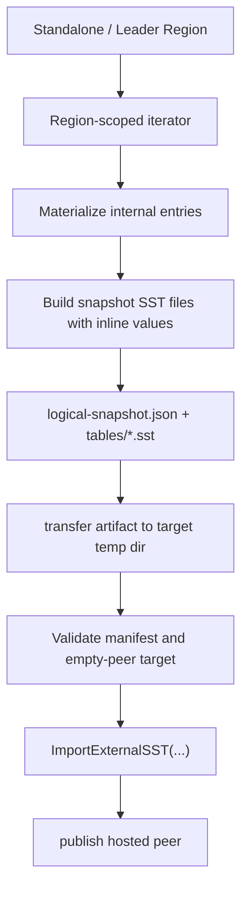

# SST Snapshot Install for Migration

## Why this matters

NoKV already has a correct standalone-to-cluster promotion path:

- `plan`
- `init`
- `serve`
- `expand`
- `transfer-leader`
- `remove-peer`

That path is now documented, checkpointed, resumable, and validated. The next bottleneck is no longer workflow shape. It is data movement.

The original region bootstrap/install path was intentionally correctness-first:

- `init` exported a region snapshot artifact into the local seed directory
- `expand` exported an in-memory snapshot payload
- the target imported detached entries through the regular write/apply path

That was the right first implementation. It kept lifecycle semantics clear and made recovery easy to reason about. It is no longer the final install pipeline.

For larger regions, the current path pays for:

- full logical re-encoding
- larger in-memory payloads
- target-side replay through the regular write path
- avoidable write amplification

The next stage should upgrade the artifact and install pipeline without rewriting the migration story.

## Current boundary

### What exists today

The current implementation is split across:

- `/Volumes/mac Ds - Data/WorkSpace/GitHub/NoKV/raftstore/snapshot/snapshot_sst.go`
- `/Volumes/mac Ds - Data/WorkSpace/GitHub/NoKV/raftstore/migrate/init.go`
- `/Volumes/mac Ds - Data/WorkSpace/GitHub/NoKV/raftstore/migrate/expand.go`
- `/Volumes/mac Ds - Data/WorkSpace/GitHub/NoKV/raftstore/store/peer_lifecycle.go`

The important properties are:

1. snapshot export is region-scoped
2. target install happens before peer publish
3. install currently assumes an empty peer target
4. checkpoint/report/failpoint coverage already exists around publish/install boundaries

That means the lifecycle contract is already good. The data artifact is what needs to change.

### What the storage layer already gives us

NoKV already has LSM ingest support:

- `/Volumes/mac Ds - Data/WorkSpace/GitHub/NoKV/lsm/lsm.go:632`
- `/Volumes/mac Ds - Data/WorkSpace/GitHub/NoKV/lsm/levels.go:467`

`ImportExternalSST(paths []string)` already handles:

- input validation
- key-range overlap checks between imported SSTs
- overlap checks against existing L0
- manifest logging
- rollback on failure

This is valuable, but it is only the ingest primitive. It does not define a migration artifact.

### The constraint that makes this non-trivial

NoKV uses value separation.

Relevant code:

- `/Volumes/mac Ds - Data/WorkSpace/GitHub/NoKV/kv/value.go`
- `/Volumes/mac Ds - Data/WorkSpace/GitHub/NoKV/db.go`
- `/Volumes/mac Ds - Data/WorkSpace/GitHub/NoKV/vlog.go`

Large values can be stored as `ValuePtr`, not inline user bytes. So “copy SSTs and ingest them” is not automatically correct. The imported table may still point at source-side vlog segments.

That is the main design constraint.

## The design we should choose

### Design goal

Keep the migration semantics exactly where they are today:

- promote one standalone workdir into one full-range seed region
- expand that seed into more peers
- keep publish/install boundaries unchanged

Only replace the data movement pipeline.

### The key decision

The first SST-based migration artifact should be:

> **region-scoped, self-contained, and independent from source-side vlog files**

That means the snapshot SST export should materialize values inline inside the exported snapshot tables, even if the source DB currently stores some values behind `ValuePtr`.

This avoids dragging value-log replication into phase one.

## What looked easy but is wrong

### Wrong approach 1: reuse existing on-disk SST files directly

This is attractive but wrong for migration phase one.

Problems:

1. Existing SSTs are LSM/layout artifacts, not region snapshot artifacts.
2. Existing SST boundaries do not necessarily align with the migration artifact boundary.
3. Existing SST entries may still reference source-side vlog segments.
4. Reusing existing SSTs couples migration to compaction history instead of region truth.

This would make the snapshot protocol leak storage-layout internals that do not belong in the migration contract.

### Wrong approach 2: ship source vlog segments together with SSTs

This is also too heavy for phase one.

Problems:

1. The install artifact becomes cross-layer: SST files + vlog segments + head metadata.
2. Import/recovery must now reason about both manifest edits and vlog ownership.
3. Target-side cleanup/rollback gets much harder.
4. The snapshot artifact stops being region-scoped in a clean way.

This may become interesting later for very large values, but it is the wrong first step.

### Wrong approach 3: solve split and SST install together

Current migration intentionally promotes one full-range region first.

Pulling split/re-shard into the same effort would mix:

- artifact redesign
- install semantics
- region-layout evolution

That is too much surface area for one iteration.

## Proposed artifact

### Artifact shape

Phase-one SST snapshot artifact:

```text
snapshot/
  logical-snapshot.json
  tables/
    000001.sst
    000002.sst
    ...
```

### Manifest fields

The SST manifest should carry at least:

- `format_version`
- `artifact_kind = "sst-inline-snapshot"`
- `region`
- `entry_count`
- `table_count`
- `inline_values = true`
- `payload_bytes`
- per-table:
  - relative path
  - smallest key
  - largest key
  - crc/checksum
  - size bytes
- `created_at`

This keeps the region contract explicit and makes target-side validation deterministic.

## Export pipeline

### Source of truth

Export should still be driven by region-scoped logical iteration, not by existing SST file discovery.

That means:

1. iterate internal entries in region bounds
2. materialize each entry through the current snapshot source path
3. ensure exported entries are inline-value entries
4. write snapshot-specific SST files

This preserves the current semantic boundary while changing the artifact from `entries.bin` to `tables/*.sst`.

### Required implementation seam

We should not expose raw `tableBuilder` as a public migration API.

Instead, add a narrow snapshot-side builder helper under one of:

- `/Volumes/mac Ds - Data/WorkSpace/GitHub/NoKV/raftstore/snapshot`
- or a small export helper in `/Volumes/mac Ds - Data/WorkSpace/GitHub/NoKV/lsm`

The helper should do only this:

- take materialized internal entries
- build one or more external SST files
- return manifest metadata

It should not become a second generic ingestion framework.

## Install pipeline

### Target-side contract

Keep the current contract:

- install only into an empty peer target
- validate before publish
- publish only after local data install succeeds

### Install steps

1. validate manifest
2. validate peer target is empty and region metadata matches
3. ingest SST files via `ImportExternalSST`
4. persist any local metadata required to treat install as durable
5. only then publish/host the peer

The existing boundary failpoint still matters:

- `/Volumes/mac Ds - Data/WorkSpace/GitHub/NoKV/raftstore/store/peer_lifecycle.go`
- `AfterSnapshotApplyBeforePublish`

The point of phase one is to preserve this install/publish boundary, not remove it.

## Transport shape

### `init`

For local standalone-to-seed promotion:

- export directly into the seed snapshot artifact directory in the same workdir

No network transport change is needed.

### `expand`

For seed-to-target install:

Do not start with a giant single-byte payload again.

Phase one should move to file-oriented transfer semantics:

- export artifact directory on leader
- transfer file chunks or file stream RPCs
- reconstruct temp artifact on target
- ingest from reconstructed files

The leader RPC interface can still be admin-driven, but the artifact should no longer be represented as one monolithic detached-entry blob.

## The value-log decision

### Strong recommendation

Phase-one SST snapshot export should force inline values in the exported SST artifact.

That means:

- snapshot export materializes `ValuePtr` payloads back into value bytes
- exported snapshot SSTs contain no source-side vlog dependency

### Why this is the right first step

1. The artifact becomes self-contained.
2. Install can reuse existing LSM ingest without also rebuilding vlog ownership.
3. Recovery remains much easier to reason about.
4. The migration contract stays region-scoped and portable.

### Cost

This does mean the artifact is not “copy existing SST files verbatim”.

That is acceptable. The goal is faster install and lower target-side write amplification, not absolute zero-copy on day one.

## Phased rollout

### Phase 1

Implement SST snapshot export/import for:

- full-range seed promotion
- add-peer install

Keep:

- current migration CLI
- current status/report/checkpoint model
- current publish/install lifecycle
- current empty-target requirement

### Phase 2

Add file streaming and chunked transfer polish:

- per-file progress
- checksums during transfer
- artifact cleanup on failure

### Phase 3

Only after phase one is stable, evaluate:

- partial inline / vlog-aware artifacts
- larger region artifact tuning
- split-aware snapshot/export

## Testing plan

### Unit tests

1. export SST snapshot manifest round-trip
2. exported tables contain only keys in region range
3. exported snapshot tables contain no `ValuePtr`
4. target ingest installs all data correctly
5. manifest/table checksum failure is detected

### Integration tests

1. seed promotion with low `ValueThreshold` still restores values correctly after SST export/import
2. add-peer install with low `ValueThreshold` works with SST snapshot artifact
3. restart after ingest-before-publish behaves correctly
4. failpoint before publish still leaves target unpublished

### Recovery tests

1. crash after artifact transfer but before ingest
2. crash after ingest but before publish
3. repeated install attempt is safe or rejected clearly

## Code path sketch



## Non-goals for this stage

- zero-downtime online migration
- dual-write cutover
- split/re-shard during migration
- direct reuse of arbitrary existing SST layout
- source vlog segment shipping

## What this changes

If implemented this way, NoKV keeps the current migration story intact while upgrading the expensive part:

- logical region truth stays the source contract
- install becomes file-oriented instead of entry-replay-oriented
- target write amplification goes down
- the artifact becomes more industrial without dragging split or vlog orchestration into the first SST phase

## What remains unsolved

- whether a later phase should support vlog-aware artifact modes
- whether the admin API should stream files or expose artifact pull endpoints
- how much reusable builder surface should be exposed from the LSM layer
- when it is worth introducing split-aware migration artifacts
