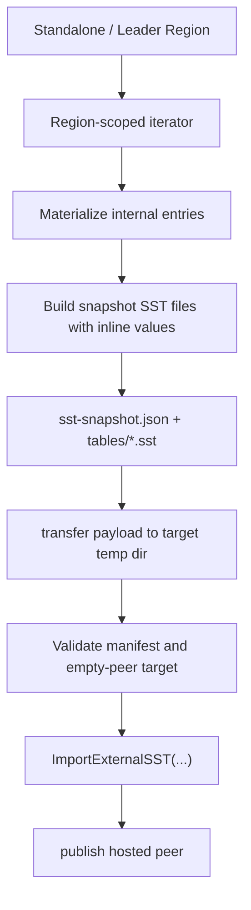

# SST Snapshot Install for Migration

This note tracks the design and implementation behind GitHub issue `#28`:
`[Feature Request] Implement SSTable-based Snapshot Install for RaftStore`.

> Status: implemented in the migration path and the internal raft snapshot payload path.

## Why this matters

NoKV already has a correct standalone-to-cluster promotion path:

- `plan`
- `init`
- `serve`
- `expand`
- `transfer-leader`
- `remove-peer`

That path is now documented, checkpointed, resumable, and validated. The next bottleneck is no longer workflow shape. It is data movement.

The original region bootstrap/install path was intentionally correctness-first:

- `init` exported a region snapshot into the local seed directory
- `expand` exported an in-memory snapshot payload
- the target imported detached entries through the regular write/apply path

That was the right first implementation. It kept lifecycle semantics clear and made recovery easy to reason about. It is no longer the final install pipeline.

For larger regions, the current path pays for:

- full logical re-encoding
- larger in-memory payloads
- target-side replay through the regular write path
- avoidable write amplification

That upgrade has now been implemented without rewriting the migration story.

## Current boundary

### What exists today

The current implementation is split across:

- `raftstore/snapshot/sst_meta.go`
- `raftstore/snapshot/sst_files.go`
- `raftstore/snapshot/sst_payload.go`
- `raftstore/migrate/init.go`
- `raftstore/migrate/expand.go`
- `raftstore/store/peer_lifecycle.go`
- `lsm/external_sst.go`
- `db_external_sst.go`

The raftstore wiring now talks to a narrow snapshot bridge:

- `ExportSnapshot(...)`
- `InstallSnapshot(...)`

That bridge keeps peer/admin wiring at the region-snapshot level while the LSM
layer continues to own raw `ExportExternalSST(...)`,
`ImportExternalSST(...)`, and `RollbackExternalSST(...)`.

The important properties are:

1. snapshot export is region-scoped
2. target install happens before peer publish
3. install currently assumes an empty peer target
4. checkpoint/report/failpoint coverage already exists around publish/install boundaries
5. publish-before-complete failures roll back imported external SST files

That means the lifecycle contract survived the transport change. The data movement path is now SST-based.

### What the storage layer already gives us

NoKV already has LSM ingest support:

- `lsm/external_sst.go`

`ExportExternalSST(...)`, `ImportExternalSST(...)`, and `RollbackExternalSST(...)` now handle:

- snapshot SST generation from materialized entries
- input validation
- key-range overlap checks between imported SSTs
- overlap checks against existing L0
- LSM manifest logging
- rollback on failure

This is the storage primitive under the higher-level snapshot path. It is not the migration workflow by itself.

### The constraint that makes this non-trivial

NoKV uses value separation.

Relevant code:

- `kv/value.go`
- `db.go`
- `vlog.go`

Large values can be stored as `ValuePtr`, not inline user bytes. So “copy SSTs and ingest them” is not automatically correct. The imported table may still point at source-side vlog segments.

That is the main design constraint.

## The design we chose

### Design goal

Keep the migration semantics exactly where they are today:

- promote one standalone workdir into one full-range seed region
- expand that seed into more peers
- keep publish/install boundaries unchanged

Only replace the data movement pipeline.

### The key decision

The first SST-based migration snapshot should be:

> **region-scoped, self-contained, and independent from source-side vlog files**

The implemented snapshot SST export materializes values inline inside the exported snapshot tables, even if the source DB currently stores some values behind `ValuePtr`.

This avoids dragging value-log replication into phase one.

## What looked easy but is wrong

### Wrong approach 1: reuse existing on-disk SST files directly

This is attractive but wrong for migration phase one.

Problems:

1. Existing SSTs are LSM/layout artifacts, not region snapshot artifacts.
2. Existing SST boundaries do not necessarily align with the region snapshot boundary.
3. Existing SST entries may still reference source-side vlog segments.
4. Reusing existing SSTs couples migration to compaction history instead of region truth.

This would make the snapshot protocol leak storage-layout internals that do not belong in the migration contract.

### Wrong approach 2: ship source vlog segments together with SSTs

This is also too heavy for phase one.

Problems:

1. The install snapshot becomes cross-layer: SST files + vlog segments + head metadata.
2. Import/recovery must now reason about both manifest edits and vlog ownership.
3. Target-side cleanup/rollback gets much harder.
4. The snapshot stops being region-scoped in a clean way.

This may become interesting later for very large values, but it is the wrong first step.

### Wrong approach 3: solve split and SST install together

Current migration intentionally promotes one full-range region first.

Pulling split/re-shard into the same effort would mix:

- snapshot redesign
- install semantics
- region-layout evolution

That is too much surface area for one iteration.

## Snapshot Layout

### Artifact shape

The current SST snapshot directory looks like:

```text
snapshot/
  sst-snapshot.json
  tables/
    000001.sst
    000002.sst
    ...
```

### Manifest fields

The SST snapshot meta carries:

- `version`
- `region`
- `entry_count`
- `table_count`
- `inline_values = true`
- aggregate `size_bytes`
- aggregate `value_bytes`
- per-table:
  - relative path
  - smallest key
  - largest key
  - entry count
  - size bytes
  - value bytes
- `created_at`

This keeps the region contract explicit and makes target-side validation deterministic without overloading the LSM `MANIFEST` meaning.

## Export pipeline

### Source of truth

Export should still be driven by region-scoped logical iteration, not by existing SST file discovery.

That means:

1. iterate internal entries in region bounds
2. materialize each entry through the current snapshot source path
3. ensure exported entries are inline-value entries
4. write snapshot-specific SST files

This preserves the current semantic boundary while changing the snapshot payload from `entries.bin` to `tables/*.sst`.

### Implementation seam

We do not expose raw `tableBuilder` as a public migration API.

Instead the code is split across:

- `lsm/external_sst.go`
- `raftstore/snapshot/sst_files.go`
- `raftstore/snapshot/sst_payload.go`

The narrow seam does only this:

- take materialized internal entries
- build one or more external SST files
- return manifest metadata

It does not become a second generic ingestion framework.

## Install pipeline

### Target-side contract

Keep the current contract:

- install only into an empty peer target
- validate before publish
- publish only after local data install succeeds

### Install steps

1. validate manifest
2. validate peer target is empty and region metadata matches
3. ingest SST files via `ImportExternalSST`
4. persist any local metadata required to treat install as durable
5. only then publish/host the peer

The existing boundary failpoint still matters:

- `raftstore/store/peer_lifecycle.go`
- `AfterSnapshotApplyBeforePublish`

The point of the implementation is to preserve this install/publish boundary, not remove it.

## Transport shape

### `init`

For local standalone-to-seed promotion:

- export directly into the seed snapshot directory in the same workdir

No network transport change is needed.

### `expand`

For seed-to-target install, the current implementation keeps a transport payload for simplicity, but the payload now contains SST snapshot files instead of detached logical entries.

## The value-log decision

### What the implementation does

The SST snapshot export forces inline values in the exported SST files.

That means:

- snapshot export materializes `ValuePtr` payloads back into value bytes
- exported snapshot SSTs contain no source-side vlog dependency

### Why this was the right first step

1. The snapshot becomes self-contained.
2. Install can reuse existing LSM ingest without also rebuilding vlog ownership.
3. Recovery remains much easier to reason about.
4. The migration contract stays region-scoped and portable.

### Cost

This does mean the snapshot is not “copy existing SST files verbatim”.

That is acceptable. The goal is faster install and lower target-side write amplification, not absolute zero-copy on day one.

## What landed

The implementation now covers:

- full-range seed promotion through SST snapshot files
- `migrate expand` through SST payload install
- internal raft peer snapshot payload export/apply through SST
- rollback of imported SST files when install succeeds but publish fails
- restart and interruption coverage in the integration suite

## Testing plan

### Current tests

1. SST meta round-trip and payload decode checks
2. exported tables contain only keys in region range
3. exported snapshot tables contain no `ValuePtr`
4. target import installs all data correctly
5. payloads missing meta or table files are rejected

### Integration tests

1. seed promotion with low `ValueThreshold` still restores values correctly after SST export/import
2. add-peer install with low `ValueThreshold` works with SST snapshot payloads
3. restart after ingest-before-publish behaves correctly
4. failpoint before publish still leaves target unpublished and retries cleanly

### Recovery tests

1. crash after snapshot payload transfer but before ingest
2. crash after ingest but before publish
3. repeated install attempt is safe or rejected clearly

## Code path sketch



## Non-goals for this stage

- zero-downtime online migration
- dual-write cutover
- split/re-shard during migration
- direct reuse of arbitrary existing SST layout
- source vlog segment shipping

## What this changed

NoKV now keeps the migration story intact while upgrading the expensive part:

- logical region truth stays the source contract
- install becomes file-oriented instead of entry-replay-oriented
- target write amplification goes down
- the snapshot path becomes more industrial without dragging split or vlog orchestration into the first SST phase

## What remains unsolved

- whether a later phase should support vlog-aware snapshot modes
- whether the admin API should stream files or expose file pull endpoints
- how much reusable builder surface should be exposed from the LSM layer
- when it is worth introducing split-aware migration snapshots
