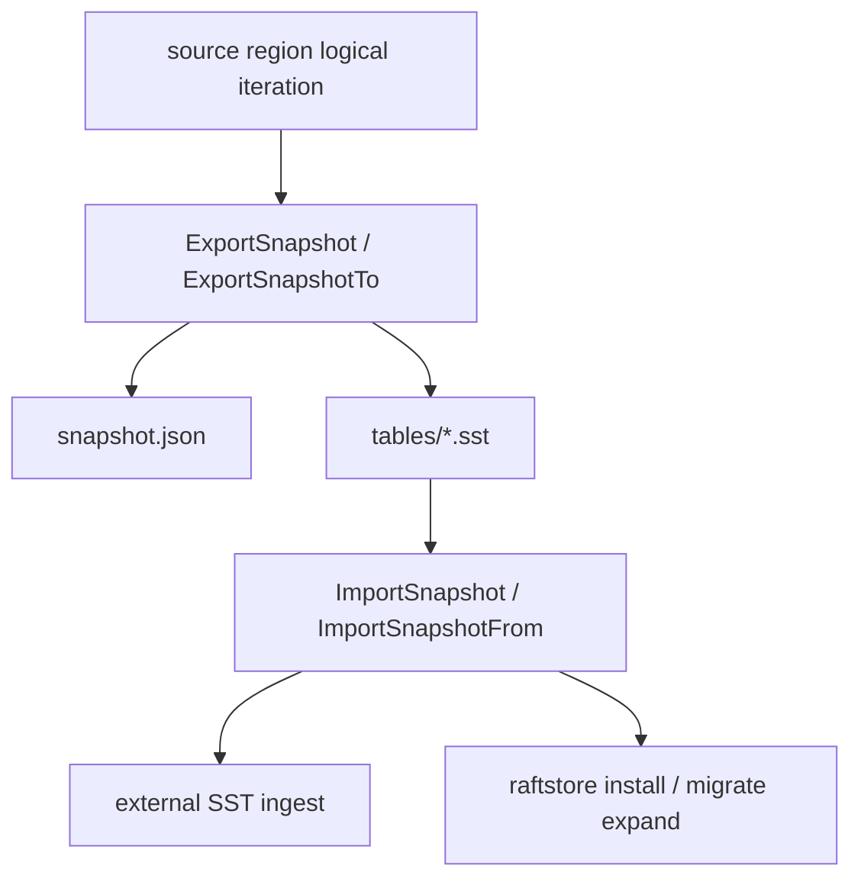
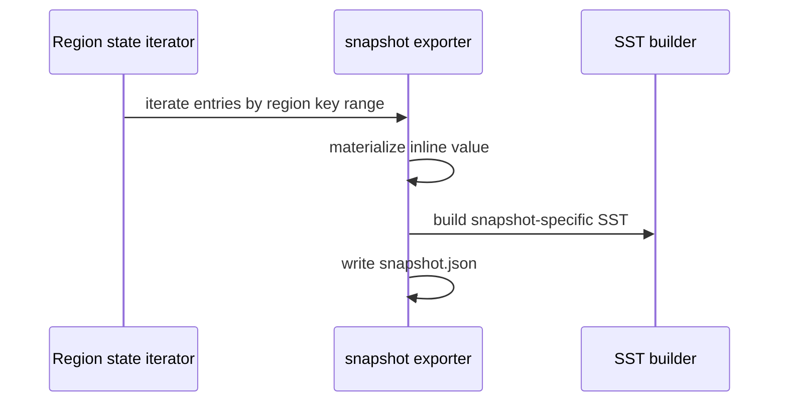
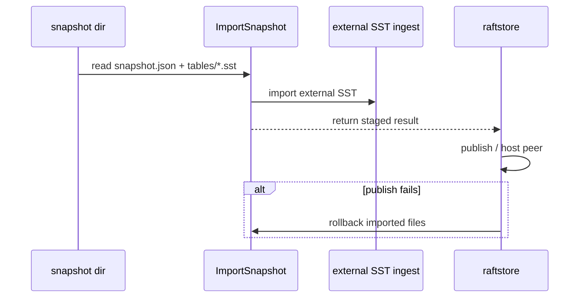

# 2026-03-31 SST-based snapshot install design and implementation

> Status: shipped on the migration path and the internal raft snapshot payload path. This note explains why NoKV picked the "region-scoped, self-contained, source-vlog-independent" SST snapshot scheme.

## TL;DR

- 🧭 Topic: why NoKV builds snapshot install as a region-scoped, self-describing, rollback-capable SST protocol.
- 🧱 Core objects: `snapshot.json`, `tables/*.sst`, external SST ingest, rollback.
- 🔁 Call chain: `ExportSnapshot -> snapshot dir -> ImportSnapshot -> staged publish/rollback`.
- 📚 Reference: LSM external ingest, range snapshot install in industrial distributed KVs.

## 1. Why this matters

Once the standalone-to-distributed bridge is in place, the real bottleneck stops being "what's the flow" and becomes:

> How to move data with lower write amplification and clearer recovery semantics.

The first stage's correctness-first path was right:

- Logical region snapshot
- In-memory payload
- Import via the regular write/apply path

But that path has obvious cost:

- Full logical re-encoding
- High memory cost for big snapshots
- The destination still has to walk the regular write path
- Considerable write amplification

So the data-transport layer of snapshot install needs an upgrade.

## 2. Current system boundary

Relevant code:

- `raftstore/snapshot/meta.go`
- `raftstore/snapshot/dir.go`
- `raftstore/snapshot/payload.go`
- `raftstore/migrate/init.go`
- `raftstore/migrate/expand.go`
- `raftstore/store/peer_lifecycle.go`
- `lsm/external_sst.go`
- `db_snapshot.go`

Layering:



## 3. Design goals

This work is not a redesign of the migration trunk — it only replaces the data-transport layer.

What stays the same:

- Standalone is promoted into a full-range seed region.
- `expand` grows the seed into a replicated region.
- Install-before-publish lifecycle boundary.

What we want to improve:

- Snapshot artifact format
- Install write amplification
- Memory footprint for large snapshots

## 4. The design we ended up with

### 4.1 region-scoped

Snapshot boundaries are region key ranges, not the underlying LSM file boundaries.

### 4.2 self-contained

The exported snapshot must be self-describing:

- Carries its own `snapshot.json`
- Carries its own `tables/*.sst`
- Doesn't depend on extra source-side directory structure

### 4.3 independent of source-side vlog

This is the most important point.

NoKV uses value separation, so some values may live in vlog as `ValuePtr`. Carrying existing SST files directly hits a fatal issue:

- After import on the destination, references inside the SST may still point at the source's vlog.

So the first-stage scheme explicitly mandates:

> When exporting a snapshot, materialize values into inline user bytes.

This way the destination doesn't need to understand the source's vlog layout.

## 5. Why simpler-looking alternatives are wrong

### 5.1 Reuse existing SST files directly

Looks easiest, but wrong for stage 1. Reasons:

- Existing SST boundaries don't necessarily match region boundaries.
- Existing SSTs may still depend on the source vlog.
- It leaks compaction history backwards into the snapshot protocol.

### 5.2 Bundle the source vlog along with the snapshot

Theoretically feasible, but not worth it for stage 1.

The install protocol immediately balloons into:

- SST files
- vlog segments
- vlog head / manifest semantics
- Cross-layer rollback

Complexity grows too fast.

### 5.3 Combine split / reshard with snapshot redesign

Also wrong order for stage 1. The right sequence is:

1. First clean up the snapshot install data-transport chain.
2. Then discuss more complex reshard/reshaping linkage.

## 6. What the snapshot directory looks like

Current layout:

```text
snapshot/
  snapshot.json
  tables/
    000001.sst
    000002.sst
    ...
```

Where:

- `snapshot.json`
  - region-scoped manifest
  - records version, region, entry_count, table_count, size, created_at
- `tables/*.sst`
  - snapshot-specific SST payload

This manifest is not a replacement for the LSM `MANIFEST` — it explicitly states:

> "This is a region-scoped snapshot contract."

## 7. Export and install call flow

### 7.1 Export



### 7.2 Install



## 8. Why `ImportSnapshot(...)` returns a rich result

This is an often-overlooked but very important detail.

`ImportSnapshot(...)` returns not "one region meta" but a staged result. Because the high-level install must handle the lifecycle:

1. Import SST
2. Attempt publish / host peer
3. If high-level publish fails, rollback imported files

So the import result must carry at least:

- The imported region/meta
- The list of imported file IDs
- Rollback capability

Only then can the high-level install preserve snapshot semantics while keeping a correct failure-rollback path.

## 9. Design philosophy

### 9.1 Snapshot protocol must be region-shaped, not LSM-state-shaped

### 9.2 First stage prefers self-contained over aggressive zero-copy

### 9.3 Install failure must roll back — ingest must not become a one-way dirty write

## 10. Reference patterns

Borrows from several mature ideas:

- External SST ingest in LSM systems
- Region/range snapshot install in distributed KVs
- Strict rollback and staged publish requirements in industrial systems

NoKV doesn't copy any one implementation — these ideas are folded into the existing migration and snapshot layering.

## 11. What's already in place

- region-scoped snapshot directory exists
- external SST ingest primitive exists
- snapshot install is wired into migration / raftstore trunk
- rollback semantics are part of the interface design

## 12. Worth doing later

- Streaming / chunking for very large snapshots
- More systematic install observability and perf benchmarks
- Whether to research stronger vlog-aware snapshot optimization

## 13. Summary

NoKV's current SST snapshot install isn't "haul the existing SSTs over." It's:

- Region-shaped semantics at the center
- Export self-contained snapshots
- Stay decoupled from source vlog
- Install + rollback as a formal protocol

This keeps migration and snapshot install clean, and leaves room for higher-performance snapshot routes later.
