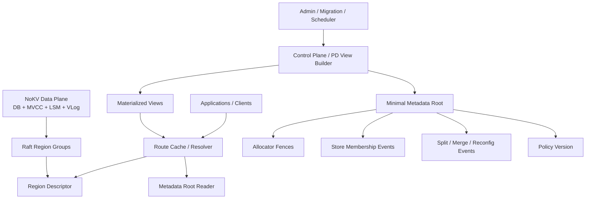
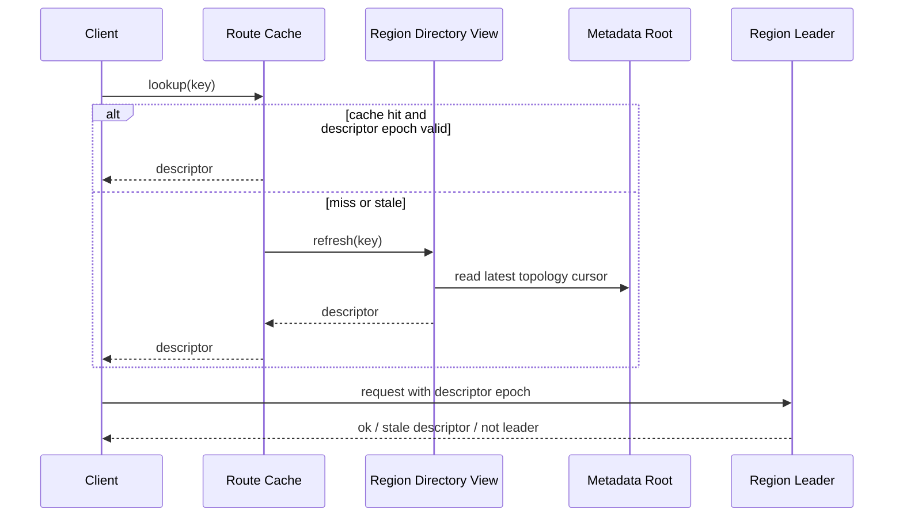
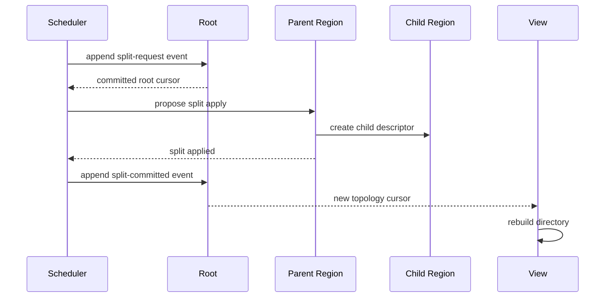
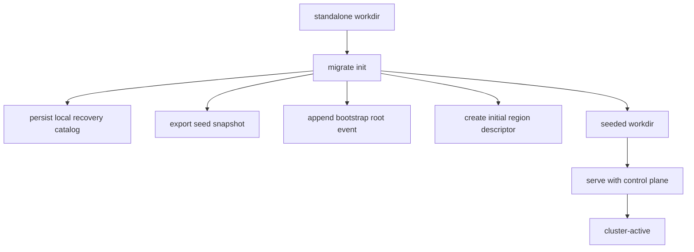

# Minimal Metadata Root and Self-Describing Regions

> Status: proposed architecture for the next distributed-control-plane phase.

## Why this matters

NoKV already has a serious standalone data plane and a defensible
standalone-to-cluster promotion path:

- one storage core
- one snapshot/install pipeline
- one migration workflow

That is the right foundation.

The next architectural question is not “how to add more migration commands”.
It is:

> how to manage distributed metadata without turning PD into a second large
> database that itself needs another control plane behind it.

The wrong answer is to keep adding more cluster truth into local JSON files.
The also-wrong answer is to build a full TiKV-style PD clone before the rest of
NoKV needs it.

This note proposes a different direction:

> keep a very small globally replicated metadata root, move more truth into
> region descriptors owned by the data plane, and treat PD/control-plane state
> as a rebuildable view instead of the only metadata authority.

## Current system boundary

Today the relevant layers are already mostly separated:

- raw SST primitives:
  - `lsm/external_sst.go`
- region snapshot format:
  - `raftstore/snapshot/meta.go`
  - `raftstore/snapshot/dir.go`
  - `raftstore/snapshot/payload.go`
- DB snapshot bridge:
  - `db_snapshot.go`
- distributed orchestration:
  - `raftstore/admin/service.go`
  - `raftstore/migrate/init.go`
  - `raftstore/migrate/expand.go`
  - `raftstore/store/peer_lifecycle.go`

The current weak spot is not the snapshot pipeline. It is metadata ownership.

Today NoKV still has prototype-style local state stores:

- store-local recovery state:
  - `raftstore/localmeta/store.go`
- PD-lite local state:
  - `pd/storage/local.go`

Both are file-backed JSON state stores. That is acceptable for the current
prototype, but it is not the long-term distributed metadata architecture.

## What looked easy but is wrong

### Wrong approach 1: make PD the permanent owner of all metadata

This would converge on a familiar but heavy design:

- PD stores a full mutable region map
- PD stores store descriptors
- PD stores allocator state
- PD becomes the only metadata authority

That works, but it pushes NoKV toward “another PD clone”, not toward a
distinguishable architecture.

### Wrong approach 2: keep metadata in local JSON files and sync informally

This is not acceptable once NoKV wants real distributed correctness.

Local files are fine for:

- recovery hints
- mode markers
- migration checkpoints

They are not fine for:

- cluster-wide range ownership truth
- allocator fencing
- reconfiguration ordering

### Wrong approach 3: remove any globally replicated metadata root

There is no free lunch here. Strongly consistent distributed metadata always
needs a root of trust somewhere.

The real design question is:

> how small can that root be?

## The design we chose

The proposal is:

> **minimal metadata root + event log + self-describing region descriptors +
> rebuildable control-plane views**

That means NoKV should no longer aim for:

- “PD owns one big metadata table”

Instead it should aim for:

1. a very small globally replicated root
2. region-owned descriptors that carry more local truth
3. control-plane views that can be dropped and rebuilt

## Target architecture



## Core principles

### 1. The data plane stays the data plane

The storage core remains:

- `db.go`
- `lsm/*`
- `vlog/*`
- MVCC / Percolator layers

Distributed evolution must continue to reuse this truth instead of creating a
second storage truth in the control plane.

### 2. Region descriptors carry local truth

A region should not rely on PD to tell the world everything about it on every
operation.

Each region descriptor should carry:

- `region_id`
- `start_key`
- `end_key`
- `epoch`
- `peers`
- `state`
- `lineage`
- `descriptor_hash`

The descriptor should be owned by the region lifecycle, not by a control-plane
table row.

### 3. The metadata root only orders and fences

The globally replicated root should only store what truly requires global
serialization:

- topology epoch
- allocator fences
- store membership events
- split events
- merge events
- peer add/remove events
- placement policy version

It should **not** store the full runtime metadata view for every region.

### 4. Views are disposable

The scheduler and route resolver can maintain:

- region directory caches
- store load views
- placement views

But these views are rebuildable. They are not the only source of truth.

## Proposed modules

Before defining packages, the terminology itself must become precise.

Today the codebase still uses the word `meta` for several different kinds of
state:

- local recovery state
- snapshot manifest state
- PD control-plane state
- region topology state

That is acceptable during prototyping, but it is not good enough for the next
phase. The design needs names that lock the boundaries in place.

## Naming rules

The following terms should be reserved:

### `RegionDescriptor`

Use this name for globally meaningful region topology state:

- range ownership
- epoch
- peer membership
- lineage
- descriptor hash

This replaces the vague use of `RegionMeta` when the meaning is really “the
distributed descriptor of a range”.

### `ReplicaLocalState`

Use this name for one store's local recovery state for one hosted replica:

- local replica lifecycle state
- last applied information needed for restart
- local-only recovery hints

This is not cluster authority and should not be called `RegionMeta`.

### `RaftProgress`

Use this name for local raft/WAL/apply checkpoint information:

- log pointer
- applied index / term
- committed index
- snapshot/truncation markers

This keeps raft-replay durability separate from replica catalog durability.

### `RootState`

Use this name for the minimal globally replicated metadata root checkpoint:

- allocator fences
- topology epoch
- membership epoch
- policy version
- last committed root cursor

### `RootEvent`

Use this name for one globally ordered metadata mutation event.

### `View`

Use this term only for rebuildable control-plane projections:

- region directory view
- store health view
- scheduler input view

Views are allowed to be stale. Root state is not.

## Suggested file names

The file names should reflect those boundaries directly.

### Files that can remain human-readable JSON

These are small, non-hot, and operator-facing:

- `MODE.json`
- `MIGRATION_PROGRESS.json`
- `sst-snapshot.json`

These should remain JSON unless there is a compelling operational reason to
change them.

### Files that should evolve into typed binary metadata

#### Store-local recovery files

- `replica-local-state.pb`
- `raft-progress.pb`

These replace the current all-in-one `RAFTSTORE_STATE.json` direction.

#### Region descriptor artifacts

- `region-descriptor.pb`

If descriptors are stored per-region on disk, prefer a layout like:

- `regions/<region-id>/descriptor.pb`

If a snapshot exports one descriptor alongside SST files, prefer:

- `descriptor.pb`

inside the snapshot directory.

#### Metadata root durability

- `metadata-root.log`
- `metadata-root-checkpoint.pb`

The log stores ordered root events.
The checkpoint stores a compact root snapshot.

#### Rebuildable control-plane views

If a process wants local checkpoints for restart speed, keep them explicitly
named as views:

- `region-directory-view.pb`
- `store-health-view.pb`

These are caches, not truth.

## `meta/root`

Suggested new package:

- `meta/root`

Responsibility:

- globally replicated metadata root
- event append / sequencing
- allocator fencing
- topology epoch management

Suggested API:

```go
type Root interface {
    Current() (State, error)
    ReadSince(cursor Cursor) ([]Event, Cursor, error)
    Append(events ...Event) (CommitInfo, error)
    FenceAllocator(kind AllocatorKind, min uint64) (uint64, error)
}
```

Suggested logical types:

```go
type State struct {
    ClusterEpoch     uint64
    MembershipEpoch  uint64
    PolicyVersion    uint64
    LastCommitted    Cursor
    IDFence          uint64
    TSOFence         uint64
}

type Cursor struct {
    Term  uint64
    Index uint64
}

type CommitInfo struct {
    Cursor Cursor
    State  State
}
```

Suggested durable state:

- `cluster_epoch`
- `event_log_head`
- `id_allocator_fence`
- `tso_allocator_fence`
- `membership_epoch`
- `policy_version`

Suggested events:

- `StoreJoined`
- `StoreLeft`
- `StoreMarkedDraining`
- `RegionSplitRequested`
- `RegionSplitCommitted`
- `RegionMerged`
- `PeerAdded`
- `PeerRemoved`
- `LeaderTransferIntent`
- `PlacementPolicyChanged`

The root should stay small enough that a fresh node can replay it quickly.

### What the root stores

The root should store only globally serialized control data:

- allocator fences
- store membership events
- topology events
- placement policy version
- cluster epoch

The root should not store:

- the full current runtime region map
- per-store heartbeat history
- every replica's local state
- scheduler caches

That is the entire point of the design.

### Why the root still needs quorum

This architecture still requires a strongly consistent root.
The difference is that the root is now small and stable instead of a second
large mutable metadata database.

For a real HA deployment, the recommended baseline is still:

- 3 root replicas
- majority commit
- one elected leader for appends

This can be implemented with Raft or an equivalent quorum protocol.

The innovation here is not “avoid consensus entirely”.
It is “reduce the consensus surface to the smallest defensible root”.

## `raftstore/descriptor`

Suggested new package:

- `raftstore/descriptor`

Responsibility:

- descriptor definition
- descriptor validation
- lineage tracking
- stale-descriptor rejection

Suggested descriptor:

```go
type Descriptor struct {
    RegionID    uint64
    StartKey    []byte
    EndKey      []byte
    Epoch       region.Epoch
    Peers       []region.Peer
    State       region.ReplicaState
    Parent      []LineageRef
    RootEpoch   uint64
    Hash        []byte
}
```

Suggested lineage types:

```go
type LineageRef struct {
    RegionID uint64
    Epoch    region.Epoch
    Hash     []byte
    Kind     LineageKind
}

type LineageKind uint8
```

Lineage should make split/merge explicit:

- split child descriptors reference parent descriptor hash/epoch
- merge descriptor references source descriptors

This gives NoKV a route to make region topology evolution auditable instead of
implicitly buried in one control-plane table.

### Descriptor invariants

A valid descriptor must satisfy:

1. `RegionID != 0`
2. `StartKey < EndKey` when both bounds are present
3. `Epoch.Version > 0`
4. `len(Peers) > 0`
5. peer identities are unique
6. `RootEpoch` is not behind the topology event that created this descriptor
7. `Hash` covers the canonical descriptor body, excluding transport wrappers

### Descriptor ownership

The descriptor is not a PD table row.
It is a region-owned object that should be:

- returned by region leaders
- embedded in or referenced by snapshots
- used by route caches
- validated against root epochs when needed

## `raftstore/recovery`

Suggested new package:

- `raftstore/recovery`

Responsibility:

- store-local replica catalog
- store-local raft progress
- restart recovery only

Suggested logical types:

```go
type ReplicaLocalState struct {
    RegionID     uint64
    LocalPeerID  uint64
    State        region.ReplicaState
    Descriptor   *descriptor.Descriptor
    LastApplied  uint64
    LastTerm     uint64
}

type RaftProgress struct {
    GroupID         uint64
    Segment         uint32
    Offset          uint64
    AppliedIndex    uint64
    AppliedTerm     uint64
    Committed       uint64
    SnapshotIndex   uint64
    SnapshotTerm    uint64
    TruncatedIndex  uint64
    TruncatedTerm   uint64
    SegmentIndex    uint64
    TruncatedOffset uint64
}
```

This package should replace the current ambiguous “state file contains
everything” direction over time.

## `pd/view`

Suggested new package:

- `pd/view`

Responsibility:

- materialized views for operators and schedulers
- region directory cache
- store stats and placement view
- rebuild from root events + live heartbeats

This layer is allowed to be incomplete temporarily.
It is not the root of trust.

Suggested components:

- `RegionDirectoryView`
- `StoreHealthView`
- `PlacementView`
- `SchedulerInputView`

### View input model

Views should be rebuilt from:

1. root events
2. current root checkpoint
3. live store heartbeats
4. optional descriptor observations from region leaders

This makes the control plane robust against cache loss.

## `raftstore/localmeta`

Keep:

- `raftstore/localmeta/store.go`

But shrink its semantic role.

Future role:

- local recovery only
- persisted local peer catalog
- local raft/apply checkpoint pointers
- restart hints

It must not become cluster authority.

Over time, the implementation should stop rewriting one full JSON state blob on
every update. The right direction is:

- split region local state from raft pointers
- use finer-grained records
- keep store-local durability separate from cluster metadata durability

In other words:

- `raftstore/localmeta` should shrink toward a compatibility bridge
- `raftstore/recovery` should become the real local durability package

## Data ownership

The design only works if ownership stays explicit.

### Data plane owns

- user keys and values
- MVCC state
- SST files
- WAL / vlog
- region snapshots
- region descriptors after install/apply

### Metadata root owns

- cluster ordering of metadata-changing events
- allocator fences
- store membership root
- topology / placement epochs

### Control-plane views own

- caches
- scheduler inputs
- operator-facing summaries

Views may be stale. Root may not.

## Responsibility matrix

| Concern | Owner | Durable? | Strongly consistent? |
| --- | --- | --- | --- |
| user KV data | data plane | yes | per raft group |
| region descriptor | region quorum | yes | yes |
| split/merge ordering | metadata root | yes | yes |
| allocator fences | metadata root | yes | yes |
| store membership | metadata root | yes | yes |
| store heartbeat stats | control-plane view | optional | no |
| route cache | client/server cache | no | no |
| replica restart state | store-local recovery | yes | local only |

## Routing model

The route path should become:



This keeps the common path cheap while allowing the region to reject stale
routing using its own descriptor epoch.

### Route miss contract

On a miss or stale descriptor:

1. the resolver checks local cache
2. on cache miss it asks a directory view
3. the view refreshes from root cursor if needed
4. the resulting descriptor is tried against the target region
5. the region may reject with newer descriptor metadata

That means the system does not need a central always-fresh routing oracle for
every operation.

## Split / merge model

The region topology path should be event-first, descriptor-second:

1. scheduler or operator proposes split/merge
2. metadata root commits the topology event
3. target region quorum applies descriptor change
4. control-plane views rebuild
5. route caches eventually converge

The important point is:

> the root serializes the topology change, but the region descriptor is what
> the data plane actually serves with.

### Suggested split sequence



The root orders the split.
The region quorum produces the serving descriptors.

## Allocator model

Allocator state should be separated from the rest of metadata.

The metadata root should provide fencing only:

- `ID fence`
- `TSO fence`

The allocator service can cache ranges locally, but the globally replicated
root must be the monotonic lower bound that prevents rollback after failover.

This keeps allocator correctness independent from the full region catalog.

### Suggested allocator strategy

The root should allocate in fenced ranges, not one ID at a time:

1. allocator service asks root to advance the fence
2. root commits the new minimum durable bound
3. allocator serves IDs or timestamps from the granted range locally

This keeps root writes small while preserving monotonicity after failover.

## Migration and snapshot integration

The current migration path is a strength and should be preserved.

Today:

- `migrate init` exports a seed snapshot
- `migrate expand` uses admin streaming export/import
- `store.InstallRegionSSTSnapshot(...)` handles staged import and publish

Under the proposed design:

- promotion still uses SST snapshot install
- the region descriptor becomes part of the snapshot contract
- metadata root records:
  - seed bootstrap
  - peer addition
  - peer removal
  - leadership movement intent

That means migration becomes:

> data movement through SST snapshots + topology movement through metadata-root
> events

This preserves the current good boundary instead of throwing it away.

### Descriptor-in-snapshot rule

Once descriptors exist, every exported region snapshot should carry the current
descriptor explicitly.

That lets install paths validate:

- region bounds
- peer membership
- epoch
- lineage if needed

before publish completes.

## Bootstrap flow

The bootstrap sequence should become:



The key change is that a seeded workdir should no longer imply that all future
cluster truth lives in PD-local mutable maps.

### Bootstrap root contents

The initial bootstrap event should record at least:

- cluster epoch = 1
- initial membership epoch = 1
- initial region descriptor reference
- initial allocator fences
- seed store membership

That gives the cluster a durable root without inventing a second full metadata
table at bootstrap time.

## Persistence strategy

## What can stay JSON

These files are small, non-hot, and operator-facing:

- `MODE.json`
- `MIGRATION_PROGRESS.json`
- `sst-snapshot.json`

There is little value in removing JSON from them.

## What should evolve away from full JSON state files

- `raftstore/localmeta/store.go`
- `pd/storage/local.go`

These should move toward:

- local recovery records for store-local metadata
- replicated event/checkpoint storage for metadata-root state

The direction is not “ban JSON everywhere”.
The direction is “stop rewriting full mutable metadata maps as the system
grows”.

## Physical encoding strategy

The logical schemas should be explicit first.

The recommended approach is:

1. define logical schemas as typed protocol objects
2. use protobuf-compatible message definitions for root state, root events,
   descriptors, and recovery objects
3. allow the physical on-disk encoding to evolve later if a hot path needs a
   custom layout

That means:

- schema stability first
- custom binary layout only where profiling proves it matters

This is appropriate because these objects are control-plane and recovery-plane
protocol objects, not SST blocks or WAL hot-path records.

## PD role under this architecture

PD still exists, but its role changes materially.

### PD should do

- propose root events
- fence allocators
- build materialized views
- run scheduling logic
- expose operator/admin APIs

### PD should not do

- own the only full mutable region map
- act as the sole long-term copy of per-region truth
- absorb store-local recovery metadata

The distinction is important:

> PD becomes a metadata-root manager and view builder, not a metadata database.

## HA deployment shape

The first real HA shape should be intentionally small:

- 3 metadata-root replicas
- 1 leader, 2 followers
- majority commit
- optional colocated PD API service on top of the same root replica set

Suggested deployment choices:

1. keep metadata-root replication separate from data-plane raft groups
2. keep the root event schema very small
3. do not colocate unrelated caches inside the root durability layer

This gives NoKV one small strongly consistent control core instead of a large
secondary metadata database.

## Phased implementation plan

## Phase 0: freeze current boundaries

Goal:

- keep `db_snapshot.go` as snapshot bridge only
- keep `raftstore/snapshot` as format/install layer only
- do not add more cluster authority semantics to local JSON stores

## Phase 1: introduce root event types

Add:

- `meta/root/types.go`
- `pb/meta/root.proto`
- `pb/meta/region.proto`

Define:

- `Event`
- `Cursor`
- `CommitInfo`
- `State`
- allocator fence model
- event kinds
- checkpoint schema

No runtime wiring yet.

## Phase 2: add a local single-node root backend

Add:

- `meta/root/local`

This is not the final HA backend.
Its purpose is to make event and state shapes explicit before distributed
replication is introduced.

Suggested outputs:

- `metadata-root.log`
- `metadata-root-checkpoint.pb`

## Phase 3: add region descriptor module

Add:

- `raftstore/descriptor`
- `pb/meta/descriptor.proto`

Integrate with:

- snapshot export/import
- peer bootstrap
- stale-route rejection hooks
- route cache entries

Also add:

- `raftstore/recovery`
- `pb/meta/recovery.proto`

## Phase 4: replace PD-local metadata authority with root + view

Refactor:

- `pd/storage/local.go`
- `pd/server/service.go`

So that PD becomes:

- root event proposer
- view builder
- scheduler
- allocator fence owner

Instead of the owner of a full mutable region map.

## Phase 5: integrate migration with root events

Update:

- `raftstore/migrate/init.go`
- `raftstore/migrate/expand.go`
- `raftstore/migrate/remove_peer.go`
- `raftstore/migrate/transfer_leader.go`

So migration persists topology transitions through root events in addition to
the existing data-movement steps.

## Phase 6: add HA root backend

Only after the model is stable:

- add a replicated backend for `meta/root`
- keep the replicated state small
- do not turn it into a second giant metadata database

Suggested shape:

- 3-node quorum
- append-only root event log
- periodic root checkpoint
- explicit fencing on leader change

## Implementation checklist

The minimum useful engineering sequence is:

1. define root schemas
2. define descriptor schemas
3. define recovery schemas
4. add local root backend
5. add descriptor validation helpers
6. embed descriptors into snapshot export/import
7. refactor PD into root + view roles
8. wire migration events into root append path
9. only then add HA root replication

## What this changes

If NoKV follows this design, the project's distinguishing story becomes:

1. one storage core from standalone to cluster
2. SST snapshot install as the shared data-movement primitive
3. region-owned descriptors instead of a control-plane-owned giant metadata map
4. a minimal globally replicated root for ordering and fencing only
5. disposable control-plane views

That is a more interesting system than either:

- “single-node engine plus a separate PD table”
- or “copy TiKV’s metadata story in smaller form”

## What remains unsolved

This note intentionally does not fully solve:

- exact descriptor hash format
- proof format for descriptor validation
- cache invalidation protocol
- split/merge commit protocol details
- the final replicated backend implementation for `meta/root`
- exact protobuf package layout
- exact leader-election and root-failover procedure

Those should be designed next as separate technical notes.

## Metadata Root Raft Backend

The metadata root should evolve from the current local file-backed backend:

- `meta/root/local`

into a dedicated replicated backend:

- `meta/root/raft`

### Reuse boundary

`meta/root/raft` should reuse the existing raft algorithm wrapper:

- `raft/raft.go`

It should **not** reuse `raftstore` runtime semantics such as:

- region peer lifecycle
- SST snapshot install
- local region catalog persistence
- data-plane raft transport conventions

The root problem is different from the region replication problem.

### What the root raft replicates

The root raft log should only replicate:

- `RootEvent`
- allocator fence commands
- compact `RootState` checkpoints

It should not become a general-purpose metadata KV store.

### Package shape

The first implementation keeps the following split:

- `meta/root/raft/config.go`
- `meta/root/raft/command.go`
- `meta/root/raft/checkpoint.go`
- `meta/root/raft/state_machine.go`
- `meta/root/raft/storage.go`
- `meta/root/raft/node.go`
- `meta/root/raft/single_node.go`

### Current implementation status

The current code has moved beyond the first single-node skeleton:

- persisted local raft state:
  - `root-raft-wal`
  - `root-raft-hardstate.pb`
  - `root-raft-snapshot.pb`
  - `root-raft-checkpoint.pb`
- single-node root adapter for end-to-end tests and local restart recovery
- in-memory multi-node transport for replication tests
- 3-node election and descriptor replication tests
- follower reopen and catch-up tests
- gRPC metadata-root service for:
  - root reads
  - root appends
  - allocator fencing
  - raft message delivery between nodes
- checkpoint-driven raft snapshot creation and local log compaction

What is still intentionally missing:

- production-grade transport tuning, retries, and observability
- membership reconfiguration workflow
- snapshot shipping policy beyond local checkpoint-backed snapshots
- PD wiring to use the replicated backend directly

Even at this stage the package shape is already correct:

- root commands are separate from data-plane commands
- root state machine materializes descriptor truth and allocator fences
- restart recovery is aligned with checkpoint-applied cursors
- gRPC transport and root API share one metadata-root protocol boundary
- raft snapshot data carries compact root checkpoints for install/recovery
- the future HA backend can extend this package instead of replacing it
