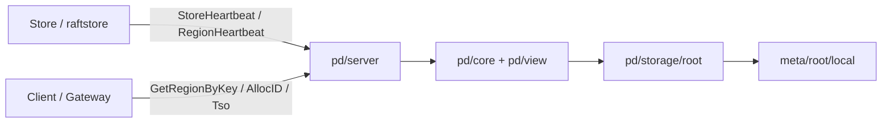

# 最小元数据根与自描述 Region 设计说明

> 状态：当前分布式控制面设计说明。本文档描述的是 NoKV 现在已经收敛下来的主路径，而不是未来的高可用设想。

## 1. 为什么要有这份设计

NoKV 的出发点不是“先做一个大而全的分布式控制面”，而是：

- 先把单机存储内核做扎实
- 再在此基础上叠加分布式数据面
- 最后才补最小必要的控制面能力

因此，NoKV 当前最重要的架构目标不是追求控制面功能最多，而是回答这几个问题：

1. 集群里的路由真相放在哪里
2. store 本地恢复真相放在哪里
3. `pd` 应该负责什么，不应该负责什么
4. 如何在不引入第二套控制面集群的前提下，把 durable truth 和 runtime view 分开

本文档给出的答案是：

> NoKV 当前采用“单机无控制面、分布式单控制面进程、最小 rooted metadata truth、自描述 region、可重建 PD view”的架构。

---

## 2. 当前产品模式

NoKV 现在只有两种正式产品模式。

### 2.1 `standalone`

- 不启动 `pd`
- 不启动 `meta/root`
- 没有控制面进程
- 所有真相都在单个存储进程里

这是默认模式，也是 NoKV 的第一公民模式。

`standalone` 不是“退化版分布式”，而是没有控制面的本地存储模式。

### 2.2 `distributed`

- 启动一个 `pd` 进程
- 同进程托管一个 `meta/root/local`
- 数据节点通过 `pd` 做：
  - `GetRegionByKey`
  - `StoreHeartbeat`
  - `RegionHeartbeat`
  - `AllocID`
  - `Tso`

当前分布式模式刻意保持为**单控制面节点**，也就是：

- 不做 `pd` 集群
- 不做 `meta` 集群
- 不做 metadata root 高可用

这样做是有意为之，用来把复杂度控制在当前项目可维护的范围内。

---

## 3. 当前架构分层

当前控制面分层如下：

### 3.1 `raftstore/localmeta`

文件：

- `NoKV/raftstore/localmeta/types.go`

职责：

- store 本地 region catalog
- peer 生命周期
- restart / recovery 所需的本地真相
- raft WAL、snapshot、apply 的本地恢复辅助信息

它代表的是：

> store-local runtime / recovery shape

它不是：

> 集群级路由权威

### 3.2 `raftstore/descriptor`

文件：

- `NoKV/raftstore/descriptor/types.go`

职责：

- 分布式 topology object
- route lookup 使用的 region 形状
- split / merge lineage
- peer membership 的分布式表达

它代表的是：

> distributed topology shape

### 3.3 `meta/root`

文件：

- `NoKV/meta/root/types.go`
- `NoKV/meta/root/local/store.go`

职责：

- 保存最小 durable control-plane truth
- 保存 allocator fence
- 保存 rooted topology event
- 提供 compact checkpoint 和 bounded recovery

它不是：

- 通用 metadata KV
- route cache
- scheduler runtime state
- 大而全的 PD 元数据库

### 3.4 `pd/view` 与 `pd/core`

文件：

- `NoKV/pd/view/region_directory.go`
- `NoKV/pd/core/cluster.go`

职责：

- 维护 route view
- 维护 heartbeat-derived store/region view
- 为 `pd/server` 提供查询与调度输入

它们代表的是：

> 可重建的运行时视图

不是：

> durable truth

### 3.5 `pd/server`

文件：

- `NoKV/pd/server/service.go`

职责：

- 对外暴露 gRPC 控制面接口
- 统一 RPC 边界、校验、错误映射

它是：

> 服务边界

不是：

> 元数据权威存储

---

## 4. `RegionMeta` 与 `Descriptor` 的职责划分

这两个对象会看起来相似，但它们不是一回事。

### 4.1 `RegionMeta`

文件：

- `NoKV/raftstore/localmeta/types.go`

用途：

- store-local recovery
- peer lifecycle
- 本地 hosted region 目录

它是：

> 本地副本与本地恢复对象

### 4.2 `Descriptor`

文件：

- `NoKV/raftstore/descriptor/types.go`

用途：

- route object
- rooted topology object
- PD 里的 region 语言
- split / merge lineage

它是：

> 分布式拓扑对象

### 4.3 两者关系

当前设计里，允许的方向是：

- `RegionMeta -> Descriptor`

不鼓励的方向是：

- `Descriptor -> RegionMeta`

也就是说：

- store 本地运行时可以把本地 region 形状提升成分布式 descriptor
- 但 control-plane 不应该反向回写 store-local 语义

这也是为什么当前把 local-to-distributed 的转换收到了：

- `NoKV/meta/codec/local_region.go`

而不是留在 `descriptor` 包内部。

---

## 5. `pd` 与 `meta/root` 之间如何交互

当前交互流程是：

### 5.1 数据节点启动

store 先从本地 `localmeta` 恢复：

- hosted peers
- 本地 region catalog
- 本地 raft/recovery 进度

这一阶段不依赖 `pd`。

### 5.2 数据节点运行中上报

store 通过 heartbeat 向 `pd` 汇报：

- store stats
- region descriptor

当前服务边界上，region 语言已经是：

- `RegionDescriptor`

而不是把 `RegionMeta` 整条链路传到底。

### 5.3 `pd` 落 durable truth

`pd` 通过：

- `/Volumes/mac Ds - Data/WorkSpace/GitHub/NoKV/pd/storage/root.go`

把 descriptor 变化转换成 rooted event，并写入：

- `/Volumes/mac Ds - Data/WorkSpace/GitHub/NoKV/meta/root/local/store.go`

### 5.4 `pd` 从 rooted truth 重建 view

`pd` 重启时：

1. 打开 `meta/root/local`
2. 读取 compact snapshot
3. 读取 retained tail
4. 重建：
   - descriptor snapshot
   - allocator state
   - region directory view

这意味着：

- `meta/root` 才是 durable truth
- `pd/view` 是重建出来的 runtime view

---

## 6. 为什么不是“大一统 PD”

一种看起来省事但长期错误的做法是：

- 把 routing、allocator、scheduler、durable metadata、operator state 都放进 `PD`

这样短期实现快，长期会出问题：

1. `PD` 会膨胀成一个大 authority
2. route cache、view、runtime state 和 durable truth 混在一起
3. 后续维护会越来越难

NoKV 当前没有走这条路，而是明确要求：

- `meta/root` 只保存最小 durable truth
- `pd/view` 只保存可重建 view
- `pd/server` 只负责 service 边界

这就是当前设计真正值钱的地方。

---

## 7. 为什么不是“两套控制面集群”

另一种看起来“更正统”的做法是：

- 一套 `pd` 集群
- 一套 `meta` 集群

当前阶段没有走这条路，原因很直接：

1. 复杂度过高
2. 运维对象翻倍
3. 当前项目规模下，维护成本超过收益

因此 NoKV 现在选择：

> 逻辑上分离 `pd` 和 `meta`
>
> 部署上仍然是同进程单控制面节点

这不是偷懒，而是为了让项目复杂度保持在当前阶段可以稳定收敛的范围内。

---

## 8. 与 TiKV、CockroachDB、FoundationDB 的差异

### 8.1 TiKV / PD

TiKV 的典型路线是：

- `PD` 是中心控制面
- `PD` 是独立高可用集群
- `PD` 内部通过 etcd 提供强一致 metadata 与 leader election

NoKV 当前不是这条路线。

NoKV 当前更像：

- `meta/root` 是最小 durable truth
- `pd` 是 service + view
- `pd` 与 `meta` 在逻辑上分层、在部署上同进程

**区别**

TiKV 更像：

> 强中心控制面

NoKV 当前更像：

> 最小 truth 子系统 + 薄服务层

### 8.2 CockroachDB

CockroachDB 的路线是：

- metadata 完全内生到数据面 ranges
- `meta1/meta2` 本身就是 replicated ranges
- 没有独立 `PD`

NoKV 当前没有走这条 fully in-band 路线。

NoKV 当前是：

- out-of-band rooted metadata truth
- 独立 `pd` 服务边界
- 没有把 metadata 完全内生进数据面

**区别**

Cockroach 更偏：

> metadata fully in-band

NoKV 当前更偏：

> out-of-band minimal rooted truth

### 8.3 FoundationDB

FoundationDB 的路线是：

- 极小协调根
- 强角色化
- coordinator / master / proxies / logs / storage 等明确分工

NoKV 当前借鉴的是：

- “小根”的思想

但没有走：

- 强角色化系统
- 大量角色协作的架构

**区别**

FDB 更像：

> 小协调根 + 强角色系统

NoKV 当前更像：

> 小真相层 + 轻控制面分层

---

## 9. 当前设计的优点

### 9.1 适合 `standalone-first`

单机模式明确没有控制面，不会被“伪分布式”代码污染。

### 9.2 比大一统 PD 更克制

`pd` 不再自然膨胀成另一个大数据库。

### 9.3 比双集群控制面更轻

不用维护：

- `pd` 集群
- `meta` 集群

两套控制面对象。

### 9.4 truth 与 view 已经分离

即使当前同进程，这个边界也有真实价值。

### 9.5 符合当前项目维护能力

NoKV 现在更需要：

- 清晰边界
- 可维护性
- 渐进演进

而不是一上来就堆完整 HA 控制面系统。

---

## 10. 当前设计的限制

当前限制也必须明确：

1. `pd` 是单点
2. `meta/root/local` 是单点
3. 当前没有 metadata quorum
4. 当前不是生产级 HA control-plane

这不是遗漏，而是明确的阶段性取舍。

---

## 11. 当前最应该坚持的设计纪律

后续演进时，下面几条必须守住：

### 11.1 `meta/root` 不再长大

只允许保存：

- rooted topology truth
- allocator fence
- compact root state

不允许长成：

- 通用 metadata KV
- route cache store
- scheduler runtime store

### 11.2 `pd/view` 仍然是可重建 view

不能重新把 durable truth 放回 `pd`。

### 11.3 `RegionMeta` 和 `Descriptor` 继续双投影

不要再把本地恢复对象和分布式拓扑对象重新揉成一个结构。

### 11.4 topology truth 尽量显式生产

长期目标仍然是：

- 上游直接生产 split / merge / peer-change truth event

而不是让 `pd/storage/root.go` 长期承担推断器职责。

---

## 12. 总结

NoKV 当前的分布式控制面设计，不是：

- 大一统 `PD`
- 双集群控制面
- fully in-band metadata

而是：

> 单机无控制面
>
> 分布式单控制面进程
>
> 最小 rooted metadata truth
>
> 自描述 region
>
> 可重建 PD view

这套设计的价值不在于“功能最多”，而在于：

1. 结构清楚
2. 维护成本可控
3. 能支持当前项目阶段继续稳定演进

对 NoKV 现在这个阶段来说，这比提前做完整高可用 metadata control-plane 更合适。
