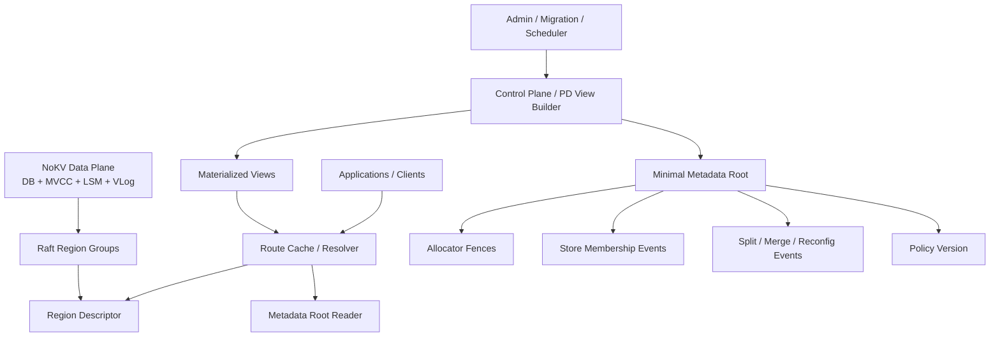
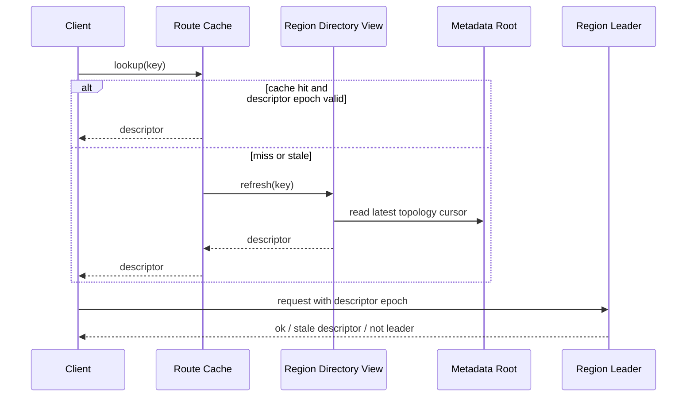
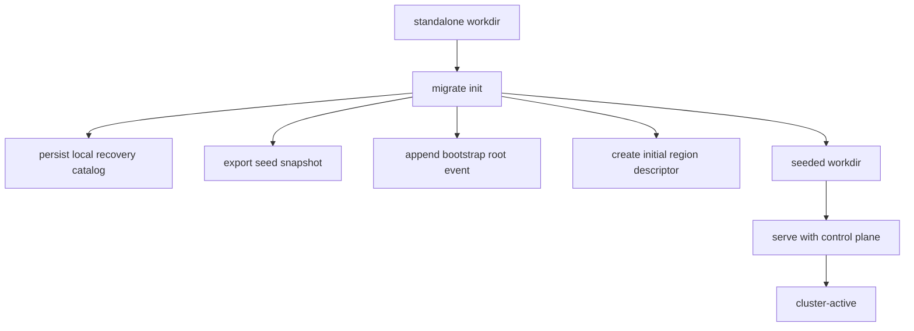

# Minimal Metadata Root and Self-Describing Regions

> Status: proposed architecture for the next distributed-control-plane phase.

## Why this matters

NoKV already has a serious standalone data plane and a defensible
standalone-to-cluster promotion path:

- one storage core
- one snapshot/install pipeline
- one migration workflow

That is the right foundation.

The next architectural question is not “how to add more migration commands”.
It is:

> how to manage distributed metadata without turning PD into a second large
> database that itself needs another control plane behind it.

The wrong answer is to keep adding more cluster truth into local JSON files.
The also-wrong answer is to build a full TiKV-style PD clone before the rest of
NoKV needs it.

This note proposes a different direction:

> keep a very small globally replicated metadata root, move more truth into
> region descriptors owned by the data plane, and treat PD/control-plane state
> as a rebuildable view instead of the only metadata authority.

## Current system boundary

Today the relevant layers are already mostly separated:

- raw SST primitives:
  - `lsm/external_sst.go`
- region snapshot format:
  - `raftstore/snapshot/meta.go`
  - `raftstore/snapshot/dir.go`
  - `raftstore/snapshot/payload.go`
- DB snapshot bridge:
  - `db_snapshot.go`
- distributed orchestration:
  - `raftstore/admin/service.go`
  - `raftstore/migrate/init.go`
  - `raftstore/migrate/expand.go`
  - `raftstore/store/peer_lifecycle.go`

The current weak spot is not the snapshot pipeline. It is metadata ownership.

Today NoKV still has prototype-style local state stores:

- store-local recovery state:
  - `raftstore/meta/store.go`
- PD-lite local state:
  - `pd/storage/local.go`

Both are file-backed JSON state stores. That is acceptable for the current
prototype, but it is not the long-term distributed metadata architecture.

## What looked easy but is wrong

### Wrong approach 1: make PD the permanent owner of all metadata

This would converge on a familiar but heavy design:

- PD stores a full mutable region map
- PD stores store descriptors
- PD stores allocator state
- PD becomes the only metadata authority

That works, but it pushes NoKV toward “another PD clone”, not toward a
distinguishable architecture.

### Wrong approach 2: keep metadata in local JSON files and sync informally

This is not acceptable once NoKV wants real distributed correctness.

Local files are fine for:

- recovery hints
- mode markers
- migration checkpoints

They are not fine for:

- cluster-wide range ownership truth
- allocator fencing
- reconfiguration ordering

### Wrong approach 3: remove any globally replicated metadata root

There is no free lunch here. Strongly consistent distributed metadata always
needs a root of trust somewhere.

The real design question is:

> how small can that root be?

## The design we chose

The proposal is:

> **minimal metadata root + event log + self-describing region descriptors +
> rebuildable control-plane views**

That means NoKV should no longer aim for:

- “PD owns one big metadata table”

Instead it should aim for:

1. a very small globally replicated root
2. region-owned descriptors that carry more local truth
3. control-plane views that can be dropped and rebuilt

## Target architecture



## Core principles

### 1. The data plane stays the data plane

The storage core remains:

- `db.go`
- `lsm/*`
- `vlog/*`
- MVCC / Percolator layers

Distributed evolution must continue to reuse this truth instead of creating a
second storage truth in the control plane.

### 2. Region descriptors carry local truth

A region should not rely on PD to tell the world everything about it on every
operation.

Each region descriptor should carry:

- `region_id`
- `start_key`
- `end_key`
- `epoch`
- `peers`
- `state`
- `lineage`
- `descriptor_hash`

The descriptor should be owned by the region lifecycle, not by a control-plane
table row.

### 3. The metadata root only orders and fences

The globally replicated root should only store what truly requires global
serialization:

- topology epoch
- allocator fences
- store membership events
- split events
- merge events
- peer add/remove events
- placement policy version

It should **not** store the full runtime metadata view for every region.

### 4. Views are disposable

The scheduler and route resolver can maintain:

- region directory caches
- store load views
- placement views

But these views are rebuildable. They are not the only source of truth.

## Proposed modules

## `meta/root`

Suggested new package:

- `meta/root`

Responsibility:

- globally replicated metadata root
- event append / sequencing
- allocator fencing
- topology epoch management

Suggested API:

```go
type Root interface {
    Current() (State, error)
    ReadSince(cursor Cursor) ([]Event, Cursor, error)
    Append(events ...Event) (CommitInfo, error)
    FenceAllocator(kind AllocatorKind, min uint64) (uint64, error)
}
```

Suggested durable state:

- `cluster_epoch`
- `event_log_head`
- `id_allocator_fence`
- `tso_allocator_fence`
- `membership_epoch`
- `policy_version`

Suggested events:

- `StoreJoined`
- `StoreLeft`
- `RegionSplitRequested`
- `RegionSplitCommitted`
- `RegionMerged`
- `PeerAdded`
- `PeerRemoved`
- `LeaderTransferIntent`
- `PlacementPolicyChanged`

The root should stay small enough that a fresh node can replay it quickly.

## `raftstore/descriptor`

Suggested new package:

- `raftstore/descriptor`

Responsibility:

- descriptor definition
- descriptor validation
- lineage tracking
- stale-descriptor rejection

Suggested descriptor:

```go
type Descriptor struct {
    RegionID    uint64
    StartKey    []byte
    EndKey      []byte
    Epoch       raftmeta.RegionEpoch
    Peers       []raftmeta.PeerMeta
    State       raftmeta.RegionState
    Parent      []LineageRef
    RootEpoch   uint64
    Hash        []byte
}
```

Lineage should make split/merge explicit:

- split child descriptors reference parent descriptor hash/epoch
- merge descriptor references source descriptors

This gives NoKV a route to make region topology evolution auditable instead of
implicitly buried in one control-plane table.

## `pd/view`

Suggested new package:

- `pd/view`

Responsibility:

- materialized views for operators and schedulers
- region directory cache
- store stats and placement view
- rebuild from root events + live heartbeats

This layer is allowed to be incomplete temporarily.
It is not the root of trust.

Suggested components:

- `RegionDirectoryView`
- `StoreHealthView`
- `PlacementView`
- `SchedulerInputView`

## `raftstore/meta`

Keep:

- `raftstore/meta/store.go`

But shrink its semantic role.

Future role:

- local recovery only
- persisted local peer catalog
- local raft/apply checkpoint pointers
- restart hints

It must not become cluster authority.

Over time, the implementation should stop rewriting one full JSON state blob on
every update. The right direction is:

- split region local state from raft pointers
- use finer-grained records
- keep store-local durability separate from cluster metadata durability

## Data ownership

The design only works if ownership stays explicit.

### Data plane owns

- user keys and values
- MVCC state
- SST files
- WAL / vlog
- region snapshots
- region descriptors after install/apply

### Metadata root owns

- cluster ordering of metadata-changing events
- allocator fences
- store membership root
- topology / placement epochs

### Control-plane views own

- caches
- scheduler inputs
- operator-facing summaries

Views may be stale. Root may not.

## Routing model

The route path should become:



This keeps the common path cheap while allowing the region to reject stale
routing using its own descriptor epoch.

## Split / merge model

The region topology path should be event-first, descriptor-second:

1. scheduler or operator proposes split/merge
2. metadata root commits the topology event
3. target region quorum applies descriptor change
4. control-plane views rebuild
5. route caches eventually converge

The important point is:

> the root serializes the topology change, but the region descriptor is what
> the data plane actually serves with.

## Allocator model

Allocator state should be separated from the rest of metadata.

The metadata root should provide fencing only:

- `ID fence`
- `TSO fence`

The allocator service can cache ranges locally, but the globally replicated
root must be the monotonic lower bound that prevents rollback after failover.

This keeps allocator correctness independent from the full region catalog.

## Migration and snapshot integration

The current migration path is a strength and should be preserved.

Today:

- `migrate init` exports a seed snapshot
- `migrate expand` uses admin streaming export/import
- `store.InstallRegionSSTSnapshot(...)` handles staged import and publish

Under the proposed design:

- promotion still uses SST snapshot install
- the region descriptor becomes part of the snapshot contract
- metadata root records:
  - seed bootstrap
  - peer addition
  - peer removal
  - leadership movement intent

That means migration becomes:

> data movement through SST snapshots + topology movement through metadata-root
> events

This preserves the current good boundary instead of throwing it away.

## Bootstrap flow

The bootstrap sequence should become:



The key change is that a seeded workdir should no longer imply that all future
cluster truth lives in PD-local mutable maps.

## Persistence strategy

## What can stay JSON

These files are small, non-hot, and operator-facing:

- `MODE.json`
- `MIGRATION_PROGRESS.json`
- `sst-snapshot.json`

There is little value in removing JSON from them.

## What should evolve away from full JSON state files

- `raftstore/meta/store.go`
- `pd/storage/local.go`

These should move toward:

- local recovery records for store-local metadata
- replicated event/checkpoint storage for metadata-root state

The direction is not “ban JSON everywhere”.
The direction is “stop rewriting full mutable metadata maps as the system
grows”.

## Phased implementation plan

## Phase 0: freeze current boundaries

Goal:

- keep `db_snapshot.go` as snapshot bridge only
- keep `raftstore/snapshot` as format/install layer only
- do not add more cluster authority semantics to local JSON stores

## Phase 1: introduce root event types

Add:

- `meta/root/types.go`

Define:

- `Event`
- `Cursor`
- `CommitInfo`
- `State`
- allocator fence model

No runtime wiring yet.

## Phase 2: add a local single-node root backend

Add:

- `meta/root/local`

This is not the final HA backend.
Its purpose is to make event and state shapes explicit before distributed
replication is introduced.

## Phase 3: add region descriptor module

Add:

- `raftstore/descriptor`

Integrate with:

- snapshot export/import
- peer bootstrap
- stale-route rejection hooks

## Phase 4: replace PD-local metadata authority with root + view

Refactor:

- `pd/storage/local.go`
- `pd/server/service.go`

So that PD becomes:

- root event proposer
- view builder
- scheduler

Instead of the owner of a full mutable region map.

## Phase 5: integrate migration with root events

Update:

- `raftstore/migrate/init.go`
- `raftstore/migrate/expand.go`
- `raftstore/migrate/remove_peer.go`
- `raftstore/migrate/transfer_leader.go`

So migration persists topology transitions through root events in addition to
the existing data-movement steps.

## Phase 6: add HA root backend

Only after the model is stable:

- add a replicated backend for `meta/root`
- keep the replicated state small
- do not turn it into a second giant metadata database

## What this changes

If NoKV follows this design, the project's distinguishing story becomes:

1. one storage core from standalone to cluster
2. SST snapshot install as the shared data-movement primitive
3. region-owned descriptors instead of a control-plane-owned giant metadata map
4. a minimal globally replicated root for ordering and fencing only
5. disposable control-plane views

That is a more interesting system than either:

- “single-node engine plus a separate PD table”
- or “copy TiKV’s metadata story in smaller form”

## What remains unsolved

This note intentionally does not fully solve:

- exact descriptor hash format
- proof format for descriptor validation
- cache invalidation protocol
- split/merge commit protocol details
- the final replicated backend implementation for `meta/root`

Those should be designed next as separate technical notes.
