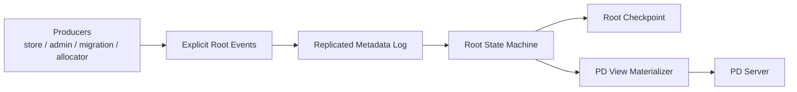
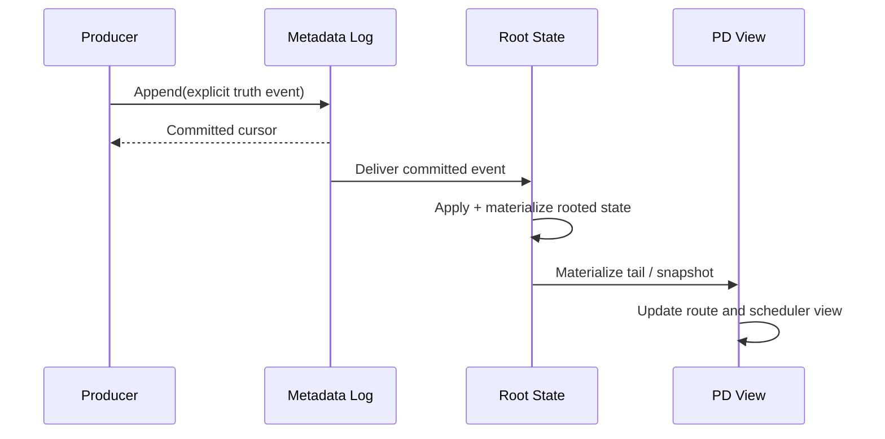

# NoKV Delos-lite Metadata HA 设计草案

> 状态：模块级设计草案。本文档是在《未来 Metadata HA 路线规划》基础上的进一步细化，目标是明确第一版 Delos-lite 的模块边界、接口草案、事件模型、恢复路径，以及和当前代码的迁移关系。

## 1. 设计目标

NoKV 当前正式控制面模型是：

- `standalone`：无 `pd`、无 `meta/root`
- `distributed`：单个 `pd` + 同进程 `meta/root/local`

未来如果重新引入 metadata 高可用，目标不是做一个“大 PD + 大 metadata KV”，而是把当前已经做对的最小 rooted truth 边界升级成高可用 rooted truth。

第一版 Delos-lite 的目标只有这些：

1. 给 allocator、membership、descriptor topology truth 提供高可用顺序日志
2. 从日志 materialize 出 compact rooted state
3. 让 `pd/view` 继续保持 materialized view 地位
4. 保持和当前代码边界连续，不推翻现有 `Descriptor`、`pd/view`、`pd/server` 的职责划分

第一版 Delos-lite 明确**不做**这些事情：

- 不做通用 metadata KV
- 不做 route cache 持久化
- 不做 scheduler runtime state 复制
- 不做 operator progress 复制
- 不先追 CURP、Bizur 这类更激进的优化

---

## 2. 总体架构



五层职责如下：

### 2.1 Producers

生产 metadata truth event 的路径，包括：

- store publish path
- admin path
- migration path
- allocator path

它们的职责不是直接改 `pd` 内存结构，而是：

> 直接产出显式 truth event

### 2.2 Replicated Metadata Log

这是 Delos-lite 的核心顺序层。

职责：

- append event
- 复制 event
- commit event
- 提供 committed ordered stream

不负责：

- 通用 KV 查询
- route lookup
- scheduler
- 临时统计和缓存

### 2.3 Root State Machine

职责：

- apply committed event
- materialize rooted truth
- 维护 compact rooted state

### 2.4 Root Checkpoint

职责：

- rooted state checkpoint
- snapshot 恢复
- tail replay 边界
- log compaction 边界

### 2.5 PD View Materializer

职责：

- 从 rooted state 或 committed tail 重建 `pd/view`
- 更新 route directory
- 更新 scheduler input
- 更新 allocator runtime cache

---

## 3. 代码模块拆分建议

### 3.1 `meta/root/event`

职责：

- 定义 event schema
- 定义事件版本与兼容边界
- 负责编码/解码

和当前代码的关系：

- 当前 `meta/root/types.go` 里的 `EventKind`、`Event`、各 payload struct 可以作为第一版基础
- 后续最好把“Root 接口”和“Event schema”拆开，避免一个文件承担过多角色

### 3.2 `meta/root/log`

职责：

- ordered log append
- ordered log read
- commit cursor 管理
- compaction / snapshot install

建议只暴露一个极小接口，类似：

```go
package rootlog

type Log interface {
    Append(events ...event.Event) (CommitCursor, error)
    ReadCommitted(from Cursor) ([]CommittedEvent, Cursor, error)
    Current() (CommitCursor, error)
    InstallSnapshot(snapshot state.Snapshot) error
    Compact(upto Cursor) error
    Close() error
}
```

第一版底层实现建议只有一个：

- `raftOrderedLog`

### 3.3 `meta/root/state`

职责：

- 定义 rooted state
- apply event
- 导出 rooted snapshot
- 提供 checkpoint 输入

建议接口：

```go
package rootstate

type Machine interface {
    Current() State
    Snapshot() Snapshot
    Apply(cursor Cursor, evt event.Event) error
}
```

### 3.4 `meta/root/checkpoint`

职责：

- checkpoint 编码
- checkpoint 恢复
- snapshot + tail replay 边界

这层未来应该吸收当前 `meta/root/local/store.go` 里的：

- compact snapshot encoding
- bounded tail replay
- physical compaction 经验

### 3.5 `pd/materialize`

职责：

- 从 rooted state 生成 `pd/view`
- 从 committed tail 增量更新 `pd/view`

建议最终把今天 `pd/storage/root.go` 里“偏恢复、偏快照、偏桥接”的职责，逐步收成一个更纯的 materializer。

### 3.6 `pd/server`

职责保持不变：

- 对外暴露控制面 API
- 只消费 `pd/view`
- 不直接拥有 durable truth

---

## 4. 事件模型

这一步是 Delos-lite 的成败关键。

### 4.1 第一原则：事件必须显式

当前系统已经暴露过一个问题：

- 如果只给 descriptor diff
- 再由 `pd/storage/root.go` 去猜 split / merge / peer-change

那么 root 持久化层会变成“业务推断器”，而不是 truth serializer。

Delos-lite 第一版必须反过来：

> producer 直接生成显式 truth event
>
> log 只负责排序和复制
>
> state machine 只负责 apply 和 materialize

### 4.2 第一版 event 类型建议

建议把 event 分为三大类。

#### A. allocator truth

- `AllocatorFenced(kind, min)`

#### B. store membership truth

- `StoreJoined(storeID, address)`
- `StoreLeft(storeID, address)`
- `StoreMarkedDraining(storeID, address)`

#### C. topology truth

- `DescriptorPublished(desc)`
- `DescriptorTombstoned(regionID)`
- `SplitCommitted(parentID, splitKey, left, right)`
- `MergeCommitted(leftID, rightID, merged)`
- `PeerChangeCommitted(regionID, storeID, peerID, kind, region)`

### 4.3 事件命名建议

当前 `meta/root/types.go` 里既有：

- `EventKindRegionBootstrap`
- `EventKindRegionDescriptorPublished`
- `EventKindRegionSplitRequested`
- `EventKindRegionSplitCommitted`
- `EventKindRegionMerged`
- `EventKindPeerAdded`
- `EventKindPeerRemoved`

未来建议再收一层，让事件语义更统一：

- 只保留真正的 truth event
- 把 intent 类事件和 committed truth 事件区分开

我的建议是：

1. `SplitRequested` 这类 event 不进入 rooted truth 主日志，除非你明确需要持久化 intent
2. rooted truth 主日志里优先保留 committed topology truth
3. `PeerAdded` / `PeerRemoved` 可以收敛为 `PeerChangeCommitted(kind=add/remove)`

### 4.4 事件 payload 要求

每个 event 都应满足：

- 自描述
- 不依赖隐式推断
- 可重放
- 可 checkpoint 化
- 可用于恢复 rooted state

例如 `SplitCommitted` 至少应该直接带：

- parent region id
- split key
- left descriptor
- right descriptor
- 必要的 lineage 信息

而不是只给一个“新 descriptor”，让下游自己猜是 split。

---

## 5. Rooted State 设计

rooted state 一定要克制。

### 5.1 建议的 rooted state 结构

建议明确拆成四块。

#### A. `AllocatorState`

内容：

- `IDFence`
- `TSOFence`
- maybe `LastAllocatedCursor`

要求：

- 单调
- 可 checkpoint
- 与 `pd/view` 无关

#### B. `StoreMembershipState`

内容：

- store id
- address
- state / role
- membership epoch

要求：

- 这是 durable truth
- 不是 heartbeat-derived runtime observation

#### C. `DescriptorCatalog`

内容：

- `regionID -> descriptor`
- range index
- lineage index

要求：

- 这是 topology truth
- 不是 route cache

#### D. `CommitState`

内容：

- last committed cursor
- last applied cursor
- snapshot boundary

要求：

- checkpoint 必须对齐它
- tail replay 必须对齐它

### 5.2 rooted state 不该存什么

不要存这些：

- route cache 命中结果
- scheduler runtime decision
- operator progress
- hotspot 观察值
- heartbeat 临时状态

一句话：

> rooted state 存 truth
>
> 不存 convenience

---

## 6. 写路径设计



具体流程：

1. 上游 producer 直接生成显式 truth event
2. event append 到 replicated metadata log
3. log commit 后交给 rooted state machine
4. rooted state machine apply event
5. `pd/view` 根据 rooted state / tail 更新视图

这样能把三件事分开：

- 顺序与复制
- truth materialization
- query / service view

---

## 7. 读路径设计

### 7.1 authority truth 读

如果读的是：

- allocator truth
- store membership truth
- descriptor truth

那应该读 rooted state。

### 7.2 route / scheduler 读

如果读的是：

- `GetRegionByKey`
- route lookup
- scheduler input

那应该读 `pd/view`。

### 7.3 为什么要分开

因为：

- rooted state 是 authority
- `pd/view` 是 hot path

不能把 rooted truth 做成热查询数据库。

---

## 8. 恢复路径设计

恢复路径建议固定为：

1. 打开最新 checkpoint
2. 恢复 rooted state snapshot
3. replay checkpoint 之后的 committed tail
4. 从 rooted state 重建 `pd/view`

### 8.1 恢复根

恢复根永远应该是：

- rooted checkpoint

而不是：

- `pd/view`
- route cache
- scheduler runtime state

### 8.2 当前代码可复用的经验

当前 `meta/root/local/store.go` 已经提供了几个重要经验：

- compact snapshot
- bounded tail replay
- physical log compaction

未来 HA 版 checkpoint 设计应该尽量继承这些经验，而不是重新回到“全量 metadata replay”。

---

## 9. 底层共识层建议

### 9.1 第一版选择

第一版底层建议直接用：

> Raft-like ordered log

原因：

1. 最适合先把 `event -> log -> state -> view` 主链做稳
2. 与 checkpoint / compaction / recovery 天然契合
3. 调试成本最低
4. 不会把项目注意力从架构边界拉到协议炫技上

### 9.2 为什么不是第一版就上 CURP / Bizur

因为当前第一优先级不是协议创新，而是：

- event 边界
- rooted state 边界
- checkpoint 边界
- view rebuild 边界

协议层的创新应该后置。

---

## 10. 迁移路径：从当前代码到 Delos-lite

### 10.1 可以继续保留的部分

这些模块未来仍然应该保留：

- `raftstore/descriptor/types.go`
- `pd/view/*`
- `pd/core/*`
- `pd/server/*`

### 10.2 需要重构的部分

#### `meta/root/local/store.go`

当前它同时承担：

- event log
- checkpoint
- local backend
- state materialization

未来需要拆成：

- `meta/root/event`
- `meta/root/log`
- `meta/root/state`
- `meta/root/checkpoint`

#### `pd/storage/root.go`

当前它仍然承担：

- rooted truth bridge
- PD snapshot rebuild
- 某些 descriptor diff 分类逻辑

未来要收成：

- 显式 root event consumer
- rooted state / tail 的 view materializer

### 10.3 需要提前完成的前置条件

最关键的前置条件是：

> 上游直接产出显式 topology truth event

也就是：

- split / merge / peer-change 不能长期靠 descriptor diff 推断

在这一步没做完之前，不应该贸然开工做 Delos-lite HA。

---

## 11. 第一版不做什么

第一版 Delos-lite 明确不做：

1. 通用 metadata KV
2. 调度状态复制
3. route cache 复制
4. metadata 根自己的复杂动态 membership reconfiguration
5. CURP 快路径
6. Bizur-like 分桶共识

先把根做小、做稳，比什么都重要。

---

## 12. 推荐实施顺序

### 第一步

继续收敛当前 event 模型：

- split / merge / peer-change 全部显式 truth 化

### 第二步

把当前 root 内部进一步拆清：

- event
- state
- checkpoint

### 第三步

定义最小 ordered log 抽象：

- append
- committed read
- snapshot install
- compaction

### 第四步

实现第一版 HA 原型：

- replicated metadata log
- rooted state machine
- checkpoint
- `pd/view` rebuild

### 第五步

只有第一版稳定之后，再考虑：

- allocator 的 CURP 风格快路径
- 更远期的 Bizur-like bucketization

---

## 13. 当前最该警惕的错误路线

1. 把 Delos-lite 做成第二个 etcd 产品
2. 把 `pd` 再次做成大 authority
3. 在 event 还不显式时就引入 HA
4. 把所有控制面状态都塞进 quorum
5. 为了“创新”过早引入复杂协议

---

## 14. 总结

NoKV 版 Delos-lite 的第一版具体设计，应当是一个：

- 显式 metadata truth event 模型
- 极小 replicated ordered log
- compact rooted state machine
- checkpoint + tail replay 恢复路径
- 可丢弃、可重建的 `pd/view`

它最重要的价值不在底层协议名字，而在于：

> 把 metadata HA 做成最小 truth log 系统，而不是大 metadata authority 系统。

这也是它和传统“大 PD + etcd”路线的根本差异。
