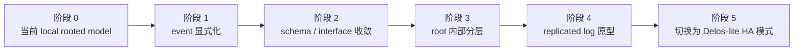

# NoKV Delos-lite Metadata HA 迁移实施计划

> 状态：实施计划草案。本文档的目标不是再解释 Delos-lite 的理念，而是把未来从当前 `meta/root/backend/local` 形态迁移到 Delos-lite metadata HA 的实施步骤拆开，明确每个阶段的目标、代码切入点、完成标志和风险控制。

## 1. 当前起点

当前 NoKV 的正式控制面模式是：

- `standalone`：无 `pd`、无 `meta/root`
- `distributed`：单个 `pd` + 同进程 `meta/root/backend/local`

关键代码路径：

- `meta/root/types.go`
- `meta/root/backend/local/store.go`
- `meta/codec/root.go`
- `pb/meta/root.proto`
- `pd/storage/root.go`
- `pd/view/region_directory.go`
- `pd/core/cluster.go`
- `pd/server/service.go`

当前已经具备的基础：

1. rooted event log
2. compact rooted checkpoint
3. bounded tail replay
4. physical log compaction
5. `pd/view` 的 rebuildable 形状
6. `Descriptor` 作为 distributed topology object

当前还没收完的关键问题：

1. topology truth 生产侧仍不够显式
2. `meta/root/types.go` 还混着 root API、event schema、state schema
3. `pd/storage/root.go` 仍然承担一部分 descriptor diff 分类职责
4. 当前根实现还是 local backend，不是 replicated log

所以迁移的重点不是“上来就做 HA”，而是：

> 先把 shape 收死，再把 local rooted log 升级成 replicated rooted log。

---

## 2. 迁移总原则

### 2.1 不推翻现有主线

保留这些边界：

- `RegionMeta` = local/runtime/recovery shape
- `Descriptor` = distributed topology object
- `meta/root` = truth
- `pd/view` = materialized view
- `pd/server` = service boundary

### 2.2 不先做“大重构”

每一步都应该能在当前主线继续工作的前提下落地。

也就是：

- 每一阶段都应可单独合并
- 每一阶段都应能通过当前测试和 lint
- 每一阶段都应不强迫立即切换运行模式

### 2.3 不先做协议创新

先做：

- event 显式化
- schema 收敛
- state/checkpoint/log 分层

后做：

- replicated log
- CURP
- Bizur-like bucketization

---

## 3. 迁移阶段总览

我建议拆成五个阶段。

---

## 4. 阶段 1：先把 topology truth 显式化

### 4.1 目标

让 split / merge / peer-change 不再依赖 `pd/storage/root.go` 的 descriptor diff 推断，变成由上游 producer 直接生成显式 truth event。

### 4.2 当前切入点

当前相关逻辑主要集中在：

- `pd/storage/root.go`
- `meta/root/types.go`
- `meta/codec/root.go`
- `pd/server/service.go`
- `raftstore/store/scheduler_runtime.go`
- `raftstore/store/admin_service.go`

从代码分布上看，当前以下类型仍然在被主路径使用：

- `RegionBootstrapped`
- `RegionSplitCommitted`
- `RegionMerged`
- `PeerAdded`
- `PeerRemoved`

同时 `pd/storage/root.go` 里的 `regionEvent(...)` 还在根据：

- `prev`
- `next`
- `current`

去判断到底发哪种 event。

### 4.3 本阶段要做的事

1. 明确 producer 侧 truth event 生成点
   - split committed 在哪里生成
   - merge committed 在哪里生成
   - peer add/remove committed 在哪里生成
2. 让 `pd/storage/root.go` 降级为 append bridge，不再承担 steady-state 推断
3. 把 heuristic 保留为过渡兼容路径，而不是主路径

### 4.4 完成标志

满足下面三条，就算完成：

1. 主路径不再依赖 `regionEvent(...)` 猜 split/merge/peer-change
2. split/merge/peer-change 的测试来自显式 event producer
3. `pd/storage/root.go` 更像 thin translator，而不是 inference engine

### 4.5 风险

最大风险是：

- producer 侧 truth 生成点分散
- 为了“先跑通”又把推断逻辑塞回 bridge 层

所以这一步必须优先完成。

---

## 5. 阶段 2：收敛 schema 和接口

### 5.1 目标

把当前：

- `meta/root/types.go`
- `pb/meta/root.proto`
- `meta/codec/root.go`

从“能用但混杂”的状态，收成 Delos-lite 所需的明确边界。

### 5.2 本阶段要做的事

1. 把 `meta/root/types.go` 中的 event schema 和 root API 分开
2. 重新划定 committed truth event 与 intent event
3. 在 proto 里补齐或收敛：
   - `AllocatorFenced`
   - `PeerChangeCommitted(kind)`
   - `RootCheckpoint` 中的 membership 信息
4. 明确 rooted state schema 和 checkpoint schema

### 5.3 当前切入点

- `meta/root/types.go`
- `pb/meta/root.proto`
- `meta/codec/root.go`

### 5.4 完成标志

1. `event`、`state`、`checkpoint` 不再全混在同一组类型里
2. proto 只表达 rooted truth 所需 schema
3. committed truth event 集合被正式定下来

### 5.5 风险

如果 schema 还没定就做 replicated log，会导致：

- log 层接口过早固化
- 后面修改 schema 成本过高

所以这一步必须在 replicated log 之前完成。

---

## 6. 阶段 3：把 root 内部分层

### 6.1 目标

把当前 `meta/root/backend/local/store.go` 一锅端的实现，拆成 Delos-lite 需要的内部层次：

- `event`
- `state`
- `checkpoint`
- local `log`

这里仍然可以先保持单机 backend，不急着上 HA。

### 6.2 当前切入点

- `meta/root/backend/local/store.go`
- `meta/root/backend/local/store_test.go`
- `meta/codec/root.go`

### 6.3 本阶段要做的事

1. 把 event apply 逻辑从 local store 实现体里抽开
2. 把 rooted state 结构抽成独立层
3. 把 checkpoint 编码/解码抽成独立层
4. 保留 local backend，但让它只变成某种 log/store 实现，而不是“整个 root 系统”

### 6.4 完成标志

1. local rooted backend 仍然可用
2. `meta/root/backend/local/store.go` 不再承担所有 root 逻辑
3. 可以清楚说出：
   - 这是 local log
   - 这是 rooted state machine
   - 这是 checkpoint store

### 6.5 风险

如果这一步偷懒不做，后面做 replicated log 时就只能在现有 local store 上继续叠复杂度，结构会很快失控。

---

## 7. 阶段 4：实现 replicated ordered log 原型

### 7.1 目标

在前面三步边界稳定之后，引入第一个 Delos-lite 风格的高可用 log backend。

### 7.2 第一版建议

第一版只做：

- `Raft-like ordered log`

不要同时引入：

- CURP 快路径
- Bizur-like bucketization
- 复杂 membership reconfiguration

### 7.3 本阶段要做的事

1. 定义最小 `rootlog.Log` 接口
2. 实现一个 `raftOrderedLog`
3. 接通：
   - `Append`
   - `ReadCommitted`
   - `InstallSnapshot`
   - `Compact`
4. 让 rooted state machine 以 committed stream 为输入
5. 让 checkpoint 继续作为恢复根

### 7.4 当前切入点

未来可能新增：

- `meta/root/log/*`
- `meta/root/state/*`
- `meta/root/checkpoint/*`

现有可复用：

- `meta/root/backend/local/store.go` 中的 checkpoint / compaction 经验
- `meta/codec/root.go` 中的 schema codec

### 7.5 完成标志

1. 有一个最小可运行的 replicated metadata log 原型
2. rooted state 恢复路径仍然是 checkpoint + tail
3. `pd/view` 仍然只从 rooted state / tail 重建

### 7.6 风险

最大风险是：

- 为了快速实现，把 log/state/view 又混回一个实现里

这一步必须克制。

---

## 8. 阶段 5：切换到 Delos-lite HA 运行模式

### 8.1 目标

在 replicated log 原型稳定后，增加新的控制面运行模式。

### 8.2 运行模式建议

当前模式：

- `standalone`
- `distributed(single pd + meta/root/backend/local)`

未来可新增：

- `distributed-ha`
  - 多个 control-plane nodes
  - 每个 node 同时托管：
    - metadata log replica
    - rooted state
    - `pd/view`
    - `pd/server`

### 8.3 为什么仍然建议同进程托管

即使未来做 HA，我仍然建议第一版先保持：

- 逻辑分层
- 进程同宿主

不要一上来做：

- `pd` 集群
- `meta` 集群

两套控制面对象。

### 8.4 完成标志

1. 当前单机 `distributed` 模式仍然保留
2. 新的 `distributed-ha` 模式可以单独选择
3. `pd` 仍然不是 authority，authority 在 rooted log + rooted state

---

## 9. 每个阶段的代码切入点汇总

### 阶段 1：event 显式化

优先看：

- `pd/storage/root.go`
- `pd/server/service.go`
- `raftstore/store/scheduler_runtime.go`
- `raftstore/store/admin_service.go`
- `meta/root/types.go`

### 阶段 2：schema 收敛

优先看：

- `meta/root/types.go`
- `pb/meta/root.proto`
- `meta/codec/root.go`

### 阶段 3：root 内部分层

优先看：

- `meta/root/backend/local/store.go`
- `meta/root/backend/local/store_test.go`

### 阶段 4：replicated log 原型

优先看：

- 新增 `meta/root/log/*`
- 新增 `meta/root/state/*`
- 新增 `meta/root/checkpoint/*`

### 阶段 5：运行模式切换

优先看：

- `cmd/nokv/pd.go`
- `pd/server/*`
- `pd/storage/*`

---

## 10. 当前最应该避免的错误

### 10.1 直接跳到 HA

如果在：

- event 还不显式
- schema 还不稳定
- root 内部还没分层

的情况下直接做 replicated log，后面一定会返工。

### 10.2 让 `pd/storage/root.go` 永久承担推断逻辑

这会把 bridge 层做成长期语义中心，是错误的。

### 10.3 把 Delos-lite 做成第二个 etcd

只要开始支持：

- 任意 key/value
- 任意 control-plane state
- 任意 runtime cache

它就会偏离最小 rooted truth 路线。

### 10.4 过早引入 CURP / Bizur

在主链没稳定前，这只会放大复杂度。

---

## 11. 推荐顺序总结

如果只用一句话概括迁移顺序，就是：

> 先收 event，再收 schema，再拆 root 内部，最后再做 replicated log。

更具体一点：

1. 让 split/merge/peer-change 变成显式 truth event
2. 把 `meta/root/types.go` 和 `pb/meta/root.proto` 收成 Delos-lite 所需边界
3. 把 `meta/root/backend/local/store.go` 拆成 event/state/checkpoint/local log
4. 再实现第一版 Raft-like ordered log
5. 最后再加 `distributed-ha` 运行模式

---

## 12. 总结

NoKV 当前已经有一个不错的起点：

- rooted truth
- compact checkpoint
- bounded recovery
- rebuildable `pd/view`

所以未来迁移到 Delos-lite metadata HA，不应该被理解成“再造一个控制面数据库”，而应该是：

> 把当前 local rooted model 分阶段收敛成：
>
> 显式 truth event + 清晰 schema + 分层 root internals + replicated ordered log。

这条路线真正难的地方不是共识协议，而是阶段顺序和边界纪律。
