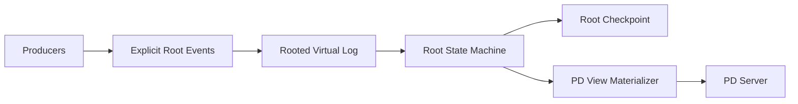

# NoKV Delos-lite Metadata Root 与 Virtual Log 路线

> 状态：统一设计与实施文档。本文档合并了此前关于 future metadata HA、Delos-lite 设计、接口/schema 草案与迁移计划的分散 note，只保留当前代码仍然有效、且能直接指导下一步实现的部分。

## 1. 当前结论

NoKV 的正式控制面模式现在收敛为两种：

1. `single pd + local meta`
2. `3 pd + replicated meta`

这两种模式共享同一套 rooted metadata 领域模型：

- `/Volumes/mac Ds - Data/WorkSpace/GitHub/NoKV/meta/root/event`
- `/Volumes/mac Ds - Data/WorkSpace/GitHub/NoKV/meta/root/state`
- `/Volumes/mac Ds - Data/WorkSpace/GitHub/NoKV/meta/root/materialize`
- `/Volumes/mac Ds - Data/WorkSpace/GitHub/NoKV/meta/root/storage`

差别只在 backend：

- `/Volumes/mac Ds - Data/WorkSpace/GitHub/NoKV/meta/root/backend/local`
- `/Volumes/mac Ds - Data/WorkSpace/GitHub/NoKV/meta/root/backend/replicated`

这就是当前 NoKV 的 Delos-lite 核心取舍：

- `meta/root` 只保留最小 durable truth
- `pd/view` 继续只是 materialized view
- `pd/server` 负责 service semantics，而不是 durable truth
- `local` 与 `replicated` 共享同一套 root domain，而不是维护两套 metadata 系统

## 2. 为什么要参考 Delos

Delos 真正值得借鉴的不是“某个更花的协议”，而是三条架构原则：

1. 把一致性核心压成稳定的小日志面，而不是让上层直接耦合协议细节
2. 把 truth 压到最小，不把 cache、调度运行态、临时观察值塞进共识根
3. 把 truth、materialization、service 分开，让 backend 可以替换

对应到 NoKV，当前已经落地的借鉴点是：

- rooted truth 在 `/Volumes/mac Ds - Data/WorkSpace/GitHub/NoKV/meta/root/...`
- materialized view 在 `/Volumes/mac Ds - Data/WorkSpace/GitHub/NoKV/pd/view/...`
- service semantics 在 `/Volumes/mac Ds - Data/WorkSpace/GitHub/NoKV/pd/server/service.go`
- backend 替换点在 `/Volumes/mac Ds - Data/WorkSpace/GitHub/NoKV/meta/root/backend/...`

这意味着 NoKV 的目标不是“再做一个 etcd 产品”，而是：

> 把当前已经做对的最小 rooted truth，升级成可替换、可复制、可恢复的 metadata root substrate。

## 3. 当前已经完成的部分

### 3.1 领域分层

`meta/root` 已经从单个大包收成下面几层：

- `event`: rooted truth event schema
- `state`: compact rooted state 与 cursor 演进
- `materialize`: rooted state / event 到 descriptor 视图的物化
- `storage`: event log / checkpoint / bootstrap install 的 substrate 边界
- `backend/local`: 单节点正式 backend
- `backend/replicated`: 三副本正式 backend

### 3.2 正式运行模式

`single pd + local meta`：

- 单节点 durable rooted truth
- 当前默认、最稳的正式路径

`3 pd + replicated meta`：

- 三个独立 `pd` 进程
- transport-backed rooted replication
- rooted leader/follower 语义
- 多 PD client failover
- leader failover 后继续写入与读路由
- 节点 rooted state 与 protocol state 可重启恢复

### 3.3 Truth 与 view 分离

当前已经明确：

- rooted truth 变化先落 `meta/root`
- `pd/view` 从 rooted snapshot / refresh 重建
- `pd/server` 写路径已经改成 `persist rooted truth first, apply view later`

这是正确的控制流；否则 leader 本地 view 会在持久化失败时漂移。

### 3.4 Event-first 主路径

当前 steady-state topology truth 已经基本统一到 explicit root event：

- split / merge / peer-change
- region tombstone
- scheduler 事件驱动的 region 更新

`PublishRegionDescriptor(...)` 现在已经明确退回为：

1. heartbeat-only
2. bootstrap-only
3. compatibility-only

它不再是 steady-state truth path。

## 4. 当前系统里什么算 rooted truth

rooted truth 只应包括：

- allocator fences
- store membership truth
- region descriptor truth
- split / merge / peer-change committed truth
- tombstone truth

不应包括：

- route cache
- scheduler runtime state
- operator progress
- hot region observation
- 临时心跳统计

这条边界必须继续守住。否则 `meta/root` 会重新长成“大 metadata DB”，直接偏离 Delos-lite 的目标。

## 5. 当前代码结构的职责

### 5.1 `meta/root`

职责：

- 保存和恢复最小 rooted truth
- 维护 compact rooted state
- 定义 event/state/materialize/storage/backend 边界

它不应该拥有：

- `pd` 级别 service 语义
- route lookup API
- scheduler 运行态

### 5.2 `pd/storage`

职责：

- 从 rooted snapshot 加载 `pd` 所需视图
- 做 rooted truth 到 PD snapshot 的薄 materializer
- 提供 refresh / leader-aware glue

它不应该继续承担：

- 大量 descriptor diff 推断
- RootEpoch 偷偷补丁式修复
- 第二套隐式状态机

### 5.3 `pd/server`

职责：

- 对外暴露 API
- 做 leader-only write / any-node read 语义
- 在写入前把输入组装成正确 rooted event
- persist rooted truth 后再更新本地 view

### 5.4 `pd/view`

职责：

- route directory
- cluster runtime view
- store/region heartbeat 物化结果

它必须继续保持“可重建、可丢弃”，不能变成 truth authority。

## 6. Virtual Log 在 NoKV 里的目标形状

NoKV 不需要复刻完整 Delos。更合理的是一个 Delos-lite 的 rooted virtual log：

这里的 `Rooted Virtual Log` 不应被理解成“新的大通用日志系统”，而是：

- ordered committed truth stream
- snapshot / compaction / catch-up 的稳定边界
- `local` 与 `replicated` 共用的上层语义面

### 6.1 它最终应该提供什么

从上层视角，Virtual Log 最终应该稳定表达四件事：

1. `Append(event...)`
2. `ReadCommitted(after)`
3. `InstallSnapshot(snapshot, tail)`
4. `Compact(upto)`

其中最关键的是：

- 上层依赖 committed truth stream
- 不直接依赖具体 raft/rawnode/transport 细节

### 6.2 当前已经有的雏形

现在的基础已经存在，但还没完全收成稳定面：

- `/Volumes/mac Ds - Data/WorkSpace/GitHub/NoKV/meta/root/storage/interfaces.go`
- `/Volumes/mac Ds - Data/WorkSpace/GitHub/NoKV/meta/root/backend/local`
- `/Volumes/mac Ds - Data/WorkSpace/GitHub/NoKV/meta/root/backend/replicated`

当前已经有：

- committed rooted tail
- rooted checkpoint
- bootstrap install
- compaction
- restart recovery
- replicated transport-backed driver

还没有完全做好的，是把这些能力统一提升成一个长期稳定的 virtual log surface。

## 7. 当前离完整 Delos-lite 还差什么

### 7.1 follower sync 仍然偏工程务实

现在 follower view 同步已经可用，但主要还是：

- wait for change
- refresh
- catch-up

还不是更成熟的：

- push / notify 驱动的 materialization

这不是 correctness bug，但它仍是一个明显的下一步。

### 7.2 virtual log 稳定面还没完全收硬

现在的 `storage` / `backend/replicated` 已经能跑，但还更像 working backend，而不是完全稳定的 virtual log substrate。

当前最大缺口是：

- committed stream 的正式语义还不够清楚
- catch-up / snapshot install / compaction 的统一边界还需要再收
- 上层还没有一个明确、简短、长期稳定的 log-facing interface

### 7.3 deployment / ops story 还不够完整

当前已经验证：

- 3 进程启动
- 选主
- failover
- restart

但还没有完全收成：

- 节点替换步骤
- workdir 布局规范
- follower 落后时的恢复策略说明
- 更系统的 observability / 运维接口

## 8. 当前已经不再建议做的事

下面这些方向当前都不应优先：

1. 动态 membership
2. 超过 3 个控制面副本
3. 把更多 runtime state 塞进 root truth
4. 先追 CURP / Bizur / 更复杂协议优化
5. 再做一层独立 metadata 集群，把 `pd` 和 `meta` 完全拆成两套部署单元

NoKV 当前的正确收敛仍然是：

- `single pd + local meta`
- `3 pd + replicated meta`

而不是扩大控制面规模和复杂度。

## 9. 下一阶段的实现重点

后续工作不应再集中在 compat path 清理，而应转到 Virtual Log substrate。

### 阶段 A：定义正式 Virtual Log 面

目标：

- 重新审视 `/Volumes/mac Ds - Data/WorkSpace/GitHub/NoKV/meta/root/storage/interfaces.go`
- 把 committed stream / snapshot install / compaction 的上层语义写死
- 让 `local` 与 `replicated` 都能明确对齐到同一个 log-facing contract

完成标志：

- 能用一组稳定接口描述 rooted committed stream
- 上层不再需要知道 backend 的实现细节

### 阶段 B：推进 catch-up / notify 机制

目标：

- 从“wait + refresh”继续推进到更明确的 change notification / stream advancement 模型
- 让 follower view 更新更贴近 committed truth 推进，而不是依赖外部定时逻辑

完成标志：

- follower service 的 catch-up 以 committed truth advancement 为主驱动
- refresh 退成 bounded fallback，而不是主同步手段

### 阶段 C：收 deployment / ops

目标：

- 固化三副本控制面的 workdir 和启动规范
- 明确 failover / restart / replace node 的 playbook
- 补更完整的 smoke / restart / failover 文档与测试

### 阶段 D：最后再评估更强的优化

只有 A/B/C 稳定以后，才值得重新评估：

- 更积极的 follower push
- 更强的 protocol/runtime observability
- 更复杂的 fast path

## 10. 评价

当前这套设计最值钱的地方，不是“已经做成了完整 Delos”，而是：

1. 把控制面的根压得足够小
2. 把 truth / view / service 的边界做对了
3. 让 `local` 与 `replicated` 共用同一套 rooted metadata 领域模型
4. 让 NoKV 的 metadata HA 演进成 backend 替换问题，而不是整套控制面重写问题

这已经足够说明方向是对的。

当前最该做的，不再是继续抠 compat 接口，而是：

> 把 Delos-lite 的下一阶段真正落在 rooted Virtual Log substrate 上。
