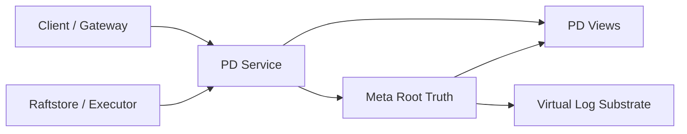
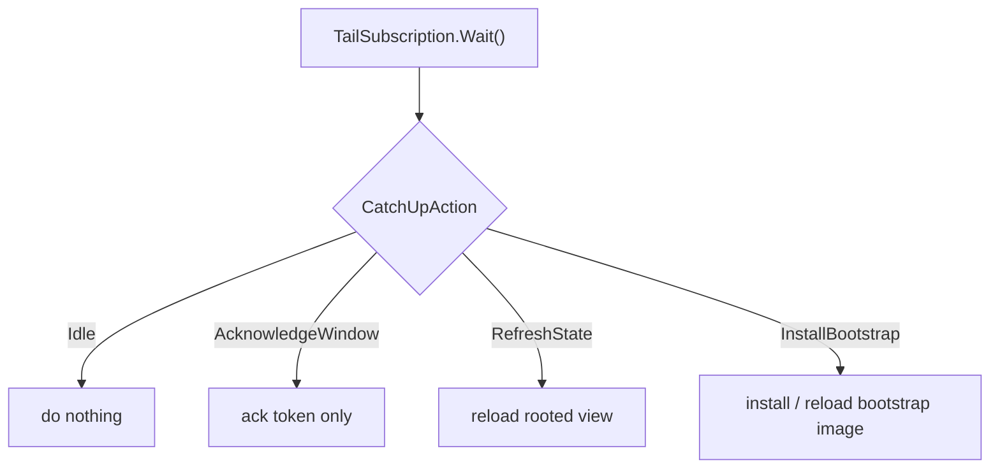

# Rooted Metadata、Delos-lite 与 Virtual Log 设计说明

> 状态：当前 NoKV metadata/control-plane 主线设计说明。本文档合并了此前关于“最小 metadata root 与自描述 region”以及“Delos-lite Metadata Root 与 Virtual Log 路线”的两篇 note，只保留当前代码仍然有效、且能直接指导后续实现与研究的部分。

## 1. 为什么现在要把文档合并

NoKV 之前关于 metadata/control-plane 的说明分散在两篇 note 里：

- 一篇强调最小 metadata root、自描述 region、`RegionMeta` 与 `Descriptor` 的边界。
- 一篇强调 Delos-lite、Virtual Log、local/replicated backend 和后续路线。

这两篇文章讲的是同一条主线的两个侧面。继续并排保留，会产生三个问题：

1. 同一组边界被重复描述。
2. 读者要自己猜哪些内容已经过时。
3. 代码继续演进后，两篇 note 很容易漂移。

所以这里直接合并成一篇正式说明，目标很简单：

- 把 NoKV 当前已经成立的 metadata/control-plane 设计一次讲清楚。
- 明确哪些是已经实现的，哪些只是下一阶段研究方向。
- 把 Delos 借鉴点和 NoKV 当前真实实现区分开，不再混说。

## 2. 当前结论

NoKV 当前的正式模式可以理解成三层：

1. `meta/root`
   - 最小 durable truth
   - transition state machine
   - rooted virtual-log substrate
2. `pd`
   - rooted route view
   - rooted transition/operator view
   - proposal gate + service host
3. `raftstore`
   - data-plane executor
   - 消费 target
   - 执行 local raft/admin change
   - 发布 terminal truth

它们之间的关系是：

当前最关键的判断有三条：

1. `meta/root` 已经不是临时存储，而是真正的最小真相核。
2. `pd` 已经不再是 authority，而是 rooted view 和 service 层。
3. `raftstore` 已经从“半个 control-plane”收敛成越来越纯的 executor。

## 3. 当前产品模式

NoKV 当前的控制面正式模式只有两种：

1. `single pd + local meta`
2. `3 pd + replicated meta`

这两种模式共享同一个 rooted metadata 领域模型：

- `/Volumes/mac Ds - Data/WorkSpace/GitHub/NoKV/meta/root/event`
- `/Volumes/mac Ds - Data/WorkSpace/GitHub/NoKV/meta/root/state`
- `/Volumes/mac Ds - Data/WorkSpace/GitHub/NoKV/meta/root/materialize`
- `/Volumes/mac Ds - Data/WorkSpace/GitHub/NoKV/meta/root/storage`

差别只在 backend：

- `/Volumes/mac Ds - Data/WorkSpace/GitHub/NoKV/meta/root/backend/local`
- `/Volumes/mac Ds - Data/WorkSpace/GitHub/NoKV/meta/root/backend/replicated`

这点非常重要，因为它意味着：

- 单机不是另一套 metadata 系统。
- 高可用也不是另一套 metadata 系统。
- 上层 `pd` 和 `raftstore` 不需要针对 local/replicated 分叉设计。

## 4. 为什么要借鉴 Delos

NoKV 参考 Delos，不是为了照搬它的协议实现，而是为了借鉴它最值钱的结构原则。

真正借鉴的是这四条：

### 4.1 最小真相源

真正需要强一致、需要 durable、需要全局收敛的东西应该尽量少。

在 NoKV 里，这些东西进入了 `meta/root`：

- region descriptor truth
- peer change / split / merge transition truth
- allocator fence truth
- compact checkpoint
- retained committed tail

这些东西不应该进入 `meta/root`：

- 高频 heartbeat
- store load
- hot region 观测
- scheduler runtime 草稿
- cache / view / stats

### 4.2 truth / view / service 分离

Delos 的关键不是“有个 log”，而是：

- truth 不等于 service
- service 不等于 protocol
- materialized view 可以从 truth 重建

NoKV 当前对应关系已经比较清楚：

- truth：`meta/root`
- view：`pd/view`、`pd/core`
- service：`pd/server`

### 4.3 virtual log 而不是把上层绑死在协议细节上

上层消费的应该是：

- committed truth stream
- checkpoint
- catch-up/install/compaction contract

而不是：

- raft rawnode
- term/vote 细节
- transport 细节
- protocol storage layout

### 4.4 backend 可替换

Delos-lite 的价值在于：

- 上层 rooted domain 稳定
- 底层 backend 可演进

对应到 NoKV，就是：

- `backend/local`
- `backend/replicated`

共享同一个 `meta/root` 领域面，而不是维护两套 metadata 实现。

## 5. 当前 `meta/root` 到底是什么

`meta/root` 现在是 NoKV 的最小 metadata truth kernel。

关键代码路径：

- `/Volumes/mac Ds - Data/WorkSpace/GitHub/NoKV/meta/root/event/types.go`
- `/Volumes/mac Ds - Data/WorkSpace/GitHub/NoKV/meta/root/state`
- `/Volumes/mac Ds - Data/WorkSpace/GitHub/NoKV/meta/root/storage/substrate.go`

它负责：

- 定义显式 `RootEvent`
- 定义 compact rooted `Snapshot`
- 定义 transition lifecycle
- 定义 pending execution state
- 定义 virtual-log read/install/catch-up/compaction contract

它不负责：

- route lookup API
- heartbeat runtime state
- scheduler runtime decisions
- operator runtime lifecycle
- data-plane local recovery

这条边界已经是对的，而且要继续守住。

## 6. `RegionMeta`、`Descriptor`、`RootEvent` 的分层

当前这三个对象已经各归其位。

### `RegionMeta`

位置：
- `/Volumes/mac Ds - Data/WorkSpace/GitHub/NoKV/raftstore/localmeta`

角色：
- store-local execution / recovery object
- 单机恢复真相
- 不应该成为跨层 authority schema

### `Descriptor`

位置：
- `/Volumes/mac Ds - Data/WorkSpace/GitHub/NoKV/raftstore/descriptor`

角色：
- 跨层共享的 topology object
- PD route view 的语言
- rooted truth payload 的主要对象

### `RootEvent`

位置：
- `/Volumes/mac Ds - Data/WorkSpace/GitHub/NoKV/meta/root/event/types.go`

角色：
- explicit rooted truth transition
- metadata/control-plane 正式写语言

一句话：

- `RegionMeta` 是本地执行态
- `Descriptor` 是共享拓扑对象
- `RootEvent` 是 durable truth transition

## 7. `meta` 和 `pd` 现在隔离得怎么样

当前这条边界已经比较清楚，而且是当前分支最重要的进展之一。

### `meta/root` 负责的事情

- 保存和恢复最小 rooted truth
- transition state machine
- checkpoint + retained tail
- catch-up / install / compaction contract

### `pd` 负责的事情

- rooted route view
- rooted transition/operator view
- proposal gate
- liveness service
- 对外 RPC 语义

### 当前已经做到的隔离

1. `pd` 不再维护第二份 authority metadata。
2. `pd` 写路径是 `persist rooted truth first, reload rooted view later`。
3. liveness 已经从 truth path 分开。
4. operator/debug surface 也是 rooted projection，不是 `pd` 自己发明的平行状态机。

这意味着：

- `pd` 可以失效
- `pd` 可以重建
- `pd` view 可以丢弃并重新 materialize
- truth 仍然稳定留在 `meta/root`

## 8. 当前 `pd` 的职责

关键代码：

- `/Volumes/mac Ds - Data/WorkSpace/GitHub/NoKV/pd/storage/root.go`
- `/Volumes/mac Ds - Data/WorkSpace/GitHub/NoKV/pd/core/cluster.go`
- `/Volumes/mac Ds - Data/WorkSpace/GitHub/NoKV/pd/view/transition_view.go`
- `/Volumes/mac Ds - Data/WorkSpace/GitHub/NoKV/pd/server/service.go`
- `/Volumes/mac Ds - Data/WorkSpace/GitHub/NoKV/pd/server/transition_service.go`

现在 `pd` 已经比较清楚地承担三件事：

### 8.1 rooted route view

- `Descriptor` route directory
- `GetRegionByKey`
- region/store heartbeat runtime observation

### 8.2 rooted transition/operator view

- pending / completed / conflict / superseded / cancelled / aborted
- operator/debug inspection
- transition assessment RPC

### 8.3 proposal gate

- 接收来自 client / executor 的变更意图
- 先评估 rooted lifecycle
- persist truth
- 再刷新 rooted view

## 9. 当前 `raftstore` 的角色

关键代码：

- `/Volumes/mac Ds - Data/WorkSpace/GitHub/NoKV/raftstore/store/transition_executor.go`
- `/Volumes/mac Ds - Data/WorkSpace/GitHub/NoKV/raftstore/store/membership_service.go`
- `/Volumes/mac Ds - Data/WorkSpace/GitHub/NoKV/raftstore/store/admin_service.go`
- `/Volumes/mac Ds - Data/WorkSpace/GitHub/NoKV/raftstore/store/region_manager.go`

`raftstore` 当前已经不是旧式的“本地先改 descriptor，再顺手推导 truth”。

它当前更接近：

1. 构造 rooted transition target
2. 执行 local raft/admin proposal
3. 本地 apply data-plane change
4. 发布 terminal rooted truth

最近这轮又收了一步：

- target 现在携带的是语义 proposal 对象，而不是已经编码好的 proposal 字节
- executor 负责：
  - leader check
  - marshal admin proposal
  - send conf/admin
  - publish terminal truth

这说明 `raftstore` 正在继续纯 executor 化。

## 10. NoKV 里的 Virtual Log 是什么

这里的 Virtual Log 不是一个新的大通用日志系统，而是 rooted metadata truth 的稳定 substrate。

关键代码：

- `/Volumes/mac Ds - Data/WorkSpace/GitHub/NoKV/meta/root/storage/substrate.go`

当前它主要围绕这些对象构建：

### `Checkpoint`

- 一个 compact rooted snapshot
- 带 `TailOffset`

### `CommittedTail`

- 一个 retained committed truth tail
- 带 `RequestedOffset / StartOffset / EndOffset`

### `ObservedCommitted`

- `Checkpoint + CommittedTail`
- 一个完整的 rooted read image

### `TailToken`

- 一次 follower/consumer 已知的 tail frontier

### `TailAdvance`

- 相对于某个 token 的 tail 变化结果
- 包括：
  - `TailAdvanceUnchanged`
  - `TailAdvanceCursorAdvanced`
  - `TailAdvanceWindowShifted`

### `TailWindow`

- retained window 本身的边界

### `TailCatchUpAction`

现在不只是“要不要 refresh”，而是：

- `TailCatchUpIdle`
- `TailCatchUpRefreshState`
- `TailCatchUpAcknowledgeWindow`
- `TailCatchUpInstallBootstrap`

### `TailSubscription`

这轮又往前收了一层，增加了 watch-like subscription：

- `NewTailSubscription(...)`
- `Wait(...)`
- `Acknowledge(...)`
- `Token()`

它的意义是：

- follower 不再到处手搓 `TailToken` 循环
- watch / catch-up contract 现在开始成为显式对象

## 11. Virtual Log 的实际工作方式

### 11.1 写入

上层 append 的不是裸协议 entry，而是：

- `RootEvent`

backend 把它们变成：

- committed rooted truth stream

### 11.2 读取

上层看到的是：

- 当前 checkpoint
- 当前 retained committed tail
- 相对上次观察到了什么变化

而不是直接去理解 protocol log / transport / memory storage。

### 11.3 follower catch-up

当前 follower catch-up 已经围绕 `TailAdvance` 工作：

这意味着 catch-up 已经不是“简单定时 refresh”，而是有了正式 contract。

### 11.4 compaction

现在 compaction 已经统一到 install contract 上：

- `PlanTailCompaction(...)`
- `plan.Observed(snapshot)`
- `InstallBootstrap(observed)`

这样 compaction、bootstrap install、recovery install 用的是同一条 substrate 语义，而不是 backend 私有分支逻辑。

## 12. 现在底层协议是不是已经变了

没有。当前 replicated backend 的协议驱动仍然是 raft。

关键代码：

- `/Volumes/mac Ds - Data/WorkSpace/GitHub/NoKV/meta/root/backend/replicated/network_driver.go`
- `/Volumes/mac Ds - Data/WorkSpace/GitHub/NoKV/meta/root/backend/replicated/driver.go`

也就是说：

- 底层 replicated metadata backend 目前仍然是 raft 驱动
- 并没有直接替换成 CURP 或别的协议

真正变化的是：

- 上层已经基本不直接消费 raft 细节
- 上层更多消费的是 `ObservedCommitted`、`TailAdvance`、`TailSubscription`、`InstallBootstrap` 这类稳定 contract

这很关键，因为它意味着：

- 未来如果研究不同 replicated substrate
- 改动的主战场在 `meta/root/backend/replicated`
- 而不是去污染 `pd` 或 `meta/root/state`

## 13. 当前 durable layout

metadata/control-plane 相关 durable 文件现在已经统一成：

### `pd` workdir

- `root.checkpoint.binpb`
- `root.events.wal`
- `root.raft.bin`（replicated mode only）

### `raftstore/localmeta`

- `replicas.binpb`
- `raft-progress.binpb`

### snapshot dir

- `snapshot.json`
- `tables/*.sst`

它们的职责也已经明确：

- `root.checkpoint.binpb` + `root.events.wal`
  - rooted cluster truth
- `root.raft.bin`
  - replicated backend protocol recovery state
- `replicas.binpb` + `raft-progress.binpb`
  - store-local recovery state
- `snapshot.json` + `tables/*.sst`
  - region snapshot payload

## 14. 当前这条主线已经做完了什么

当前已经基本完成的收敛：

1. `meta/root` 成为最小 truth kernel
2. `pd` 退出 authority 角色
3. liveness 从 truth path 分离
4. `RootEvent` 成为正式 truth 写语言
5. `peer/split/merge` transition state machine 明显成型
6. cancel / conflict / superseded / aborted / retry class 已闭环
7. operator/debug surface 已正式 RPC 化
8. durable 文件命名和格式语义已清晰化
9. Virtual Log read/install/catch-up/compaction contract 已经明显成型

## 15. 当前还没到终局的地方

这条主线已经工程化，但还没到工业终局。

主要还差：

### 15.1 operator runtime / scheduler lifecycle

当前已经有 transition/operator view，但还没有成熟的：

- owner
- attempt
- backoff
- admission
- anti-thrash
- placement / failure-domain policy

### 15.2 replicated substrate 还值得继续研究

尤其是：

- watch/subscribe 进一步 formalization
- protocol driver 与 substrate adapter 继续细分
- catch-up/install 策略调优
- potential alternative protocol exploration

### 15.3 `raftstore` 还可以继续纯 executor 化

当前它已经更像 executor，但 target construction 仍然长在 store 层。后面如果继续深入，可以让 planner surface 更明确，再把 executor 压窄。

## 16. 当前不应该做什么

下面这些方向现在都不应该抢优先级：

1. 再把 runtime state 塞回 `meta/root`
2. 重新让 `pd` 长成 authority
3. 先追更复杂协议优化
4. 提前做过度复杂的 control-plane deployment 拆分
5. 在 `raftstore` 里继续加新的 control-plane 语义

## 17. 这套设计为什么适合作为研究平台

因为它已经满足研究平台最需要的三个条件：

### 17.1 主骨架稳定

- truth / view / executor 已分开
- durable layout 清楚
- local / replicated 共用一个 root domain

### 17.2 关键边界没有缠死

- 可以单独研究 `replicated backend`
- 可以单独研究 `scheduler/operator runtime`
- 可以单独研究 `executor pureification`

### 17.3 不需要先推翻架构

当前后续研究大多是“继续在正确结构上深入”，而不是“先拆掉重来”。

## 18. 一句话总结

NoKV 当前这条 metadata/control-plane 主线，已经是一条成立的 Delos-lite 设计：

- `meta/root` 是最小 durable truth kernel
- `pd` 是 rooted view + service + proposal gate
- `raftstore` 是越来越纯的 data-plane executor
- Virtual Log substrate 已经围绕 `ObservedCommitted`、`TailAdvance`、`TailSubscription`、`InstallBootstrap`、`PlanTailCompaction` 建立起稳定 contract
- 底层 replicated backend 目前仍然是 raft 驱动，但上层已经基本不被 raft 细节绑死

这意味着 NoKV 现在已经不仅适合作为工程主线继续演进，也非常适合作为 metadata architecture、operator runtime、scheduler、protocol substrate 和 distributed storage experiment 的研究平台。
