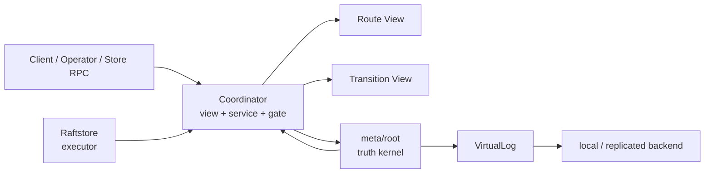
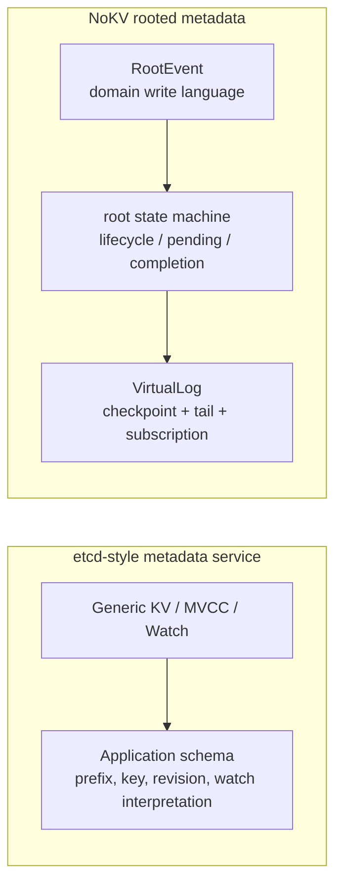
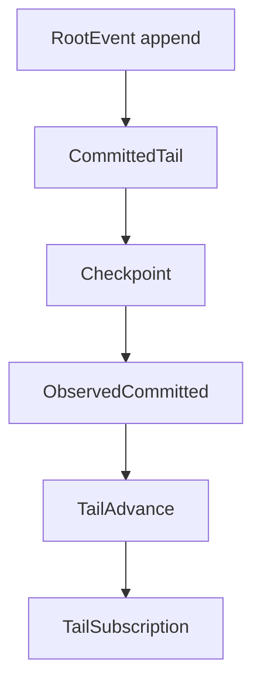
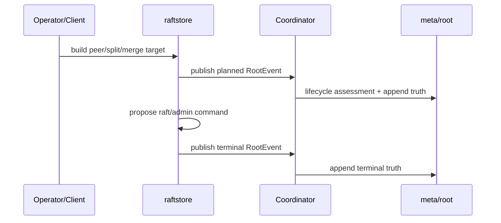
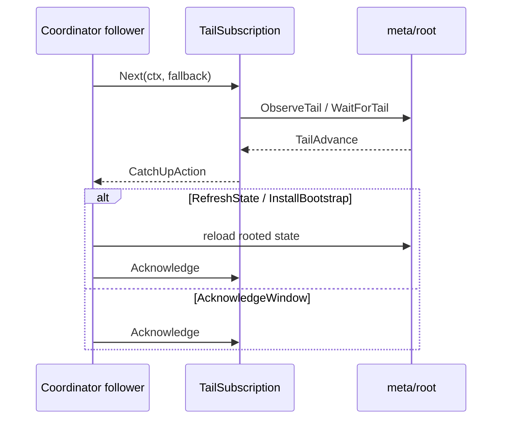

# 2026-04-03 Rooted Metadata, Delos-lite, and the VirtualLog

> Status: the canonical design note for NoKV's current metadata / control-plane mainline. This document explains, end to end, the responsibilities, call chains, and persistence layout of the three layers `meta/root`, `coordinator`, and `raftstore`, the VirtualLog, and how all of this relates to Delos- and etcd-style metadata services.

## TL;DR

- 🧭 Topic: why NoKV's current `meta/root + coordinator + raftstore` control plane is a Delos-lite mainline.
- 🧱 Core objects: `RootEvent`, `ObservedCommitted`, `TailAdvance`, `TailSubscription`, `TransitionAssessment`.
- 🔁 Call chain: `planned truth -> execute -> terminal truth` and `watch-first catch-up`.
- 📚 References: Delos, FoundationDB, TiKV/PD+etcd, CockroachDB.

## 1. Why this document exists

Over the last few rounds, NoKV has consolidated its metadata / control-plane mainline into something that's actually engineering-coherent:

- `meta/root` is the minimal truth kernel.
- `coordinator` is no longer authority — it's a rooted view + service + proposal gate.
- `raftstore` is converging on a target-driven executor.
- `local` and `replicated` backends share the same rooted domain.

If we don't write this mainline down explicitly, it's easy to slide back into the bad shapes:

1. `coordinator` regrows into "brain plus database".
2. Runtime observation and durable truth get tangled together again.
3. `raftstore` takes on too much control-plane responsibility again.
4. The replicated backend's protocol details leak upward and pollute the upper-layer domain model.

So this document isn't describing a wishful picture. It pins down:

- What we have actually built.
- Why this layering.
- How it differs from Delos- / etcd-style designs.
- Which pieces are stable, and which are still research space.

## 2. Current conclusion

NoKV's current metadata / control-plane is best read as three layers:

1. `meta/root`
   - Minimal durable truth.
   - Transition state machine.
   - Rooted `VirtualLog` contract.
2. `coordinator`
   - Rooted route view.
   - Rooted transition view.
   - Proposal gate + service host.
3. `raftstore`
   - Data-plane executor.
   - Consumes targets.
   - Executes local raft / admin change.
   - Publishes terminal truth.

Overall:

The three load-bearing judgments are:

1. `meta/root` is not a temporary store — it's the minimal source of truth.
2. `coordinator` is not authority — it's a rooted view and service layer.
3. `raftstore` is no longer half a control plane — it's converging on a pure executor.

## 3. Currently supported product modes

The metadata / control-plane currently has exactly two officially supported modes:

1. `single coordinator + local meta`
2. `3 coordinator + replicated meta`

Both share the same rooted metadata domain surface:

- `meta/root/event`
- `meta/root/state`
- `meta/root/materialize`
- `meta/root/storage`

The only difference is the backend:

- `meta/root/backend/local`
- `meta/root/backend/replicated`

This matters because it implies:

- Single-node isn't a separate metadata system.
- HA isn't a separate metadata system.
- The upper-layer `coordinator` and `raftstore` don't need to fork their design between local and replicated.

## 4. Why we borrow from Delos rather than build an etcd-style metadata service

NoKV doesn't borrow from Delos because we're cloning a protocol. We borrow it for its most valuable structural principles.

### 4.1 Minimal source of truth

The set of facts that genuinely need strong consistency, durability, and global convergence should be as small as possible.

In NoKV, `meta/root` admits only:

- Region descriptor truth.
- Peer change / split / merge transition truth.
- Allocator fence truth.
- Compact checkpoint.
- Retained committed tail.

It does **not** admit:

- High-frequency heartbeat.
- Store load.
- Hot region observations.
- Scheduler runtime drafts.
- Route cache.

### 4.2 Truth / view / service separation

The Delos lesson isn't "have a log". It's:

- Truth ≠ service.
- Service ≠ protocol.
- Materialized view can be rebuilt from truth.

NoKV's mapping:

- Truth: `meta/root`.
- View: `coordinator/catalog`, `coordinator/view`.
- Service: `coordinator/server`.

### 4.3 A virtual log, not upper layers bolted to protocol details

Upper layers should consume:

- A committed truth stream.
- Checkpoints.
- A catch-up / install / compaction contract.

Not:

- Raft RawNode.
- Term / vote / transport details.
- Protocol storage layout.

### 4.4 Replaceable backend

The engineering value of Delos-lite is:

- Upper-layer rooted domain stays stable.
- Lower-layer backend can evolve.

In NoKV that becomes:

- `backend/local`
- `backend/replicated`

sharing the same root domain.

## 5. How this differs from an etcd-style metadata service

If you stored metadata directly in etcd, the natural shape would be:

- Express region, operator, runtime state via key/value.
- Stitch catch-up out of revision/watch.
- Interpret lifecycle in application schema.

NoKV picked a different path:

- The write language is `RootEvent`.
- The read language is `Snapshot + CommittedTail`.
- The catch-up language is `TailAdvance / TailSubscription`.
- Lifecycle semantics are baked into `meta/root/state`.

Said simply:

> etcd is a general-purpose distributed KV.
> NoKV's `meta/root` is a purpose-built metadata truth kernel.

The two routes look like this:

This makes NoKV a better research platform, because what we're researching is:

- Minimal truth model.
- Control-plane layering.
- Virtual log contract.
- Backend replaceability.

Rather than how to encode those semantics inside etcd's keyspace.

## 6. What `meta/root` actually is

Key code:

- `meta/root/event/types.go`
- `meta/root/state`
- `meta/root/storage/virtual_log.go`

`meta/root` is currently NoKV's minimal metadata truth kernel.

Its job:

- Define explicit `RootEvent`s.
- Define a compact rooted `Snapshot`.
- Define the transition lifecycle.
- Define pending execution state.
- Define the `VirtualLog` read / install / catch-up / compaction contract.

What it does **not** do:

- Route lookup APIs.
- Heartbeat runtime state.
- Scheduler runtime decisions.
- Scheduler / runtime lifecycle.
- Store-local recovery.

This boundary is correct today — it must be defended.

## 7. The layering of `RegionMeta`, `Descriptor`, and `RootEvent`

These three objects are now in their proper places.

### `RegionMeta`

Location:

- `raftstore/localmeta`

Role:

- Store-local execution / recovery object.
- Single-node recovery truth.
- Should not become a cross-layer authority schema.

### `Descriptor`

Location:

- `raftstore/descriptor`

Role:

- Cross-layer shared topology object.
- The language of Coordinator's route view.
- The primary payload object of rooted truth.

### `RootEvent`

Location:

- `meta/root/event/types.go`

Role:

- Explicit rooted truth transition.
- The official write language of metadata / control-plane.

One sentence:

- `RegionMeta` is local execution state.
- `Descriptor` is the shared topology object.
- `RootEvent` is durable truth transition.

## 8. How well are `meta` and `coordinator` isolated today

The boundary is reasonably crisp now, and it's one of the most important wins of the current mainline.

### `meta/root` owns

- Persisting and recovering minimal rooted truth.
- The transition state machine.
- Checkpoint + retained tail.
- The catch-up / install / compaction contract.

### `coordinator` owns

- Rooted route view.
- Rooted transition view.
- Proposal gate.
- Liveness service.
- External-facing RPC.

### Isolation already in place

1. `coordinator` no longer keeps a second copy of authority metadata.
2. The `coordinator` write path is `persist truth first, reload rooted view later`.
3. Liveness is split off the truth path.
4. Transition / debug surfaces are rooted projections, not a parallel state machine kept by `coordinator`.

This means:

- `coordinator` may fail.
- `coordinator` may be rebuilt.
- The `coordinator` view may be discarded and rebuilt.
- Truth still sits stably in `meta/root`.

## 9. What `coordinator` actually does today

Key code:

- `coordinator/storage/root.go`
- `coordinator/catalog/cluster.go`
- `coordinator/server/service.go`
- `coordinator/server/transition_service.go`

Today, `coordinator` does:

- Rooted snapshot → runtime route view.
- Rooted pending transition → transition view.
- Leader-only proposal gate.
- Liveness / allocator / route RPC.
- Assessment / inspection RPC.

That is:

`coordinator` is not a metadata DB. `coordinator` is the service host and view host for rooted metadata.

## 10. What `raftstore` actually does today

Key code:

- `raftstore/store/transition_builder.go`
- `raftstore/store/transition_executor.go`
- `raftstore/store/transition_outcome.go`
- `raftstore/store/membership_ops.go`
- `raftstore/store/admin_ops.go`

`raftstore` is converging on this shape:

1. Build target.
2. Execute target.
3. Local apply.
4. Publish terminal truth.

That is, it's increasingly a pure executor — not half a control plane.

## 11. How the `VirtualLog` is designed

Core in:

- `meta/root/storage/virtual_log.go`

Key objects:

- `Checkpoint`
- `CommittedTail`
- `ObservedCommitted`
- `TailToken`
- `TailAdvance`
- `TailWindow`
- `TailSubscription`
- `TailCompactionPlan`

### What it expresses

It does **not** "expose the raft log directly".

It expresses:

1. What the current compact rooted truth is.
2. What the current retained committed tail is.
3. What changed since the last observation.
4. Whether to refresh, ack a window, or install bootstrap.

### Read / write contract

### Follower catch-up

Followers no longer just timer-reload. They use:

- `TailSubscription.Next(...)`
- `TailAdvance.CatchUpAction()`

to decide:

- `Idle`
- `RefreshState`
- `AcknowledgeWindow`
- `InstallBootstrap`

This pulls catch-up semantics formally into the VirtualLog contract instead of letting them sprawl as if/else at the entry layer.

## 12. Local backend vs replicated backend

### `backend/local`

Location:

- `meta/root/backend/local`

Role:

- Single-node rooted metadata storage.
- Persistent files:
  - `root.checkpoint.binpb`
  - `root.events.wal`

### `backend/replicated`

Location:

- `meta/root/backend/replicated`

Role:

- Replicated metadata backend.
- Still raft-driven.
- But the upper layer is already decoupled via `VirtualLog` / `ObservedCommitted`.

Current rough layering:

- `network_driver.go`
  - RawNode / transport / tick / campaign.
- `network_ready.go`
  - Ready drain / protocol persistence / committed decode.
- `network_virtual_log.go`
  - VirtualLog-facing methods.
- `virtual_log_adapter.go`
  - Rooted virtual-log adapter.
- `store.go`
  - Rooted state machine host.

## 13. Persistence layout

### Rooted metadata

- `root.checkpoint.binpb`
- `root.events.wal`
- `root.raft.bin`

### Store-local metadata

- `replicas.binpb`
- `raft-progress.binpb`

### Snapshot

- `snapshot.json`
- `tables/*.sst`

The roles are now clear:

- `meta/root`: cluster truth.
- `root.raft.bin`: protocol recovery state.
- `raftstore/localmeta`: store-local recovery.
- `snapshot/`: region-scoped snapshot contract.

## 14. Actual call logic

### Topology change write path

### Follower catch-up

## 15. Design principles

The five principles this design actually defends:

### 15.1 Truth must be small.

### 15.2 Truth / view / runtime / executor must be layered.

### 15.3 Upper layers must not be bolted to a specific protocol.

### 15.4 Local and replicated must share the same domain surface.

### 15.5 A research platform must first be explainable, before it stacks features.

## 16. References

### Delos

What we borrow:

- Minimal truth kernel.
- Truth / service separation.
- VirtualLog contract.
- Replaceable backend.

### FoundationDB

What we borrow:

- A small, strong consistency root.
- Build a larger service surface on top of a small truth core.

### TiKV / PD + etcd

What it teaches us by contrast:

- Why `coordinator` must not regrow into an authority metadata service.

### CockroachDB

What it teaches us by contrast:

- It leans toward in-band metadata.
- NoKV picks a small out-of-band truth kernel.

## 17. Boundaries already landed

- `meta/root` has become the minimal truth kernel.
- `coordinator` has exited the authority role and primarily owns rooted view, service, and proposal gate.
- `raftstore` has converged toward executor and interacts with the control plane through planned / terminal truth.
- The `VirtualLog` contract has taken shape and is shared by local / replicated backends.
- Route freshness, root lag, catch-up state, transition assessment are part of Coordinator RPC.
- Execution-plane v1 has admission / outcome / publish / restart state and admin diagnostics.

## 18. What we haven't built yet

- No automatic scheduler / control-plane runtime policy.
- No richer transition phases such as `Published` / `Stalled`.
- No client-side policy layer that fully consumes all freshness / degraded / catch-up fields.
- No stronger push/stream API on `VirtualLog`.
- The replicated backend has more room to research stronger commit / compaction / install policies.
- `raftstore` can be pushed further toward pure executor — but the v1 boundary is usable.

## 19. Why this is a good research platform

Because we now have:

1. A clear enough truth kernel.
2. Stable enough view/service boundaries.
3. A clear enough executor surface.
4. A sufficiently independent replicated backend.

So the research can be split:

- Metadata truth model.
- Scheduler / runtime policy.
- Scheduler / orchestrator.
- Replicated protocol / backend.
- Catch-up / compaction / install strategies.

Each can be researched without overturning the whole system.

## 20. Bottom line

The valuable thing about NoKV's current metadata / control-plane design isn't "we built another metadata store". It's:

- We separated minimal truth, view, runtime, and executor explicitly.
- We made `meta/root` a purpose-built rooted metadata truth kernel — not a generic KV.
- We borrowed structural principles from Delos, not the protocol itself.
- We put local / replicated, single-node / distributed, and truth / view all under one stable framework.

That is why this mainline now supports not just code, but continued research on control plane, scheduler, VirtualLog, and protocol directions.
