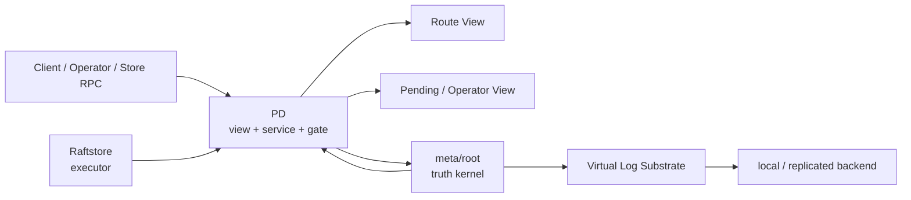
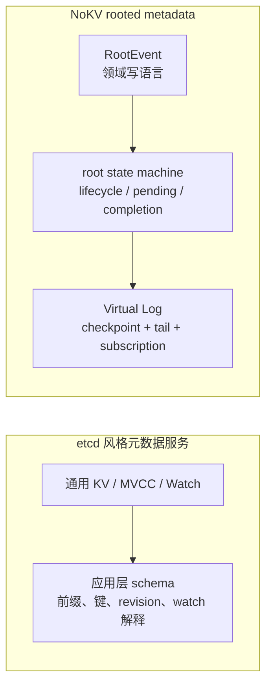
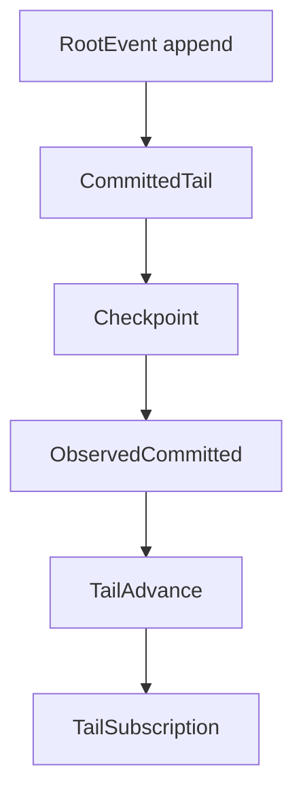
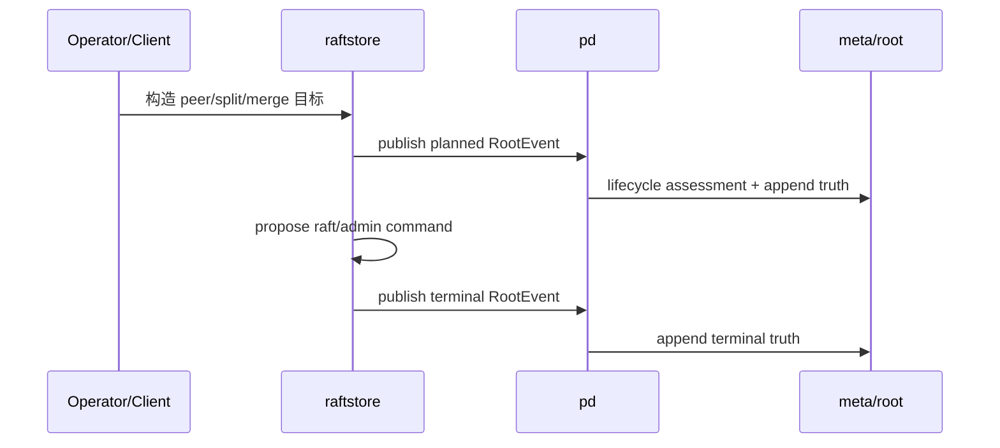
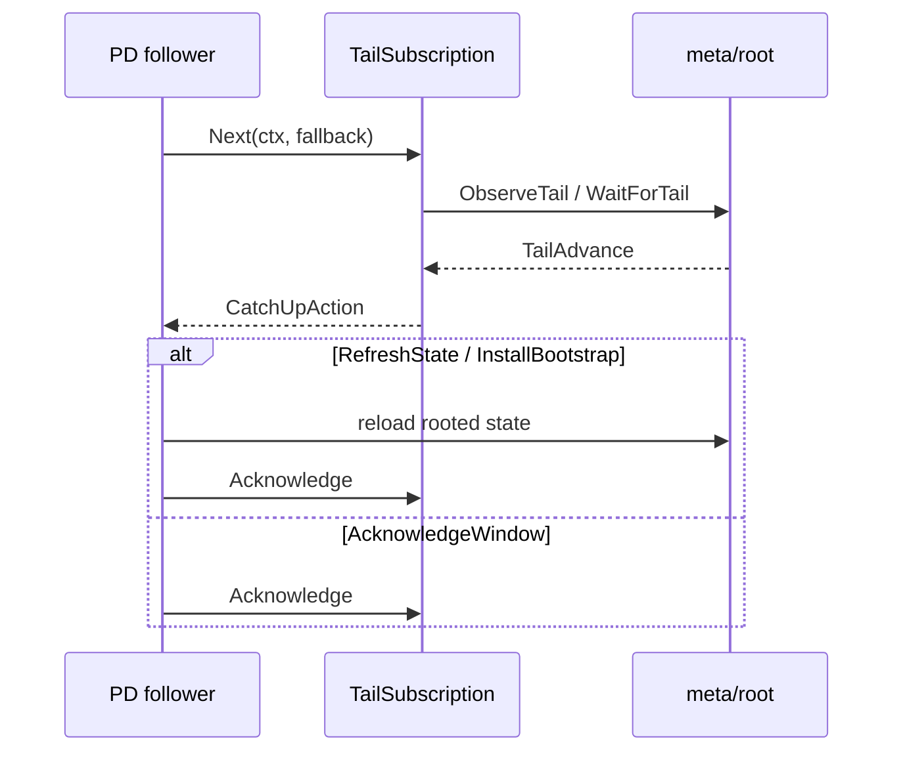

# 2026-04-03 Rooted Metadata、Delos-lite 与 Virtual Log 设计说明

> 状态：当前 NoKV metadata/control-plane 主线的正式设计说明。本文档用中文完整解释 `meta/root`、`pd`、`raftstore` 三层的职责、调用链、持久化布局、Virtual Log substrate，以及它与 Delos / etcd 风格元数据服务的关系。

## 导读

- 🧭 主题：NoKV 当前 `meta/root + pd + raftstore` 控制面为什么是一条 Delos-lite 主线。
- 🧱 核心对象：`RootEvent`、`ObservedCommitted`、`TailAdvance`、`TailSubscription`、`PendingView`。
- 🔁 调用链：`planned truth -> execute -> terminal truth` 与 `watch-first catch-up`。
- 📚 参考对象：Delos、FoundationDB、TiKV/PD+etcd、CockroachDB。

## 1. 为什么需要这篇文档

NoKV 在最近几轮里，已经把 metadata/control-plane 主线收成了一个比较清楚的工程化设计：

- `meta/root` 成为最小 truth kernel
- `pd` 不再是 authority，而是 rooted view + service + proposal gate
- `raftstore` 越来越接近 target-driven executor
- `local` 和 `replicated` backend 共享同一个 rooted domain

如果不把这条主线正式写清楚，后面很容易再次回到这些坏形态：

1. `pd` 重新长成“大脑兼数据库”
2. 运行时观测和 durable truth 混在一起
3. `raftstore` 重新承担过多 control-plane 职责
4. replicated backend 的协议细节反向污染上层领域模型

所以这篇文档的目的不是描述一个理想图，而是明确：

- 当前已经做成了什么
- 为什么要这样分层
- 这和 Delos / etcd 风格设计的区别是什么
- 哪些地方已经稳定，哪些地方仍然属于研究空间

## 2. 当前结论

NoKV 当前的 metadata/control-plane 可以理解成三层：

1. `meta/root`
   - 最小 durable truth
   - transition state machine
   - rooted virtual-log substrate
2. `pd`
   - rooted route view
   - rooted pending/operator view
   - proposal gate + service host
3. `raftstore`
   - data-plane executor
   - consume target
   - 执行 local raft/admin change
   - 发布 terminal truth

整体关系如下：

这套设计最重要的三个判断是：

1. `meta/root` 不是临时存储，而是真正的最小真相源。
2. `pd` 不是 authority，而是 rooted view 和服务层。
3. `raftstore` 不再是半个 control-plane，而是越来越纯的 executor。

## 3. 当前产品模式

当前正式支持的 metadata/control-plane 模式只有两种：

1. `single pd + local meta`
2. `3 pd + replicated meta`

这两种模式共享同一个 rooted metadata 领域面：

- `meta/root/event`
- `meta/root/state`
- `meta/root/materialize`
- `meta/root/storage`

差别只在 backend：

- `meta/root/backend/local`
- `meta/root/backend/replicated`

这点非常重要，因为它意味着：

- 单机不是另一套 metadata 系统
- 高可用也不是另一套 metadata 系统
- 上层 `pd` 和 `raftstore` 不需要为了 local/replicated 分叉设计

## 4. 为什么借鉴 Delos，而不是直接做成 etcd-style metadata service

NoKV 参考 Delos，并不是为了照搬某个协议，而是为了借它最值钱的结构原则。

### 4.1 最小真相源

真正需要强一致、需要 durable、需要全局收敛的东西应该尽量少。

在 NoKV 里，进入 `meta/root` 的只有：

- region descriptor truth
- peer change / split / merge transition truth
- allocator fence truth
- compact checkpoint
- retained committed tail

这些东西不应该进入 `meta/root`：

- 高频 heartbeat
- store load
- hot region 观测
- scheduler runtime 草稿
- route cache

### 4.2 truth / view / service 分离

Delos 的关键不是“有个 log”，而是：

- truth 不等于 service
- service 不等于 protocol
- materialized view 可以从 truth 重建

NoKV 当前已经形成：

- truth：`meta/root`
- view：`pd/core`、`pd/view`、`pd/operator`
- service：`pd/server`

### 4.3 virtual log，而不是把上层绑死在协议细节上

上层应该消费：

- committed truth stream
- checkpoint
- catch-up / install / compaction contract

而不是：

- raft rawnode
- term/vote/transport 细节
- protocol storage layout

### 4.4 backend 可替换

Delos-lite 的工程价值在于：

- 上层 rooted domain 稳定
- 底层 backend 可演进

在 NoKV 中体现为：

- `backend/local`
- `backend/replicated`

共享同一个 root domain。

## 5. 和 etcd 风格 metadata service 有什么不同

如果直接用 etcd 存 metadata，最自然的形态通常会是：

- 用 key/value 表达 region、operator、runtime state
- 用 revision/watch 拼 catch-up
- 用应用层 schema 解释 lifecycle

NoKV 当前选择的是另一条路：

- 写语言是 `RootEvent`
- 读语言是 `Snapshot + CommittedTail`
- catch-up 语言是 `TailAdvance / TailSubscription`
- lifecycle 语义内建在 `meta/root/state`

也就是说：

> etcd 是通用分布式 KV substrate。  
> NoKV 的 `meta/root` 是专用的 metadata truth substrate。

可以把差异简单看成下面两种路线：

这使它更适合作为研究平台，因为你们研究的是：

- 最小 truth model
- control-plane 分层
- virtual log contract
- backend 可替换性

而不是如何在 etcd 的 key space 里拼出这些语义。

## 6. `meta/root` 到底是什么

关键代码：

- `meta/root/event/types.go`
- `meta/root/state`
- `meta/root/storage/substrate.go`

`meta/root` 当前是 NoKV 的最小 metadata truth kernel。

它负责：

- 定义显式 `RootEvent`
- 定义 compact rooted `Snapshot`
- 定义 transition lifecycle
- 定义 pending execution state
- 定义 virtual-log read/install/catch-up/compaction contract

它不负责：

- route lookup API
- heartbeat runtime state
- scheduler runtime 决策
- operator runtime 生命周期
- store-local recovery

这条边界现在是对的，而且必须继续守住。

## 7. `RegionMeta`、`Descriptor`、`RootEvent` 的分层

当前这三个对象已经各归其位。

### `RegionMeta`

位置：

- `raftstore/localmeta`

角色：

- store-local execution / recovery object
- 单机恢复真相
- 不应该成为跨层 authority schema

### `Descriptor`

位置：

- `raftstore/descriptor`

角色：

- 跨层共享的 topology object
- PD route view 的语言
- rooted truth payload 的主要对象

### `RootEvent`

位置：

- `meta/root/event/types.go`

角色：

- explicit rooted truth transition
- metadata/control-plane 正式写语言

一句话：

- `RegionMeta` 是本地执行态
- `Descriptor` 是共享拓扑对象
- `RootEvent` 是 durable truth transition

## 8. `meta` 和 `pd` 现在隔离得怎么样

当前这条边界已经比较清楚，而且是当前主线最重要的成果之一。

### `meta/root` 负责

- 保存和恢复最小 rooted truth
- transition state machine
- checkpoint + retained tail
- catch-up / install / compaction contract

### `pd` 负责

- rooted route view
- rooted pending/operator view
- proposal gate
- liveness service
- 对外 RPC

### 已经做到的隔离

1. `pd` 不再维护第二份 authority metadata。
2. `pd` 写路径是 `persist truth first, reload rooted view later`。
3. liveness 已经从 truth path 分开。
4. operator/debug surface 是 rooted projection，而不是 `pd` 自己维护的平行状态机。

这意味着：

- `pd` 可以失效
- `pd` 可以重建
- `pd` view 可以被丢弃并重建
- truth 仍然稳定留在 `meta/root`

## 9. `pd` 当前到底做什么

关键代码：

- `pd/storage/root.go`
- `pd/core/cluster.go`
- `pd/view/pending_view.go`
- `pd/operator`
- `pd/server/service.go`
- `pd/server/transition_service.go`

当前 `pd` 负责：

- rooted snapshot -> runtime route view
- rooted pending transition -> pending/operator view
- leader-only proposal gate
- liveness / allocator / route RPC
- assessment / inspection RPC

也就是说：

`pd` 不是 metadata DB。`pd` 是 rooted metadata 的服务宿主和 view 宿主。

## 10. `raftstore` 当前到底做什么

关键代码：

- `raftstore/store/transition_builder.go`
- `raftstore/store/transition_executor.go`
- `raftstore/store/transition_outcome.go`
- `raftstore/store/membership_service.go`
- `raftstore/store/admin_service.go`

当前 `raftstore` 越来越接近这样的形态：

1. build target
2. execute target
3. local apply
4. publish terminal truth

也就是说，它越来越像一个纯 executor，而不是半个 control-plane。

## 11. Virtual Log substrate 是怎么设计的

核心在：

- `meta/root/storage/substrate.go`

关键对象：

- `Checkpoint`
- `CommittedTail`
- `ObservedCommitted`
- `TailToken`
- `TailAdvance`
- `TailWindow`
- `TailSubscription`
- `TailCompactionPlan`

### 它到底表达什么

不是“直接暴露 raft log”。

它表达的是：

1. 当前 compact rooted truth 是什么
2. 当前 retained committed tail 是什么
3. 相对上次观察，这次发生了什么变化
4. 该 refresh、ack window，还是 install bootstrap

### 读写合同

### follower catch-up 逻辑

当前 follower 不再只是定时 reload，而是通过：

- `TailSubscription.Next(...)`
- `TailAdvance.CatchUpAction()`

来决定：

- `Idle`
- `RefreshState`
- `AcknowledgeWindow`
- `InstallBootstrap`

这使 catch-up 语义正式进入 substrate contract，而不是散落在入口层的 if/else。

## 12. local backend 和 replicated backend

### `backend/local`

位置：

- `meta/root/backend/local`

作用：

- 单节点 rooted metadata 存储
- 持久化文件：
  - `root.checkpoint.binpb`
  - `root.events.wal`

### `backend/replicated`

位置：

- `meta/root/backend/replicated`

作用：

- replicated metadata substrate
- 当前仍然是 raft 驱动
- 但上层已经被 `Substrate` / `ObservedCommitted` 解耦

当前大致分层：

- `network_driver.go`
  - rawnode / transport / tick / campaign
- `network_ready.go`
  - ready drain / protocol persistence / committed decode
- `network_substrate.go`
  - substrate-facing methods
- `substrate_adapter.go`
  - rooted virtual-log adapter
- `store.go`
  - rooted state machine host

## 13. 持久化布局

### rooted metadata

- `root.checkpoint.binpb`
- `root.events.wal`
- `root.raft.bin`

### store-local metadata

- `replicas.binpb`
- `raft-progress.binpb`

### snapshot

- `snapshot.json`
- `tables/*.sst`

这几组文件的角色已经比较清楚：

- `meta/root`：cluster truth
- `root.raft.bin`：protocol recovery state
- `raftstore/localmeta`：store-local recovery
- `snapshot/`：region-scoped snapshot contract

## 14. 实际调用逻辑

### topology 变更写路径

### follower catch-up

## 15. 设计理念

这套设计背后真正坚持的理念有五条：

### 15.1 真相必须小

### 15.2 truth / view / runtime / executor 必须分层

### 15.3 上层不应该直接被协议绑死

### 15.4 local 和 replicated 必须共享同一个领域面

### 15.5 研究平台首先要可解释，而不是先堆现成功能

## 16. 参考对象

### Delos

借鉴点：

- 最小 truth kernel
- truth / service 分离
- virtual log substrate
- backend 可替换

### FoundationDB

借鉴点：

- 小而强的一致性根
- 由小 truth 核心支撑更大的服务面

### TiKV / PD + etcd

对比对象：

- 让我们更明确看见，为什么 `pd` 不该重新长成 authority metadata service

### CockroachDB

对比对象：

- 它更偏 in-band metadata
- NoKV 当前选择的是小型 out-of-band truth kernel

## 17. 当前已经完成的

- `meta/root` 已成为最小 truth kernel
- `pd` 已退出 authority 角色
- `raftstore` 已明显收敛为 executor
- Virtual Log contract 已经成型
- local / replicated backend 已共享同一个 rooted domain
- 持久化布局和命名已经清楚很多

## 18. 当前还没做完的

- 更成熟的 scheduler/operator runtime
- replicated substrate 的进一步研究
- Virtual Log 更强的 push/stream 模型
- `raftstore` 进一步纯 executor 化
- 更系统的性能基准与策略研究

## 19. 这套设计为什么适合作为研究平台

因为它现在已经具备：

1. 足够清楚的 truth kernel
2. 足够稳定的 view/service 边界
3. 足够清楚的 executor 面
4. 足够独立的 replicated substrate

所以你可以分别研究：

- metadata truth model
- operator runtime
- scheduler/orchestrator
- replicated protocol/substrate
- catch-up / compaction / install 策略

而不需要先推翻整个系统。

## 20. 总结

NoKV 当前的 metadata/control-plane 设计，真正值钱的不是“实现了一个新的元数据存储”，而是：

- 它把最小 truth、view、runtime、executor 明确拆开了
- 它把 `meta/root` 做成了一个专用的 rooted metadata substrate，而不是通用 KV
- 它借鉴 Delos 的地方是结构原则，而不是协议照搬
- 它让 local / replicated、单机 / 分布式、truth / view 都进入了同一个稳定框架

这也是为什么这条主线现在已经不仅能支撑代码实现，还能支撑后续继续做 control-plane、scheduler、Virtual Log 和 protocol 方向的研究。
