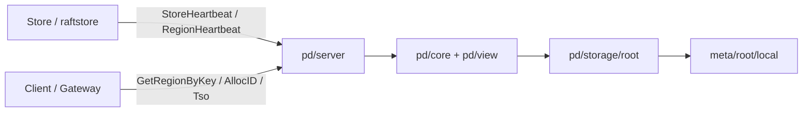
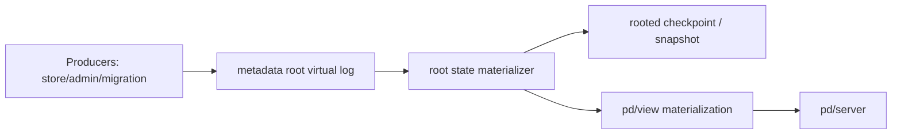

# NoKV 未来 Metadata HA 路线规划

> 状态：计划文档。本文档描述的是 NoKV 在当前单控制面模式稳定之后，未来如果重新引入 metadata 高可用，最值得考虑的架构路线。

## 1. 为什么现在要写这份计划

NoKV 当前已经收敛到一个明确的控制面形态：

- `standalone`：无 `pd`、无 `meta/root`
- `distributed`：单个 `pd` + 同进程 `meta/root/local`

这条主线是刻意收缩复杂度后的结果。当前最重要的是把：

- `RegionMeta` / `Descriptor` 双投影
- `meta/root` / `pd/view` 分层
- rooted truth 的恢复与压缩路径
- 单控制面部署模型

做稳。

但只要 NoKV 未来继续往真正的分布式系统演进，metadata 高可用迟早会重新成为问题。原因很直接：

1. allocator fence 不能回退
2. store membership 不能分叉
3. split / merge / peer-change 必须有一致顺序
4. route truth 不能只靠单节点 durable storage

所以问题不是“将来要不要做 metadata HA”，而是“将来应该以什么形状做 metadata HA”。

本文档的目标不是直接给出最终实现，而是先明确：

- 哪些路线适合 NoKV
- 哪些路线不适合 NoKV
- 如果未来重新做 metadata HA，应该沿着哪条主线走

---

## 2. 当前架构边界

未来的 metadata HA 方案必须尊重当前已经收敛下来的边界，而不是重新推翻它们。

### 2.1 当前控制面分层

对应代码：

- `raftstore/localmeta/types.go`
- `raftstore/descriptor/types.go`
- `meta/root/types.go`
- `meta/root/local/store.go`
- `pd/storage/root.go`
- `pd/view/region_directory.go`
- `pd/core/cluster.go`
- `pd/server/service.go`

### 2.2 当前最重要的边界

#### `RegionMeta`

文件：

- `raftstore/localmeta/types.go`

职责：

- store-local runtime shape
- 本地 peer 生命周期
- 本地 crash/recovery
- hosted region catalog

#### `Descriptor`

文件：

- `raftstore/descriptor/types.go`

职责：

- distributed topology object
- route object
- rooted metadata event 的主对象
- split / merge / membership 的分布式表达

#### `meta/root`

文件：

- `meta/root/types.go`
- `meta/root/local/store.go`

职责：

- 最小 durable control-plane truth
- allocator fence
- rooted topology event
- compact rooted snapshot

#### `pd/view`

文件：

- `pd/view/region_directory.go`
- `pd/core/cluster.go`

职责：

- rebuildable route view
- scheduler input
- store/region heartbeat derived view

### 2.3 未来方案不能破坏什么

未来 metadata HA 不管怎么做，都必须继续守住：

1. `meta/root` 是 truth，不是大而全 metadata DB
2. `pd/view` 是 materialized view，不是 authority
3. `Descriptor` 是 distributed topology object，不回退成 `RegionMeta` 的别名
4. `pd` 不重新长成大 authority

也就是说，未来真正可接受的 metadata HA，不是“再做一个 etcd 产品”，而是：

> 把当前最小 rooted truth 变成高可用 rooted truth

---

## 3. 评估标准

对 NoKV 来说，好的 metadata HA 方案至少要满足下面四条：

1. 和当前代码边界连续
2. 不把 `pd` 做重
3. 不把运维复杂度一下拉爆
4. 创新点主要在架构，而不是单纯堆协议复杂度

按这四条，本文评估三条路线：

1. `Delos-lite / VirtualLog metadata root`
2. `Delos-lite + CURP 局部快路径`
3. `Bizur-like bucketized metadata`

---

## 4. 方案一：Delos-lite / VirtualLog metadata root

### 4.1 参考背景

参考资料：

- [Delos: 简单、灵活的控制面存储](https://engineering.fb.com/2019/06/06/data-center-engineering/delos/)
- [Virtual Consensus in Delos（OSDI 2020）](https://www.usenix.org/conference/osdi20/presentation/balakrishnan)
- [Zelos：基于 Delos 提供 ZooKeeper API](https://engineering.fb.com/2022/06/08/developer-tools/zelos/)

Delos 的关键思想不是“再做一个大而全 metadata store”，而是：

- 把一致性核心抽象成一个虚拟日志
- 上层服务依赖统一的 log 抽象
- materialization 与 ordering 分开
- 不让上层服务直接绑定到某一种共识实现细节

### 4.2 对 NoKV 来说，什么是 Delos-lite

NoKV 不需要完整复刻 Delos。更合理的是一个 Delos-lite 版本：

也就是：

- 做一个极小 replicated log
- 只写最小 truth event
- 由状态机 materialize 出 rooted state
- `pd/view` 继续只是 view

### 4.3 log 里应该写什么

只写这些：

- allocator fences
- store membership truth
- descriptor publish
- descriptor tombstone
- split committed
- merge committed
- peer-change committed

不要写这些：

- route cache
- scheduler runtime state
- operator progress
- hot region observation
- 各种临时统计

也就是说，未来的 HA metadata root 仍然要守住当前 `meta/root` 的克制边界。

### 4.4 它为什么最适合 NoKV

#### 第一，和当前代码最连续

NoKV 现在已经有：

- `meta/root/types.go`
- `meta/root/local/store.go`
- `pd/storage/root.go`
- `pd/view/*`

本质上已经在做：

- rooted event log
- compact snapshot
- bounded recovery
- view rebuild

所以未来走 Delos-lite，不是推翻重做，而是把：

- local rooted log
- 升级成 replicated rooted log

#### 第二，不会把 `pd` 做成大 authority

Delos-lite 的自然结果是：

- `pd` 继续是 service + view
- truth 继续留在极小 root log + root state 里

这和当前的设计哲学完全一致。

#### 第三，创新点明确

这个方向的创新不在“选了一个更新的协议名词”，而在：

- 把 metadata HA 的核心定义成最小 truth log
- 上层全部做 materialized views
- 不再把 HA metadata 理解成一张大 KV 表

这比“嵌个 etcd 然后叫 high availability”更有辨识度。

### 4.5 它的代价

#### 第一，必须把 log / state / view 三层分得非常硬

否则系统会重新退化成：

- `pd` 持有大量 durable state
- `meta/root` 只是名义存在

#### 第二，checkpoint / recovery 设计要非常规整

未来如果做 Delos-lite，必须明确：

- log 是 ordering truth
- checkpoint 是 compact rooted state
- `pd/view` 可以丢弃并重建

#### 第三，不能长成通用 metadata KV

如果以后为了方便，往 rooted log 里塞：

- scheduler config
- route cache
- operator state
- 临时观察值

那 Delos-lite 就会很快变质。

### 4.6 对它的判断

这是 NoKV 最值得选择的 metadata HA 主线。

不是因为它最省事，而是因为：

- 它和当前架构最连续
- 能最大限度保住当前已经做对的边界
- 真正有机会做出“不像传统大 PD”的设计辨识度

---

## 5. 方案二：Delos-lite + CURP 局部快路径

### 5.1 参考背景

参考资料：

- [CURP: Exploiting Commutativity for Practical Fast Replication](https://www.usenix.org/system/files/nsdi19-park.pdf)
- [Xline 对 CURP 的工程说明](https://www.cncf.io/blog/2023/09/20/the-introduction-to-the-curp-protocol/)

CURP 的关键点不是替代整个 replicated state machine，而是：

- 利用命令可交换性
- 给某些冲突少的命令提供更快的提交路径
- 将慢路径和全序路径保留给需要严格排序的命令

### 5.2 对 NoKV 的正确用法

NoKV 不应该让 CURP 取代整个 metadata root。

更合理的用法是：

- topology truth 仍然走 Delos-lite rooted log
- 只把一小部分可交换写做快路径

更可能适合快路径的对象：

- allocator reserve / fence
- lease renew
- 某些 store registration

不适合快路径的对象：

- split committed
- merge committed
- peer-change committed
- descriptor ownership truth

### 5.3 它的价值

#### 第一，创新感更强

如果只是做 Delos-lite，会更像一次优秀的架构整理。

如果在此基础上引入 CURP 风格的局部快路径，就开始有：

- metadata fast path / ordered path 分层
- 对 allocator/lease 这类可交换对象的低延迟优化

这在研究意义上更有增量。

#### 第二，不会破坏主模型

前提是非常克制：

- rooted topology truth 仍然全序
- 只有局部命令做快路径

这样系统不会失去模型清晰度。

#### 第三，特别适合 allocator 子域

allocator/fence 本身就是 NoKV 当前元数据里比较独立的一类 truth。未来如果要在 metadata HA 上做“有限但有亮点的创新”，我认为 allocator 是最合适的试验田。

### 5.4 它的风险

#### 第一，容易把快路径用过头

最危险的错误就是：

- “既然快路径好，那 topology truth 也一起快路径化”

这会非常快地破坏语义边界。

#### 第二，冲突判定会明显增加复杂度

必须非常清楚地区分：

- 哪些命令可交换
- 哪些命令必须进全序 rooted log

这件事做不好，调试和维护都会明显变差。

#### 第三，它是第二阶段优化，不是第一阶段主线

NoKV 当前最缺的不是 metadata 写延迟，而是：

- metadata truth 系统边界
- rooted event 模型
- view materialization 纪律

所以 CURP 不该先于 Delos-lite 本体出现。

### 5.5 对它的判断

这是一个很有潜力的第二阶段方案。

正确顺序应该是：

1. 先把 Delos-lite rooted log 做稳
2. 再挑 allocator 这类局部子域试快路径

如果顺序反了，系统会更容易变乱。

---

## 6. 方案三：Bizur-like bucketized metadata

### 6.1 参考背景

参考资料：

- [Bizur: A Key-value Consensus Algorithm for Scalable File-systems](https://arxiv.org/abs/1702.04242)

Bizur 的核心思想是：

- 不走全局共享日志
- 对 key / bucket 独立做一致性
- 避免所有写都争抢单一全局顺序

它适合的是：

- key-scoped metadata
- 大量彼此独立的小对象
- 对全局全序需求不强的控制面系统

### 6.2 它为什么有吸引力

如果未来 NoKV metadata 规模很大、写入频率很高，而且其中很多对象彼此独立，那么 Bizur-like 路线会很吸引人。

例如可以想象把 metadata 切成：

- allocator buckets
- store membership buckets
- route buckets
- policy buckets

这样理论上可以获得：

- 更高 metadata 吞吐
- 更少全局顺序瓶颈
- 更好的横向扩展潜力

### 6.3 它为什么现在不适合 NoKV

#### 第一，NoKV 当前 metadata 不是纯 key-scoped

当前最重要的 topology truth 里，有很多天然跨对象关系：

- split parent / child
- merge source / target
- peer-change lineage
- ownership handoff

这些语义不是单 bucket 就能优雅表达的。

#### 第二，它和当前 event-first 模型不够连续

NoKV 当前正在收成：

- rooted topology event
- rooted snapshot
- descriptor-centric truth

而 Bizur-like 更偏：

- key/bucket scoped consensus state

这和当前 event-first 路径不是最连续的演进。

#### 第三，它更像吞吐扩展研究题

Bizur-like 的价值通常在于：

- metadata 量很大
- 写频率很高
- 对单 root log 形成实质瓶颈

NoKV 当前明显还没到这个阶段。

### 6.4 它什么时候值得考虑

我认为至少要满足下面条件：

1. 已经有稳定的 Delos-lite rooted metadata HA
2. metadata 吞吐开始成为瓶颈
3. 能清楚地区分：
   - 哪些 truth 是 bucket-local
   - 哪些 truth 必须全局排序

在那之前，Bizur-like 更适合作为研究方向，而不是主线路线。

### 6.5 对它的判断

它是一个很有研究味、创新感强的远期方向。

但它不是 NoKV 当前未来路线的第一选择。

---

## 7. 为什么不推荐传统“大 PD + etcd”作为未来主线

NoKV 当然可以走传统路线：

- `pd` 做大 authority
- 内嵌 etcd 或等价系统
- metadata 都进 control-plane KV

这条路最大的问题不是做不出来，而是会破坏当前最有价值的边界：

1. `pd` 会重新变重
2. `meta/root` 会失去独立存在的意义
3. `pd/view` 很容易重新和 durable truth 混在一起
4. 项目会被拖向第二个 control-plane database

这不是说传统路线不成熟，而是它不适合 NoKV 当前已经做出来的架构方向。

---

## 8. 三条路线的横向比较

| 方案 | 和当前架构连续性 | 创新性 | 实现复杂度 | 当前匹配度 | 适合阶段 |
|---|---:|---:|---:|---:|---|
| Delos-lite / VirtualLog | 高 | 高 | 中高 | 高 | 主线候选 |
| Delos-lite + CURP | 中高 | 很高 | 高 | 中高 | 第二阶段 |
| Bizur-like bucketized metadata | 中 | 很高 | 很高 | 低到中 | 远期研究 |

---

## 9. 推荐路线

### 9.1 第一阶段

未来如果 NoKV 重新引入 metadata HA，最合理的第一阶段是：

> 先做 Delos-lite rooted metadata log

也就是：

- replicated truth log
- rooted state materializer
- compact rooted checkpoint
- `pd/view` 继续是 materialized view

### 9.2 第二阶段

如果第一阶段已经稳定，再选择一个很小的子域，比如 allocator，尝试：

> Delos-lite + CURP 局部快路径

这样能在不破坏主模型的前提下，增加研究和性能亮点。

### 9.3 第三阶段

只有当 metadata 规模和并发真的把单 rooted log 压到瓶颈，才考虑：

> Bizur-like bucketized metadata

也就是把“哪些 truth 需要全局排序、哪些 truth 可以 bucket-local”变成新的研究主题。

---

## 10. 一个适合 NoKV 的最终表述

如果以后对外描述 NoKV 的 metadata HA 方向，我建议用下面这句话：

> NoKV 未来的 metadata 高可用，不会走“大 PD + 通用 metadata KV”路线，而会优先尝试一种以最小 rooted truth log 为核心、以 materialized view 为上层形态的 Delos-lite 架构；在此基础上，再针对 allocator 这类可交换子域研究 CURP 风格快路径，并将 Bizur-like 分桶共识保留为更长期的 metadata 扩展方向。

---

## 11. 还没决定的关键问题

本文只是路线规划，不是最终实现说明。未来如果真的启动 metadata HA，至少还要先回答下面这些问题：

1. rooted log 的精确定义是什么
2. 哪些 event 必须进入全局顺序
3. allocator 是否值得单独做快路径
4. `pd/view` 从 rooted state 重建的代价与一致性窗口怎么定义
5. store membership 和 region topology truth 是否共享同一条 rooted log
6. 是否需要引入 loglet / segmented log 的内部抽象

这些问题没有回答清楚之前，不应该直接开工做 metadata HA。

---

## 12. 总结

NoKV 当前已经收敛到：

- `standalone` 无控制面
- `distributed` 为单个 `pd + meta/root/local`

这条主线是对的，不应该轻易打破。

但如果未来重新做 metadata 高可用，也不应该回到传统的大控制面 authority 路线。对 NoKV 来说，最有价值的方向是：

1. 用 Delos-lite / VirtualLog 把 metadata HA 继续收缩成最小 rooted truth log
2. 让 `pd/view` 继续保持 materialized view 地位
3. 把 CURP 局部快路径保留给 allocator / lease 这类可交换子域
4. 把 Bizur-like 分桶元数据共识保留为远期扩展研究

换句话说，未来真正值得做的，不是“把当前 local root 换成一个传统元数据库”，而是：

> 把当前已经做对的最小 rooted truth 边界，升级成高可用 rooted truth。
