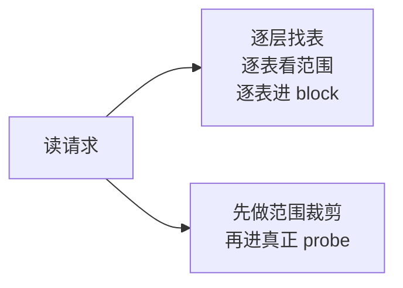
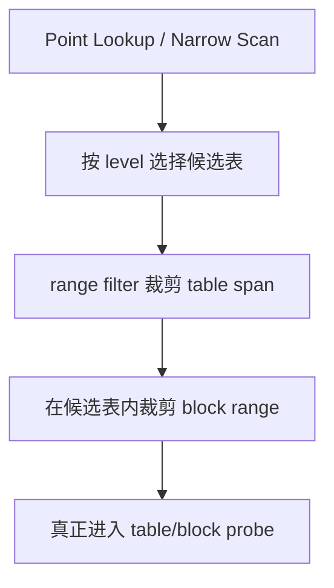
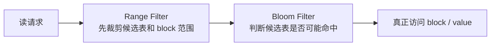

# 2026-04-05 Range Filter：从 GRF 得到启发，但不照搬 GRF

> 状态：当前 NoKV 单机引擎读路径优化的设计说明。本文档解释我们为什么要做 `range filter`、从 GRF 论文里具体借了什么、为什么没有直接实现 full GRF，以及当前方案在 NoKV 里的边界和收益。

## 导读

- 🧭 主题：NoKV 为什么需要 `range filter`，以及为什么它是一个更保守的 GRF-inspired 设计。
- 🧱 核心对象：LSM level、table span、block range、point lookup、bounded scan。
- 🔁 调用链：`先裁剪候选表 -> 再裁剪表内 block 范围 -> 最后进入真正的 table/block probe`。
- 📚 参考对象：GRF、Bloom Filter、传统 LSM non-overlap level pruning。

## 1. 为什么要做这件事

NoKV 当前的单机引擎，已经有比较完整的：

- memtable
- WAL
- leveled compaction
- ingest buffer
- block/index cache

但只做到这里，还不够。

在读路径上，LSM 系统经常会浪费大量时间在两个问题上：

1. 哪些 SST 根本不值得看
2. 某个 SST 里，哪些 block 根本不值得扫

这在下面几类场景里尤其明显：

- point miss
- point hit，但 level 里表很多
- 很窄的 bounded scan
- 读偏 workload 下的大量短读

如果不做额外裁剪，系统即使最终只需要访问一个很小的 key range，也可能先付出很多无效的 table probe、index decode 和 block 边界判断成本。

所以 `range filter` 的目标从一开始就不是“做一个更聪明的 filter”，而是非常务实地回答：

> 在不改变恢复语义、不增加新的 durable 元数据、不过度绑定 compaction 策略的前提下，能不能把这部分无效 probe 明显砍掉？

## 2. 我们从 GRF 真正借了什么

GRF 论文给我们的启发，不是“照着实现一套全局编码结构”，而是下面三个更本质的判断：

1. 读路径里真正贵的，很多时候不是最终访问那一个 block，而是前面的候选集筛选成本
2. 只要 pruning 足够早，哪怕不是最强版本，也能拿到可观收益
3. 这种 pruning 如果要工程上可落地，就必须把 correctness 放在第一位，宁可保守，也不能误剪

可以把这件事简单理解成：

GRF 告诉我们的，是“前置裁剪值得认真做”；但它并没有强迫我们必须把整篇论文原样搬进 NoKV。

## 3. 为什么没有直接实现 full GRF

如果照论文完整实现，我们理论上可以得到更强的全局 pruning 能力。但这会把当前 NoKV 拉进另一类复杂度里：

1. 要引入更强的全局 filter 元数据
2. 要把 filter 生命周期更紧地绑定到 compaction shape
3. 要考虑 version / snapshot / rebuild 的额外维护成本
4. 要决定这些元数据是内存态、持久态，还是两者混合

而 NoKV 当前并不需要为了一个读路径优化，把整个恢复和元数据系统一起复杂化。

更具体地说，当前 NoKV 还在几个更基础的点上持续演进：

- L0 overlap 形态
- compaction 债务控制
- ingest buffer 与 main level 的关系
- cache / block load / iterator 热路径

在这个阶段直接做 full GRF，风险很高：

- 容易把 filter 绑到还没完全稳定的 LSM shape 上
- 容易新增一层持久化和 rebuild 责任
- 容易让读路径优化反过来主导 compaction 设计

这不是我们想要的。

所以 NoKV 当前的取舍是：

> 先拿 GRF 最值得的那部分收益，也就是“更早做范围裁剪”；  
> 但不为此引入新的恢复责任和复杂持久化语义。

## 4. 当前 NoKV 的设计边界

当前 `range filter` 的边界非常明确：

- `in-memory`
- `advisory`
- `correctness-first`
- `table-level pruning + table-internal block-range pruning`

它不是：

- 全局 authoritative filter
- persisted metadata
- full shape encoding
- compaction policy controller

也就是说，它从一开始就不是“真相源”，而只是一个更聪明的读路径裁剪层。

## 5. 我们最终采用的结构

当前设计可以概括成两段式裁剪：

### 第一段：先裁剪表

对每个 level，我们维护一组表的 key span。

对于 non-overlap level：

- 可以更激进地缩小候选表范围
- point lookup 往往会落到极少量候选表，很多时候就是一个

对于 overlap level 或过小 level：

- 走更保守的策略
- 不强求 filter 一定生效

### 第二段：再裁剪表内 block 范围

当某张表已经成为候选之后，我们并不直接无脑扫整张表，而是继续利用 table index 里的 block base key 信息，把真正需要进入的 block 范围缩窄。

整体形状如下：

这套结构很务实：

- 第一段解决“这张表要不要看”
- 第二段解决“这张表里哪些 block 要看”

它没有试图一次性解决所有问题，但已经覆盖了当前最值钱的两层裁剪。

## 6. 为什么这个设计更适合 NoKV 当前阶段

### 6.1 不新增 durable 负担

这是最重要的一点。

当前 `range filter` 不需要：

- 新 manifest 语义
- 新 recovery 路径
- 新 snapshot/install 负担

表集合一旦变化，filter 就在现有 level ownership 边界内重建。这样读路径优化不会污染恢复模型。

### 6.2 对现有 LSM 结构侵入很小

NoKV 已经有自己的：

- leveled compaction
- ingest buffer
- table install / replace

`range filter` 只依赖“当前 level 上有哪些表、它们的范围是什么”，而不要求系统先具备更强的 run ID、shape encoding 或跨版本索引。

### 6.3 correctness 很容易讲清楚

我们现在坚持一个简单规则：

> 只要不确定，就 fallback。

也就是：

- overlap 时保守
- level 太小时保守
- 算不准时保守
- 永远不能 false-negative prune

这条规则让 `range filter` 在工程上非常安全。

## 7. 和 Bloom Filter 的关系

Bloom Filter 解决的问题是：

- 这张表里大概率有没有这个 key

`range filter` 解决的问题是：

- 这张表值不值得先去看
- 这张表里哪些 block 值不值得先去碰

两者不是替代关系，而是不同层次的裁剪。

可以粗略理解成：

`range filter` 更像“读路径计划层”的 pruning，Bloom 更像“单表内部 membership 层”的 pruning。

## 8. 这个设计实际带来了什么收益

当前收益最明确的场景有：

- point miss
- point hit on many-table non-overlap levels
- narrow bounded scan
- 读偏 workload

它不会自动把所有 workload 都变快。

特别是这些场景，收益没有那么直接：

- L0 overlap 很重时
- scan 很长时
- block load 或 cache miss 才是主要成本时
- mixed workload 下 compaction debt 已经成为主瓶颈时

这也是为什么我们现在对它的定位很克制：

> 它是一个有效的 read-path pruning 层，  
> 不是整个读路径性能的唯一答案。

## 9. 设计理念

这次 `range filter` 设计里，最重要的理念有三条。

### 9.1 借论文的结构判断，不照搬论文的全部机制

论文的价值在于指出一个方向，而不是强迫系统按论文的全部假设生长。

### 9.2 优先拿“最便宜的早期收益”

相比一上来做 persisted global filter，先把：

- 表级裁剪
- 表内 block-range 裁剪

做扎实，性价比更高。

### 9.3 读路径优化不能反向污染恢复和元数据设计

这条对 NoKV 很重要。

NoKV 现在的工程主线不是“某个 filter 多先进”，而是：

- 单机引擎边界清楚
- 恢复模型清楚
- 从单机到分布式可连续演进

所以任何优化，只要开始逼迫：

- manifest 变复杂
- compaction 被 filter 绑架
- recovery 多出新责任

就要非常谨慎。

## 10. 参考对象

- GRF: A Global Range Filter for LSM-Trees with Shape Encoding
- Bloom Filter 在 LSM 中的传统用法
- NoKV 当前 leveled compaction + ingest buffer 的工程边界

## 11. 这次记录了什么

这篇 note 不是在宣布一个全新 feature，而是在把当前 `range filter` 的设计边界正式写清楚：

- 灵感来自 GRF
- 但当前实现不是 full GRF
- 当前是更保守、correctness-first、工程上更稳的 pruning 方案

## 12. 还没解决什么

当前还没解决的点也很明确：

1. `L0` overlap heavy 场景下，裁剪能力仍然保守
2. 还没有 persisted / global range filter
3. 还没有更强的 shape-aware pruning
4. 读路径的剩余成本仍然可能来自：
   - block load
   - cache miss
   - iterator 组装
   - compaction debt

所以这篇文档的结论不是“已经做完了”，而是：

> 当前版本已经拿到了最稳妥的一段收益，  
> 但仍然给后续更强的 range-aware 设计保留了空间。
