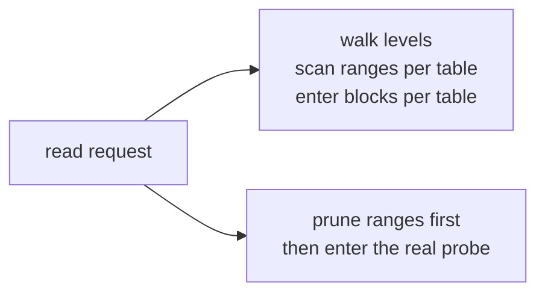
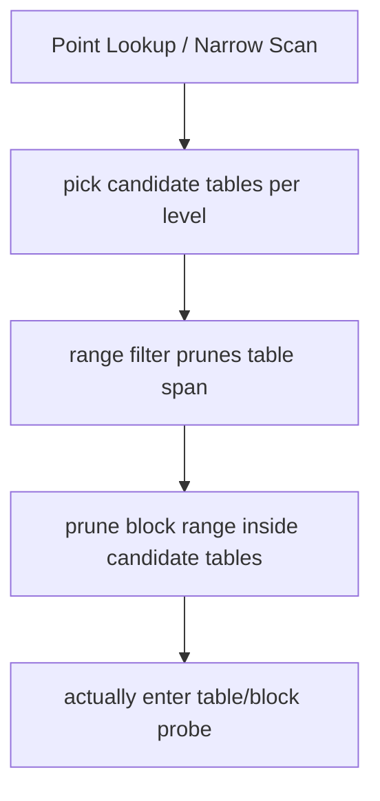
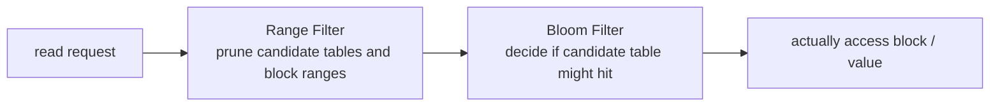

# 2026-04-05 Range Filter: inspired by GRF, but not copying GRF

> Status: design note for NoKV's current single-node engine read-path optimization. This explains why we built `range filter`, what we specifically borrowed from the GRF paper, why we did not implement full GRF, and the current scheme's boundaries and benefits inside NoKV.

## TL;DR

- 🧭 Topic: why NoKV needs `range filter`, and why it's a more conservative GRF-inspired design.
- 🧱 Core objects: LSM level, table span, block range, point lookup, bounded scan.
- 🔁 Call chain: `prune candidate tables -> prune in-table block ranges -> finally enter the real table/block probe`.
- 📚 Reference: GRF, Bloom Filter, classic LSM non-overlap level pruning.

## 1. Why we're doing this

NoKV's single-node engine already has a fairly complete:

- memtable
- WAL
- leveled compaction
- landing buffer
- block/index cache

But that's not enough on its own.

On the read path, LSM systems often waste a lot of time on two questions:

1. Which SSTs aren't worth looking at at all.
2. Inside a given SST, which blocks aren't worth scanning at all.

This is especially obvious in:

- point miss
- point hit but the level holds many tables
- very narrow bounded scan
- read-heavy workloads with many short reads

Without extra pruning, even when the system only ultimately needs a small key range, it can pay heavy cost in pointless table probes, index decodes, and block-boundary checks first.

So the goal of `range filter` was never "build a smarter filter." It was a very practical question:

> Without changing recovery semantics, without adding new durable metadata, without over-coupling to compaction policy — can we visibly cut these wasted probes?

## 2. What we actually borrowed from GRF

GRF's contribution to us is not "here's a global encoding structure to copy." It's three more fundamental judgments:

1. The expensive part of the read path is often the candidate-set filtering before the final block access, not the access itself.
2. As long as pruning happens early enough, even a non-maximum version is worth meaningful gains.
3. For pruning to be engineering-deployable, correctness must come first — being conservative beats false negatives every time.

You can summarize it as:

GRF tells us "early pruning is worth doing seriously." It does not force us to drop the entire paper into NoKV verbatim.

## 3. Why we didn't implement full GRF

If we did the full implementation, we would in theory get stronger global pruning. But that pulls NoKV into a different complexity bucket:

1. We'd need stronger global filter metadata.
2. We'd need to bind the filter lifecycle tightly to compaction shape.
3. We'd need to think about extra version / snapshot / rebuild maintenance cost.
4. We'd need to decide if this metadata is in-memory, persistent, or both.

NoKV does not need to entangle the entire recovery and metadata system for the sake of a read-path optimization.

More concretely, NoKV is still actively evolving on more foundational axes:

- L0 overlap shape
- compaction debt control
- relationship between landing buffer and main level
- cache / block load / iterator hot path

In this stage, going straight for full GRF carries serious risk:

- Couples the filter to an LSM shape that hasn't fully settled.
- Adds a new persistence and rebuild responsibility.
- Lets read-path optimization start dictating compaction design.

We don't want any of that.

So NoKV's current trade-off:

> Take GRF's most-valuable insight — earlier range pruning;
> but do not introduce new recovery responsibilities or complex persistence semantics for it.

## 4. NoKV's current design boundary

The boundary of `range filter` is explicitly:

- `in-memory`
- `advisory`
- `correctness-first`
- `table-level pruning + table-internal block-range pruning`

It is **not**:

- A global authoritative filter
- Persistent metadata
- Full shape encoding
- A compaction policy controller

In other words, from day one it was never "the source of truth" — only a smarter read-path pruning layer.

## 5. The structure we ended up with

The current design is a two-stage prune:

### Stage 1: prune at the table level

For every level, we maintain a set of table key spans.

For non-overlap levels:

- We can shrink candidate tables aggressively.
- A point lookup typically lands on very few candidate tables — often just one.

For overlap levels or very small levels:

- Use a more conservative strategy.
- Don't insist that the filter must apply.

### Stage 2: prune within the table at the block-range level

Once a table has become a candidate, we don't blindly scan the whole table. We use the table index's block base-key info to narrow the block range we actually need to enter.

The overall shape:

Pragmatic structure:

- Stage 1 answers "do we even read this table."
- Stage 2 answers "which blocks inside this table do we read."

It doesn't try to solve every problem at once, but it covers the two most valuable pruning layers right now.

## 6. Why this design fits NoKV's current stage

### 6.1 No new durable burden

This is the most important point.

`range filter` does not need:

- New manifest semantics
- New recovery path
- New snapshot/install burden

When the table set changes, the filter is rebuilt within existing level-ownership boundaries. Read-path optimization doesn't pollute the recovery model.

### 6.2 Minimal intrusion into existing LSM structure

NoKV already has:

- leveled compaction
- landing buffer
- table install / replace

`range filter` only depends on "which tables are at this level and what their ranges are" — it doesn't require the system to first develop stronger run IDs, shape encodings, or cross-version indexes.

### 6.3 Correctness is easy to argue

We hold one simple rule:

> If unsure, fall back.

That is:

- Be conservative when there's overlap.
- Be conservative when the level is too small.
- Be conservative when computation can't be confident.
- Never false-negative-prune.

This rule keeps `range filter` engineering-safe.

## 7. Relationship with Bloom Filter

Bloom Filter solves:

- "Probably is/isn't this key in this table."

Range filter solves:

- "Is this table even worth looking at."
- "Which blocks inside this table are even worth touching."

They aren't substitutes — they're pruning at different layers.

Roughly:

`range filter` is closer to "read-path planner" pruning; Bloom is closer to "intra-table membership" pruning.

## 8. What this design actually buys

The clear win cases today:

- point miss
- point hit on many-table non-overlap levels
- narrow bounded scan
- read-heavy workloads

It does not auto-accelerate every workload.

These cases see less direct benefit:

- When L0 overlap is heavy.
- Long scans.
- When block load / cache miss is the dominant cost.
- Mixed workloads where compaction debt is the real bottleneck.

That's why we describe its scope so cautiously:

> It is an effective read-path pruning layer.
> It is not the only answer for read-path performance.

## 9. Design philosophy

Three principles for this `range filter`:

### 9.1 Borrow the structural insight from the paper, not all its machinery

Papers point at directions; they don't force the system to grow under all of their assumptions.

### 9.2 Prefer the cheapest-to-acquire early gains

Instead of jumping straight to a persistent global filter, we get more value-per-effort from:

- table-level pruning
- in-table block-range pruning

Doing those two well is the highest-ROI move; build them out solidly first, and only then weigh anything more elaborate.

### 9.3 Read-path optimization must not back-pollute recovery and metadata design

This principle matters a lot for NoKV.

NoKV's engineering trunk isn't "how advanced is filter X" — it's:

- A clean single-node engine boundary.
- A clean recovery model.
- A continuous evolution path from standalone to distributed.

So any optimization that starts forcing:

- manifest complexity
- compaction held hostage by the filter
- new responsibility added to recovery

must be treated with caution.

## 10. Reference patterns

- GRF: A Global Range Filter for LSM-Trees with Shape Encoding
- Classic Bloom Filter usage in LSM
- The engineering boundary of NoKV's current leveled compaction + landing buffer

## 11. What this note records

This note isn't announcing a new feature. It's formalizing the current `range filter`'s design boundary:

- Inspired by GRF.
- But not full GRF.
- Currently a more conservative, correctness-first, engineering-stable pruning scheme.

## 12. What remains unsolved

Open items:

1. Pruning is still conservative under heavy `L0` overlap.
2. No persistent / global range filter yet.
3. No stronger shape-aware pruning yet.
4. Remaining read-path cost can still come from:
   - block load
   - cache miss
   - iterator construction
   - compaction debt

So the conclusion isn't "we're done" — it's:

> The current version captured the safest segment of gains;
> there's still room left for stronger range-aware design later.
