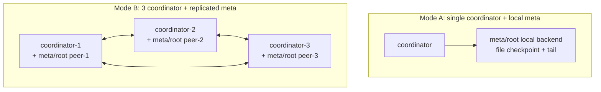
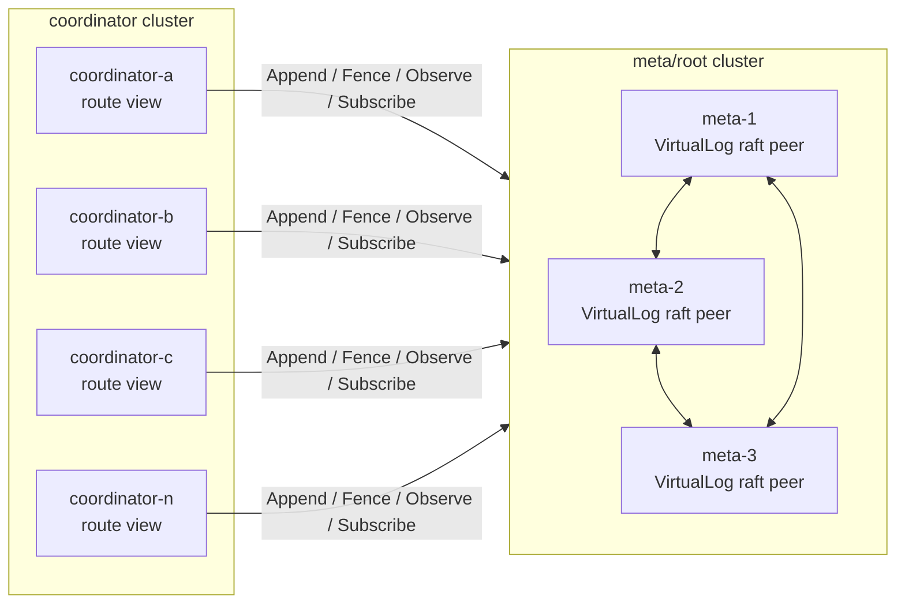
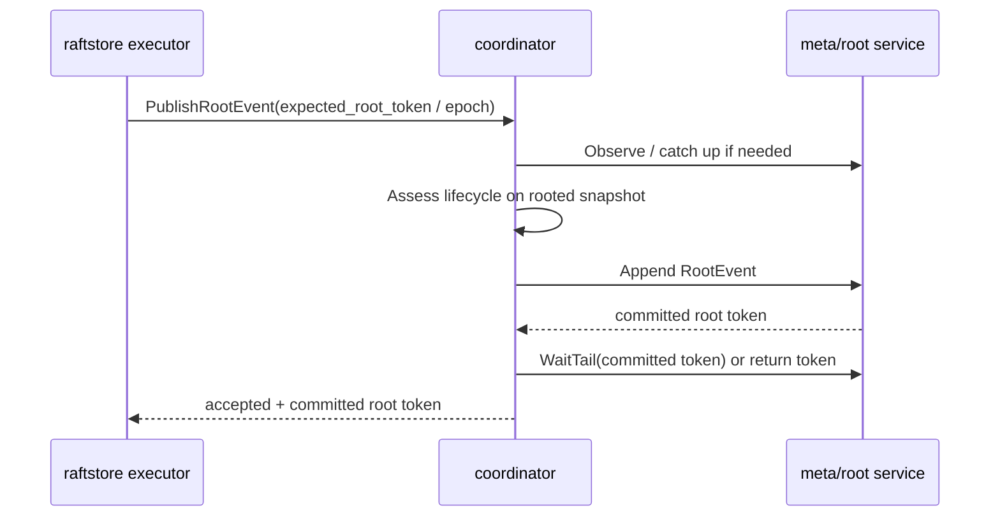

# 2026-04-12 Separated Deployment for Coordinator and meta/root

> Status: implemented experimental mode. The current officially supported modes are still `single coordinator + local meta` and `3 coordinator + replicated meta`. `remote meta/root`, the Coordinator lease gate, the allocator window, the remote-root harness, basic correctness tests, and minimal ops scripts have all landed — but separated deployment is not the default ops path yet, and we haven't completed real-network or baseline-level evaluation. This note explains why we'd split, when we shouldn't, and which protocol boundaries must be made explicit before and after the split.

## TL;DR

- 🧭 Topic: should `coordinator` and `meta/root` evolve from co-located replicated mode to separated deployment?
- 🧱 Core objects: `RootStore`, `VirtualLog`, `RootToken`, Coordinator lease, TSO/ID window, scheduler owner.
- 🔁 Call chain: `coordinator view -> remote meta/root VirtualLog -> tail catch-up -> freshness-aware routing`.
- 📚 References: Delos's VirtualLog layering, the co-located control-plane experience of TiKV/PD+etcd, FoundationDB's split control-plane roles.

## 1. What we actually deploy today

NoKV doesn't have just one mode — it has two officially supported ones:



Mode B is already multi-process HA — it just hosts a `meta/root` raft peer inside each `coordinator` process.

That means the system already has:

- Three-replica replicated truth in `meta/root`.
- `coordinator` rebuilding view from rooted truth.
- `RootStore` as the adapter boundary between `coordinator` and `meta/root`.
- TSO/ID fences written into `meta/root`, so leader change cannot regress them.
- Coordinators that aren't the rooted leader rejecting `AllocID`, `Tso`, and `PublishRootEvent`.

What's already implemented:

- A standalone `meta/root` service binary: `nokv meta-root`.
- `coordinator --root-mode=remote`.
- A `meta/root` external gRPC API and a remote client.
- A minimal lease / owner mechanism for an independent Coordinator cluster.
- ID / TSO window pre-allocation.

What's still missing:

- More complete ops scripts and stable operational playbooks.
- More systematic failure / recovery drills.

What's already in observability:

- `nokv coordinator --metrics-addr ...` publishes the `nokv_coordinator` expvar key.
- `nokv_coordinator` currently includes:
  - `root_mode`
  - rooted read-state summary
  - lease state
  - allocator window state

What's already in correctness coverage:

- `coordinator/integration` covers Mode C coordinator crash/recovery:
  - The old Coordinator allocates IDs and then doesn't release the lease, simulating a crash.
  - The remote `meta/root` survives independently.
  - A new Coordinator connects to remote root using the same stable `coordinator-id`.
  - The new `AllocID` is strictly greater than the last ID returned before the crash.
  - The rooted allocator fence and lease fence don't regress.
- `meta/root/backend/replicated` covers root leader change:
  - The old root leader writes `Tenure` and allocator fences.
  - The new root leader continues renewing the same holder.
  - ID / TSO fences stay monotonic across all root peers.

## 2. What separated deployment looks like

A future separated mode should be:



`meta/root` is the durable truth cluster; `coordinator` is a horizontally scalable service/view layer.

Key principles:

1. `meta/root` still does only truth kernel — it does not become a full Coordinator.
2. `coordinator` still holds only a rebuildable view — it does not own durable topology truth.
3. Separated mode must not break co-located mode; it must reuse the same `RootStore` / `VirtualLog` contract.
4. Separated mode is not the default — it's the deployment shape you opt into when routing / Coordinator ops becomes the bottleneck.

## 3. Why we'd separate

### 3.1 Independent failure domains

In Mode B today, one process crashing takes out:

- One `coordinator` service instance.
- One `meta/root` raft peer.

Acceptable inside three nodes, but failure domains are still bound together.

After separation:

- A `coordinator` crash doesn't take a `meta/root` peer with it.
- Minority `meta/root` failures don't stop existing `coordinator`s from serving best-effort / bounded reads off cached view.
- `coordinator`s can roll-upgrade without restarting `meta/root` raft peers.

This has real production-ops value, but it's not complexity the project has to bear early.

### 3.2 Coordinator horizontal scaling

`meta/root` is a consensus system. You don't scale read service by adding more nodes — bigger raft groups make the write path heavier.

`coordinator` is a view/service layer; you scale it by adding more instances:

- `GetRegionByKey`
- Route freshness check
- Gateway route lookup
- Control-plane read/debug surface

After separation it can be:

```text
3 meta/root nodes + N coordinator nodes
```

That's saner than scaling `3 coordinator + replicated meta` into `7 coordinator + 7 meta peers`.

### 3.3 Cleaner version evolution

If `coordinator` and `meta/root` are separate processes:

- `coordinator` can be upgraded more often for route / scheduler policy.
- `meta/root` can stay small and stable.
- The `VirtualLog` wire API becomes an explicit compatibility boundary.

Good for long-term evolution, and good for presenting NoKV's control-plane design as a research / workshop case study.

## 4. Why we shouldn't implement it directly right now

Separated deployment is not "swap function calls for RPCs".

If you do remote `RootStore` directly, three problems show up immediately.

### 4.1 The TSO/ID hot path gets pierced

In a window-less design, `reserveTSO` and `reserveIDs` call `SaveAllocatorState` on every allocation — i.e. they advance the allocator fence in `meta/root`.

Today, allocator window is already implemented in the co-located mode, so within the window neither `Tso` nor `AllocID` repeatedly advances the root fence on the hot path. `AllocID` doesn't yet have a production topology consumer, but it shares the same durable fence semantics as TSO.

After separation, every TSO becomes a remote `FenceAllocator` RPC. If every transaction needs `start_ts` and `commit_ts`, then:

```text
10k txn/s -> 20k TSO/s -> 20k remote fence writes/s
```

That turns the `meta/root` write path into a transaction hot path. Not acceptable.

### 4.2 Read-after-write opens a view-staleness window

In co-located mode today:

```text
AppendRootEvent -> reload RootStore -> ReplaceRootSnapshot
```

Write and view update happen synchronously in the same process.

After separation:

```text
coordinator AppendRootEvent RPC -> meta/root commit -> tail stream -> coordinator catch-up
```

Between commit and catch-up, the Coordinator view can lag.

So freshness contract isn't an extra diagnostic field — it's a precondition for separated mode to even be sound:

- Without separated mode it makes staleness observable.
- With separated mode it decides whether a route read is safe to return.

Separated mode must strictly depend on:

- `RootToken`
- `CatchUpState`
- `DegradedMode`
- `Freshness`

Otherwise clients receive stale routes for regions that have just been split / merged.

### 4.3 Scheduling owner must be explicit

`StoreHeartbeat` today can return lightweight scheduler operations such as a leader-transfer hint.

If N Coordinators all receive heartbeats and each schedule independently, you get duplicate or conflicting operations.

So separated mode must define:

- All Coordinators may receive heartbeats and update local store stats.
- Only the lease holder may return scheduler operations.
- Non-lease-holders return empty operations or a redirect hint.

## 5. Core design: remote root + coordinator lease + allocator window

Separated mode needs all three mechanisms together.

### 5.1 Remote `meta/root` API

A new standalone `meta/root` service that exposes `VirtualLog` capability — not full Coordinator semantics.

Minimal API:

```proto
service MetadataRoot {
  rpc Append(AppendRequest) returns (AppendResponse);
  rpc FenceAllocator(FenceAllocatorRequest) returns (FenceAllocatorResponse);
  rpc Observe(ObserveRequest) returns (ObserveResponse);
  rpc WaitTail(WaitTailRequest) returns (WaitTailResponse);
  rpc SubscribeTail(SubscribeTailRequest) returns (stream TailAdvance);
  rpc Campaign(CampaignRequest) returns (CampaignResponse);
  rpc Status(StatusRequest) returns (StatusResponse);
}
```

The principles for this API surface:

- Express only root log / checkpoint / tail / fence.
- Don't expose `GetRegionByKey`.
- Don't expose scheduler policy.
- Don't turn `meta/root` into a second Coordinator.

Write RPCs must have explicit leader-redirect semantics:

- `Append`, `FenceAllocator`, `Campaign` must be accepted only by the `meta/root` leader.
- Followers return `NOT_LEADER` and try to carry `leader_id` / `leader_addr`.
- `meta/root/client` is responsible for refreshing the leader hint and retrying retryable writes.
- This matches raftstore's `NotLeader` routing model — the upper Coordinator must not have to guess which root peer is leader.

Code landing points:

- `meta/root/server`
- `meta/root/client`
- `coordinator/storage/root_remote.go`

The `rootBackend` in `coordinator/storage/root_open.go` is already a natural seam.

### 5.2 Coordinator lease

After separation, Coordinator is no longer naturally co-located with the `meta/root` raft leader, so we must define who owns singleton-service authority.

Capabilities that need a singleton owner:

- `Tso`
- `AllocID`
- Scheduler operation planning

Capabilities that don't:

- `GetRegionByKey`
- `RegionLiveness`
- Local `StoreHeartbeat` stats recording
- Final serialization of `PublishRootEvent` — it's already serialized by the `meta/root` raft append itself

But `PublishRootEvent`'s pre-assessment depends on the Coordinator's view, so in separated mode it must carry an explicit root precondition:

- Request carries `ExpectedClusterEpoch` or `ExpectedRootToken`.
- Coordinator must catch up to that token first, then assess.
- After append succeeds, Coordinator either waits for the returned token or returns the committed root token in the response and asks the caller to use freshness checks downstream.

Lease events can be part of rooted truth:

```go
type Tenure struct {
    HolderID     string
    Term         uint64
    ExpiresUnixNano int64
    IDFence      uint64
    TSOFence     uint64
}
```

`Campaign` semantics must be precise:

1. Coordinator submits a `KindTenure` campaign to the `meta/root` leader.
2. The `meta/root` state machine checks whether the current lease is still active.
3. If there's an active holder, return failure with current holder / expiry / leader hint.
4. If there's no active holder, write the new lease and return success, lease term, expiry, ID fence, TSO fence.
5. The winning Coordinator must initialize its local allocator window from the returned fences before it opens up `Tso`, `AllocID`, and scheduler operations.

Constraints:

- At most one active holder at a time.
- Lease renew must go through `meta/root` append or compare-and-fence.
- Once a holder loses its lease, it must reject `Tso`, `AllocID`, and scheduler operations.
- Follower Coordinators may continue to serve best-effort / bounded route reads.

### 5.3 TSO/ID window

Writing the root fence on every `Tso` / `AllocID` is unacceptable.

We need windowed pre-allocation:

```text
root fence = durable upper bound
local current = in-memory next value
window high = already-fenced high watermark
```

TSO allocation flow:

```text
if current + count <= window_high:
    return from memory
else:
    require active coordinator lease
    FenceAllocator(TSO, current + window_size)
    window_high = returned fence
    return from memory
```

ID should support the same mechanism, but priority differs.

Today's `AllocID` is implemented and persists fences, but the production topology paths don't actually call it: `store_id`, `region_id`, `peer_id` still come mainly from static config or explicit caller input. So:

- TSO window is a hard prerequisite for separated mode.
- ID window is preparation for boundary unification and future dynamic topology, not a near-term performance bottleneck.

The difference is just frequency:

- TSO is the transaction hot path, must be windowed.
- ID is low frequency today, but it's still better to share the same window mechanism so that we don't redesign when `AddStore`, splits, and peer adds become high-frequency.

Crash recovery semantics:

- Already-fenced but unused windows can be skipped.
- A new holder continues allocating after the durable fence.
- ID / TSO require uniqueness and monotonicity, not contiguity.

This matches TiKV TSO and most industrial allocators.

## 6. Performance analysis

### 6.1 Data plane

No impact.

KV reads and writes are still:

```text
client -> raftstore leader peer
```

Not through `coordinator` or `meta/root`.

### 6.2 Route reads

No noticeable impact under normal conditions.

`GetRegionByKey` still reads the Coordinator in-memory view.

The difference is that view catch-up can lag more easily in separated mode, so strong-freshness requests may have to wait for the tail:

```text
FRESHNESS_BEST_EFFORT -> return current view directly
FRESHNESS_BOUNDED     -> return only if lag is within bound
FRESHNESS_STRONG      -> must catch up to current root token
```

That isn't a throughput issue — it's a semantic choice.

### 6.3 TSO/ID

No window: not acceptable.

With window: acceptable.

Assume:

```text
TSO request = 100k/s
window size = 10k
remote fence latency = 1ms
```

Then root fence write frequency is:

```text
100k / 10k = 10 writes/s
```

The hot path is in-memory atomic / mutex, no longer a remote raft write.

### 6.4 Topology change

`split`, `merge`, `peer change` aren't on the high-frequency data path.

Separated mode adds one root RPC and one tail catch-up — usually milliseconds — so total system throughput isn't affected.

What actually has to be guarded is correctness: after append succeeds, the caller cannot assume every Coordinator instantly sees the new topology.

## 7. Correctness boundaries

### 7.1 Lease safety

Invariant:

```text
At most one Coordinator may allocate TSO/ID or emit scheduler operations at a time.
```

Implementation requirements:

- Lease writes must be serialized through `meta/root`.
- The lease holder must check the local `lease_active` flag on every issuance — not just at window refill.
- The lease holder must run an independent expiry monitor that periodically checks the local lease deadline.
- The expiry monitor must proactively stop issuance and set local `lease_active` to false at `ExpiresUnixNano - clock_skew_buffer`.
- When a renew can't complete before lease expiry, the holder must stop issuance — it must not keep serving off the local window.

You cannot base safety on `window_exhaust_time < lease_ttl / 2`. Under low traffic the window might not exhaust for a long time, and if you only check the lease at refill, the old holder will keep issuing on the old window after lease expiry.

The correct safety condition is:

```text
Tso / AllocID fast path = require lease_active && now < lease_deadline - clock_skew_buffer
```

The lease TTL must cover physical clock and runtime jitter:

```text
lease_ttl > max_clock_skew + max_gc_pause + max_network_jitter + renew_margin
```

The engineering default should be conservative — e.g. TTL ≥ 10s — and tuned via tests and benchmarks. Window size only affects refill frequency and how many IDs / TSOs can be skipped at most; it must not decide lease safety.

### 7.2 Allocator monotonicity

Invariant:

```text
new_holder_start > max(old_holder_fenced_high)
```

So lease state must carry, or be able to read:

- Latest ID fence.
- Latest TSO fence.

A new holder must fence the allocator first, then open up `Tso` / `AllocID`.

### 7.3 View freshness

Invariant:

```text
Coordinator may serve stale routes only when the requested freshness permits it.
```

Separated mode must strictly use:

- `RootToken`
- `root_lag`
- `CatchUpState`
- `DegradedMode`

For `FRESHNESS_STRONG`:

- If Coordinator hasn't caught up to the root current token, it must wait or fail.
- It must not return best-effort routes.

For `FRESHNESS_BEST_EFFORT`:

- It may return the current view.
- It must carry degraded / lag information so the caller knows the risk.

### 7.4 PublishRootEvent write-after-read

In separated mode, the correct flow for `PublishRootEvent` should be:



This flow prevents a stale Coordinator from making a wrong assessment off an old view.

## 8. Why not just have meta/root issue TSO directly

You could — but it shouldn't be the first option.

| Option | Pros | Issues |
| --- | --- | --- |
| Sink TSO into `meta/root` | Most direct leader uniqueness | `meta/root` shifts from truth kernel to service; hot path lands on root leader |
| Coordinator lease + window | Keeps `meta/root` small; TSO hot path stays in Coordinator memory | Needs lease correctness and window refill |
| Coordinator's own raft | Independent semantics | A third consensus layer — not worth it |

Recommendation:

```text
Coordinator lease + TSO/ID window
```

Reason: it preserves NoKV's most important boundaries:

- `meta/root` is a durable truth kernel.
- `coordinator` is service / view / runtime host.
- `raftstore` is executor.

## 9. Implementation roadmap

### Phase 0: don't open separated mode

Keep the current officially supported modes:

- Local co-located.
- Replicated co-located.

This phase's constraints are met. Subsequent work has opened `--root-mode=remote`, but it's still not the default recommended mode.

### Phase 1: do allocator window first

Status: TSO window and ID window already implemented.

Already landed:

- `coordinator/server` adds allocator window state.
- `SaveAllocatorState` is called only on ID / TSO window refill.
- The current co-located mode also uses the window.
- Reload of rooted allocator fence does not consume an active local allocator window.
- `AllocID` still has no production topology consumer — ID window is mainly for boundary unification and future dynamic topology.

Tests:

- ID / TSO monotonicity.
- No repeated fence persistence inside the ID / TSO window.
- Reload doesn't consume an active allocator window.
- Continuation from fence after leader switch.
- After a refill failure, allocator requests must not continue to be served.

### Phase 2: define root remote API, but only as client/server harness

Status: minimal harness landed; remote-ops paths have minimal CLI / script entry points.

Already landed:

- `pb/meta/root.proto` adds the `MetadataRoot` service.
- `meta/root/remote` provides a gRPC service / client.
- The remote client implements `Snapshot`, `Append`, `FenceAllocator`, `IsLeader`, `LeaderID`.
- The remote client implements unary `ObserveCommitted`, `ObserveTail`, `WaitForTail` to drive `RootStore` catch-up.
- The remote client supports multiple endpoints and retries the leader on writes after receiving `leader_id` hint.
- Coordinator can wrap the remote client through the existing `RootStore` contract.
- Follower write requests return `FailedPrecondition` with a `leader_id` hint embedded in the error text.

Not yet landed:

- Push / streaming watch notifications — only unary observe/wait today.
- More complete remote-deployment observability.

Tests:

- Remote root append / snapshot through `RootStore`.
- Remote allocator fence through `RootStore`.
- Remote root write on a follower returns `NOT_LEADER + leader_hint`.
- Remote root client follows leader redirect and retries the write.
- Remote RootStore subscription can observe tail advance via unary observe / wait.
- Invalid allocator kind returns `InvalidArgument`.

### Phase 3: Coordinator lease

Status: root truth layer and coordinator runtime minimum gate are implemented; separated deployment is still not enabled by default.

Already landed:

- `meta/root/event` adds the `TenureGranted` rooted event.
- `meta/root/state` checkpoint adds `Tenure`.
- Local / replicated root backends add `CampaignTenure`.
- Remote root RPC adds `Campaign`.
- New holder campaign returns the current holder while the active one hasn't expired.
- The holder may renew itself; after expiry a new holder may take over.
- Campaign events also advance ID / TSO durable fences.
- `coordinator/server.Service` adds explicit `ConfigureTenure(...)`.
- With lease gate enabled, `Tso` / `AllocID` / scheduler operations all require the current holder to hold the lease.
- `StoreHeartbeat` still accepts stat reports, but does not return scheduler operations on a non-holder or follower.
- The runtime stops using its local lease at `ExpiresUnixNano - clock_skew_buffer` and requires renew/campaign first.
- `RunTenureLoop(ctx)` has landed; coordinators with `--coordinator-id` set renew the lease in the background.
- Rooted `ReleaseTenure()` has landed; graceful shutdown explicitly releases the current holder's lease.

Not yet landed:

- Richer release observability / metrics.
- Lease / recovery evaluation under real network.
- An external authority baseline allocator for comparison.

Tests:

- `Campaign` returns failure and the current holder while an active holder exists.
- After lease expiry, a new holder takes over.
- After lease event replay, holder and allocator fences recover.
- Replicated follower can see lease and fences after refresh.
- Remote campaign round-trip.

### Phase 4: open separated deployment

New CLI:

```bash
nokv meta-root \
  --addr 127.0.0.1:2380 \
  --mode replicated \
  --transport-addr 127.0.0.1:3380 \
  --node-id 1 \
  --peer 1=127.0.0.1:3380 \
  --peer 2=127.0.0.1:3381 \
  --peer 3=127.0.0.1:3382 \
  --workdir ./artifacts/meta-1

nokv coordinator \
  --addr 127.0.0.1:2379 \
  --root-mode remote \
  --root-peer 1=127.0.0.1:2380 \
  --root-peer 2=127.0.0.1:2381 \
  --root-peer 3=127.0.0.1:2382
```

Current state:

- `nokv meta-root` has landed and supports `local|replicated`.
- `nokv coordinator --root-mode=remote` has landed and can connect to a remote `meta/root`.
- `--coordinator-id`, `--lease-ttl`, `--lease-renew-before` are wired into the `nokv coordinator` CLI.
- `remote` mode now requires an explicitly stable `--coordinator-id`.
- `scripts/ops/serve-meta-root.sh` has landed and can independently control a single `meta/root` process.
- `scripts/dev/separated-cluster.sh` has landed and can directly bring up a local orchestration of `3 meta-root + 1 coordinator(remote) + stores`.
- Stable operational documentation and more complete observability are still missing.

`--coordinator-id` must be a stable configured ID, not a UUID generated at every start.

Why:

- Lease holder identity must be observable and auditable.
- The same Coordinator after restart must be able to re-campaign with the same identity.
- Random UUIDs make ops logs and lease ownership untraceable.

A stable ID does not imply auto-renewing the old lease — after restart it must still re-campaign and initialize the allocator window from the fences returned by `meta/root`.

Default still should not be separated mode.

## 10. When separated mode is worth turning on

Worth turning on:

- `GetRegionByKey` / route lookup QPS becomes a bottleneck.
- You need independent rolling upgrades for Coordinator.
- You need to separate `meta/root` failure domain from service-layer failure domain.
- For control-plane research where you need to demonstrate the explicit tradeoff between co-located and separated.

Not worth turning on:

- Small clusters.
- Single-node / local experiments.
- Coordinator QPS is far below raftstore data-plane QPS.
- No real-network validation, no baseline comparison, no mature ops manual yet.

For the current project stage, recommended:

```text
Continue with Mode B: 3 coordinator + replicated meta
```

Reason is simple: it already provides HA, TSO semantics are simple, and it's cheaper to deploy.

## 11. Workshop / research positioning

This design's research value is not "we invented Delos".

Honest positioning:

> NoKV applies Delos's VirtualLog idea to a distributed KV control plane and pulls durable truth, service view, data-plane executor, freshness contract, and optional separated deployment into the same implementable system.

Defensible contributions:

- In a KV control plane, splitting authority / service / executor explicitly.
- Making route freshness an explicit API instead of inferring it from `NotLeader` / `EpochNotMatch`.
- Showing that co-located and separated deployments can share the same `VirtualLog` / `RootStore` contract.
- Analyzing why TSO/ID allocator must use lease + window in separated deployment, otherwise it becomes a root write bottleneck.

Should not claim:

- A new consensus protocol.
- A new VirtualLog theory.
- Performance superior to TiKV/PD.

More appropriate paper types:

- Workshop experience paper.
- Systems design note.
- Research platform paper.

A more honest current ranking:

- HotStorage / systems workshop: evidence is roughly sufficient.
- CHEOPS-style systems workshop: more solid with real-network experiments.
- CIDR: still needs multi-machine or `tc netem`-class experiments, baseline comparison, and a more focused narrative.

Experiments still to add:

- Co-located vs separated route lookup QPS.
- TSO no-window vs window throughput and tail latency.
- Effect of root catch-up lag on `FRESHNESS_STRONG` / `BOUNDED` / `BEST_EFFORT`.
- Allocator monotonicity under Coordinator crash / root leader switch.

## 12. Boundaries of current evidence

This needs to be stated explicitly, otherwise it's easy to overclaim in a paper.

What we already have evidence for:

- Separated deployment's correctness path is verified end to end.
- The necessity of allocator window can be illustrated through a benchmark entry point and a degradation control group.
- Coordinator crash / recovery and root leader change have direct test coverage.

What we should not yet claim:

- That `remote` benchmark absolute latency represents real multi-machine deployment. Today the benchmark uses in-process `bufconn`; it shows API stack cost only, not real network RTT.
- That separated deployment is mature in production. Today it's an implemented experimental mode, not the default ops path.
- Performance superior to TiKV/PD, etcd, or other industrial control planes. We have no comparable baseline data today.

What's actually next:

1. Extend `BenchmarkControlPlaneAllocID*` to real TCP.
2. Re-run B1/B2/B3 under `tc netem` or three-process cross-host conditions.
3. Add an external authority baseline — e.g. an etcd-backed allocator that does one `put` fence per allocation.
4. Turn restart / recovery recipes into reproducible ops docs.

## 13. Bottom line

Separated deployment of `coordinator` and `meta/root` is valuable, but it's not the current default route.

It solves:

- Coordinator horizontal scaling.
- Independent failure domains.
- Independent upgrades and research observability.

It costs:

- TSO/ID must use lease + window.
- Scheduler owner must be explicit.
- Route freshness must be strictly enforced.
- Ops shifts from one cluster to two roles.

So the right next step isn't to keep stacking features — it's to finish the evidence:

1. Keep co-located mode as the default ops path.
2. Fill in real-network experiments and baseline comparisons for separated mode.
3. Fill in restart / recovery / observability docs to a reproducible state.
4. Then decide whether it's an experimental deployment or a more formal ops option.

This matches NoKV's mainline: hold correctness and boundaries first, talk deployment scalability second.
