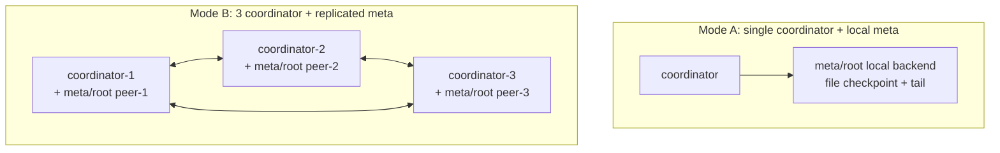
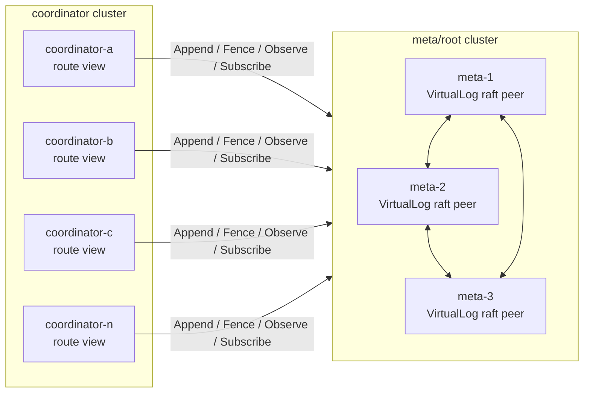
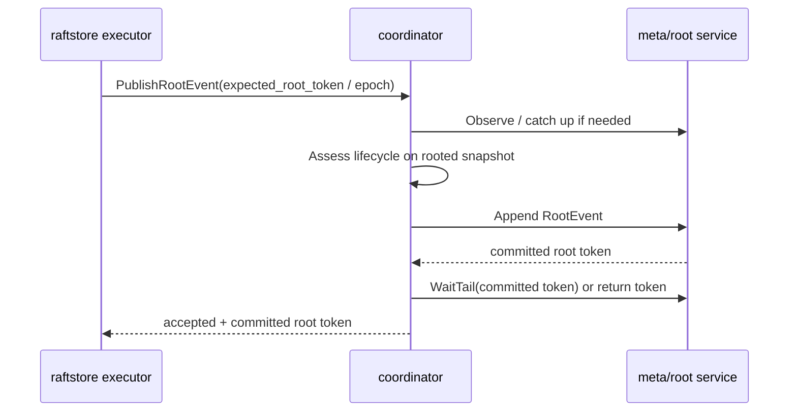

# 2026-04-12 Coordinator 和 meta/root 分离部署设计

> 状态：implemented experimental mode。当前默认正式模式仍然是 `single coordinator + local meta` 和 `3 coordinator + replicated meta`；`remote meta/root`、Coordinator lease gate、allocator window、remote root harness、基本 correctness tests 和最小运维脚本都已落地，但 separated deployment 还不是默认运维路径，也还没有完成真实网络与 baseline 级别的评估。本文说明为什么拆、什么时候不该拆，以及拆分前后哪些协议边界必须明确。

## 导读

- 🧭 主题：`coordinator` 和 `meta/root` 是否应该从 co-located replicated mode 演进到 separated deployment。
- 🧱 核心对象：`RootStore`、`VirtualLog`、`RootToken`、Coordinator lease、TSO/ID window、scheduler owner。
- 🔁 调用链：`coordinator view -> remote meta/root VirtualLog -> tail catch-up -> freshness-aware routing`。
- 📚 参考对象：Delos 的 VirtualLog 分层、TiKV/PD+etcd 的 co-located control-plane 经验、FoundationDB 的控制面角色拆分。

## 1. 当前实际部署是什么

NoKV 当前不是只有一个模式，而是两个正式模式：



Mode B 已经是多进程 HA，只是每个 `coordinator` 进程内同时托管一个 `meta/root` raft peer。

这意味着当前系统已经具备：

- `meta/root` 的三副本 replicated truth。
- `coordinator` 从 rooted truth 重建 view。
- `RootStore` 作为 `coordinator` 和 `meta/root` 的适配边界。
- TSO/ID fence 写入 `meta/root`，避免 leader 切换后回退。
- 非 rooted leader 的 Coordinator 拒绝 `AllocID`、`Tso` 和 `PublishRootEvent`。

当前已经实现：

- 独立 `meta/root` 服务进程：`nokv meta-root`。
- `coordinator --root-mode=remote`。
- `meta/root` 对外 gRPC API 和 remote client。
- 独立 Coordinator 集群的 lease / owner 最小机制。
- ID / TSO window 预分配。

当前仍未完成：

- 更完整的 ops 脚本和稳定运维说明。
- 更系统化的 failure / recovery 演练。

当前已经补齐的 observability：

- `nokv coordinator --metrics-addr ...` 会发布 `nokv_coordinator` expvar key。
- `nokv_coordinator` 当前包含：
  - `root_mode`
  - rooted read-state summary
  - lease state
  - allocator window state

当前已经补齐的 correctness coverage：

- `coordinator/integration` 覆盖 Mode C coordinator crash/recovery：
  - old Coordinator 分配 ID 后不 release lease，模拟崩溃
  - remote `meta/root` 独立存活
  - new Coordinator 使用同一 stable `coordinator-id` 连接 remote root
  - new `AllocID` 严格大于 crash 前最后返回 ID
  - rooted allocator fence 和 lease fence 不回退
- `meta/root/backend/replicated` 覆盖 root leader change：
  - old root leader 写入 `CoordinatorLease` 和 allocator fences
  - new root leader 继续 renew 同一 holder
  - ID / TSO fences 在所有 root peers 上保持单调不回退

## 2. 分离部署长什么样

未来 separated mode 应该是：



这里 `meta/root` 是 durable truth cluster，`coordinator` 是可水平扩展的 service/view layer。

关键原则：

1. `meta/root` 仍然只做 truth kernel，不变成完整 Coordinator。
2. `coordinator` 仍然只持有 rebuildable view，不拥有 durable topology truth。
3. separated mode 不能破坏现有 co-located mode；它必须复用同一个 `RootStore` / `VirtualLog` contract。
4. separated mode 不是默认模式，它是当 routing / Coordinator 运维成为瓶颈时才打开的部署形态。

## 3. 为什么要分离部署

### 3.1 独立失败域

当前 Mode B 中，一个进程崩溃会同时带走：

- 一个 `coordinator` service instance。
- 一个 `meta/root` raft peer。

这在三节点内是可接受的，但失败域仍然绑定。

分离后：

- `coordinator` 崩溃不会带走 `meta/root` peer。
- `meta/root` 少数节点故障不影响已有 `coordinator` 继续用 cached view 服务 best-effort / bounded read。
- `coordinator` 可以滚动升级，不触发 `meta/root` raft peer 重启。

这对生产运维有真实价值，但不是项目早期必须承受的复杂度。

### 3.2 Coordinator 水平扩展

`meta/root` 是共识系统，不应该通过加很多节点来扩展读服务。Raft group 节点越多，写路径越重。

`coordinator` 是 view/service 层，可以通过更多实例扩展：

- `GetRegionByKey`
- route freshness check
- gateway route lookup
- control-plane read/debug surface

分离后可以是：

```text
3 meta/root nodes + N coordinator nodes
```

这比把 `3 coordinator + replicated meta` 扩成 `7 coordinator + 7 meta peers` 更合理。

### 3.3 版本演进更干净

如果 `coordinator` 和 `meta/root` 进程分开：

- `coordinator` 可以更频繁升级 route / scheduler policy。
- `meta/root` 可以保持小而稳定。
- `VirtualLog` wire API 成为明确兼容边界。

这适合长期系统演进，也适合把 NoKV 的控制面设计作为 research / workshop case study 来讲。

## 4. 为什么现在不应该直接实现

分离部署不是把函数调用换成 RPC 那么简单。

如果直接做 remote `RootStore`，会立刻出现三个问题。

### 4.1 TSO/ID 热路径会被打穿

在没有 window 的设计里，`reserveTSO` 和 `reserveIDs` 每次分配都会调用 `SaveAllocatorState`，也就是推进 `meta/root` 中的 allocator fence。

当前代码已经先实现 co-located 模式下的 allocator window，所以 `Tso` 和 `AllocID` 热路径都不会在窗口内重复推进 root fence。`AllocID` 目前还没有生产拓扑消费者，但它和 TSO 使用同一套 durable fence 语义。

分离后，每次 TSO 都变成 remote `FenceAllocator` RPC。如果每个事务要 `start_ts` 和 `commit_ts`，那么：

```text
10k txn/s -> 20k TSO/s -> 20k remote fence writes/s
```

这会把 `meta/root` 写路径变成事务热路径，不能接受。

### 4.2 写后读会出现 view staleness 窗口

当前 co-located 模式中：

```text
AppendRootEvent -> reload RootStore -> ReplaceRootSnapshot
```

写入和 view 更新在一个进程里同步完成。

分离后：

```text
coordinator AppendRootEvent RPC -> meta/root commit -> tail stream -> coordinator catch-up
```

在 commit 和 catch-up 之间，Coordinator view 可能落后。

所以 freshness contract 不是一个附加诊断字段，而是让 separated mode 成立的必要机制：

- 没有 separated mode 时，它让 staleness 可观测。
- 有 separated mode 时，它决定路由读能不能被安全返回。

Separated mode 必须严格依赖：

- `RootToken`
- `CatchUpState`
- `DegradedMode`
- `Freshness`

否则客户端会拿到刚被 split / merge 过期的旧路由。

### 4.3 调度 owner 需要明确

`StoreHeartbeat` 当前能返回 lightweight scheduler operation，例如 leader transfer hint。

如果 N 个 Coordinator 都接收 heartbeat 并各自做调度，可能产生重复或冲突操作。

因此 separated mode 必须定义：

- 所有 Coordinator 都可以接收 heartbeat 并更新本地 store stats。
- 只有 lease holder 可以返回 scheduler operations。
- 非 lease holder 返回空 operation，或者返回 redirect hint。

## 5. 核心设计：remote root + coordinator lease + allocator window

Separated mode 需要三个机制一起出现。

### 5.1 Remote `meta/root` API

新增一个独立 `meta/root` service，暴露 `VirtualLog` 能力，而不是暴露完整 Coordinator 语义。

最小 API：

```proto
service MetadataRoot {
  rpc Append(AppendRequest) returns (AppendResponse);
  rpc FenceAllocator(FenceAllocatorRequest) returns (FenceAllocatorResponse);
  rpc Observe(ObserveRequest) returns (ObserveResponse);
  rpc WaitTail(WaitTailRequest) returns (WaitTailResponse);
  rpc SubscribeTail(SubscribeTailRequest) returns (stream TailAdvance);
  rpc Campaign(CampaignRequest) returns (CampaignResponse);
  rpc Status(StatusRequest) returns (StatusResponse);
}
```

这层 API 的原则：

- 只表达 root log / checkpoint / tail / fence。
- 不暴露 `GetRegionByKey`。
- 不暴露 scheduler policy。
- 不把 `meta/root` 做成第二个 Coordinator。

写 RPC 必须有明确 leader redirect 语义：

- `Append`、`FenceAllocator`、`Campaign` 只能由 `meta/root` leader 接受。
- follower 返回 `NOT_LEADER`，并尽量携带 `leader_id` / `leader_addr`。
- `meta/root/client` 负责自动刷新 leader hint 并重试 retryable write。
- 这和 raftstore 的 `NotLeader` 路由模型一致，不能让上层 Coordinator 猜测哪个 root peer 是 leader。

对应代码落点：

- `meta/root/server`
- `meta/root/client`
- `coordinator/storage/root_remote.go`

`coordinator/storage/root_open.go` 里的 `rootBackend` 已经是天然分离点。

### 5.2 Coordinator lease

分离后，Coordinator 不再天然跟 `meta/root` raft leader co-located，所以必须定义谁拥有 singleton service 权限。

需要 singleton owner 的能力：

- `Tso`
- `AllocID`
- scheduler operation planning

不需要 singleton owner 的能力：

- `GetRegionByKey`
- `RegionLiveness`
- local `StoreHeartbeat` stats recording
- `PublishRootEvent` 的最终串行化，因为它本身由 `meta/root` raft append 串行化

但是 `PublishRootEvent` 的 pre-assessment 依赖 Coordinator view，所以 separated mode 下它必须带明确的 root precondition：

- request 带 `ExpectedClusterEpoch` 或 `ExpectedRootToken`。
- Coordinator 必须先 catch up 到该 token，再做 assessment。
- Append 成功后，Coordinator 要么 wait 到 returned token，要么在 response 中返回 committed root token，要求 caller 后续用 freshness 检查。

Lease 事件可以作为 rooted truth 的一部分：

```go
type CoordinatorLease struct {
    HolderID     string
    Term         uint64
    ExpiresUnixNano int64
    IDFence      uint64
    TSOFence     uint64
}
```

`Campaign` 的语义必须明确：

1. Coordinator 向 `meta/root` leader 提交 `KindCoordinatorLease` campaign。
2. `meta/root` 状态机检查当前 lease 是否仍 active。
3. 如果已有 active holder，返回失败并携带 current holder / expiry / leader hint。
4. 如果没有 active holder，写入新 lease，返回 success、lease term、expiry、ID fence、TSO fence。
5. 获胜 Coordinator 必须先根据 returned fences 初始化本地 allocator window，然后才能开放 `Tso`、`AllocID` 和 scheduler operation。

约束：

- 同一时间最多一个 active holder。
- Lease renew 必须通过 `meta/root` append 或 compare-and-fence 完成。
- Holder 失去 lease 后必须拒绝 `Tso`、`AllocID` 和 scheduler operation。
- Follower Coordinator 可以继续服务 best-effort / bounded route read。

### 5.3 TSO/ID window

直接每次 `Tso` / `AllocID` 写 root fence 不可接受。

需要窗口预分配：

```text
root fence = durable upper bound
local current = in-memory next value
window high = already fenced high watermark
```

TSO 分配流程：

```text
if current + count <= window_high:
    return from memory
else:
    require active coordinator lease
    FenceAllocator(TSO, current + window_size)
    window_high = returned fence
    return from memory
```

ID 也应该支持同样机制，但优先级不同。

当前代码里 `AllocID` 已经实现并持久化 fence，但生产拓扑路径还没有真正调用它：`store_id`、`region_id`、`peer_id` 仍然主要来自静态配置或调用方显式传入。也就是说：

- TSO window 是 separated mode 的必要前置条件。
- ID window 是边界统一和未来动态 topology 的准备，不是近期性能瓶颈。

区别只是频率：

- TSO 是事务热路径，必须 window。
- ID 当前频率低，但最好复用同一套 window 机制，避免未来 `AddStore`、split、peer add 高频时重新设计。

崩溃恢复语义：

- 已 fence 但未使用的窗口可以跳过。
- 新 holder 从 durable fence 之后继续分配。
- ID / TSO 要求唯一和单调，不要求连续。

这和 TiKV TSO 以及多数工业 allocator 的做法一致。

## 6. 性能分析

### 6.1 数据平面

无影响。

KV 读写仍然是：

```text
client -> raftstore leader peer
```

不经过 `coordinator` 或 `meta/root`。

### 6.2 路由读

正常情况下无明显影响。

`GetRegionByKey` 仍然读 Coordinator in-memory view。

区别在于 separated mode 的 view catch-up 更容易落后，所以强 freshness 请求可能等待 tail：

```text
FRESHNESS_BEST_EFFORT -> 直接返回当前 view
FRESHNESS_BOUNDED     -> lag 在 bound 内才返回
FRESHNESS_STRONG      -> 必须 catch up 到 current root token
```

这不是吞吐问题，而是语义选择。

### 6.3 TSO/ID

不做 window：不可接受。

做 window：可接受。

假设：

```text
TSO request = 100k/s
window size = 10k
remote fence latency = 1ms
```

则 root fence 写频率约为：

```text
100k / 10k = 10 writes/s
```

热路径是内存 atomic / mutex，不再是 remote raft write。

### 6.4 Topology change

`split`、`merge`、`peer change` 本来就不是高频数据路径。

Separated mode 多一次 root RPC 和 tail catch-up，通常是毫秒级，不影响整体系统吞吐。

真正要守住的是 correctness：append 成功后，caller 不能假设所有 Coordinator 立刻看见新 topology。

## 7. 正确性边界

### 7.1 Lease safety

不变量：

```text
At most one Coordinator may allocate TSO/ID or emit scheduler operations at a time.
```

实现要求：

- Lease 写入必须走 `meta/root` 串行化。
- Lease holder 每次发号前都必须检查本地 `lease_active` 标志，不能只在 window refill 时检查。
- Lease holder 必须有独立的 expiry monitor，定期检查本地 lease deadline。
- Expiry monitor 必须在 `ExpiresUnixNano - clock_skew_buffer` 时主动停止发号，把本地 `lease_active` 置为 false。
- Lease 到期前无法 renew 时，holder 必须停止发号，而不是继续靠本地窗口服务。

不能把 safety 建立在 `window_exhaust_time < lease_ttl / 2` 上。低流量时窗口可能很久都不会耗尽，如果只在 refill 时检查 lease，旧 holder 会在 lease 过期后继续用旧 window 发号。

正确的安全条件是：

```text
Tso / AllocID fast path = require lease_active && now < lease_deadline - clock_skew_buffer
```

Lease TTL 必须覆盖物理时钟和运行时抖动：

```text
lease_ttl > max_clock_skew + max_gc_pause + max_network_jitter + renew_margin
```

工程默认值应该保守，例如 TTL >= 10s，再通过测试和 benchmark 调整。窗口大小只影响 refill 频率和最多跳过多少 ID / TSO，不应该决定 lease safety。

### 7.2 Allocator monotonicity

不变量：

```text
new_holder_start > max(old_holder_fenced_high)
```

因此 lease state 必须携带或能读取：

- latest ID fence
- latest TSO fence

新 holder 获得 lease 后必须先 fence allocator，再开放 `Tso` / `AllocID`。

### 7.3 View freshness

不变量：

```text
Coordinator may serve stale routes only when the requested freshness permits it.
```

Separated mode 必须严格使用：

- `RootToken`
- `root_lag`
- `CatchUpState`
- `DegradedMode`

对于 `FRESHNESS_STRONG`：

- 如果 Coordinator 没有 catch up 到 root current token，必须等待或失败。
- 不能返回 best-effort route。

对于 `FRESHNESS_BEST_EFFORT`：

- 可以返回当前 view。
- 必须携带 degraded / lag 信息，让 caller 知道风险。

### 7.4 PublishRootEvent write-after-read

Separated mode 中，`PublishRootEvent` 的正确流程应该是：



这个流程避免 stale Coordinator 基于旧 view 做错误 assessment。

## 8. 为什么不是让 meta/root 直接发 TSO

可以，但不推荐作为第一方案。

方案对比：

| 方案 | 优点 | 问题 |
| --- | --- | --- |
| TSO 下沉到 `meta/root` | leader 唯一性最直接 | `meta/root` 从 truth kernel 变成 service；热路径压到 root leader |
| Coordinator lease + window | 保持 `meta/root` 小；TSO 热路径在 Coordinator 内存 | 需要 lease 正确性和 window refill |
| Coordinator 自己 raft | 语义独立 | 引入第三个 consensus 层，不值得 |

推荐选择：

```text
Coordinator lease + TSO/ID window
```

原因：它保留 NoKV 当前最重要的边界：

- `meta/root` 是 durable truth kernel。
- `coordinator` 是 service/view/runtime host。
- `raftstore` 是 executor。

## 9. 实现路线

### Phase 0：不开放 separated mode

保持当前正式模式：

- local co-located
- replicated co-located

这个阶段的约束已经完成；后续实现虽然已经开放 `--root-mode=remote`，但它仍然不是默认推荐模式。

### Phase 1：先做 allocator window

状态：TSO window 和 ID window 已实现。

已经落地：

- `coordinator/server` 增加 allocator window state。
- `SaveAllocatorState` 只在 ID / TSO window refill 时调用。
- 当前 co-located 模式也使用 window。
- reload rooted allocator fence 时，不会消耗本地仍然 active 的 allocator window。
- `AllocID` 仍然没有生产拓扑消费者；ID window 主要是边界统一和 future dynamic topology 的准备。

测试：

- ID / TSO 单调性。
- ID / TSO window 内不会重复持久化 fence。
- reload 不会消耗 active allocator window。
- leader 切换后从 fence 继续。
- window refill 失败后不得继续服务 allocator 请求。

### Phase 2：定义 root remote API，但只做 client/server harness

状态：最小 harness 已实现；remote ops path 已有最小 CLI/脚本入口。

已经落地：

- `pb/meta/root.proto` 增加 `MetadataRoot` 服务。
- `meta/root/remote` 提供 gRPC service/client。
- remote client 实现 `Snapshot`、`Append`、`FenceAllocator`、`IsLeader`、`LeaderID`。
- remote client 实现 unary `ObserveCommitted`、`ObserveTail`、`WaitForTail`，可驱动 `RootStore` catch-up。
- remote client 支持多 endpoint，并在写请求收到 `leader_id` hint 后重试 leader。
- coordinator 可以通过现有 `RootStore` contract 包装 remote client。
- follower 写请求返回 `FailedPrecondition`，错误文本携带 `leader_id` hint。

仍未落地：

- watch push / streaming notification；当前只有 unary observe/wait。
- 更完整的 remote deployment observability。

测试：

- remote root append / snapshot through `RootStore`。
- remote allocator fence through `RootStore`。
- remote root write on follower returns `NOT_LEADER + leader_hint`。
- remote root client follows leader redirect and retries write。
- remote RootStore subscription can observe tail advance through unary observe/wait。
- invalid allocator kind returns `InvalidArgument`。

### Phase 3：Coordinator lease

状态：root truth 层和 coordinator runtime 最小 gate 已实现；默认仍未启用 separated deployment。

已经落地：

- `meta/root/event` 增加 `CoordinatorLeaseGranted` rooted event。
- `meta/root/state` checkpoint state 增加 `CoordinatorLease`。
- local / replicated root backend 增加 `CampaignCoordinatorLease`。
- remote root RPC 增加 `Campaign`。
- active holder 未过期时，新 holder campaign 返回 current holder。
- holder 自己可以 renew，过期后新 holder 可以接管。
- campaign event 同时推进 ID / TSO durable fences。
- `coordinator/server.Service` 增加显式 `ConfigureCoordinatorLease(...)`。
- 开启 lease gate 后，`Tso` / `AllocID` / scheduler operation 都要求当前 holder 持有 lease。
- `StoreHeartbeat` 仍然接受统计上报，但在无 lease 或 follower 时不返回 scheduler operations。
- runtime 在 `ExpiresUnixNano - clock_skew_buffer` 前停止继续使用本地 lease，并要求先 renew/campaign。
- `RunCoordinatorLeaseLoop(ctx)` 已落地；启用 `--coordinator-id` 的 coordinator 会后台续租。
- rooted `ReleaseCoordinatorLease()` 已落地；graceful shutdown 会显式 release 当前 holder lease。

仍未落地：

- 更丰富的 release observability / metrics。
- 真实网络下的 lease / recovery 评估。
- external authority baseline allocator 对比。

测试：

- active holder 存在时，`Campaign` 返回失败和 current holder。
- lease 过期后，新 holder 接管。
- lease event replay 后恢复 holder 和 allocator fences。
- replicated follower refresh 后能看到 lease 和 fences。
- remote campaign round-trip。

### Phase 4：开放 separated deployment

新增 CLI：

```bash
nokv meta-root \
  --addr 127.0.0.1:2380 \
  --mode replicated \
  --transport-addr 127.0.0.1:3380 \
  --node-id 1 \
  --peer 1=127.0.0.1:3380 \
  --peer 2=127.0.0.1:3381 \
  --peer 3=127.0.0.1:3382 \
  --workdir ./artifacts/meta-1

nokv coordinator \
  --addr 127.0.0.1:2379 \
  --root-mode remote \
  --root-peer 1=127.0.0.1:2380 \
  --root-peer 2=127.0.0.1:2381 \
  --root-peer 3=127.0.0.1:2382
```

当前状态：

- `nokv meta-root` 已落地，支持 `local|replicated`。
- `nokv coordinator --root-mode=remote` 已落地，可连接 remote `meta/root`。
- `--coordinator-id`、`--lease-ttl`、`--lease-renew-before` 已接入 `nokv coordinator` CLI。
- `remote` 模式现在要求显式提供稳定 `--coordinator-id`。
- `scripts/ops/serve-meta-root.sh` 已落地，可独立控制单个 `meta/root` 进程。
- `scripts/dev/separated-cluster.sh` 已落地，可直接启动 `3 meta-root + 1 coordinator(remote) + stores` 的本地编排。
- 仍未补齐稳定运维说明和更完整的 observability。

`--coordinator-id` 必须是稳定配置 ID，不应该每次启动生成 UUID。

原因：

- lease holder 身份需要可观测、可审计。
- 重启后的同一 Coordinator 可以用同一身份重新 campaign。
- 随机 UUID 会让运维日志和 lease ownership 难以追踪。

稳定 ID 不表示自动续租旧 lease；重启后仍必须重新 campaign，并根据 `meta/root` 返回的 fences 初始化 allocator window。

默认仍然不应该是 separated mode。

## 10. 什么时候值得启用 separated mode

值得启用：

- `GetRegionByKey` / route lookup QPS 成为瓶颈。
- 需要 Coordinator 独立滚动升级。
- 需要把 `meta/root` 失败域和 service layer 失败域分开。
- 要做控制面研究，需要展示 co-located 与 separated 的明确 tradeoff。

不值得启用：

- 小集群。
- 单机 / 本地实验。
- Coordinator QPS 远低于 raftstore 数据面 QPS。
- 还没有真实网络验证、baseline 对比和成熟运维手册。

当前项目阶段推荐：

```text
继续使用 Mode B: 3 coordinator + replicated meta
```

原因很简单：它已经提供 HA，TSO 语义简单，部署也更少。

## 11. Workshop / 研究定位

这个设计的研究价值不是“发明了 Delos”。

诚实定位应该是：

> NoKV 把 Delos 的 VirtualLog 思路应用到分布式 KV 控制面，并进一步把 durable truth、service view、data-plane executor、freshness contract 和 optional separated deployment 放进同一个可实现系统里。

可 defend 的贡献点：

- 在 KV 控制面里把 authority / service / executor 分开。
- 把 route freshness 做成显式 API，而不是依赖 NotLeader / EpochNotMatch 反推。
- 展示 co-located 和 separated deployment 可以共享同一个 `VirtualLog` / `RootStore` contract。
- 分析 TSO/ID allocator 在 separated deployment 下必须用 lease + window，否则会变成 root 写瓶颈。

不应该声称：

- 新共识协议。
- 新 VirtualLog 理论。
- 性能一定优于 TiKV/PD。

更合理的 paper 类型：

- workshop experience paper
- systems design note
- research platform paper

当前更诚实的分层是：

- HotStorage / systems workshop：证据已经基本够用。
- CHEOPS 这类 systems workshop：再补真实网络实验会更稳。
- CIDR：还需要多机或 `tc netem` 级别实验、baseline 对比，以及更收敛的论文叙事。

需要补的实验：

- co-located vs separated route lookup QPS。
- TSO no-window vs window 的吞吐和 tail latency。
- root catch-up lag 对 `FRESHNESS_STRONG` / `BOUNDED` / `BEST_EFFORT` 的影响。
- Coordinator crash / root leader switch 下 allocator monotonicity。

## 12. 当前证据的边界

这部分需要明确写死，否则很容易在论文里说过头。

当前已经有的证据：

- separated deployment 的 correctness path 已经跑通。
- allocator window 的必要性已经能通过 benchmark 入口和退化对照组说明。
- coordinator crash / recovery 和 root leader change 都有直接测试覆盖。

当前还不该声称的内容：

- `remote` benchmark 的绝对延迟代表真实多机部署。当前 benchmark 使用的是进程内 `bufconn`，它只说明 API stack 成本，不说明真实网络 RTT。
- separated deployment 在生产环境里已经成熟。当前它是 implemented experimental mode，不是默认 ops path。
- 性能优于 TiKV/PD、etcd 或其他工业控制面。当前没有可比的 baseline 数据。

下一步真正该补的是：

1. 把 `BenchmarkControlPlaneAllocID*` 扩到真实 TCP。
2. 在 `tc netem` 或三进程跨 host 条件下重跑 B1/B2/B3。
3. 加一个 external authority baseline，例如 etcd 每次 `put` 一次 fence 的 allocator。
4. 把 restart / recovery recipe 写成可重复的 ops 文档。

## 13. 总结

`coordinator` 和 `meta/root` 分离部署有价值，但不是当前默认路线。

它解决的是：

- Coordinator 水平扩展。
- 独立失败域。
- 独立升级和研究可观测性。

它带来的代价是：

- TSO/ID 必须做 lease + window。
- scheduler owner 必须明确。
- route freshness 必须严格执行。
- 运维从一套集群变成两套角色。

所以当前正确路线不是继续堆功能，而是把证据补完整：

1. 保持 co-located mode 作为默认运维路径。
2. 把 separated mode 的真实网络实验和 baseline 对比补齐。
3. 把 restart / recovery / observability 文档补到可重复执行。
4. 再决定是把它定位为实验部署，还是更正式的 ops 选项。

这样做符合 NoKV 的主线：先守住 correctness 和边界，再谈部署扩展性。
