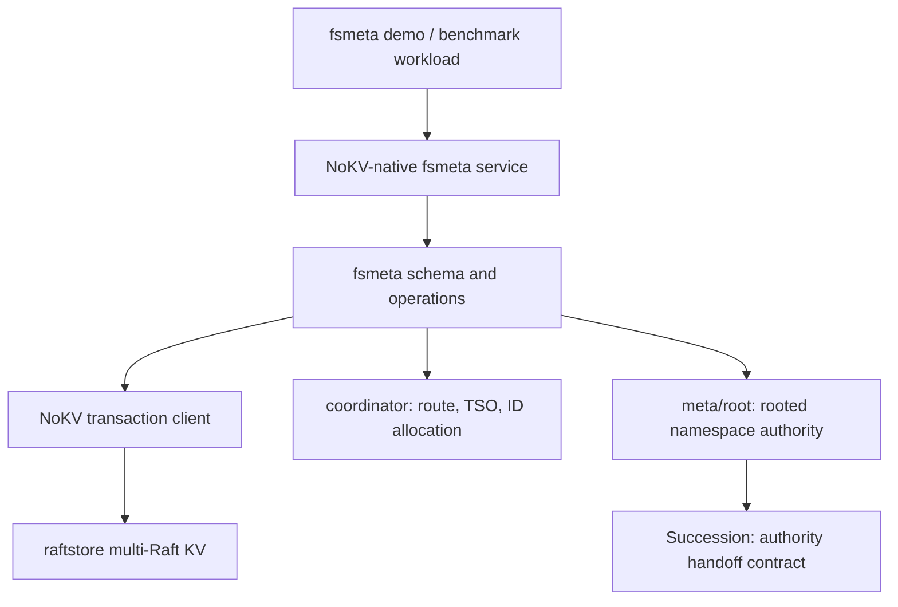

# 2026-04-24 fsmeta 定位：面向分布式文件系统的元数据底座

> 状态：Stage 1 native-service roadmap v2。`fsmeta/` 已落包边界、value codec 和最小 executor。v2 相对 v1 的主要修订：
>
> - Stage 1 从 JuiceFS TKV adapter 改为 NoKV-native metadata service；
> - benchmark 锚点从"对标 TiKV / FDB"改为"同一 NoKV 集群下 native API vs generic KV schema"；
> - JuiceFS 降级为 Stage 3 兼容性验证，不再作为主线卖点；
> - 保留 §10 Related Work，但不再把 TKV 兼容作为 Stage 1 gating。

## 导读

- 🧭 主题：NoKV 作为云原生分布式文件系统的 metadata service，是否是一个成立的生态位。
- 🧱 核心对象：`fsmeta`、`raftstore`、`percolator`、`coordinator`、`meta/root`、Succession。
- 🔁 调用链：native fsmeta service -> `fsmeta` schema/API -> NoKV transaction client -> raftstore multi-Raft execution；mount/subtree authority -> `meta/root` rooted events。
- 📚 参考对象：
  - 工业 —— Meta Tectonic、Google Colossus、DeepSeek 3FS、CephFS、HDFS/RBF、JuiceFS、CurveFS、CubeFS、Lustre、FoundationDB、etcd；
  - 学术 —— Weil'04、IndexFS、ShardFS、HopsFS、InfiniFS、CFS、Tectonic、λFS、FileScale、FoundationDB、DaisyNFS、Mooncake、Quiver。

## 1. 结论

NoKV 不应该把这个方向包装成"又一个分布式文件系统"。更准确的位置是：

> **NoKV fsmeta 是 hyperscaler "stateless schema 层 + 外部事务 KV" 架构在 Go + CNCF 生态里的开源实现，专门为 filesystem metadata workload 调过边界。**

**为什么这个定位站得住**：2021 年以来，hyperscaler 的 DFS 元数据设计已经**明显收敛**到同一个模式——Google Colossus (Curator + Bigtable)、Meta Tectonic (ZippyDB)、DeepSeek 3FS (FoundationDB)、Snowflake (FoundationDB)——也就是"无状态 schema / 业务层 + 外部事务 KV 做持久层"。开源 / CNCF 生态已经有 CubeFS、Curve、JuiceFS 这类完整文件系统或 frontend，但缺的是一个**面向 DFS metadata workload 的外部事务 KV substrate**：既是可复用后端，又把目录 range、subtree authority、watch、readdir+stat 这些语义纳入存储层边界。

这个生态位和现有系统不完全重叠：

- JuiceFS 把 metadata engine 抽象成可插拔接口，但它自己不做 KV；TKV 模式下 inode/dentry/chunk/session 都编码成普通 key/value。
- 3FS 的 metadata service 轻量，所有事务边界都压到 FoundationDB；inode 用 `INOD`、dentry 用 `DENT`。
- Meta Tectonic 把 metadata 拆成 Name / File / Block 三层，全部压到 ZippyDB。
- CurveFS / CephFS 是完整文件系统，metadata service 深度绑定自己的客户端协议。
- etcd 是小规模强一致配置 KV，不适合承接数亿 inode/dentry 主存储。

NoKV 要做的不是"比它们都强"，而是做一个**专门给 filesystem metadata workload 调过边界的、开源可运维的 KV/transaction substrate**：目录 range、inode/dentry lifecycle、subtree authority、readdir+stat、watch/cache invalidation 这些语义下沉到存储层，而不是全靠上层 key schema 拼出来。

## 2. 外部系统事实核验

### 2.1 工业系统

| 系统 | 元数据落点 | 工程含义 | 对 NoKV 的启发 |
|---|---|---|---|
| **Meta Tectonic** (FAST'21) | 三层 metadata（Name / File / Block），全部压到 ZippyDB（Paxos-replicated RocksDB KV）。stateless front-end。按 directory-id / file-id / block-id hash partition。参考：[FAST'21 PDF](https://www.usenix.org/system/files/fast21-pan.pdf)。 | 论文 §3.2 自己承认：MapReduce 读同目录 10k 个文件 → 单 ZippyDB shard 融化。hash-by-dir 解决不了 fan-in hotspot。 | NoKV 的 range-partitioned multi-Raft + split-on-hotness 是这条痛点的直接答案。 |
| **Google Colossus** | stateless Curators + Bigtable 存 FS 行；根元数据靠 Chubby 协调。参考：[Google Cloud blog](https://cloud.google.com/blog/products/storage-data-transfer/a-peek-behind-colossus-googles-file-system)。 | Curator 不服务数据，只做 control plane。scale 靠 Bigtable tablet split。 | 验证"stateless meta + external tx-KV"是成熟范式，不是异端。 |
| **DeepSeek 3FS** | stateless meta service + FDB；inode `"INOD"+le64(id)`、dentry 按 parent inode 聚簇。SSI 事务。参考：[3FS design notes](https://github.com/deepseek-ai/3FS/blob/main/docs/design_notes.md)。 | 继承 FDB 硬限（10MB / 5s / 10KB key）；文件长度在并发写入时只做最终一致，`close/fsync` 修正。 | 不照抄 FDB layer：把 metadata 常见原语下沉到 KV 层，绕开 5s 单事务上限的妥协。 |
| **JuiceFS + TiKV** | TKV 模式下 inode / dentry / chunk / session 编码成普通 KV。参考：[JuiceFS Internals](https://juicefs.com/docs/community/internals/)。 | JuiceFS 不要求 metadata backend 理解目录；TiKV 只是通用 range KV + tx。 | 它是反面边界：TKV 兼容会隐藏 fsmeta 的 native 差异化。NoKV 可以 Stage 3 验证兼容性，但 Stage 1 不以它为主线。 |
| **CubeFS MetaNode** | meta-partition 按 inode range，multi-Raft；内存 B-tree + snapshot + WAL。参考：[CubeFS design](https://www.cubefs.io/docs/master/design/metanode.html)。 | inode range 不天然等价于 parent-directory locality，大目录和跨目录操作仍要在文件系统层处理。 | NoKV 可以优先探索目录前缀 / subtree-aware 的 range placement，让 locality 成为存储层合同的一部分。 |
| **CurveFS** | MDS 用 etcd 存拓扑（HA）；Metaserver 存 inode/dentry（multi-Raft）。参考：[CurveFS architecture](https://docs.opencurve.io/CurveFS/architecture/architecture-intro)。 | CurveFS 明确不把 etcd 当 inode/dentry 主存储。 | 支持我们的判断：etcd 不适合承接高 churn FS metadata。 |
| **CephFS MDS** | stateful MDS + RADOS；Weil 2004 "dynamic subtree partitioning"。参考：[Weil SC'04](https://ceph.io/assets/pdfs/weil-mds-sc04.pdf)、[tracker #24840](https://tracker.ceph.com/issues/24840)。 | subtree balancer 不稳定（18 小时 delayed request），Reef+ 默认关闭多 MDS balancing。2025 年 [ACM TOS](https://dl.acm.org/doi/10.1145/3721483) 仍在研究怎么修。 | 20 年未修的包袱是我们的攻击面：NoKV 用 Succession 把 subtree handoff 形式化，规避 Ceph balancer 不稳定性。 |
| **HDFS + RBF** | 单 JVM NN + QJM；federation 静态切；RBF router stateless。参考：[HDFS RBF](https://hadoop.apache.org/docs/stable/hadoop-project-dist/hadoop-hdfs-rbf/HDFSRouterFederation.html)。 | LinkedIn 1.1B objects / 380GB heap；Uber 切 ViewFs；跨 subcluster rename 不支持。 | 静态 federation 的硬限定义了对比基线。 |
| **FoundationDB** | 单事务 10MB / 5s / key 10KB / value 100KB。参考：[FDB known limitations](https://apple.github.io/foundationdb/known-limitations.html)。 | 大目录 rename、递归 delete、批量 snapshot 必须拆小事务或上层协议。 | 我们的机会在 subtree-scoped 可恢复 operation，不是单个超大 KV 事务。 |
| **etcd** | 请求 1.5MiB；DB 2GiB 默认、8GiB 建议上限。参考：[etcd limits](https://etcd.io/docs/v3.4/dev-guide/limit/)。 | 适合配置 / 选主 / 控制面，不适合承接数亿 inode。 | 兼容 K8s 运维习惯，但目标不能降级成"更大的 etcd"。 |

### 2.2 学术参考（时间线）

| 论文 | 贡献 | 对 NoKV 的启发 |
|---|---|---|
| **Weil et al. SC'04** "Dynamic Metadata Management" | MDS 持有 subtree，hot subtree 分裂迁移。CephFS 至今架构骨架。参考：[SC'04 PDF](https://ceph.io/assets/pdfs/weil-mds-sc04.pdf)。 | subtree authority 方向对；Ceph 的 unbounded handoff 是痛点。NoKV Succession 形式化 handoff → subtree 权威可控。 |
| **IndexFS** (SC'14) | 每目录增量切分 (GIGA+)；LSM-style metadata 落盘；stateless client 缓存；**bulk insertion 针对 N-N checkpoint storm**。参考：[PDL PDF](https://www.pdl.cmu.edu/PDL-FTP/FS/IndexFS-SC14.pdf)。 | 三条直接可借：目录级增量 split、LSM-native metadata 落盘（NoKV 已有）、bulk insert 专门应对 AI checkpoint。 |
| **ShardFS** (SoCC'15) | 对立路线：directory-lookup state 全副本广播。参考：[SoCC'15](https://dl.acm.org/doi/10.1145/2806777.2806844)。 | 反面教材——mutation-heavy 时更差。NoKV 不走这条。 |
| **HopsFS** (FAST'17) | 把 HDFS 单 NN 的内存 metadata 换成 NewSQL（MySQL NDB）；**same-parent-same-shard** partitioning + 分布式事务。37× 容量、16-37× 吞吐。参考：[FAST'17](https://www.usenix.org/conference/fast17/technical-sessions/presentation/niazi)。 | **最接近的"stateless NN + tx-KV"先例**。same-parent-same-shard 是 fsmeta 的关键 partitioning 启发。 |
| **FoundationDB** (SIGMOD'21) | "Unbundled" 事务 KV 的 canonical design paper。参考：[SIGMOD'21](https://dl.acm.org/doi/10.1145/3448016.3457559)。 | 外 KV 做 metadata substrate 的权威引用。我们不是发明这条路，是在 CNCF 生态里兑现它。 |
| **Tectonic** (FAST'21) | hierarchical metadata 拆三层，全部压 ZippyDB。参考：[FAST'21](https://www.usenix.org/conference/fast21/presentation/pan)。 | 架构和 NoKV fsmeta 同构——**pattern 本身被 Meta 在生产验证**。 |
| **InfiniFS** (FAST'22) | **100B 文件 namespace**。三个想法：(a) 解耦 access metadata (permission/path) vs content metadata (inode attrs) → 按不同维度 partition；(b) speculative parallel path resolution；(c) optimistic access-metadata client cache → 干掉近根 hotspot。报告 73× / 23× 超 HopsFS / CephFS。参考：[FAST'22](https://www.usenix.org/conference/fast22/presentation/lv)。 | **最值得借鉴的学术先例**。access/content 解耦 → fsmeta schema 把 permission 和 attr 分开 partition；parallel path resolution → native RPC 设计。 |
| **CFS** (EuroSys'23) | 百度 AI Cloud 生产化。分层 metadata（attr vs namespace 独立扩）；**单 shard 原子原语替代分布式事务**；client-side metadata 解析。比 InfiniFS 快 1.22-4.10×。参考：[EuroSys'23](https://dl.acm.org/doi/10.1145/3552326.3587443)。 | **最近的直接先验**。哲学相同："尽量把操作 confine 到单 shard，去掉分布式事务冲突"。必须显式引用并说差异化（CFS 是内部系统、不 CNCF、没形式化 authority handoff）。 |
| **λFS** (ASPLOS'23) | HopsFS 的 NN 跑成 serverless function，动态 20→74 实例。参考：[ASPLOS'23](https://dl.acm.org/doi/10.1145/3623278.3624765)。 | 验证"schema 层无状态、真相在 KV"的可扩性极限。 |
| **FileScale** (SoCC'23) | 三层架构；小规模接近单机内存、大规模随 DDBMS 线性扩。参考：[SoCC'23](https://dl.acm.org/doi/10.1145/3620678.3624784)。 | 直接回应"DDBMS-based 系统在小规模慢 10x"的老问题——给 NoKV 的小规模性能要求提供学术对标。 |
| **Mooncake** (FAST'25 Best Paper) | 把"storage for AI"拉上顶会。参考：[FAST'25](https://www.usenix.org/conference/fast25/presentation/qin)。 | AI-storage 话题正式获得学术合法性，Stage 3 进入这个方向有顶会可投。 |
| **DaisyNFS** (OSDI'22) | Perennial + Iris + Coq 证明并发 + crash-safe NFS。60%+ Linux-NFS 吞吐。参考：[OSDI'22](https://www.usenix.org/conference/osdi22/presentation/chajed)。 | **分布式 metadata 的 formal verification 学术空白**。NoKV 已有 Succession TLA+，延展到 namespace correctness 是真正可发 paper 的点。 |
| **Quiver** (FAST'20) | DL workload 下的 informed storage cache。参考：[FAST'20](https://www.usenix.org/conference/fast20/presentation/kumar)。 | Stage 3 方向储备。 |

## 3. NoKV 当前能力盘点（file:line 校准）

这轮重新读了本仓关键路径，结论比上一轮更精确。

| 能力 | 当前状态 | 判断 |
|---|---|---|
| Multi-Raft range execution | `raftstore/server/node.go`、`raftstore/store/store.go`、`raftstore/kv/service.go`：region descriptor、epoch 校验、leader 路由、scan / get / prewrite / commit / rollback RPC 均已就绪。 | 可直接作为 inode / dentry / chunk-map 的物理执行层。 |
| **跨 region Percolator 事务** | `raftstore/client/client_kv.go:319` `TwoPhaseCommit` 已经支持跨 region：按 key 路由分组，先 primary prewrite/commit，再处理 secondaries。`raftstore/client/client_test.go:984,1669,1727` 已覆盖 route 不可用、取消路径、leader change 场景。`percolator/txn.go` 的单 region apply 是 **server-side apply 单位**，不是客户端事务边界。 | **Stage 1 不是从零做 2PC**，是硬化现有路径：补 secondary prewrite 失败清理、commit primary 成功而 secondary commit 失败的 resolve path、region split / epoch mismatch 下的 fsmeta-level 恢复测试。 |
| Prefix scan | `raftstore/kv/service.go` `KvScan` 已存在；反向 scan 未支持。 | `readdir` 基础已有；缺 `readdir+stat` fused RPC 和分页 contract。 |
| DeleteRange | `db.go` 单机 `DB.DeleteRange` 存在；`raftstore/kv/service.go` 未暴露 distributed DeleteRange RPC。 | recursive delete / subtree cleanup / GC 需补 region-by-region tombstone 事务 / 恢复设计。 |
| Watch / change feed | `meta/root` 有 tail subscription；数据面 KV 无 watch RPC。 | FUSE / client cache invalidation、subtree watch 需要补。`meta/root` 的 tail 语义模型可以迁移到数据面 changefeed。 |
| **ID / TSO RPC** | `pb/coordinator/coordinator.proto:305-306` 已定义 `AllocID` 和 `Tso` RPC，带 witness 验证。 | **不需要新 RPC**，需要整理成 fsmeta 稳定依赖的 client wrapper + 错误语义 + 超时重试 + witness 失败处理合同。 |
| Rooted truth / Succession | `meta/root/` + `spec/Succession.tla` 已能表达 authority handoff、allocator fences、coordinator lease；4 个 contrast model 形式化了 handoff legality 的最小保证。 | 不应承载每个 inode / dentry mutation；适合 mount、subtree authority、snapshot era、quota fence 这类低频 rooted truth。 |
| Namespace shell | `namespace.go` 是 DB lifecycle shell；`fsmeta/types.go` 顶部已声明用户 metadata plane 包边界，`fsmeta/value.go` 和 `fsmeta/exec/` 已形成最小 native executor。 | 方向正确：`fsmeta` 是应用数据 plane，不放进内部 `meta/`。 |
| **单 fsync 域（raft log + LSM 复用 WAL）** | `raftstore/engine/wal_storage.go`：raft entries 与 LSM 写同一 `wal.Manager`；`lsm.canRemoveWalSegment` 需同时咨询 manifest checkpoint 和 raft truncation metadata。 | **结构性优势，明确可宣称**：metadata 小写密集 workload 下，单 fsync 比"metadata service WAL + 底层 KV WAL"双层方案少一层 syscall 和一次 fsync barrier。 |

## 4. 正确的系统边界

`fsmeta` 应该分三层：

边界要固定：

- `fsmeta` 是用户 metadata plane，不是 NoKV 内部 cluster truth。
- `meta/root` 只放 namespace-level truth：mount registry、subtree owner、snapshot era、quota fence、authority handoff。
- inode / dentry / xattr / chunk / session 都是 raftstore / percolator 上的数据面记录。
- Stage 1 不做 JuiceFS TKV adapter。TKV 兼容会把 NoKV fsmeta 降级成"第五个通用 KV backend"，隐藏目录 range、subtree authority、native readdir 这些差异化。
- Stage 1 的验证入口是 NoKV-native service 和 workload benchmark；JuiceFS 只作为 Stage 3 末尾的兼容性验证。

## 4.5 借鉴与差异化

fsmeta 不是从零发明架构。下表明确每一条设计决定的学术/工业来源，以及 NoKV 在此之上加了什么。

| 设计决定 | 借鉴来源 | NoKV 在此之上加的 |
|---|---|---|
| stateless schema 层 + 外部事务 KV 做 truth | Tectonic / Colossus / 3FS / HopsFS | 在开源云原生生态里做一个可复用 metadata substrate；KV 层为 filesystem metadata 调过边界（不是只暴露通用 KV）。 |
| same-parent-same-shard key partition | HopsFS (FAST'17) | 用 range partition + region split hint 让它成为**副作用**而非显式 directive。 |
| access metadata vs content metadata 解耦 | InfiniFS (FAST'22) | `meta/root` 承载 authority-sensitive 的 access metadata（mount / quota / snapshot epoch）；`raftstore` 承载高频 content metadata。 |
| 单 shard 原子原语替代分布式事务 | CFS (EuroSys'23) | 用 NoKV 已有 region-local Percolator 实现；跨 region 仍用 `TwoPhaseCommit`。 |
| dynamic subtree partitioning | Weil SC'04 (CephFS) | **Succession 形式化 bounded handoff**，规避 Ceph balancer 的 unbounded migration 不稳定性。 |
| per-directory incremental split + LSM metadata | IndexFS (SC'14) | LSM 已是一等公民，不需要中间层。 |
| bulk insertion for checkpoint storm | IndexFS (SC'14) | `engine/lsm/` ingest buffer 天生适合，Stage 2 再做专门 API。 |
| hierarchical metadata 分层扩展 | Tectonic (FAST'21) | 分层但都落在**同一 NoKV KV 上**，避免 ZippyDB hash-by-dir 的 MapReduce 融化问题。 |
| client-side path resolution cache | InfiniFS / CFS | 用 `meta/root` tail subscription 做 bounded-freshness 客户端 cache 失效。 |
| serverless / elastic meta workers | λFS (ASPLOS'23) | Stage 2 可选；Stage 0-1 先保证架构分层允许 fsmeta 水平扩展。 |
| formal verification of metadata | DaisyNFS (OSDI'22, 单机), Succession TLA+ (NoKV 自有) | **学术空白**：DaisyNFS 没做分布式；NoKV Succession 扩展到 namespace correctness 是 novel research 贡献。 |
| AI checkpoint-aware metadata | Mooncake / Quiver (FAST'20, FAST'25) | Stage 1 benchmark 锚点；先做 checkpoint storm 和目录 hotspot fan-in 两个 workload，避免落入通用 KV 对标。 |

**自己独有、没人做的**：**Succession 形式化的 authority handoff 作为 namespace authority 的基础**。Weil'04 的 subtree 思想 + Succession 的 handoff legality = 别人做不到的差异化组合。

## 5. Claim budget

先把能说、不能说、Stage 2 才能说的 claim 切清楚。

| 类型 | 现阶段可说 | Stage 2 完成后可说 | 永远不能说 |
|---|---|---|---|
| Guaranteed property | `fsmeta` 和 `meta/root` 分层；rooted truth 不承载 per-inode mutation；subtree authority 可映射到 Succession。 | subtree rename / delete 具备 bounded handoff + rooted recovery；subtree watch 是 KV 层 novel primitive。 | "NoKV 是 production-ready DFS metadata service"。 |
| Measured effect | 引用 NoKV 已有 KV / scan / raftstore benchmark；单 fsync 域是结构性事实。 | 引用 `benchmark/fsmeta`：同一 NoKV 集群下 native API vs generic KV schema，在 checkpoint storm / directory fan-in workload 上的差异。 | "比 TiKV / FDB 更快"——没有同 workload、公平部署、可复现脚本前都不能说。 |
| Design hypothesis | metadata-native range / subtree primitive 能减少上层 schema hack，提高 readdir / rename / recursive delete / watch 的可维护性。 | metadata-native primitive 在**百度 CFS / InfiniFS 同尺度 workload**下可对标或有差异化改进。 | "通用 KV 做不到"——通用 KV 能做，但语义和恢复协议会挤到上层；这是更准确的说法。 |
| Non-goal | Stage 1 不做完整 POSIX FS，不替代 CephFS，不做数据块存储，不承诺 FUSE 性能，不做 JuiceFS TKV adapter。 | Stage 2 不做 kernel module / native client 数据面。 | 不要同时讲"教学平台"和"工业级 DFS"两套定位。 |

## 6. Stage 0/1 具体动作（基于本轮 audit 更新）

### Stage 0：边界落地

完成信号：

- `fsmeta/` 包存在，只描述 filesystem metadata plane，不引入实现。
- 本文进入 `docs/notes`，对外能解释 why fsmeta、why not `meta/`、why not another DFS。
- `docs/SUMMARY.md` 挂上本文。

当前 `fsmeta/types.go` 的包说明和本文已就位，Stage 0 闭合。

### Stage 1：NoKV-native metadata service + workload benchmark

**关键校正**：Stage 1 完全绕开 JuiceFS。目标不是成为 JuiceFS 的第五个 TKV backend，而是形成一个端到端 NoKV-native metadata 薄片：native service、native executor、native benchmark。`TwoPhaseCommit` 和 `AllocID / Tso` 都不是从零做，是**硬化 + 包装**。

必须做：

1. **硬化跨 region TwoPhaseCommit**  
   `raftstore/client.TwoPhaseCommit` 已补齐：
   - secondary prewrite 失败后的 rollback / cleanup；
   - commit primary 成功、secondary commit 失败后的 resolve path；
   - region split / epoch mismatch 下按 key 重新 route；
   - resolve failure 的 joined-error 覆盖。

   后续只补 fsmeta rename / unlink 级语义测试和 transaction status / lock resolver 后台清理入口。

2. **定义 fsmeta native schema v0**
   当前 `fsmeta/keys.go` 已定义 magic/version/key-kind；`fsmeta/value.go` 已定义 Inode / Dentry / Session value codec。Stage 1 剩余 schema 范围：
   - `ChunkRecord`：chunk mapping；
   - `UsageRecord`：目录 usage / quota counter；
   - `MountRecord`：mount-level metadata；
   - value schema freeze note。

3. **做 `fsmeta/exec` 到 `fsmeta/service` 的 native API**
   `fsmeta/exec` 已有 `Create` / `Lookup` / `ReadDir` 最小闭环。下一步是加：
   - `Unlink`；
   - `Rename`（primary = source dentry，真实消费跨 region 2PC）；
   - `OpenWriteSession`；
   - `fsmeta/service` gRPC API，直接暴露 native `Create/Lookup/ReadDir/Unlink/Rename`，不要经过 TKV。

4. **包装 `AllocID` / `Tso` 为 fsmeta client surface**  
   `pb/coordinator/coordinator.proto:305-306` 已有 RPC；需要补的是 fsmeta-facing client 包、错误语义、超时重试、witness 失败后的处理合同。

5. **做 native workload demo 和 benchmark**
   Stage 1 benchmark 不对标 TiKV / FDB。对照组是同一 NoKV 集群的两种模式：
   - **generic KV schema**：上层自己拼 key、自己做 read-modify-write；
   - **fsmeta native service**：走 `fsmeta/service` 的 operation API。

   两个 workload：
   - **checkpoint storm**：并发 client 在多个目录批量 create checkpoint files；
   - **directory hotspot fan-in**：大量文件集中在单目录，被并发 `ReadDir` / future `ReadDirPlus` 访问。

6. **补 distributed DeleteRange 设计草案**
   不一定 Stage 1 全实现，但 recursive delete 和 GC 会卡在这里。至少要定义 region-by-region range tombstone 的事务 / 恢复语义。

7. **明确 JuiceFS 位置**
   JuiceFS 不进入 Stage 1。Stage 3 末尾可以做一次性兼容性验证：证明 NoKV 的通用 KV 层能跑 JuiceFS，不追求性能，不作为项目卖点。

## 7. Stage 2 以后：NoKV 真正的差异化

Stage 1 只是进入牌桌。NoKV 的独特点要到 Stage 2 才明显。每个原语都映射到已有学术 / 工业锚点：

| 原语 | 锚点 | NoKV 的做法 |
|---|---|---|
| `ReadDirPlus(parent, cursor, limit)` | InfiniFS speculative parallel resolution；CFS client-side | raftstore 一次返回 dentry + inode attr，减少 RPC 和 MVCC read set |
| `RenameSubtree(src, dst)` | Weil'04 subtree 思想 + CFS 单 shard 原子 | rooted subtree authority + bounded KV txn；Succession 保证 handoff legality，规避 Ceph 不稳定 |
| `DeleteSubtree(root)` | FDB 硬限 → 3FS 拆小事务；CFS pruned critical sections | rooted deletion job + distributed DeleteRange + idempotent cleanup |
| `WatchSubtree(root, era)` | **工业 / 学术全空白**（etcd watch 是 key 粒度，不是 subtree） | `meta/root` tail subscription 模型迁移到数据面 changefeed，按 subtree 前缀过滤。**真正的 novel primitive。** |
| `SnapshotSubtree(root)` | Mooncake dataset management；Colossus snapshot | subtree era + immutable frontier，不要求复制所有 dentry |
| `QuotaFence(root)` | Tectonic / HopsFS quota counter；Succession authority | quota fence 作为 rooted event；普通计数走 KV，关键边界走 authority gate |

**Stage 2 交付范围**：6 条里实际交付 2-3 条（优先 `ReadDirPlus` + `RenameSubtree` + `WatchSubtree`），其余进 Stage 3 roadmap。避免 over-promise。

这部分才是 NoKV 相比 FDB / TiKV / etcd 的独立生态位：**不是"我也是 KV"，而是"我把 filesystem metadata 的操作边界做成存储层原语，并且给 subtree authority 提供形式化的 handoff 合同"**。

## 8. 工业生态位

适合切入的场景：

1. **云原生 fsmeta service**
   面向自研 DFS frontend、AI dataset service、对象存储网关，提供 Go-native、Kubernetes-friendly、multi-Raft replicated metadata substrate。

2. **AI / analytics dataset namespace service**  
   不抢 3FS 的 RDMA 数据面，专注 dataset 目录、snapshot、rename、quota、session、cache invalidation。

3. **对象存储网关的强一致 namespace 层**  
   S3 / object storage 没有天然目录树；NoKV fsmeta 可以做 bucket / prefix namespace authority、atomic publish、recursive cleanup。

4. **多租户 mount / subtree authority service**  
   把 Succession 从 coordinator authority 推广到 namespace authority：mount owner、snapshot era、quota fence、subtree migration 都有明确 handoff contract。

不适合现在切入的场景：

- 替代 CephFS 全栈。
- 做 kernel module / native client 数据面。
- 承诺比 FDB / TiKV 快，但没有同 workload benchmark。
- 把 Stage 1 做成 JuiceFS TKV backend。
- 把所有文件操作都放进 `meta/root` rooted event。

## 9. 最近应执行的工作单

按优先级（基于 v1 audit 后的实际工作量）：

1. 写 `fsmeta` v0 schema 和 operation contract：`Create` / `Lookup` / `ReadDir` / `Rename` / `Unlink` / `OpenWriteSession`。
2. 给 `raftstore/client.TwoPhaseCommit` 补 failure cleanup 测试矩阵：secondary prewrite fail、primary committed secondary pending、region epoch mismatch、leader unavailable。
3. 补 `fsmeta/exec` 的 `Unlink` 和 `Rename`，让 native executor 真实消费跨 region 2PC。
4. 定义 `fsmeta/service` gRPC API：`Create` / `Lookup` / `ReadDir` / `Unlink` / `Rename`，错误语义按 fsmeta native contract 暴露。
5. 包装 `AllocID` / `Tso` 为 fsmeta 稳定 client surface（错误语义、超时、witness 失败路径）。
6. 做 `cmd/fsmeta-demo`：模拟 checkpoint storm、dataset readdir、跨目录 atomic rename、quota check。
7. 做 `benchmark/fsmeta`：同一 NoKV 集群下 generic KV schema vs fsmeta native service。
8. 写 distributed DeleteRange design note，明确是否需要 rooted job。

这条线的判断标准很简单：Stage 1 如果不能证明 native service 在 metadata workload 上比"把 NoKV 当通用 KV 用"更清楚、更少 RPC 或更少事务冲突，这个方向就只能停留在架构叙事；如果能在 checkpoint storm / directory fan-in 上给出 profile，Stage 2 的 metadata-native primitive 才有可信基础。

## 10. Related Work

### 工业系统 / 设计文档

- Meta Tectonic — Pan et al., FAST'21. <https://www.usenix.org/system/files/fast21-pan.pdf>
- Google Colossus peek — Google Cloud blog (2021). <https://cloud.google.com/blog/products/storage-data-transfer/a-peek-behind-colossus-googles-file-system>
- DeepSeek 3FS design notes (2025, 非 peer-reviewed). <https://github.com/deepseek-ai/3FS/blob/main/docs/design_notes.md>
- Alibaba Pangu 2.0 — Li et al., FAST'23. <https://www.usenix.org/system/files/fast23-li-qiang_more.pdf>
- FoundationDB — Zhou et al., SIGMOD'21. <https://dl.acm.org/doi/10.1145/3448016.3457559>
- Snowflake cloud services over FDB — Dageville et al., SIGMOD'16. <https://dl.acm.org/doi/10.1145/2882903.2903741>
- CephFS MDS foundational — Weil, SC'04. <https://ceph.io/assets/pdfs/weil-mds-sc04.pdf>
- CephFS dynamic balancer 现状 — Yang et al., ACM TOS 2025. <https://dl.acm.org/doi/10.1145/3721483>
- CubeFS MetaNode. <https://www.cubefs.io/docs/master/design/metanode.html>
- CurveFS architecture. <https://docs.opencurve.io/CurveFS/architecture/architecture-intro>
- HDFS Router-Based Federation. <https://hadoop.apache.org/docs/stable/hadoop-project-dist/hadoop-hdfs-rbf/HDFSRouterFederation.html>
- JuiceFS Internals. <https://juicefs.com/docs/community/internals/>
- FDB known limitations. <https://apple.github.io/foundationdb/known-limitations.html>
- etcd system limits. <https://etcd.io/docs/v3.4/dev-guide/limit/>

### 学术论文

- IndexFS — Ren et al., SC'14. <https://www.pdl.cmu.edu/PDL-FTP/FS/IndexFS-SC14.pdf>
- ShardFS — Xiao et al., SoCC'15. <https://dl.acm.org/doi/10.1145/2806777.2806844>
- HopsFS — Niazi et al., FAST'17. <https://www.usenix.org/conference/fast17/technical-sessions/presentation/niazi>
- InfiniFS — Lv et al., FAST'22. <https://www.usenix.org/conference/fast22/presentation/lv>
- CFS — Wang et al., EuroSys'23. <https://dl.acm.org/doi/10.1145/3552326.3587443>
- Tectonic — Pan et al., FAST'21. <https://www.usenix.org/conference/fast21/presentation/pan>
- λFS — Carver et al., ASPLOS'23. <https://dl.acm.org/doi/10.1145/3623278.3624765>
- FileScale — Gankidi et al., SoCC'23. <https://dl.acm.org/doi/10.1145/3620678.3624784>
- Quiver — Kumar & Sivathanu, FAST'20. <https://www.usenix.org/conference/fast20/presentation/kumar>
- Mooncake — Qin et al., FAST'25 Best Paper. <https://www.usenix.org/conference/fast25/presentation/qin>
- DaisyNFS — Chajed et al., OSDI'22. <https://www.usenix.org/conference/osdi22/presentation/chajed>
- FSCQ — Chen et al., SOSP'15. <https://dl.acm.org/doi/10.1145/2815400.2815402>
- Yggdrasil — Sigurbjarnarson et al., OSDI'16 Best Paper. <https://www.usenix.org/conference/osdi16/technical-sessions/presentation/sigurbjarnarson>
