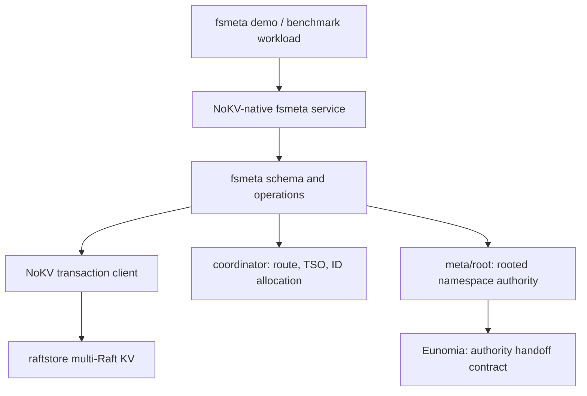

# 2026-04-24 fsmeta positioning: a metadata substrate for distributed filesystems

> Status: current public positioning v5. `fsmeta/` already ships schema, plan, executor, cross-region 2PC consumption, native gRPC service + typed client, `ReadDirPlus`, `WatchSubtree`, `SnapshotSubtree`, `RenameSubtree`, `Link` / `Unlink` link-count lifecycle, mount lifecycle, quota fence + persisted usage counter, and a native-vs-generic benchmark (same-cluster ReadDirPlus 42.5×).
>
> v5 vs v4 main revisions:
>
> - Reframe the Stage 2/3 already-shipped primitives from roadmap voice to current implementation;
> - Make explicit that quota fence is rooted truth, while the usage counter is a data-plane key — not written into `meta/root`;
> - Make explicit that `nokv-fsmeta`'s lifecycle monitor bootstraps at startup and then follows `WatchRootEvents`; `MonitorInterval` is a reconnect backoff;
> - `Link` / `Unlink` link-count lifecycle is shipped; directory hard-links remain illegal;
> - `DeleteSubtree`, FUSE frontend, S3 HTTP / object-body I/O, snapshot GC retention enforcement remain non-goals / future work.
>
> v4 vs v3 main revisions:
>
> - **Positioning extended**: fsmeta serves not just distributed filesystems but **also the namespace layer of object storage** — the schema was never hardcoded around POSIX assumptions; FS and object storage share the same substrate.
> - Added §1.5 making the three consumer types (DFS / object storage / AI dataset) co-equal — three identities sharing one architecture.
> - §7 Stage 2 primitives extended with object-storage-side applications (`RenameSubtree` solving S3's lack of native prefix rename, etc.).
> - §8 industrial niche: "object storage gateway namespace layer" elevated from adjacent niche to a primary consumer co-equal with DFS.
> - Confirmed that `meta/root`'s namespace-authority extensions (mount registry / snapshot epoch / subtree authority / quota fence / namespace tombstone) are **fully generic across FS and object storage**; the schema isn't specialized for any consumer.
>
> v3 revisions (preserved): added §7.5 capability matrix vs mainstream KV primitives; added §7.6 three-class structural advantage taxonomy (Shape / Structure / Correctness); §10 Related Work expanded into tiered research hotspots + Stage 2 primitive × research-anchor mapping; Stage 1 benchmark anchors confirmed.
>
> v2 revisions (preserved): Stage 1 changed from JuiceFS TKV adapter to NoKV-native metadata service; JuiceFS demoted to Stage 3 compatibility validation.

## TL;DR

- 🧭 Topic: whether NoKV as a cloud-native distributed-filesystem metadata service is a viable niche.
- 🧱 Core objects: `fsmeta`, `raftstore`, `percolator`, `coordinator`, `meta/root`, Eunomia.
- 🔁 Call chain: native fsmeta service -> `fsmeta` schema/API -> NoKV transaction client -> raftstore multi-Raft execution; mount/subtree authority -> `meta/root` rooted events.
- 📚 References:
  - Industrial — Meta Tectonic, Google Colossus, DeepSeek 3FS, CephFS, HDFS/RBF, JuiceFS, CurveFS, CubeFS, Lustre, FoundationDB, etcd.
  - Academic — Weil'04, IndexFS, ShardFS, HopsFS, InfiniFS, CFS, Tectonic, λFS, FileScale, FoundationDB, DaisyNFS, Mooncake, Quiver.

## 1. Conclusion

NoKV should not package this direction as "yet another distributed filesystem," nor narrow it to "just DFS metadata." The accurate position is:

> **NoKV fsmeta is the open-source realization, in the Go + CNCF ecosystem, of the hyperscaler "stateless schema layer + external transactional KV" architecture — a namespace metadata substrate that serves three consumers in parallel: distributed filesystems, object-storage namespace layers, and AI dataset metadata.**

**Why this position holds**: since 2021, hyperscaler namespace-metadata designs have **clearly converged** on the same pattern — Google Colossus (Curator + Bigtable), Meta Tectonic (ZippyDB), DeepSeek 3FS (FoundationDB), Snowflake (FoundationDB) — all "stateless schema / business layer + external transactional KV as durable layer." This pattern doesn't distinguish FS from object storage; Tectonic at Meta backs both FS and warehouse internally; Colossus at Google supports BigQuery, GCS, and more.

The open-source / CNCF ecosystem has CubeFS, Curve, JuiceFS-style full DFS frontends and MinIO-style no-metadata-service object storage — but **lacks an open-source transactional-KV substrate that's been tuned for namespace-metadata workload at the boundary**: one that can give DFS inode/dentry/subtree semantics and give object-storage gateways bucket/prefix/version namespace authority — **two consumers sharing one foundation**.

This niche doesn't fully overlap with existing systems:

- JuiceFS abstracts the metadata engine into a pluggable interface, but doesn't provide its own KV; in TKV mode, inode / dentry / chunk / session are encoded as plain key/value.
- 3FS's metadata service is lightweight; every transaction boundary collapses into FoundationDB; inode uses `INOD`, dentry uses `DENT`.
- Meta Tectonic splits metadata into Name / File / Block, all collapsed into ZippyDB.
- CurveFS / CephFS are full filesystems; metadata service is deeply bound to their proprietary client protocol.
- MinIO explicitly refuses a metadata service (per-object xl.meta + erasure set), at the cost of no native atomic prefix rename and LIST performance limited by fan-out.
- S3 / GCS / ADLS are closed source; S3 only achieved strong consistency in 2020 and still has no native prefix rename.
- etcd is small-scale strongly-consistent config KV — not suited to back hundreds of millions of inodes/objects.

NoKV's job isn't to "beat all of them." It's to build **an open-source, operable KV / transaction substrate specifically tuned at the boundary for namespace-metadata workloads**: directory / prefix range, inode/dentry lifecycle, subtree authority, fused readdir+stat / list+head, watch / cache invalidation — semantics pushed down into the storage layer rather than reassembled by the application.

## 1.5 Three consumer types in parallel

The same architecture has **three external identities**; pick one when pitching, never mix:

| Consumer | Identity description | Comparable / replaces |
|---|---|---|
| **DFS frontend** (FUSE / native client) | Open-source Go-native CNCF metadata kernel for distributed filesystems | CubeFS MetaNode / CurveFS Metaserver / HopsFS / 3FS metadata |
| **Object-storage namespace layer** (S3-compatible gateway / MinIO replacement / ADLS-style hierarchical-over-flat) | The namespace authority layer object-storage gateways have always wanted; provides atomic prefix rename / consistent LIST / bucket-level snapshot | MinIO (no metadata service) / ADLS Gen2 (closed) / S3 + application-layer consistency hacks |
| **AI dataset / data-lake service** | Metadata substrate for AI workloads with checkpoint storms + dataset versioning + subtree watch | Mooncake KVCache pattern / 3FS dataset layer / Alluxio decentralized metadata |

**All three identities share one architecture**: schema is FS/object-agnostic; `meta/root` namespace-authority events are FS/object-agnostic; fsmeta primitives are **all valid for all three consumers**. This is the standard hyperscaler "one substrate, multiple markets" play.

**Discipline**: keep config fields like MountRegistered's payload as a **generic `map[string]bytes`** so consumers (FUSE frontend / S3 gateway / dataset service) interpret it themselves — `meta/root` rooted truth is not specialized for any one consumer.

## 2. Reality check on external systems

### 2.1 Industrial systems

| System | Metadata location | Engineering meaning | NoKV takeaway |
|---|---|---|---|
| **Meta Tectonic** (FAST'21) | Three-tier metadata (Name / File / Block), all in ZippyDB (Paxos-replicated RocksDB KV); stateless front-end; partitioned by directory-id / file-id / block-id hash. Ref: [FAST'21 PDF](https://www.usenix.org/system/files/fast21-pan.pdf). | The paper's §3.2 admits: a MapReduce reading 10k files in one directory melts a single ZippyDB shard. Hash-by-dir doesn't solve fan-in hotspots. | NoKV's range-partitioned multi-Raft + split-on-hotness is the direct answer to this pain. |
| **Google Colossus** | Stateless Curators + Bigtable for FS rows; Chubby coordinates root metadata. Ref: [Google Cloud blog](https://cloud.google.com/blog/products/storage-data-transfer/a-peek-behind-colossus-googles-file-system). | Curator doesn't serve data — control-plane only. Scale comes from Bigtable tablet split. | Validates "stateless meta + external tx-KV" as a mature paradigm, not heresy. |
| **DeepSeek 3FS** | Stateless meta service + FDB; inode `"INOD"+le64(id)`, dentry clustered by parent inode. SSI transactions. Ref: [3FS design notes](https://github.com/deepseek-ai/3FS/blob/main/docs/design_notes.md). | Inherits FDB hard limits (10MB / 5s / 10KB key); file length under concurrent writers is eventually consistent, fixed up by `close/fsync`. | Don't copy FDB layer: push common metadata primitives down into the KV layer to dodge the 5s single-transaction cap. |
| **JuiceFS + TiKV** | TKV mode encodes inode / dentry / chunk / session as plain KV. Ref: [JuiceFS Internals](https://juicefs.com/docs/community/internals/). | JuiceFS doesn't require the metadata backend to understand directories; TiKV is just a generic range KV + tx. | A negative boundary: TKV compatibility hides fsmeta's native differentiation. NoKV may run a Stage 3 compat check, but Stage 1 isn't built around it. |
| **CubeFS MetaNode** | Meta-partition by inode range, multi-Raft; in-memory B-tree + snapshot + WAL. Ref: [CubeFS design](https://www.cubefs.io/docs/master/design/metanode.html). | Inode range doesn't naturally equate to parent-directory locality; large directories and cross-directory operations still need filesystem-layer handling. | NoKV can prioritize directory-prefix / subtree-aware range placement so locality becomes part of the storage-layer contract. |
| **CurveFS** | MDS uses etcd for topology (HA); Metaserver stores inode/dentry (multi-Raft). Ref: [CurveFS architecture](https://docs.opencurve.io/CurveFS/architecture/architecture-intro). | CurveFS explicitly does not use etcd as inode/dentry primary storage. | Supports our judgment: etcd isn't suited for high-churn FS metadata. |
| **CephFS MDS** | Stateful MDS + RADOS; Weil 2004 "dynamic subtree partitioning". Ref: [Weil SC'04](https://ceph.io/assets/pdfs/weil-mds-sc04.pdf), [tracker #24840](https://tracker.ceph.com/issues/24840). | Subtree balancer is unstable (18-hour delayed requests); multi-MDS balancing is off by default in Reef+. ACM TOS 2025 [paper](https://dl.acm.org/doi/10.1145/3721483) is still researching how to fix this. | A 20-year unsolved baggage is our attack surface: NoKV uses Eunomia to formalize subtree handoff and avoid Ceph's balancer instability. |
| **HDFS + RBF** | Single-JVM NameNode + QJM; static federation; RBF router stateless. Ref: [HDFS RBF](https://hadoop.apache.org/docs/stable/hadoop-project-dist/hadoop-hdfs-rbf/HDFSRouterFederation.html). | LinkedIn 1.1B objects / 380GB heap; Uber switched to ViewFs; cross-subcluster rename unsupported. | Static federation's hard limits define the comparison baseline. |
| **FoundationDB** | Per-transaction 10MB / 5s / key 10KB / value 100KB. Ref: [FDB known limitations](https://apple.github.io/foundationdb/known-limitations.html). | Big-directory rename, recursive delete, batch snapshot must be split into smaller transactions or layered protocols. | Our opportunity is subtree-scoped recoverable operations, not single very-large KV transactions. |
| **etcd** | Request 1.5MiB; DB 2GiB default, 8GiB recommended cap. Ref: [etcd limits](https://etcd.io/docs/v3.4/dev-guide/limit/). | Suited for config / leader election / control plane, not hundreds of millions of inodes. | Compatible with K8s ops habits, but the goal must not degrade into "a bigger etcd." |

### 2.2 Academic references (timeline)

| Paper | Contribution | NoKV takeaway |
|---|---|---|
| **Weil et al. SC'04** "Dynamic Metadata Management" | MDS holds subtree, hot subtree splits and migrates. CephFS's architectural skeleton to date. Ref: [SC'04 PDF](https://ceph.io/assets/pdfs/weil-mds-sc04.pdf). | Subtree authority direction is correct; Ceph's unbounded handoff is the pain. NoKV Eunomia formalizes handoff → controllable subtree authority. |
| **IndexFS** (SC'14) | Per-directory incremental split (GIGA+); LSM-style metadata persistence; stateless client cache; **bulk insertion targeting N-N checkpoint storm**. Ref: [PDL PDF](https://www.pdl.cmu.edu/PDL-FTP/FS/IndexFS-SC14.pdf). | Three direct borrowings: directory-level incremental split, LSM-native metadata persistence (NoKV already has it), bulk insert specifically for AI checkpoints. |
| **ShardFS** (SoCC'15) | Opposite path: full-replication of directory-lookup state. Ref: [SoCC'15](https://dl.acm.org/doi/10.1145/2806777.2806844). | Cautionary tale — much worse under mutation-heavy. NoKV does not go this way. |
| **HopsFS** (FAST'17) | Replaces HDFS single-NN in-memory metadata with NewSQL (MySQL NDB); **same-parent-same-shard** partitioning + distributed transactions. 37× capacity, 16-37× throughput. Ref: [FAST'17](https://www.usenix.org/conference/fast17/technical-sessions/presentation/niazi). | **Closest "stateless NN + tx-KV" precedent.** Same-parent-same-shard is fsmeta's key partitioning inspiration. |
| **FoundationDB** (SIGMOD'21) | The canonical design paper for "unbundled" transactional KV. Ref: [SIGMOD'21](https://dl.acm.org/doi/10.1145/3448016.3457559). | Authoritative citation for using external KV as metadata substrate. We didn't invent this path; we deliver it inside the CNCF ecosystem. |
| **Tectonic** (FAST'21) | Hierarchical metadata split into three layers, all collapsed into ZippyDB. Ref: [FAST'21](https://www.usenix.org/conference/fast21/presentation/pan). | Architecture isomorphic to NoKV fsmeta — **the pattern itself is production-validated by Meta**. |
| **InfiniFS** (FAST'22) | **100B-file namespace.** Three ideas: (a) decouple access metadata (permission/path) vs content metadata (inode attrs) → partition by different dimensions; (b) speculative parallel path resolution; (c) optimistic access-metadata client cache → kill near-root hotspots. Reports 73× / 23× over HopsFS / CephFS. Ref: [FAST'22](https://www.usenix.org/conference/fast22/presentation/lv). | **Most worth borrowing.** access/content decoupling → fsmeta schema partitions permission and attrs separately; parallel path resolution → native RPC design. |
| **CFS** (EuroSys'23) | Baidu AI Cloud production. Layered metadata (attr vs namespace scaling independently); **single-shard atomic primitives replacing distributed transactions**; client-side metadata resolution. 1.22-4.10× faster than InfiniFS. Ref: [EuroSys'23](https://dl.acm.org/doi/10.1145/3552326.3587443). | **Most direct prior art**. Same philosophy: "confine operations to a single shard; eliminate distributed-transaction conflict." Must explicitly cite and differentiate (CFS is internal, non-CNCF, no formal authority handoff). |
| **λFS** (ASPLOS'23) | HopsFS NN as serverless functions, dynamic 20→74 instances. Ref: [ASPLOS'23](https://dl.acm.org/doi/10.1145/3623278.3624765). | Validates the scalability ceiling of "stateless schema layer, truth in KV." |
| **FileScale** (SoCC'23) | Three-tier architecture; small-scale near-single-machine memory, large-scale linear with DDBMS. Ref: [SoCC'23](https://dl.acm.org/doi/10.1145/3620678.3624784). | Directly rebuts "DDBMS-based systems are 10x slower at small scale" — provides academic baseline for NoKV's small-scale performance requirement. |
| **Mooncake** (FAST'25 Best Paper) | Brings "storage for AI" into top-tier conferences. Ref: [FAST'25](https://www.usenix.org/conference/fast25/presentation/qin). | AI-storage formally gains academic legitimacy; Stage 3 in this direction has top-tier venues. |
| **DaisyNFS** (OSDI'22) | Perennial + Iris + Coq prove a concurrent + crash-safe NFS. 60%+ Linux-NFS throughput. Ref: [OSDI'22](https://www.usenix.org/conference/osdi22/presentation/chajed). | **Distributed-metadata formal verification is an academic gap.** NoKV already has Eunomia TLA+; extending to namespace correctness is a publishable contribution. |
| **Quiver** (FAST'20) | Informed storage cache for DL workloads. Ref: [FAST'20](https://www.usenix.org/conference/fast20/presentation/kumar). | Stage 3 reserve. |

## 3. NoKV current capability inventory (file:line calibrated)

This pass through the repo gave a more precise read than the previous round.

| Capability | Current state | Judgment |
|---|---|---|
| Multi-Raft range execution | `raftstore/server/node.go`, `raftstore/store/store.go`, `raftstore/kv/service.go`: region descriptor, epoch validation, leader routing, scan / get / prewrite / commit / rollback RPCs are all in place. | Can directly serve as the physical execution layer for inode / dentry / chunk-map. |
| **Cross-region Percolator transactions** | `raftstore/client/client_kv.go:319` `TwoPhaseCommit` already supports cross-region: routes by key, primary prewrite/commit first, then secondaries. `raftstore/client/client_test.go:984,1669,1727` covers route unavailable, cancellation paths, leader change. `percolator/txn.go`'s single-region apply is the **server-side apply unit**, not the client transaction boundary. | **Stage 1 isn't building 2PC from scratch** — it's hardening the existing path: secondary prewrite failure cleanup, primary-commit-success-but-secondary-commit-fail resolve path, region split / epoch mismatch fsmeta-level recovery tests. |
| Prefix scan | `raftstore/kv/service.go` `KvScan` exists; reverse scan not yet. | `readdir` foundation present; missing fused `readdir+stat` RPC and pagination contract. |
| DeleteRange | `db.go` single-machine `DB.DeleteRange` exists; `raftstore/kv/service.go` doesn't expose distributed DeleteRange RPC. | recursive delete / subtree cleanup / GC requires region-by-region tombstone transaction / recovery design. |
| Watch / change feed | `meta/root` has tail subscription; data-plane KV has no watch RPC. | FUSE / client cache invalidation, subtree watch must be added. `meta/root`'s tail semantic model can migrate to data-plane changefeed. |
| **ID / TSO RPC** | `pb/coordinator/coordinator.proto:305-306` already defines `AllocID` and `Tso` RPCs with witness validation. | **No new RPC needed** — needs to be packaged as a stable fsmeta-facing client wrapper + error semantics + timeout retry + witness-failure contract. |
| Rooted truth / Eunomia | `meta/root/` + `spec/Eunomia.tla` express authority handoff, allocator fences, coordinator lease; 4 contrast models formalize the minimal handoff legality guarantees. | Should not carry every inode / dentry mutation; suitable for low-frequency rooted truth like mount, subtree authority, snapshot era, quota fence. |
| fsmeta native layer | `fsmeta/types.go` declares the user metadata-plane package boundary; `fsmeta/value.go`, `fsmeta/exec/`, `fsmeta/server/`, `fsmeta/client/` form a native metadata API. The old `namespace.go` lifecycle shell has been removed. | Direction is correct: `fsmeta` is the application data plane, not part of internal `meta/`, and no longer retains the old namespace listing shell. |
| **Single fsync domain (raft log + LSM share WAL)** | `raftstore/engine/wal_storage.go`: raft entries and LSM writes share `wal.Manager`; `lsm.canRemoveWalSegment` consults both manifest checkpoint and raft truncation metadata. | **Structural advantage; explicitly claimable**: under metadata-heavy small-write workloads, single fsync saves one syscall layer and one fsync barrier compared to "metadata-service WAL + underlying-KV WAL" two-tier solutions. |

## 4. The correct system boundary

`fsmeta` should be in three layers:

Boundary fixed:

- `fsmeta` is user metadata plane; it is **not** NoKV internal cluster truth.
- `meta/root` only carries namespace-level truth: mount registry, subtree owner, snapshot era, quota fence, authority handoff.
- inode / dentry / xattr / chunk / session are data-plane records on raftstore / percolator.
- Stage 1 does not build a JuiceFS TKV adapter. TKV compatibility would degrade NoKV fsmeta to "the fifth generic KV backend" and hide differentiation in directory range, subtree authority, native readdir.
- Stage 1's validation entry is the NoKV-native service and a workload benchmark. JuiceFS is only a Stage 3 end-of-cycle compatibility check.

## 4.5 Inheritance vs differentiation

fsmeta is not invented from scratch. The table below explicitly cites the academic / industrial source of each design decision and what NoKV adds on top.

| Design decision | Inherited from | What NoKV adds |
|---|---|---|
| Stateless schema layer + external transactional KV as truth | Tectonic / Colossus / 3FS / HopsFS | Build a reusable metadata substrate inside the open-source cloud-native ecosystem; the KV layer is tuned at the boundary for filesystem metadata (not just exposing a generic KV). |
| same-parent-same-shard key partition | HopsFS (FAST'17) | Make it a **side effect** of range partition + region-split hint, not an explicit directive. |
| Decoupling access metadata vs content metadata | InfiniFS (FAST'22) | `meta/root` carries authority-sensitive access metadata (mount / quota / snapshot epoch); `raftstore` carries high-frequency content metadata. |
| Single-shard atomic primitives replacing distributed transactions | CFS (EuroSys'23) | Implemented via NoKV's existing region-local Percolator; cross-region still uses `TwoPhaseCommit`. |
| Dynamic subtree partitioning | Weil SC'04 (CephFS) | **Eunomia-formalized bounded handoff**, avoiding Ceph balancer's unbounded migration instability. |
| Per-directory incremental split + LSM metadata | IndexFS (SC'14) | LSM is already first-class — no intermediary needed. |
| Bulk insertion for checkpoint storm | IndexFS (SC'14) | `engine/lsm/` landing buffer is naturally suited; a dedicated BatchCreate API is a future extension. |
| Hierarchical metadata layered scaling | Tectonic (FAST'21) | Layered, but all on **the same NoKV KV** — avoids ZippyDB hash-by-dir's MapReduce melt-down problem. |
| Client-side path resolution cache | InfiniFS / CFS | Use `meta/root` tail subscription for bounded-freshness client-cache invalidation. |
| Serverless / elastic meta workers | λFS (ASPLOS'23) | Optional later; for now ensure architecture allows fsmeta horizontal scaling. |
| Formal verification of metadata | DaisyNFS (OSDI'22, single-machine), Eunomia TLA+ (NoKV-original) | **Academic gap**: DaisyNFS doesn't do distributed; NoKV Eunomia extending to namespace correctness is novel research. |
| AI checkpoint-aware metadata | Mooncake / Quiver (FAST'20, FAST'25) | Stage 1 benchmark anchor; do checkpoint storm and directory hotspot fan-in workloads first; avoid being measured as a generic KV. |

**Original / no-one-else-does**: **Eunomia-formalized authority handoff as the foundation of namespace authority**. Weil'04's subtree thinking + Eunomia's handoff legality = a differentiation combination others don't have.

## 5. Claim budget

Cleanly separate what we can claim now, what we can after future work, and what we can never claim.

| Type | Can claim now | Can claim after future work | Never claim |
|---|---|---|---|
| Guaranteed property | `fsmeta` and `meta/root` are layered; rooted truth doesn't carry per-inode mutations; mount, subtree, snapshot, quota all have rooted authority boundaries. | DeleteSubtree / recursive materialization / snapshot-GC retention. | "NoKV is a production-ready DFS metadata service." |
| Measured effect | `ReadDirPlus` native-vs-generic 42.5×; WatchSubtree Docker Compose p50≈178ms / p95≈472ms; single fsync domain is structural fact. | Bare-metal multi-machine benchmark, real-workload trace. | "Faster than TiKV / FDB" — without same workload, fair deployment, reproducible scripts, never claim. |
| Design hypothesis | Metadata-native range / subtree primitives reduce upper-layer schema hacks and improve maintainability of readdir / rename / recursive delete / watch. | Metadata-native primitives can match or differentiate at **Baidu CFS / InfiniFS-scale workloads**. | "Generic KV can't do this" — generic KV can do it, but the semantics and recovery protocol get squeezed up to higher layers. That's the more accurate framing. |
| Non-goal | No full POSIX FS, doesn't replace CephFS, doesn't do block storage, doesn't promise FUSE performance, doesn't do JuiceFS TKV adapter. | Kernel module / native client data plane. | Don't simultaneously sell "teaching platform" and "industrial-grade DFS." |

## 6. Stage 0/1 concrete actions (updated by this audit)

### Stage 0: boundary in place

Done signals:

- `fsmeta/` package exists, only describes filesystem metadata plane, doesn't introduce implementation.
- This note enters `docs/notes`; it can publicly explain why fsmeta, why not `meta/`, why not yet another DFS.
- `docs/SUMMARY.md` links it.

`fsmeta/types.go`'s package doc and this note are in place; Stage 0 closed.

### Stage 1: NoKV-native metadata service + workload benchmark

**Key correction**: Stage 1 entirely bypasses JuiceFS. Goal is not to be JuiceFS's fifth TKV backend, but to form an end-to-end NoKV-native metadata sliver: native service, native executor, native benchmark. `TwoPhaseCommit` and `AllocID / Tso` are not built from scratch — they're **hardened + wrapped**.

Stage 1 trunk done:

1. **Harden cross-region TwoPhaseCommit**
   `raftstore/client.TwoPhaseCommit` is filled in:
   - rollback / cleanup after secondary prewrite failure;
   - resolve path after primary commit succeeds but secondary commit fails;
   - re-route by key under region split / epoch mismatch;
   - joined-error coverage for resolve failure.

   Remaining: stronger transaction-status / lock-resolver background-cleanup entry and cross-workload chaos.

2. **Define fsmeta native schema v0**
   `fsmeta/keys.go` defines magic/version/key-kind; `fsmeta/value.go` defines binary value codec for Inode / Dentry / Session / Usage. Chunk key schema exists but the current fsmeta API does not own object-body / chunk I/O.

3. **Build native API from `fsmeta/exec` to `fsmeta/server` / `fsmeta/client`**
   `fsmeta/exec` ships `Create` / `Lookup` / `ReadDir` / `ReadDirPlus` / `WatchSubtree` / `SnapshotSubtree` / `RetireSnapshotSubtree` / `GetQuotaUsage` / `RenameSubtree` / `Link` / `Unlink`. `fsmeta/server` exposes the FSMetadata gRPC API; `fsmeta/client` provides a typed wrapper. `RenameSubtree`, watch replay, snapshot epoch, and quota usage all have real-cluster or executor-level test coverage.

4. **Plumb coordinator dependencies**
   `nokv-fsmeta` only needs a coordinator endpoint at startup. TSO and store discovery go through coordinator; store address is no longer injected from static `raft_config` into the client. If fsmeta later allocates inodes itself, add the fsmeta-facing wrapper for `AllocID`.

5. **Run native workload benchmark**
   Stage 1 benchmark doesn't compare against TiKV / FDB. Comparison is two modes on the same NoKV cluster:
   - **generic KV schema**: upper layer assembles keys, does its own read-modify-write;
   - **fsmeta native service**: goes through `fsmeta/server` + `fsmeta/client` operation API.

   Two workloads:
   - **checkpoint storm**: concurrent clients batch-create checkpoint files in many directories;
   - **directory hotspot fan-in**: many files concentrated in one directory, accessed concurrently via `ReadDirPlus`.

   Formal results land in `benchmark/fsmeta/results/`: Stage 1 native vs generic-KV comparison in `fsmeta_formal_native_vs_generic_20260425T051640Z.csv` (headline: ReadDirPlus 42.5×); Stage 2.2 watchsubtree end-to-end notification latency in `fsmeta_watchsubtree_20260425T083316Z.csv` (p50≈178ms / p95≈472ms / p99≈1235ms). Each formal run leaves a CSV; no separate results notes.

6. **Add a distributed DeleteRange design draft**
   Not necessarily fully implemented in Stage 1, but recursive delete and GC will block here. At minimum, define region-by-region range tombstone transaction / recovery semantics.

7. **Pin JuiceFS's place**
   JuiceFS is not in Stage 1. End of Stage 3 may run a one-off compatibility validation: prove NoKV's generic KV layer can run JuiceFS — without performance pursuit, not a project selling point.

## 7. Current fsmeta primitives: NoKV's real differentiation

NoKV's distinctiveness lives in native primitives. Each maps to academic / industrial anchors, and **each primitive is valid for both DFS and object-storage consumers**:

| Primitive | Anchor | NoKV approach | DFS view | Object-storage view |
|---|---|---|---|---|
| `ReadDirPlus(parent, cursor, limit)` ✅ | InfiniFS speculative parallel resolution; CFS client-side | raftstore returns dentry + inode attr in one shot; reduces RPCs and MVCC read set | `ls -la /dir` | `LIST bucket/prefix?delimiter=/` consistent snapshot of objects + metadata |
| `RenameSubtree(src, dst)` ✅ | Weil'04 subtree thinking + CFS single-shard atomicity | dentry 2PC + rooted subtree handoff; root-event monitor repairs pending handoffs | atomic cross-directory `mv /old /new` | **S3 has no native support**: atomically rename `bucket/v1/*` to `bucket/v2/*` — fills a widespread industrial gap |
| `DeleteSubtree(root)` 🚧 | FDB hard limit → 3FS small-transaction split; CFS pruned critical sections | rooted deletion job + distributed DeleteRange + idempotent cleanup | `rm -rf /tree` | bucket-wide delete + visible GC pending state |
| `WatchSubtree(root, era)` ✅ | **industrial / academic blank** (etcd watch is key-level, TiKV CDC is region-level) | raftstore apply observer + fsmeta router; ready / ack / cursor replay / overflow back-pressure | inotify / FUSE invalidate | bucket prefix changes → trigger downstream ETL pipeline; **strongly-consistent version of S3 event notifications** |
| `SnapshotSubtree(root)` ✅ | Mooncake dataset management; Colossus snapshot | publish MVCC read epoch; doesn't copy dentry list; supports explicit retire | dataset snapshot | bucket-level point-in-time view (replaces S3 versioning + application-layer consistency hacks) |
| `QuotaFence(root)` ✅ | Tectonic / HopsFS quota counter; formal authority boundary | quota fence rooted; usage counter is data-plane key, packed into the same Percolator txn | per-user directory quota | bucket capacity cap + subtree quota |

We still don't promise `DeleteSubtree`, FUSE frontend, S3 HTTP / object-body I/O, or snapshot GC retention enforcement.

**Core insight**: `RenameSubtree`'s value on the object-storage side is even higher than on the FS side — S3 / GCS / Azure Blob never supported native atomic prefix rename; application-layer copy-then-delete workarounds are everywhere. fsmeta providing this fills a 20-year unsolved widespread industrial pain.

This part is NoKV's independent niche relative to FDB / TiKV / etcd: **not "I am also a KV", but "I make namespace-metadata operation boundaries first-class storage primitives, valid for both DFS and object-storage consumers, and provide formal handoff contracts for subtree authority"**.

## 7.5 Primitive capability comparison vs mainstream distributed KVs

"Differentiation is visible only where the API differs." The table shows our primitive design vs other mainstream KVs in **capability contract** — not "who is faster," but "who has / doesn't have this shape."

| Primitive | **NoKV / fsmeta** | TiKV | FoundationDB | etcd | CockroachDB |
|---|---|---|---|---|---|
| **ReadDirPlus** (dentry + attr fused single-snapshot) | ✅ Server-side Scan + BatchGet at same ts, consistent snapshot | ❌ client-side N+1, no cross-RPC consistency | ❌ same | ❌ no bulk readdir concept | ❌ requires SQL join |
| **AssertionNotExist** (cross-region multi-key atomic) | ✅ Enforced server-side at Percolator layer | ⚠️ Single-region similar marker, semantics differ across regions | ⚠️ `snapshot_get` + `add_conflict_range` combo, not a primitive | ⚠️ `Compare(Value=)` single key | ⚠️ SQL UNIQUE; no KV-layer equivalent |
| **Directory-prefix co-located range partition** | ✅ Existing; directory-boundary split-hint is later optimization | ✅ Generic range partition, doesn't know about directories | ✅ directory layer has path locality, doesn't know about hotspots | ❌ Single boltdb has no partition | ✅ Generic range, doesn't know about directories |
| **Single fsync domain** (raft log + LSM WAL share) | ✅ Shared `wal/Manager` | ❌ raft log + data in separate RocksDB | ❌ txn log + storage separate | ❌ raft log + mvcc separate | ❌ raft log in independent Pebble |
| **Eunomia-bounded authority handoff** | ✅ TLA+ formalized + 4 minimum guarantees + 4 counter-example models | ❌ PD election no formal handoff | ❌ Controller fault-tolerance no formal model | ❌ raft election, no eunomia concept | ❌ range lease transfer not formalized |
| **WatchSubtree / RenameSubtree / SnapshotSubtree / QuotaFence** | ✅ fsmeta v1 shipped | ❌ no equivalent | ❌ no equivalent | ⚠️ key-prefix watch is closest but not subtree semantics | ❌ no equivalent |

**The three strongest rows** are WatchSubtree / Eunomia / single fsync domain — NoKV is **structurally unique** on these three, not "implementation better."

## 7.6 Three classes of structural advantage

We can rigorously split our design advantages into three classes; each class has a different source of persuasive power.

### Class A: **API shape is differentiation** (design-level)

The shape of the primitive itself is the advantage; the caller doesn't have to assemble it client-side.

- `ReadDirPlus` — workload's natural shape `readdir + stat all` is the primitive itself; TiKV/FDB users must assemble N+1 lookups or a local cache.
- `BatchCreate` (future) — checkpoint storm's natural shape; a single primary covers N files.
- **Industry precedent**: InfiniFS (FAST'22) parallel path resolution, CFS (EuroSys'23) pruned single-shard primitives — "lift semantics into the storage layer" is recent academic consensus.

### Class B: **Architectural asymmetry** (structure-level)

Structural choices set the workload floor — not something tuning can compensate for.

- **Single fsync domain** (shipped) — under metadata small-write pressure, raft log + LSM WAL sharing `wal.Manager` saves one syscall layer and one fsync barrier.
- **Directory-prefix-aware region split** (future) — range partition isn't new; **split policy that knows directory boundaries is new**. Tectonic FAST'21 §3.2 publicly admits hash-by-dir doesn't solve fan-in hotspots.
- **Raft + LSM WAL merged** (shipped) — engineering precedent exists (some bespoke KVs), but the effect is multiplied in metadata workloads.

### Class C: **Correctness semantics are unique** (formal-method-level)

Formal-method evidence is something we have that's referenceable in OSDI/FAST-tier research.

- **Eunomia** (TLC bounded model checking passed) — `spec/Eunomia.tla` positive model + four counter-example models (LeaseOnly / TokenOnly / ChubbyFencedLease / LeaseStartOnly). **Others have TLA+, but no one elevates handoff legality into an independent correctness class.**
- **AssertionNotExist cross-region multi-key atomicity** (shipped end-to-end in `percolator/txn.go` and `fsmeta/exec`) — TiKV has single-region; we guarantee multi-key atomic assertion under cross-region 2PC; Create and RenameSubtree's "all must not exist" semantics run server-side.
- **Future**: extending Eunomia to namespace authority (mount / subtree / snapshot / quota handoff) — DaisyNFS-style distributed metadata verification is an academic gap.

**One line**: Shape wins API design, Structure wins workload floor, Correctness wins academic narrative. Three classes are not substitutes; NoKV needs all three legs solid.

## 8. Industrial niche

Three primary parallel consumer scenarios (in priority order):

1. **Cloud-native DFS metadata kernel**
   For self-built DFS frontends (FUSE / native client), CubeFS / CurveFS / HopsFS-style metadata-backend replacement. Provides a Go-native, Kubernetes-friendly, multi-Raft replicated substrate. **Maps to §1.5 identity 1.**

2. **Strongly-consistent namespace layer for object-storage gateways (priority co-equal with DFS)**
   For S3-compatible gateway / MinIO replacement / ADLS-like hierarchical-over-flat designs. NoKV fsmeta provides bucket / prefix namespace authority, **the atomic prefix rename S3 has never supported**, bucket-level snapshot, recursive cleanup with rooted tombstone, subtree-scoped change notification (replacing S3 event notifications' eventually-consistent hack). **Maps to §1.5 identity 2.**

3. **AI / analytics dataset namespace service**
   Doesn't compete with 3FS / Mooncake on RDMA data plane; focused on dataset directory / snapshot / rename / quota / session / subtree watch. **Maps to §1.5 identity 3.**

Adjacent niche:

4. **Multi-tenant mount / subtree authority service**
   Extend Eunomia from coordinator authority to namespace authority: mount owner, snapshot era, quota fence, subtree migration all have explicit handoff contracts. Consumed by 1/2/3, not an independent product.

Not suited for entry now:

- Replacing CephFS full-stack.
- Building kernel module / native client data plane.
- Promising faster-than-FDB / TiKV without same-workload benchmarks.
- Building Stage 1 as a JuiceFS TKV backend (confirmed demoted to Stage 3).
- Putting every inode / object mutation into `meta/root` rooted events.

## 9. Current state and next step

Done:

1. `fsmeta` v1 schema and operation contract: `Create` / `Lookup` / `ReadDir` / `ReadDirPlus` / `WatchSubtree` / `SnapshotSubtree` / `RetireSnapshotSubtree` / `GetQuotaUsage` / `RenameSubtree` / `Link` / `Unlink`.
2. `raftstore/client.TwoPhaseCommit` failure cleanup, epoch reroute, resolve failure coverage.
3. `cmd/nokv-fsmeta` deployment entry: depends only on coordinator endpoint; store discovery / TSO / root-event stream all via coordinator.
4. `benchmark/fsmeta`: same NoKV cluster, generic KV schema vs fsmeta native service; result CSVs in `benchmark/fsmeta/results/`.
5. Rooted namespace authority: Mount, SubtreeAuthority, SnapshotEpoch, QuotaFence.

Not yet built or not currently a selling point:

1. `DeleteSubtree` / recursive deletion job.
2. FUSE / S3 HTTP / object-body I/O.
3. Snapshot epoch driving data-plane MVCC GC retention.
4. Bare-metal multi-machine benchmark.

The judging criterion has shifted from "does it run" to "which primitives have stable evidence": `ReadDirPlus` has native-vs-generic numbers; `WatchSubtree` has end-to-end notification latency. Future primitives should leave workload evidence the same way.

## 10. Related Work

### Industrial systems / design docs

- Meta Tectonic — Pan et al., FAST'21. <https://www.usenix.org/system/files/fast21-pan.pdf>
- Google Colossus peek — Google Cloud blog (2021). <https://cloud.google.com/blog/products/storage-data-transfer/a-peek-behind-colossus-googles-file-system>
- DeepSeek 3FS design notes (2025, non-peer-reviewed). <https://github.com/deepseek-ai/3FS/blob/main/docs/design_notes.md>
- Alibaba Pangu 2.0 — Li et al., FAST'23. <https://www.usenix.org/system/files/fast23-li-qiang_more.pdf>
- FoundationDB — Zhou et al., SIGMOD'21. <https://dl.acm.org/doi/10.1145/3448016.3457559>
- Snowflake cloud services over FDB — Dageville et al., SIGMOD'16. <https://dl.acm.org/doi/10.1145/2882903.2903741>
- CephFS MDS foundational — Weil, SC'04. <https://ceph.io/assets/pdfs/weil-mds-sc04.pdf>
- CephFS dynamic balancer state — Yang et al., ACM TOS 2025. <https://dl.acm.org/doi/10.1145/3721483>
- CubeFS MetaNode. <https://www.cubefs.io/docs/master/design/metanode.html>
- CurveFS architecture. <https://docs.opencurve.io/CurveFS/architecture/architecture-intro>
- HDFS Router-Based Federation. <https://hadoop.apache.org/docs/stable/hadoop-project-dist/hadoop-hdfs-rbf/HDFSRouterFederation.html>
- JuiceFS Internals. <https://juicefs.com/docs/community/internals/>
- FDB known limitations. <https://apple.github.io/foundationdb/known-limitations.html>
- etcd system limits. <https://etcd.io/docs/v3.4/dev-guide/limit/>

### Academic papers

- IndexFS — Ren et al., SC'14. <https://www.pdl.cmu.edu/PDL-FTP/FS/IndexFS-SC14.pdf>
- ShardFS — Xiao et al., SoCC'15. <https://dl.acm.org/doi/10.1145/2806777.2806844>
- HopsFS — Niazi et al., FAST'17. <https://www.usenix.org/conference/fast17/technical-sessions/presentation/niazi>
- InfiniFS — Lv et al., FAST'22. <https://www.usenix.org/conference/fast22/presentation/lv>
- CFS — Wang et al., EuroSys'23. <https://dl.acm.org/doi/10.1145/3552326.3587443>
- Tectonic — Pan et al., FAST'21. <https://www.usenix.org/conference/fast21/presentation/pan>
- λFS — Carver et al., ASPLOS'23. <https://dl.acm.org/doi/10.1145/3623278.3624765>
- FileScale — Gankidi et al., SoCC'23. <https://dl.acm.org/doi/10.1145/3620678.3624784>
- Quiver — Kumar & Sivathanu, FAST'20. <https://www.usenix.org/conference/fast20/presentation/kumar>
- Mooncake — Qin et al., FAST'25 Best Paper. <https://www.usenix.org/conference/fast25/presentation/qin>
- DaisyNFS — Chajed et al., OSDI'22. <https://www.usenix.org/conference/osdi22/presentation/chajed>
- FSCQ — Chen et al., SOSP'15. <https://dl.acm.org/doi/10.1145/2815400.2815402>
- Yggdrasil — Sigurbjarnarson et al., OSDI'16 Best Paper. <https://www.usenix.org/conference/osdi16/technical-sessions/presentation/sigurbjarnarson>

### 10.3 Recent research hotspots (tiered tracking)

**Tier 1 — Direct impact on Stage 2 design (must follow)**

AI training metadata direction:
- **Mooncake** (FAST'25 Best Paper) — Qin et al., centralized KVCache storage for LLM serving. Not FS metadata, but proves "storage for AI" is a top-tier first-class topic; **disaggregated + context-aware scheduling** ideas can directly inform `fsmeta/service` client metadata cache. <https://www.usenix.org/conference/fast25/presentation/qin>
- **MLPerf Storage v2.0** (2025-08) — MLCommons officially adds checkpointing workload. **Stage 1 benchmark workload A (checkpoint storm) directly reproduces this.** <https://mlcommons.org/2025/08/storage-2-checkpointing/>
- **3FS design notes** (2025-02) — DeepSeek open-source; `INOD`/`DENT` schema, stateless meta + FDB. **Stage 1 benchmark key schema benchmarks against this design doc.** <https://github.com/deepseek-ai/3FS/blob/main/docs/design_notes.md>
- **Quiver** (FAST'20) — DL workload informed storage cache; classic dataset management precedent. <https://www.usenix.org/conference/fast20/presentation/kumar>

Metadata-specific scaling direction:
- **InfiniFS** (FAST'22) — access vs content metadata decoupling, speculative parallel path resolution. **Our `meta/root` vs `fsmeta/*` layering directly borrows this concept.** <https://www.usenix.org/conference/fast22/presentation/lv>
- **CFS** (EuroSys'23) — Baidu AI Cloud productionized, single-shard pruned critical section. **`RenameSubtree`'s bounded version directly cites this idea.** <https://dl.acm.org/doi/10.1145/3552326.3587443>

**Tier 2 — Stage 2 research-leg directly publishable**

Verified distributed metadata (**academic gap, NoKV-unique opportunity**):
- **DaisyNFS** (OSDI'22) — Perennial + Iris + Coq prove concurrent + crash-safe NFS, **single-node**. <https://www.usenix.org/conference/osdi22/presentation/chajed>
- **Grove / Perennial 2.0** (recent work) — distributed formal-verification framework prototype.
- **Extending NoKV Eunomia TLA+ + DaisyNFS-style to distributed metadata-service semantics** is a clear gap, OSDI / SOSP submittable.

Deterministic simulation testing:
- **FoundationDB flow simulation** — industry canon.
- **TigerBeetle / DBOS / LazyFS** — recent reproduction wave.
- NoKV's existing **18 VFS failpoints + 8 raft failpoints + Eunomia counter-example models** are deterministic simulation prototype; consolidating into a paper is ATC / NSDI workshop tier.

**Tier 3 — Borrow ideas, don't directly implement**

Subtree semantics research:
- **Weil SC'04** (Ceph original paper) + **ACM TOS'25** Yang et al., "Agile and Judicious Metadata Load Balancing" — 20-year-active problem. Eunomia-bounded subtree handoff has solid grounds for differentiation. <https://dl.acm.org/doi/10.1145/3721483>

SmartNIC / DPU offload (Stage 3+ reserve):
- **LineFS** (SOSP'21 Best Paper) — BlueField offloads DFS operations, 2.x latency / throughput win. <https://dl.acm.org/doi/10.1145/3477132.3483565>

Learned metadata caching (optional optimization):
- **XStore** (OSDI'20) — learned index as RDMA remote cache. <https://www.usenix.org/conference/osdi20/presentation/wei>
- **SIEVE** (NSDI'24) — simpler-than-LRU eviction. <https://www.usenix.org/conference/nsdi24/presentation/zhang-yazhuo>

**Tier 4 — Watch but don't follow yet**

- CXL / memory disaggregation: hot research; needs hardware stack; NoKV is software layer.
- Vector database metadata: RAG scenario shape differs widely from FS metadata; niche overlap is low.
- Temporal databases: CockroachDB `AS OF SYSTEM TIME` etc.; not on the fsmeta trunk.

### 10.4 Primitive × research-anchor mapping

Every primitive must precisely cite 1-2 papers from the last 3 years as positive or negative anchor.

| Primitive | Positive anchor (borrow) | Negative anchor (avoid) | What we add |
|---|---|---|---|
| `ReadDirPlus` ✅ | InfiniFS (FAST'22) parallel path resolution; CFS (EuroSys'23) client-side | Tectonic FAST'21 §3.2 hash-by-dir fan-in failure | server-side single-snapshot fusion; the shape itself is the API |
| `RenameSubtree` ✅ | Weil SC'04 subtree thinking; CFS single-shard atomicity | Ceph `tracker/#24840` + ACM TOS'25: 20-year unfixed balancer instability | rooted handoff + monitor repair |
| `DeleteSubtree` 🚧 | IndexFS (SC'14) bulk primitive; CFS pruned critical section | FDB 10MB/5s hard limit → 3FS forced into small transactions | rooted deletion job + idempotent cleanup |
| `WatchSubtree` ✅ | **industrial / academic blank** (etcd watch is key, TiKV CDC is region) | — | Migrating from `meta/root` TailSubscription to data-plane changefeed. **Only truly novel primitive.** |
| `SnapshotSubtree` ✅ | Mooncake (FAST'25) dataset management; IndexFS bulk insertion | Colossus snapshot deeply bound to Bigtable tablet | subtree-scoped MVCC read epoch, expressed as rooted event |
| `QuotaFence` ✅ | HopsFS (FAST'17) counter; Tectonic quota | Ceph quota not formalized → races under concurrency | quota fence is rooted event; usage is transactional data-plane counter |
| Cross-region `AssertionNotExist` ✅ | — | FDB `add_conflict_range` only single txn; TiKV single region | Percolator prewrite checks server-side; cross-region multi-key atomic |

**Principle**: before writing code for a new primitive, document the boundary, failure semantics, and validation method in `docs/notes/` or in a corresponding public reference. Don't let an implementation accident become an API contract.
