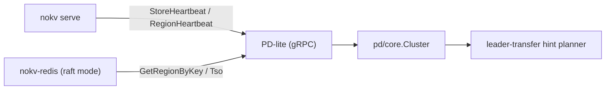

# PD-lite

`PD-lite` is NoKV's control-plane service for distributed mode.  
It exposes a gRPC API (`pb.PD`) and is started by:

```bash
go run ./cmd/nokv pd --addr 127.0.0.1:2379
```

---

## 1. Responsibilities

PD-lite currently owns:

- **Routing**: `GetRegionByKey`
- **Heartbeats**: `StoreHeartbeat`, `RegionHeartbeat`
- **Region removal**: `RemoveRegion`
- **ID service**: `AllocID`
- **TSO**: `Tso`

Runtime clients (for example `cmd/nokv-redis` raft backend) use PD as the
routing source of truth.

---

## 2. Runtime Architecture



Core implementation units:

- `pd/core`: in-memory cluster metadata model + allocators.
- `pd/storage`: persistence abstraction (`Store`) with local manifest+state implementation.
- `pd/server`: gRPC service + RPC validation/error mapping.
- `pd/client`: client wrapper used by store/gateway.
- `pd/adapter`: scheduler sink that forwards heartbeats into PD.

---

## 3. Persistence (`--workdir`)

When `--workdir` is provided, PD-lite persists control-plane state:

- **Region catalog** via manifest edits.
- **Allocator checkpoints** via `PD_STATE.json`:
  - `id_current`
  - `ts_current`

Startup flow:

1. Open `pd/storage` with `--workdir`.
2. Load snapshot (`regions` + allocator counters).
3. Compute starts as `max(cli_start, checkpoint+1)`.
4. Replay region snapshot into `pd/core.Cluster`.

This avoids allocator rollback after restart and keeps route metadata stable.

---

## 4. Config Integration

`raft_config.json` supports PD endpoint + workdir defaults:

```json
"pd": {
  "addr": "127.0.0.1:2379",
  "docker_addr": "nokv-pd:2379",
  "work_dir": "./artifacts/cluster/pd",
  "docker_work_dir": "/var/lib/nokv-pd"
}
```

Resolution rules:

- CLI override wins.
- Otherwise read from config by scope (`host` / `docker`).

Helpers:

- `config.ResolvePDAddr(scope)`
- `config.ResolvePDWorkDir(scope)`
- `nokv-config pd --field addr|workdir --scope host|docker`

---

## 5. Routing Source Convergence

NoKV now uses **PD-first routing**:

- `raftstore/client` resolves regions with `GetRegionByKey`.
- `raft_config` regions are bootstrap/deployment metadata.
- Runtime route truth comes from PD heartbeats + PD region catalog.

This avoids dual sources drifting over time (config vs PD).

---

## 6. Serve Mode Semantics

`nokv serve` follows a strict split:

- **Standalone/dev mode** (no `--peer`): PD is optional.
- **Cluster mode** (any `--peer` configured): `--pd-addr` is required.

This keeps distributed control-plane behavior PD-centric and avoids fallback to
a local scheduler path in cluster deployments. Startup logs explicitly print the
selected mode.

---

## 7. Comparison: TinyKV / TiKV

### TinyKV (teaching stack)

- Uses a scheduler server (`tinyscheduler`) as separate process.
- Control plane integrates embedded etcd for metadata persistence.
- Educational architecture, minimal production hardening.

### TiKV (production stack)

- PD is an independent, highly available cluster.
- PD internally uses etcd Raft for durable metadata + leader election.
- Rich scheduling and balancing policies, rolling updates, robust ops tooling.

### NoKV PD-lite (current)

- Single PD-lite process with optional local persistence (`--workdir`).
- Sufficient for local clusters, testing, and architecture iteration.
- API shape intentionally aligned with a PD-style control plane so migration to
  stronger HA semantics is incremental.

---

## 8. Current Limitations / Next Steps

- No multi-PD quorum and no automatic PD failover.
- Scheduler policy is intentionally small (leader transfer focused).
- No advanced placement constraints yet.

These are deliberate scope limits for a fast-moving experimental platform.
